# LeetCode Log

> - 先以《面试经典150题》开始，每日两题预计五月中结束，此后题目再议。
> - 题目后的`*`个数表示难度，一般我能做出等效最优解的题目，不视为难题，即 *；而若能解出但不是最优，则 **；若无法解出，则 \*\*\*。特别地，如果做到了等效最优解，但是相对不够好，则 \*/\*\*
> - `@`被认为是重点题目

## 零、一些配置

- **通用模板设置**：

  1. 在 VSCode 中，点击左下角齿轮 -> **（用户）代码片段 (User Snippets)**。

  2. 搜索并选择 `cpp`。

  3. 将以下 JSON 代码粘贴进去：

     ```json
     {
       "LeetCode Template": {
         "prefix": "lcc",
         "body": [
           "#include <iostream>",
           "#include <vector>",
           "#include <string>",
           "#include <algorithm>",
           "#include <unordered_map>",
           "#include <queue>",
           "",
           "using namespace std;",
           "",
           "int main() {",
           "    ios::sync_with_stdio(false);",
           "    cin.tie(nullptr);",
           "    $0",
           "    return 0;",
           "}"
         ],
         "description": "快速生成力扣/机试基础模板"
       }
     }
     ```

     > - 运行时由于没有自动刷新，所以需要手动在键盘上按 `Ctrl + Z`，然后敲击回车

- **格式化风格**
  1. 在 VSCode 中按 `Ctrl + ,` 打开设置。
  2. 在搜索框输入 `fallback style`。
  3. 找到 **C_Cpp: Clang_format_fallback Style**。
  4. 将默认的 `Visual Studio` 改为 `Google` 或 `LLVM`


## 一、数组 / 字符串

### 1. 合并两个有序数组*

#### 1.1 题目

给你两个按 **非递减顺序** 排列的整数数组 `nums1` 和 `nums2`，另有两个整数 `m` 和 `n` ，分别表示 `nums1` 和 `nums2` 中的元素数目。

请你 **合并** `nums2` 到 `nums1` 中，使合并后的数组同样按 **非递减顺序** 排列。

**注意：**最终，合并后数组不应由函数返回，而是存储在数组 `nums1` 中。为了应对这种情况，`nums1` 的初始长度为 `m + n`，其中前 `m` 个元素表示应合并的元素，后 `n` 个元素为 `0` ，应忽略。`nums2` 的长度为 `n` 。

 

**示例 1：**

```
输入：nums1 = [1,2,3,0,0,0], m = 3, nums2 = [2,5,6], n = 3
输出：[1,2,2,3,5,6]
解释：需要合并 [1,2,3] 和 [2,5,6] 。
合并结果是 [1,2,2,3,5,6] ，其中斜体加粗标注的为 nums1 中的元素。
```

**示例 2：**

```
输入：nums1 = [1], m = 1, nums2 = [], n = 0
输出：[1]
解释：需要合并 [1] 和 [] 。
合并结果是 [1] 。
```

**示例 3：**

```
输入：nums1 = [0], m = 0, nums2 = [1], n = 1
输出：[1]
解释：需要合并的数组是 [] 和 [1] 。
合并结果是 [1] 。
注意，因为 m = 0 ，所以 nums1 中没有元素。nums1 中仅存的 0 仅仅是为了确保合并结果可以顺利存放到 nums1 中。
```

 

**提示：**

- `nums1.length == m + n`
- `nums2.length == n`
- `0 <= m, n <= 200`
- `1 <= m + n <= 200`
- `-109 <= nums1[i], nums2[j] <= 109`

 

**进阶：**你可以设计实现一个时间复杂度为 `O(m + n)` 的算法解决此问题吗？


#### 1.2 解法

时间复杂度 $O(m + n)$；空间复杂度 $O(1)$

```cpp
#include <algorithm>
#include <iostream>
#include <queue>
#include <string>
#include <unordered_map>
#include <vector>

using namespace std;

class Solution {
 public:
  void merge(vector<int>& nums1, int m, vector<int>& nums2, int n) {
    int k = m + n - 1;
    m--;
    n--;

    // 倒序比较，无需开辟新数组
    while (m >= 0 && n >= 0) {
      if (nums1[m] < nums2[n]) {
        nums1[k] = nums2[n];
        n--;
      } else {
        nums1[k] = nums1[m];
        m--;
      }
      k--;
    }

    // 若nums1有剩，则无需移动
    while (n >= 0) {
      nums1[k] = nums2[n];
      k--;
      n--;
    }
  }
};

int main() {
  ios::sync_with_stdio(false);
  cin.tie(nullptr);

  int m, n;
  while (cin >> m >> n) {
    vector<int> nums1(m + n);
    for (int i = 0; i < m + n; ++i) {
      cin >> nums1[i];
    }

    vector<int> nums2(n);
    for (int i = 0; i < n; ++i) {
      cin >> nums2[i];
    }

    Solution().merge(nums1, m, nums2, n);

    cout << "[";
    for (int i = 0; i < m + n; ++i) {
      cout << nums1[i] << (i == m + n - 1 ? "" : ",");
    }
    cout << "]\n";
  }

  return 0;
}
```


#### 1.3 解析

这题比较简单，我这个解法已经是理论最优解，算是开门红。

简单地来看看其他的解法吧：

1. 暴力破解

   ```cpp
   #include <vector>
   #include <algorithm>
   
   using namespace std;
   
   class Solution {
   public:
       void merge(vector<int>& nums1, int m, vector<int>& nums2, int n) {
           for (int i = 0; i < n; ++i) {
               nums1[m + i] = nums2[i];
           }
           sort(nums1.begin(), nums1.end());
       }
   };
   ```

   > 直接使用sort，复杂度为 `O(log(m+n))`

2. 另辟数组

   ```cpp
   #include <vector>
   
   using namespace std;
   
   class Solution {
   public:
       void merge(vector<int>& nums1, int m, vector<int>& nums2, int n) {
           vector<int> nums1_copy(nums1.begin(), nums1.begin() + m);
           int p1 = 0;
           int p2 = 0;
           int p = 0;
           
           while (p1 < m && p2 < n) {
               if (nums1_copy[p1] <= nums2[p2]) {
                   nums1[p++] = nums1_copy[p1++];
               } else {
                   nums1[p++] = nums2[p2++];
               }
           }
           
           while (p1 < m) {
               nums1[p++] = nums1_copy[p1++];
           }
           
           while (p2 < n) {
               nums1[p++] = nums2[p2++];
           }
       }
   };
   ```

   > 空间复杂度 `O(m)`


### 2. 移除元素*

#### 2.1 题目

给你一个数组 `nums` 和一个值 `val`，你需要 **[原地](https://baike.baidu.com/item/原地算法)** 移除所有数值等于 `val` 的元素。元素的顺序可能发生改变。然后返回 `nums` 中与 `val` 不同的元素的数量。

假设 `nums` 中不等于 `val` 的元素数量为 `k`，要通过此题，您需要执行以下操作：

- 更改 `nums` 数组，使 `nums` 的前 `k` 个元素包含不等于 `val` 的元素。`nums` 的其余元素和 `nums` 的大小并不重要。
- 返回 `k`。

**用户评测：**

评测机将使用以下代码测试您的解决方案：

```
int[] nums = [...]; // 输入数组
int val = ...; // 要移除的值
int[] expectedNums = [...]; // 长度正确的预期答案。
                            // 它以不等于 val 的值排序。

int k = removeElement(nums, val); // 调用你的实现

assert k == expectedNums.length;
sort(nums, 0, k); // 排序 nums 的前 k 个元素
for (int i = 0; i < actualLength; i++) {
    assert nums[i] == expectedNums[i];
}
```

如果所有的断言都通过，你的解决方案将会 **通过**。

 

**示例 1：**

```
输入：nums = [3,2,2,3], val = 3
输出：2, nums = [2,2,_,_]
解释：你的函数应该返回 k = 2, 并且 nums 中的前两个元素均为 2。
你在返回的 k 个元素之外留下了什么并不重要（因此它们并不计入评测）。
```

**示例 2：**

```
输入：nums = [0,1,2,2,3,0,4,2], val = 2
输出：5, nums = [0,1,4,0,3,_,_,_]
解释：你的函数应该返回 k = 5，并且 nums 中的前五个元素为 0,0,1,3,4。
注意这五个元素可以任意顺序返回。
你在返回的 k 个元素之外留下了什么并不重要（因此它们并不计入评测）。
```

 

**提示：**

- `0 <= nums.length <= 100`
- `0 <= nums[i] <= 50`
- `0 <= val <= 100`


#### 2.2 解法

**时间复杂度**：$O(n)$，**空间复杂度**：$O(1)$

```cpp
#include <algorithm>
#include <iostream>
#include <vector>

using namespace std;

class Solution {
 public:
  int removeElement(vector<int>& nums, int val) {
    int n = nums.size(), k = 0, i = 0;
    while (i + k < n) {
      if (nums[i] == val) {
        swap(nums[i], nums[n - k - 1]);
        k++;
      }

      // 避免交换到val
      if (nums[i] != val) {
        i++;
      }
    }

    return i;
  }
};

int main() {
  ios::sync_with_stdio(false);
  cin.tie(nullptr);

  int n, val;
  while (cin >> n >> val) {
    vector<int> nums(n);
    for (int i = 0; i < n; ++i) {
      cin >> nums[i];
    }

    Solution obj;
    int k = obj.removeElement(nums, val);

    sort(nums.begin(), nums.begin() + k);

    cout << k << ", nums = [";
    for (int i = 0; i < k; ++i) {
      cout << nums[i] << (i == k - 1 ? "" : ",");
    }
    cout << "]\n";
  }

  return 0;
}
```

> 优化写法（左右指针/双指针）：方法类似，但是更有逻辑一些。
>
> ```cpp
> class Solution {
> public:
>     int removeElement(vector<int>& nums, int val) {
>         int left = 0;
>         int right = nums.size();
>         while (left < right) {
>             if (nums[left] == val) {
>                 nums[left] = nums[right - 1];
>                 right--;
>             } else {
>                 left++;
>             }
>         }
>         return left;
>     }
> };
> ```


#### 2.3 解析

这道题同样比较简单，我的解法是等效最优解，在某些情况比标准解更快。

简单的看看标准解：

```cpp
class Solution {
public:
    int removeElement(vector<int>& nums, int val) {
        int slow = 0;
        for (int fast = 0; fast < nums.size(); fast++) {
            if (nums[fast] != val) {
                nums[slow] = nums[fast];
                slow++;
            }
        }
        return slow;
    }
};
```

> 固定时间复杂度为$O(n)$，快慢指针方法，直接覆盖慢指针，无需交换。


### 3. 删除有序数组中的重复项*

#### 3.1 题目

给你一个 **非严格递增排列** 的数组 `nums` ，请你**[ 原地](http://baike.baidu.com/item/原地算法)** 删除重复出现的元素，使每个元素 **只出现一次** ，返回删除后数组的新长度。元素的 **相对顺序** 应该保持 **一致** 。然后返回 `nums` 中唯一元素的个数。

考虑 `nums` 的唯一元素的数量为 `k`。去重后，返回唯一元素的数量 `k`。

`nums` 的前 `k` 个元素应包含 **排序后** 的唯一数字。下标 `k - 1` 之后的剩余元素可以忽略。

**判题标准:**

系统会用下面的代码来测试你的题解:

```
int[] nums = [...]; // 输入数组
int[] expectedNums = [...]; // 长度正确的期望答案

int k = removeDuplicates(nums); // 调用

assert k == expectedNums.length;
for (int i = 0; i < k; i++) {
    assert nums[i] == expectedNums[i];
}
```

如果所有断言都通过，那么您的题解将被 **通过**。

 

**示例 1：**

```
输入：nums = [1,1,2]
输出：2, nums = [1,2,_]
解释：函数应该返回新的长度 2 ，并且原数组 nums 的前两个元素被修改为 1, 2 。不需要考虑数组中超出新长度后面的元素。
```

**示例 2：**

```
输入：nums = [0,0,1,1,1,2,2,3,3,4]
输出：5, nums = [0,1,2,3,4,_,_,_,_,_]
解释：函数应该返回新的长度 5 ， 并且原数组 nums 的前五个元素被修改为 0, 1, 2, 3, 4 。不需要考虑数组中超出新长度后面的元素。
```

 

**提示：**

- `1 <= nums.length <= 3 * 104`
- `-100 <= nums[i] <= 100`
- `nums` 已按 **非递减** 顺序排列。


#### 3.2 解法

**时间复杂度**：$O(n)$，**空间复杂度**：$O(1)$

```cpp
#include <algorithm>
#include <iostream>
#include <queue>
#include <string>
#include <unordered_map>
#include <vector>

using namespace std;

class Solution {
 public:
  int removeDuplicates(vector<int>& nums) {
    int base = 0, check = 0, n = nums.size();
    while (check < n) {
      if (nums[base] == nums[check]) {
        nums[base] = nums[check];
        check++;
      } else {
        base++;
        nums[base] = nums[check];
        check++;
      }
    }

    return base + 1;
  }
};

int main() {
  ios::sync_with_stdio(false);
  cin.tie(nullptr);

  int n;
  while (cin >> n) {
    vector<int> nums(n);
    for (int i = 0; i < n; ++i) {
      cin >> nums[i];
    }

    Solution obj;
    int k = obj.removeDuplicates(nums);

    cout << k << ", nums = [";
    for (int i = 0; i < k; ++i) {
      cout << nums[i] << (i == k - 1 ? "" : ",");
    }
    cout << "]\n";
  }

  return 0;
}
```

> 当时为了避免算法起步失败，让相等时也赋值，这是不必要的；此外还有一些小的冗余，优化如下：
>
> ```cpp
> class Solution {
> public:
>     int removeDuplicates(vector<int>& nums) {
>         int base = 0;
>         
>        // 快指针直接1开始，不需要考虑起步问题；check一定会++，所以直接使用for循环 
>         for (int check = 1; check < nums.size(); check++) {
>             if (nums[check] != nums[base]) {
>                 base++;
>                 nums[base] = nums[check];
>             }
>         }
>         
>         return base + 1;
>     }
> };
> ```


#### 3.3 解析

我的解法写得有点丑陋，但是也算是等效最优解。此外，可以看看别的一些办法：

1. K位去重模板（有序）

   ```cpp
   class Solution {
   public:
       int removeDuplicates(vector<int>& nums) {
           int slow = 0;
           
        	// 当不再等于时，慢指针才++   
           for (int x : nums) {
               if (slow < 1 || nums[slow - 1] != x) {
                   nums[slow] = x;
                   slow++;
               }
           }
           
           return slow;
       }
   };
   ```

2. STL库

   ```cpp
   #include <algorithm>
   
   class Solution {
   public:
       int removeDuplicates(vector<int>& nums) {
        	// 返回的是整理后的数组的末尾迭代器，减去begin()就是长度
           return unique(nums.begin(), nums.end()) - nums.begin();
       }
   };
   ```


### 4. 删除有序数组中的重复项II*

#### 4.1 题目

给你一个有序数组 `nums` ，请你**[ 原地](http://baike.baidu.com/item/原地算法)** 删除重复出现的元素，使得出现次数超过两次的元素**只出现两次** ，返回删除后数组的新长度。

不要使用额外的数组空间，你必须在 **[原地 ](https://baike.baidu.com/item/原地算法)修改输入数组** 并在使用 O(1) 额外空间的条件下完成。

 

**说明：**

为什么返回数值是整数，但输出的答案是数组呢？

请注意，输入数组是以**「引用」**方式传递的，这意味着在函数里修改输入数组对于调用者是可见的。

你可以想象内部操作如下:

```
// nums 是以“引用”方式传递的。也就是说，不对实参做任何拷贝
int len = removeDuplicates(nums);

// 在函数里修改输入数组对于调用者是可见的。
// 根据你的函数返回的长度, 它会打印出数组中 该长度范围内 的所有元素。
for (int i = 0; i < len; i++) {
    print(nums[i]);
}
```

 

**示例 1：**

```
输入：nums = [1,1,1,2,2,3]
输出：5, nums = [1,1,2,2,3]
解释：函数应返回新长度 length = 5, 并且原数组的前五个元素被修改为 1, 1, 2, 2, 3。 不需要考虑数组中超出新长度后面的元素。
```

**示例 2：**

```
输入：nums = [0,0,1,1,1,1,2,3,3]
输出：7, nums = [0,0,1,1,2,3,3]
解释：函数应返回新长度 length = 7, 并且原数组的前七个元素被修改为 0, 0, 1, 1, 2, 3, 3。不需要考虑数组中超出新长度后面的元素。
```

 

**提示：**

- `1 <= nums.length <= 3 * 104`
- `-104 <= nums[i] <= 104`
- `nums` 已按升序排列


#### 4.2 解法

时间复杂度 $O(n)$，空间复杂度 $O(1)$

```cpp
#include <algorithm>
#include <iostream>
#include <queue>
#include <string>
#include <unordered_map>
#include <vector>

using namespace std;

class Solution {
 public:
  int removeDuplicates(vector<int>& nums) {
    int base = 0, check = 1, n = nums.size();
    bool flag = true;

    if (n <= 1) {
      return n;
    }

    while (check < n) {
      if (nums[base] == nums[check]) {
        if (flag) {
          base++;
          flag = false;
        }
        nums[base] = nums[check];
        check++;
      } else {
        base++;
        nums[base] = nums[check];
        flag = true;
        check++;
      }
    }

    return base + 1;
  }
};

int main() {
  ios::sync_with_stdio(false);
  cin.tie(nullptr);

  int n;
  while (cin >> n) {
    vector<int> nums(n);
    for (int i = 0; i < n; ++i) {
      cin >> nums[i];
    }

    Solution obj;
    int k = obj.removeDuplicates(nums);

    cout << k << ", nums = [";
    for (int i = 0; i < k; ++i) {
      cout << nums[i] << (i == k - 1 ? "" : ",");
    }
    cout << "]\n";
  }

  return 0;
}
```

> 这是基于上一题改的，同样有一定的冗余问题：
>
> ```cpp
> class Solution {
> public:
>     int removeDuplicates(vector<int>& nums) {
>         int n = nums.size();
>         if (n <= 2) return n;
> 
>         int base = 0;
>         bool flag = true; 
> 
>         for (int check = 1; check < n; check++) {
>             if (nums[base] == nums[check]) {
>                 if (flag) {
>                     base++;
>                     nums[base] = nums[check];
>                     flag = false;
>                 }
>             } else {
>                 base++;
>                 nums[base] = nums[check];
>                 flag = true;
>             }
>         }
>         
>         return base + 1;
>     }
> };
> ```
>
> 


#### 4.3 解析

这道题同样地是等效最优解，由于是基于上一题解法改的，也同样有点丑陋。这里就没什么其他解法了，上一题给的通用K模板，在已经是很好的做法。


### 5. 多数元素**

#### 5.1 题目

给定一个大小为 `n` 的数组 `nums` ，返回其中的多数元素。多数元素是指在数组中出现次数 **大于** `⌊ n/2 ⌋` 的元素。

你可以假设数组是非空的，并且给定的数组总是存在多数元素。

 

**示例 1：**

```
输入：nums = [3,2,3]
输出：3
```

**示例 2：**

```
输入：nums = [2,2,1,1,1,2,2]
输出：2
```

 

**提示：**

- `n == nums.length`
- `1 <= n <= 5 * 10^4`
- `-10^9 <= nums[i] <= 10^9`
- 输入保证数组中一定有一个多数元素。

 

**进阶：**尝试设计时间复杂度为 O(n)、空间复杂度为 O(1) 的算法解决此问题。


#### 5.2 解法

**时间复杂度**：$O(n)$，**空间复杂度**：$O(n)$

```cpp
#include <algorithm>
#include <iostream>
#include <queue>
#include <string>
#include <unordered_map>
#include <vector>

using namespace std;

class Solution {
 public:
  int majorityElement(vector<int>& nums) {
    unordered_map<int, int> freq;
    int max = 0, maxNum = 0;

    for (auto x : nums) {
      if (++freq[x] > max) {
        max = freq[x];
        maxNum = x;
      }
    }

    return maxNum;
  }
};

int main() {
  ios::sync_with_stdio(false);
  cin.tie(nullptr);

  int n;
  while (cin >> n) {
    vector<int> nums(n);
    for (int i = 0; i < n; ++i) {
      cin >> nums[i];
    }

    Solution obj;
    int k = obj.majorityElement(nums);

    cout << k;
  }

  return 0;
}
```

> 我们不必要找出max，只要频率满足条件即可
>
> ```cpp
> #include <unordered_map>
> #include <vector>
> 
> using namespace std;
> 
> class Solution {
> public:
>     int majorityElement(vector<int>& nums) {
>         unordered_map<int, int> freq;
>         int target = nums.size() / 2;
> 
>         for (int x : nums) {
>             if (++freq[x] > target) {
>                 return x;
>             }
>         }
> 
>         return -1;
>     }
> };
> ```


#### 5.3 解析

这次并未找到等效最优解，要么是内存大了，要么就是时间慢了，来看看别的解法：

1. 排序法

   ```cpp
   // 内存严格达标，但是时间超出
   #include <algorithm>
   #include <vector>
   
   using namespace std;
   
   class Solution {
   public:
       int majorityElement(vector<int>& nums) {
           sort(nums.begin(), nums.end());
           return nums[nums.size() / 2];
       }
   };
   ```

2. **Boyer-Moore 投票算法**

   **时间复杂度**：$O(n)$，**空间复杂度**：$O(1)$。这个方法很巧妙，核心在于利用了多数元素频次比数组中其他任何元素频次之和还要大，也即选取一个candidate，如果遇到等值数即++，遇到非等值即--，当count为0时重选candidate，如此能保证多数元素与所有其他元素“一换一”后还能至少存活一个（count=1），即得结果。

   ```cpp
   #include <vector>
   
   using namespace std;
   
   class Solution {
   public:
       int majorityElement(vector<int>& nums) {
           int candidate = 0;
           int count = 0;
   
           for (int x : nums) {
               if (count == 0) {
                   candidate = x;
               }
               if (x == candidate) {
                   count++;
               } else {
                   count--;
               }
           }
   
           return candidate;
       }
   };
   ```

   

### 6. 轮转数组**

#### 6.1 题目

给定一个整数数组 `nums`，将数组中的元素向右轮转 `k` 个位置，其中 `k` 是非负数。

 

**示例 1:**

```
输入: nums = [1,2,3,4,5,6,7], k = 3
输出: [5,6,7,1,2,3,4]
解释:
向右轮转 1 步: [7,1,2,3,4,5,6]
向右轮转 2 步: [6,7,1,2,3,4,5]
向右轮转 3 步: [5,6,7,1,2,3,4]
```

**示例 2:**

```
输入：nums = [-1,-100,3,99], k = 2
输出：[3,99,-1,-100]
解释: 
向右轮转 1 步: [99,-1,-100,3]
向右轮转 2 步: [3,99,-1,-100]
```

 

**提示：**

- `1 <= nums.length <= 105`
- `-231 <= nums[i] <= 231 - 1`
- `0 <= k <= 105`

 

**进阶：**

- 尽可能想出更多的解决方案，至少有 **三种** 不同的方法可以解决这个问题。
- 你可以使用空间复杂度为 `O(1)` 的 **原地** 算法解决这个问题吗？


#### 6.2 解法

1. 时间复杂度为 $O(n \times k)$，空间复杂度为 $O(1)$
2. 时间复杂度 $O(n)$，空间复杂度 $O(n)$
3. 错误解法

```cpp
#include <algorithm>
#include <iostream>
#include <queue>
#include <string>
#include <unordered_map>
#include <vector>

using namespace std;

class Solution {
 public:
  void rotate(vector<int>& nums, int k) {
    int n = nums.size();
    k = k % int(n);
    if (k == 0) return;

    rotate3(nums, k, n);
  }

  void rotate1(vector<int>& nums, int k, int n) {
    for (int i = 0; i < k; i++) {
      for (int j = n - 1; j > 0; j--) {
        swap(nums[j], nums[j - 1]);
      }
    }
  }

  void rotate2(vector<int>& nums, int k, int n) {
    vector<int> rotateNum(n);

    for (int i = 0; i < n; i++) {
      rotateNum[(i + k) % n] = nums[i];
    }

    nums = rotateNum;
  }

  void rotate3(vector<int>& nums, int k, int n) {
    for (int i = 0; i < n / k; i++) {
      for (int j = 0; j < k; j++) {
        swap(nums[i * k + j], nums[n - k + j]);
      }
    }
  }
};

int main() {
  ios::sync_with_stdio(false);
  cin.tie(nullptr);

  int n, k;
  while (cin >> n) {
    cin >> k;

    vector<int> nums(n);
    for (int i = 0; i < n; ++i) {
      cin >> nums[i];
    }

    Solution obj;
    obj.rotate(nums, k);

    cout << "nums = [";
    for (int i = 0; i < nums.size(); ++i) {
      cout << nums[i] << (i == nums.size() - 1 ? "" : ",");
    }
    cout << "]\n";
  }

  return 0;
}
```


#### 6.3 解析

花了很长的时间，仍无法改好rorate3，未来的思路可能是较为复杂的递归，理论能能够达到$O(1)$空间复杂度，但是递归本身也需要相当的空间（拆解成循环或可实现，但是过于复杂）。

1. **三次翻转**：

   一个很显著的特征就是平移，但是要原地地实现平移就是难点。我们可以三次翻转，即先翻转一次，发现前后两段位置对了，但是顺序不对，再各自独立翻转一次即可：

   > 观察输入 `[1, 2, 3, 4, 5, 6, 7]` 和输出 `[5, 6, 7, 1, 2, 3, 4]`。
   >
   > 可以发现，数组其实被分成了两段：
   >
   > - **尾部段** `[5, 6, 7]`（长度为 $k$）：它们整体平移到了最前面。
   > - **首部段** `[1, 2, 3, 4]`（长度为 $n-k$）：它们整体平移到了后面。
   >
   > 如果我们直接将整个数组首尾翻转，变成 `[7, 6, 5, 4, 3, 2, 1]`。
   >
   > 此时，原本在尾部的元素确实跑到前面去了，原本在前面的元素也跑到后面去了。唯一的问题是，这两段内部的元素顺序是逆序的。
   >
   > 因此，我们只需要将前 $k$ 个元素再翻转一次，把后面的 $n-k$ 个元素也翻转一次，就能完美负负得正，恢复原来的相对顺序。

   ```cpp
   #include <vector>
   #include <algorithm>
   
   using namespace std;
   
   class Solution {
   public:
       void rotate(vector<int>& nums, int k) {
           int n = nums.size();
           k = k % n;
           
           reverse(nums.begin(), nums.end());
           reverse(nums.begin(), nums.begin() + k);
           reverse(nums.begin() + k, nums.end());
       }
   };
   ```

2. 环状替换：

   仅了解。

   ```cpp
   #include <vector>
   #include <numeric>
   
   using namespace std;
   
   class Solution {
   public:
       void rotate(vector<int>& nums, int k) {
           int n = nums.size();
           k = k % n;
           if (k == 0) return;
   
           int count = gcd(k, n);
           
           for (int start = 0; start < count; ++start) {
               int current = start;
               int prev = nums[start];
               
               do {
                   int next = (current + k) % n;
                   int temp = nums[next];
                   nums[next] = prev;
                   prev = temp;
                   current = next;
               } while (start != current);
           }
       }
   };
   ```


### 7. 买卖股票的最佳时机*

#### 7.1 题目

给定一个数组 `prices` ，它的第 `i` 个元素 `prices[i]` 表示一支给定股票第 `i` 天的价格。

你只能选择 **某一天** 买入这只股票，并选择在 **未来的某一个不同的日子** 卖出该股票。设计一个算法来计算你所能获取的最大利润。

返回你可以从这笔交易中获取的最大利润。如果你不能获取任何利润，返回 `0` 。

 

**示例 1：**

```
输入：[7,1,5,3,6,4]
输出：5
解释：在第 2 天（股票价格 = 1）的时候买入，在第 5 天（股票价格 = 6）的时候卖出，最大利润 = 6-1 = 5 。
     注意利润不能是 7-1 = 6, 因为卖出价格需要大于买入价格；同时，你不能在买入前卖出股票。
```

**示例 2：**

```
输入：prices = [7,6,4,3,1]
输出：0
解释：在这种情况下, 没有交易完成, 所以最大利润为 0。
```

 

**提示：**

- `1 <= prices.length <= 105`
- `0 <= prices[i] <= 104`


#### 7.2 解法

时间复杂度 **O(n)**，空间复杂度为 **O(1)**

```cpp
#include <algorithm>
#include <iostream>
#include <queue>
#include <string>
#include <unordered_map>
#include <vector>

using namespace std;

class Solution {
 public:
  int maxProfit(vector<int>& prices) {
    int n = prices.size(), sum = 0, b = 0;

    for (int i = 1; i < n; i++) {
      int profit = prices[i] - prices[i - 1];
      if (b > 0) {
        b += profit;
      } else {
        b = profit;
      }

      sum = max(b, sum);
    }

    return sum;
  }
};

int main() {
  ios::sync_with_stdio(false);
  cin.tie(nullptr);

  int n;
  while (cin >> n) {
    vector<int> p(n);
    for (int i = 0; i < n; i++) {
      cin >> p[i];
    }

    Solution obj;
    int profit = obj.maxProfit(p);

    cout << profit;
  }
  return 0;
}
```

> 一些写法上的优化：（实际上差不多）
>
> ```cpp
> class Solution {
> public:
>     int maxProfit(vector<int>& prices) {
>         int n = prices.size();
>         int sum = 0, b = 0;
> 
>         for (int i = 1; i < n; i++) {
>             int profit = prices[i] - prices[i - 1];
>             b = max(profit, b + profit);
>             sum = max(b, sum);
>         }
> 
>         return sum;
>     }
> };
> ```


#### 7.3 解析

我的解法达到了等效最优解，本质上是利用了动态规划中的最大字段和问题的解法。事实上还有一些别的想法：

1. 贪心算法

   算是这道题的标准解法，重点在于相对最小值，即：若在`i`出卖出，那么此前若是在最低点买入的，则必然是该天卖出的最大利润情况。这样的想法把找最小值和比较利润最大值融合，同样是 **O(n)**的时间复杂度。

   ```cpp
   class Solution {
   public:
       int maxProfit(vector<int>& prices) {
           int minPrice = 1e9;
           int maxProf = 0;
   
           for (int price : prices) {
               minPrice = min(minPrice, price);
               maxProf = max(maxProf, price - minPrice);
           }
   
           return maxProf;
       }
   };
   ```

2. 状态机动态规划

   每一天，我们只有两种状态：**持有股票**（状态 1）或 **不持有股票**（状态 0）。

   - 今天**不持有**股票的最大收益，等于：昨天也不持有，或者昨天持有但今天卖掉了，两者取最大。
   - 今天**持有**股票的最大收益，等于：昨天就持有，或者昨天不持有但今天买入了，两者取最大（因为只能交易一次，所以今天买入的收益就是 `-prices[i]`）。

   这类题关键在于状态的确定与比较，即：

   ```cpp
   class Solution {
   public:
       int maxProfit(vector<int>& prices) {
           int n = prices.size();
           if (n == 0) return 0;
   
           int dp_i_0 = 0;
           int dp_i_1 = -prices[0];
   
           for (int i = 1; i < n; i++) {
               dp_i_0 = max(dp_i_0, dp_i_1 + prices[i]);
               dp_i_1 = max(dp_i_1, -prices[i]);
           }
   
           return dp_i_0;
       }
   };
   ```


### 8. 买卖股票的最佳时机II*

#### 8.1 题目

给你一个整数数组 `prices` ，其中 `prices[i]` 表示某支股票第 `i` 天的价格。

在每一天，你可以决定是否购买和/或出售股票。你在任何时候 **最多** 只能持有 **一股** 股票。然而，你可以在 **同一天** 多次买卖该股票，但要确保你持有的股票不超过一股。

返回 *你能获得的 **最大** 利润* 。

 

**示例 1：**

```
输入：prices = [7,1,5,3,6,4]
输出：7
解释：在第 2 天（股票价格 = 1）的时候买入，在第 3 天（股票价格 = 5）的时候卖出, 这笔交易所能获得利润 = 5 - 1 = 4。
随后，在第 4 天（股票价格 = 3）的时候买入，在第 5 天（股票价格 = 6）的时候卖出, 这笔交易所能获得利润 = 6 - 3 = 3。
最大总利润为 4 + 3 = 7 。
```

**示例 2：**

```
输入：prices = [1,2,3,4,5]
输出：4
解释：在第 1 天（股票价格 = 1）的时候买入，在第 5 天 （股票价格 = 5）的时候卖出, 这笔交易所能获得利润 = 5 - 1 = 4。
最大总利润为 4 。
```

**示例 3：**

```
输入：prices = [7,6,4,3,1]
输出：0
解释：在这种情况下, 交易无法获得正利润，所以不参与交易可以获得最大利润，最大利润为 0。
```

 

**提示：**

- `1 <= prices.length <= 3 * 104`
- `0 <= prices[i] <= 104`


#### 8.2 解法

时间复杂度 $O(n)$，空间复杂度 $O(1)$

```cpp
#include <algorithm>
#include <iostream>
#include <queue>
#include <string>
#include <unordered_map>
#include <vector>

using namespace std;

class Solution {
 public:
  int maxProfit(vector<int>& prices) {
    int n = prices.size(), sum = 0;

    for (int i = 1; i < n; i++) {
      int profit = prices[i] - prices[i - 1];
      if (profit > 0) {
        sum += profit;
      }
    }

    return sum;
  }
};

int main() {
  ios::sync_with_stdio(false);
  cin.tie(nullptr);

  int n;
  while (cin >> n) {
    vector<int> p(n);
    for (int i = 0; i < n; i++) {
      cin >> p[i];
    }

    Solution obj;
    int profit = obj.maxProfit(p);

    cout << profit;
  }
  return 0;
}
```

> 也是写法上的：
>
> ```cpp
> #include <algorithm>
> #include <iostream>
> #include <vector>
> 
> using namespace std;
> 
> class Solution {
> public:
>     int maxProfit(vector<int>& prices) {
>         int n = prices.size(), sum = 0;
> 
>         for (int i = 1; i < n; i++) {
>             sum += max(0, prices[i] - prices[i - 1]);
>         }
> 
>         return sum;
>     }
> };
> ```


#### 8.3 解析

上一题的思路在此发挥了巨大的作用，其本质上是贪心算法，将全局问题拆解为了最小粒度的局部问题。

再看看上一题的DP状态机在这题的改进：

```cpp
#include <vector>
#include <algorithm>

using namespace std;

class Solution {
public:
    int maxProfit(vector<int>& prices) {
        int n = prices.size();
        if (n == 0) return 0;

        int dp_i_0 = 0;
        int dp_i_1 = -prices[0];

        for (int i = 1; i < n; i++) {
            // 区别在于这次的买入有基础资金dp_i_0，也就是昨天没有持有股票时的利润
            int temp = dp_i_0;
            dp_i_0 = max(dp_i_0, dp_i_1 + prices[i]);
            dp_i_1 = max(dp_i_1, temp - prices[i]);
        }

        return dp_i_0;
    }
};
```


### 9. 跳跃游戏*

#### 9.1 题目

给你一个非负整数数组 `nums` ，你最初位于数组的 **第一个下标** 。数组中的每个元素代表你在该位置可以跳跃的最大长度。

判断你是否能够到达最后一个下标，如果可以，返回 `true` ；否则，返回 `false` 。

 

**示例 1：**

```
输入：nums = [2,3,1,1,4]
输出：true
解释：可以先跳 1 步，从下标 0 到达下标 1, 然后再从下标 1 跳 3 步到达最后一个下标。
```

**示例 2：**

```
输入：nums = [3,2,1,0,4]
输出：false
解释：无论怎样，总会到达下标为 3 的位置。但该下标的最大跳跃长度是 0 ， 所以永远不可能到达最后一个下标。
```

 

**提示：**

- `1 <= nums.length <= 104`
- `0 <= nums[i] <= 105`

 

#### 9.2 解法

时间复杂度为 $O(n)$，空间复杂度为 $O(1)$

```cpp
#include <algorithm>
#include <iostream>
#include <queue>
#include <string>
#include <unordered_map>
#include <vector>

using namespace std;

class Solution {
 public:
  bool canJump(vector<int>& nums) {
    int n = nums.size(), canReach = 0;
    for (int i = 0; i < n; i++) {
      if (canReach < i) {
        return false;
      } else {
        canReach = max(canReach, i + nums[i]);
      }
    }

    return true;
  }
};

int main() {
  ios::sync_with_stdio(false);
  cin.tie(nullptr);

  int n;
  while (cin >> n) {
    vector<int> nums(n);
    for (int i = 0; i < n; i++) {
      cin >> nums[i];
    }

    Solution obj;
    bool canJump = obj.canJump(nums);
    cout << canJump;
  }

  return 0;
}
```

> 可以加入一个提前终止的机制，即若途中canReach即可达到末尾，可以终止：
>
> ```cpp
> #include <algorithm>
> #include <iostream>
> #include <vector>
> 
> using namespace std;
> 
> class Solution {
> public:
>     bool canJump(vector<int>& nums) {
>         int n = nums.size(), canReach = 0;
>         
>         for (int i = 0; i < n; i++) {
>             if (canReach < i) {
>                 return false;
>             }
>             
>             canReach = max(canReach, i + nums[i]);
>             
>             // 若直接可达末位，终止
>             if (canReach >= n - 1) {
>                 return true;
>             }
>         }
> 
>         return true;
>     }
> };
> ```


#### 9.3 解析

同样达到了等效最优解，来看看另外两种比较经典的解法：

1. 逆向贪心

   与本解同为贪心，不过是逆向跑的：如果目的地是最后一个点，那么逆向遍历，如果遇到的点能够到达上一个目的地，那么新的目的地就变成了该点，直到结束如果目的地移动到了最开始的点，那么就成功。

   ```cpp
   class Solution {
   public:
       bool canJump(vector<int>& nums) {
           int n = nums.size();
           int destination = n - 1;
           
           for (int i = n - 2; i >= 0; i--) {
               if (i + nums[i] >= destination) {
                   destination = i;
               }
           }
           
           return destination == 0;
       }
   };
   ```

2. 动态规划

   **“在想不到贪心策略时，万物皆可 DP。”**

   同样来看状态：定义 `dp[i]` 表示“能否到达下标 `i`”。 如果要到达下标 `i`，那么在它前面的所有点 `j` 中，必须存在至少一个点满足两个条件：第一，点 `j` 本身是可达的（`dp[j] == true`）；第二，从点 `j` 起跳的最大距离能覆盖到 `i`（`j + nums[j] >= i`）。

   但是这种解法的时间复杂度是 $O(n^2)$，很可能超时。

   ```cpp
   class Solution {
   public:
       bool canJump(vector<int>& nums) {
           int n = nums.size();
           vector<bool> dp(n, false);
           dp[0] = true;
           
           for (int i = 1; i < n; i++) {
               for (int j = 0; j < i; j++) {
                   if (dp[j] && j + nums[j] >= i) {
                       dp[i] = true;
                       break;
                   }
               }
           }
           
           return dp[n - 1];
       }
   };
   ```


### 10. 跳跃游戏II**

#### 10.1 题目

给定一个长度为 `n` 的 **0 索引**整数数组 `nums`。初始位置在下标 0。

每个元素 `nums[i]` 表示从索引 `i` 向后跳转的最大长度。换句话说，如果你在索引 `i` 处，你可以跳转到任意 `(i + j)` 处：

- `0 <= j <= nums[i]` 且
- `i + j < n`

返回到达 `n - 1` 的最小跳跃次数。测试用例保证可以到达 `n - 1`。

 

**示例 1:**

```
输入: nums = [2,3,1,1,4]
输出: 2
解释: 跳到最后一个位置的最小跳跃数是 2。
     从下标为 0 跳到下标为 1 的位置，跳 1 步，然后跳 3 步到达数组的最后一个位置。
```

**示例 2:**

```
输入: nums = [2,3,0,1,4]
输出: 2
```

 

**提示:**

- `1 <= nums.length <= 104`
- `0 <= nums[i] <= 1000`
- 题目保证可以到达 `n - 1`


#### 10.2 解法

时间复杂度接近 $O(n!)$。

```cpp
#include <algorithm>
#include <iostream>
#include <queue>
#include <string>
#include <unordered_map>
#include <vector>

using namespace std;

class Solution {
 public:
  int minTimes = 10000;

  int jump(vector<int>& nums) {
    if (nums.size() == 1) {
      return 0;
    }

    canReach(nums, nums.size() - 1, -1);

    return minTimes;
  }

  void canReach(vector<int>& nums, int k, int times) {
    // cout << "enter pos:" << k << ", and now:" << times << endl;
    times++;
    if (times > minTimes) return;

    for (int i = k - 1; i >= 0; i--) {
      if (i + nums[i] >= k) {
        // cout << "in " << k << ", reach: " << i << ", and now: " << times
        //      << endl;
        if (i == 0) {
          minTimes = min(minTimes, times + 1);
          return;
        } else {
          canReach(nums, i, times);
        }
      }
    }
  }
};

int main() {
  ios::sync_with_stdio(false);
  cin.tie(nullptr);

  int n;
  while (cin >> n) {
    vector<int> nums(n);
    for (int i = 0; i < n; i++) {
      cin >> nums[i];
    }

    Solution obj;
    int jumpTimes = obj.jump(nums);
    cout << jumpTimes;
  }

  return 0;
}
```

> 可以从开始往后搜索，而不是从后往前。这样的话搜索算法的复杂度能降下来到时间复杂度是 $O(n^2)$，空间复杂度是 $O(1)$。
>
> ```cpp
> #include <vector>
> #include <algorithm>
> 
> using namespace std;
> 
> class Solution {
> public:
>     int jump(vector<int>& nums) {
>         int position = nums.size() - 1;
>         int steps = 0;
>         
>         while (position > 0) {
>             for (int i = 0; i < position; i++) {
>                 if (i + nums[i] >= position) {
>                     position = i;
>                     steps++;
>                     break;
>                 }
>             }
>         }
>         
>         return steps;
>     }
> };
> ```


#### 10.3 解析

很遗憾未能找到最优解，优化后的搜索算法仍然是  $O(n^2)$级别的。看看其他办法吧，最优解本质上就是我上一题的优化解法，我也曾这样想过，可惜当时未能理解其本质：

```cpp
#include <vector>
#include <algorithm>

using namespace std;

class Solution {
public:
    int jump(vector<int>& nums) {
        int maxReach = 0;
        int end = 0;
        int steps = 0;
        
        for (int i = 0; i < nums.size() - 1; i++) {
            maxReach = max(maxReach, i + nums[i]);
            
            if (i == end) {
                end = maxReach;
                steps++;
            }
        }
        
        return steps;
    }
}
```

其核心在于steps++的时机上，也即当我们未到达当前最大覆盖范围的边界时，始终在上一次step+1次跳跃的可控范围内，不需要真的加一；而若到达了边界，则需要加一落实新的一次跳跃以达到该边界；若超出，则无法到达末尾。这是上一题思路的更深入扩充，也就是把能够到达时候的情况讨论得更加深入了。


### 11. H 指数*

#### 11.1 题目

给你一个整数数组 `citations` ，其中 `citations[i]` 表示研究者的第 `i` 篇论文被引用的次数。计算并返回该研究者的 **`h` 指数**。

根据维基百科上 [h 指数的定义](https://baike.baidu.com/item/h-index/3991452?fr=aladdin)：`h` 代表“高引用次数” ，一名科研人员的 `h` **指数** 是指他（她）至少发表了 `h` 篇论文，并且 **至少** 有 `h` 篇论文被引用次数大于等于 `h` 。如果 `h` 有多种可能的值，**`h` 指数** 是其中最大的那个。

 

**示例 1：**

```
输入：citations = [3,0,6,1,5]
输出：3 
解释：给定数组表示研究者总共有 5 篇论文，每篇论文相应的被引用了 3, 0, 6, 1, 5 次。
     由于研究者有 3 篇论文每篇 至少 被引用了 3 次，其余两篇论文每篇被引用 不多于 3 次，所以她的 h 指数是 3。
```

**示例 2：**

```
输入：citations = [1,3,1]
输出：1
```

 

**提示：**

- `n == citations.length`
- `1 <= n <= 5000`
- `0 <= citations[i] <= 1000`


#### 11.2 解法

**时间复杂度**：$O(n)$，**空间复杂度**：$O(n)$。

```cpp
#include <algorithm>
#include <iostream>
#include <queue>
#include <string>
#include <unordered_map>
#include <vector>

using namespace std;

class Solution {
 public:
  int hIndex(vector<int>& citations) {
    int n = citations.size(), h = 0;
    unordered_map<int, int> passby;

    for (int x : citations) {
      if (x > h) {
        passby[x]++;
        if (h >= h + 1 - passby[h]) {
          passby[h]--;
        } else {
          h = h + 1 - passby[h];
        }
      }
    }

    return h;
  }
};

int main() {
  ios::sync_with_stdio(false);
  cin.tie(nullptr);

  int n;
  while (cin >> n) {
    vector<int> nums(n);
    for (int i = 0; i < n; i++) {
      cin >> nums[i];
    }

    Solution obj;
    int h = obj.hIndex(nums);
    cout << h;
  }

  return 0;
}
```

> 那个判断条件`h >= h + 1 - passby[h]`事实上能移项简化，有：
>
> ```cpp
> #include <iostream>
> #include <vector>
> 
> using namespace std;
> 
> class Solution {
> public:
>     int hIndex(vector<int>& citations) {
>         int h = 0;
>         int n = citations.size();
>         vector<int> passby(1001, 0); 
> 
>         for (int x : citations) {
>             if (x > h) {
>                 passby[min(x, 1000)]++;
>                 if (passby[h] > 0) {
>                     passby[h]--;
>                 } else {
>                     h++;
>                 }
>             }
>         }
> 
>         return h;
>     }
> };
> ```


#### 11.3 解析

我的方法达到了等效最优解，本质上是空间换时间，核心是h++之后，会被踢出h内的论文，正确地处理它们即可解出本题。

当然，如果追求空间复杂度最小，直接排序就能做；然后还有一种等效最优解是桶排序。

1. 直接排序法

   ```cpp
   #include <vector>
   #include <algorithm>
   #include <iostream>
   
   using namespace std;
   
   class Solution {
   public:
       int hIndex(vector<int>& citations) {
           // 直接使用内置排序即可
           sort(citations.begin(), citations.end(), greater<int>());
           int h = 0;
           
           for (int i = 0; i < citations.size(); i++) {
               if (citations[i] > h) {
                   h++;
               } else {
                   break;
               }
           }
           
           return h;
       }
   };
   ```

2. 计数排序/桶排序

   本质上还是排序，但是用了最快的桶排序（$O(n)$），核心是注意到提示中citations的上限只是1000。

   ```cpp
   #include <vector>
   #include <algorithm>
   #include <iostream>
   
   using namespace std;
   
   class Solution {
   public:
       int hIndex(vector<int>& citations) {
           int n = citations.size();
           vector<int> count(n + 1, 0);
   
           for (int c : citations) {
               if (c >= n) {
                   count[n]++;
               } else {
                   count[c]++;
               }
           }
   
           int total = 0;
           for (int i = n; i >= 0; i--) {
               total += count[i];
               if (total >= i) {
                   return i;
               }
           }
   
           return 0;
       }
   };
   ```


### 12. O(1) 时间插入、删除和获取随机元素*

#### 12.1 题目

实现`RandomizedSet` 类：

- `RandomizedSet()` 初始化 `RandomizedSet` 对象
- `bool insert(int val)` 当元素 `val` 不存在时，向集合中插入该项，并返回 `true` ；否则，返回 `false` 。
- `bool remove(int val)` 当元素 `val` 存在时，从集合中移除该项，并返回 `true` ；否则，返回 `false` 。
- `int getRandom()` 随机返回现有集合中的一项（测试用例保证调用此方法时集合中至少存在一个元素）。每个元素应该有 **相同的概率** 被返回。

你必须实现类的所有函数，并满足每个函数的 **平均** 时间复杂度为 `O(1)` 。

 

**示例：**

```
输入
["RandomizedSet", "insert", "remove", "insert", "getRandom", "remove", "insert", "getRandom"]
[[], [1], [2], [2], [], [1], [2], []]
输出
[null, true, false, true, 2, true, false, 2]

解释
RandomizedSet randomizedSet = new RandomizedSet();
randomizedSet.insert(1); // 向集合中插入 1 。返回 true 表示 1 被成功地插入。
randomizedSet.remove(2); // 返回 false ，表示集合中不存在 2 。
randomizedSet.insert(2); // 向集合中插入 2 。返回 true 。集合现在包含 [1,2] 。
randomizedSet.getRandom(); // getRandom 应随机返回 1 或 2 。
randomizedSet.remove(1); // 从集合中移除 1 ，返回 true 。集合现在包含 [2] 。
randomizedSet.insert(2); // 2 已在集合中，所以返回 false 。
randomizedSet.getRandom(); // 由于 2 是集合中唯一的数字，getRandom 总是返回 2 。
```

 

**提示：**

- `-231 <= val <= 231 - 1`
- 最多调用 `insert`、`remove` 和 `getRandom` 函数 `2 * ``105` 次
- 在调用 `getRandom` 方法时，数据结构中 **至少存在一个** 元素。


#### 12.2 解法


```cpp
#include <algorithm>
#include <iostream>
#include <queue>
#include <random>
#include <string>
#include <unordered_map>
#include <vector>

using namespace std;

static std::random_device rd;
static std::mt19937 gen(rd());

class RandomizedSet {
 public:
  unordered_map<int, int> index;
  vector<int> set;

  RandomizedSet() { set.push_back(-1); }

  bool insert(int val) {
    if (index[val] == 0) {
      set.push_back(val);
      index[val] = set.size() - 1;
      return true;
    } else {
      return false;
    }
  }

  bool remove(int val) {
    if (index[val] == 0) {
      return false;
    } else {
      index[set.back()] = index[val];
      set[index[val]] = set.back();
      set.pop_back();
      index[val] = 0;
      return true;
    }
  }

  int getRandom() {
    uniform_int_distribution<> dis(1, set.size() - 1);

    return set[dis(gen)];
  }
};

int main() {
  ios::sync_with_stdio(false);
  cin.tie(nullptr);

  int n;
  while (cin >> n) {
    RandomizedSet* obj = nullptr;
    cout << "[";
    for (int i = 0; i < n; ++i) {
      string op;
      cin >> op;
      if (op == "RandomizedSet") {
        obj = new RandomizedSet();
        cout << "null";
      } else if (op == "insert") {
        int val;
        cin >> val;
        cout << (obj->insert(val) ? "true" : "false");
      } else if (op == "remove") {
        int val;
        cin >> val;
        cout << (obj->remove(val) ? "true" : "false");
      } else if (op == "getRandom") {
        cout << obj->getRandom();
      }

      if (i < n - 1) cout << ",";
    }
    cout << "]\n";

    delete obj;
  }

  return 0;
}
```


#### 12.3 解析

同样也算等效最优解，但是直接把index设为0，会让该index仍然存在（只是值为0），会导致空间无法释放，所以优化一下就是：

```cpp
static std::random_device rd;
static std::mt19937 gen(rd());

class RandomizedSet {
public:
    unordered_map<int, int> index;
    vector<int> set;

    RandomizedSet() {}

    bool insert(int val) {
        if (index.count(val)) {
            return false;
        }
        set.push_back(val);
        index[val] = set.size() - 1;
        return true;
    }

    bool remove(int val) {
        if (!index.count(val)) {
            return false;
        }
        int lastElement = set.back();
        int idx = index[val];

        set[idx] = lastElement;
        index[lastElement] = idx;

        set.pop_back();
        index.erase(val); // 就是用了erase
        return true;
    }

    int getRandom() {
        uniform_int_distribution<> dis(0, set.size() - 1);
        return set[dis(gen)];
    }
};
```


### 13. 除自身以外数组的乘积*

#### 13.1 题目

给你一个整数数组 `nums`，返回 数组 `answer` ，其中 `answer[i]` 等于 `nums` 中除了 `nums[i]` 之外其余各元素的乘积 。

题目数据 **保证** 数组 `nums`之中任意元素的全部前缀元素和后缀的乘积都在 **32 位** 整数范围内。

请 **不要使用除法，**且在 `O(n)` 时间复杂度内完成此题。

 

**示例 1:**

```
输入: nums = [1,2,3,4]
输出: [24,12,8,6]
```

**示例 2:**

```
输入: nums = [-1,1,0,-3,3]
输出: [0,0,9,0,0]
```

 

**提示：**

- `2 <= nums.length <= 105`
- `-30 <= nums[i] <= 30`
- 输入 **保证** 数组 `answer[i]` 在 **32 位** 整数范围内

 

**进阶：**你可以在 `O(1)` 的额外空间复杂度内完成这个题目吗？（ 出于对空间复杂度分析的目的，输出数组 **不被视为** 额外空间。）


#### 13.2 解法

时间复杂度$O(n)$，空间复杂度$O(1)$（除输出数组）

```cpp
#include <algorithm>
#include <iostream>
#include <queue>
#include <string>
#include <unordered_map>
#include <vector>

using namespace std;

class Solution {
 public:
  vector<int> productExceptSelf(vector<int>& nums) {
    int n = nums.size(), mul = 1;
    vector<int> out(n, 1);

    for (int i = 0; i < n - 1; i++) {
      mul *= nums[i];
      out[i + 1] *= mul;
    }

    mul = 1;
    for (int i = n - 1; i > 0; i--) {
      mul *= nums[i];
      out[i - 1] *= mul;
    }

    return out;
  }
};

int main() {
  ios::sync_with_stdio(false);
  cin.tie(nullptr);

  int n;
  while (cin >> n) {
    vector<int> nums(n);
    for (int i = 0; i < n; i++) {
      cin >> nums[i];
    }

    Solution obj;
    vector<int> out = obj.productExceptSelf(nums);

    cout << "[";
    for (int i = 0; i < n; i++) {
      cout << out[i] << (i == n - 1 ? " " : ", ");
    }
    cout << "]\n";
  }

  return 0;
}
```

> 可以再简化一点
>
> ```cpp
> #include <vector>
> 
> using namespace std;
> 
> class Solution {
> public:
>     vector<int> productExceptSelf(vector<int>& nums) {
>         int n = nums.size();
>         vector<int> out(n, 1);
> 
>         for (int i = 1; i < n; i++) {
>             // 在前面可以暂时不用变量，但是没什么区别
>             out[i] = out[i - 1] * nums[i - 1];
>         }
> 
>         int R = 1;
>         for (int i = n - 1; i >= 0; i--) {
>             out[i] = out[i] * R;
>             R *= nums[i];
>         }
> 
>         return out;
>     }
> };
> ```


#### 13.3 解析

这次不存在太多的等效最优解，我这个可能就是唯一的最优解。另有一个思路，也就是我的解的基础版，就是用数组去存前缀积以及后缀积，但是这样额外空间相当的大。


### 14. 加油站*/**

#### 14.1 题目

在一条环路上有 `n` 个加油站，其中第 `i` 个加油站有汽油 `gas[i]` 升。

你有一辆油箱容量无限的的汽车，从第 `i` 个加油站开往第 `i+1` 个加油站需要消耗汽油 `cost[i]` 升。你从其中的一个加油站出发，开始时油箱为空。

给定两个整数数组 `gas` 和 `cost` ，如果你可以按顺序绕环路行驶一周，则返回出发时加油站的编号，否则返回 `-1` 。如果存在解，则 **保证** 它是 **唯一** 的。

 

**示例 1:**

```
输入: gas = [1,2,3,4,5], cost = [3,4,5,1,2] 
输出: 3
解释:
从 3 号加油站(索引为 3 处)出发，可获得 4 升汽油。此时油箱有 = 0 + 4 = 4 升汽油
开往 4 号加油站，此时油箱有 4 - 1 + 5 = 8 升汽油
开往 0 号加油站，此时油箱有 8 - 2 + 1 = 7 升汽油
开往 1 号加油站，此时油箱有 7 - 3 + 2 = 6 升汽油
开往 2 号加油站，此时油箱有 6 - 4 + 3 = 5 升汽油
开往 3 号加油站，你需要消耗 5 升汽油，正好足够你返回到 3 号加油站。
因此，3 可为起始索引。
```

**示例 2:**

```
输入: gas = [2,3,4], cost = [3,4,3]
输出: -1
解释:
你不能从 0 号或 1 号加油站出发，因为没有足够的汽油可以让你行驶到下一个加油站。
我们从 2 号加油站出发，可以获得 4 升汽油。 此时油箱有 = 0 + 4 = 4 升汽油
开往 0 号加油站，此时油箱有 4 - 3 + 2 = 3 升汽油
开往 1 号加油站，此时油箱有 3 - 3 + 3 = 3 升汽油
你无法返回 2 号加油站，因为返程需要消耗 4 升汽油，但是你的油箱只有 3 升汽油。
因此，无论怎样，你都不可能绕环路行驶一周。
```

 

**提示:**

- `n == gas.length == cost.length`
- `1 <= n <= 105`
- `0 <= gas[i], cost[i] <= 104`
- 输入保证答案唯一。


#### 14.2 解法

时间复杂度是 `O(n)`，空间复杂度是 `O(1)`。

```cpp
#include <algorithm>
#include <iostream>
#include <queue>
#include <string>
#include <unordered_map>
#include <vector>

using namespace std;

class Solution {
 public:
  int canCompleteCircuit(vector<int>& gas, vector<int>& cost) {
    int n = gas.size(), sum = 0, b = 0, bSt = 0, st = 0;

    for (int i = 0; i < 2 * n; i++) {
      int index = i % n;
      if (i - bSt >= n) break;

      int k = gas[index] - cost[index];
      if (b > 0) {
        b += k;
      } else {
        b = k;
        bSt = index;
      }

      if (b > sum) {
        sum = b;
        st = bSt;
      }
    }

    sum = 0;
    for (int i = st; i < st + n; i++) {
      int index = i % n;
      sum += gas[index] - cost[index];
      if (sum < 0) {
        return -1;
      }
    }

    return st;
  }
};

int main() {
  ios::sync_with_stdio(false);
  cin.tie(nullptr);

  int n;
  while (cin >> n) {
    vector<int> gas(n), cost(n);
    for (int i = 0; i < n; i++) {
      cin >> gas[i];
    }
    for (int i = 0; i < n; i++) {
      cin >> cost[i];
    }

    Solution obj;
    int st = obj.canCompleteCircuit(gas, cost);
    cout << st;
  }

  return 0;
}
```


#### 14.3 解析

则也算等效最优解，但是稍微差了些。这道题我想了比较久，最后是抓到了“唯一解”，进而想到最优解一定是唯一解，从而把最大子段和的思路挪到了这里。但是事实上并不需要最大富余油量的最优解，可以把这个贪心思路更简化一些，这道题的关键在两处：

1. 全局上，如果总和小于零，必然没有解；反之有解。
2. 局部上，**如果$\sum(A,B)<0$，那么A、B之间的任意一个点都不能作为起点**，这稍微有点绕，其实是迭代条件的必然结果（如果n到n+1时和为负，则立即淘汰，所以从A到n所剩油量必为非负，而若非负都无法进入到B，那么A到B的任意一点都不行）。

明白这一点，这道题还是比较简单的：

```cpp
#include <vector>

using namespace std;

class Solution {
public:
    int canCompleteCircuit(vector<int>& gas, vector<int>& cost) {
        int total_sum = 0;
        int current_sum = 0;
        int start = 0;

        for (int i = 0; i < gas.size(); i++) {
            int diff = gas[i] - cost[i];
            total_sum += diff;
            current_sum += diff;

            if (current_sum < 0) {
                start = i + 1;
                current_sum = 0;
            }
        }

        if (total_sum < 0) {
            return -1;
        }

        return start;
    }
};
```


### 15. 分发糖果*/**

#### 15.1 题目

`n` 个孩子站成一排。给你一个整数数组 `ratings` 表示每个孩子的评分。

你需要按照以下要求，给这些孩子分发糖果：

- 每个孩子至少分配到 `1` 个糖果。
- 相邻两个孩子中，评分更高的那个会获得更多的糖果。

请你给每个孩子分发糖果，计算并返回需要准备的 **最少糖果数目** 。

 

**示例 1：**

```
输入：ratings = [1,0,2]
输出：5
解释：你可以分别给第一个、第二个、第三个孩子分发 2、1、2 颗糖果。
```

**示例 2：**

```
输入：ratings = [1,2,2]
输出：4
解释：你可以分别给第一个、第二个、第三个孩子分发 1、2、1 颗糖果。
     第三个孩子只得到 1 颗糖果，这满足题面中的两个条件。
```

 

**提示：**

- `n == ratings.length`
- `1 <= n <= 2 * 104`
- `0 <= ratings[i] <= 2 * 104`


#### 15.2 解法

时间复杂度是 `O(n)`，空间复杂度是 `O(1)`。

```cpp
#include <algorithm>
#include <iostream>
#include <queue>
#include <string>
#include <unordered_map>
#include <vector>

using namespace std;

class Solution {
 public:
  int candy(vector<int>& ratings) {
    int n = ratings.size(), sum = 0, flag = 0, base = 1, tempSum = 0;
    if (n == 1) return 1;
    ratings.push_back(ratings.back());
    for (int i = 1; i < n + 1; i++) {
      int sub = ratings[i] - ratings[i - 1];
      int cat = sub * flag;
      if (cat > 0) {
        tempSum++;
      } else if (cat < 0) {
        if (flag < 0) {
          sum += max(0, base - tempSum - 2);
          base = 1;
        }
        sum += (2 * base + tempSum + (flag - 1) * (-1)) * (tempSum + 1) / 2;
        if (flag > 0) base += tempSum + 1;
        flag *= -1;
        tempSum = 0;
      } else {
        if (sub == 0) {
          if (flag != 0) {
            if (flag < 0) {
              sum += max(0, base - tempSum - 2);
              base = 1;
            }
            if (flag < 0) base = 1;
            sum += (2 * base + tempSum + 1) * (tempSum + 2) / 2;
            tempSum = 0;
            flag *= 0;
          } else {
            sum++;
            base = 1;
          }
        } else {
          if (sub > 0) {
            flag = 1;
          } else {
            flag = -1;
          }
        }
      }
    }
    return sum;
  }
};

int main() {
  ios::sync_with_stdio(false);
  cin.tie(nullptr);

  int n;
  while (cin >> n) {
    vector<int> ratings;
    for (int i = 0; i < n; i++) {
      cin >> ratings[i];
    }

    Solution obj;
    int sum = obj.candy(ratings);
    cout << sum;
  }

  return 0;
}
```

> 这个思路从一开始就有点问题，后面限于沉没成本打了一些补丁，最终也是正确的，效果上也不错，但是可以优化：
>
> ```cpp
> class Solution {
> public:
>     int candy(vector<int>& ratings) {
>         int n = ratings.size();
>         if (n == 0) return 0;
>         
>         int totalCandies = 1;
>         int up = 1;
>         int down = 0;
>         int peak = 1;
>         
>         for (int i = 1; i < n; i++) {
>             if (ratings[i] > ratings[i - 1]) {
>                 down = 0;
>                 up++;
>                 peak = up;
>                 totalCandies += up;
>             } else if (ratings[i] == ratings[i - 1]) {
>                 down = 0;
>                 up = 1;
>                 peak = 1;
>                 totalCandies += 1;
>             } else {
>                 up = 1;
>                 down++;
>                 totalCandies += down;
>                 if (peak <= down) {
>                     totalCandies++;
>                 }
>             }
>         }
>         
>         return totalCandies;
>     }
> };
> ```
>
> 这个思路就清晰很多了，和我的方法本质上是一样的。事实上从左到右的一次遍历只会有三种情况：
>
> 1. 更大：那么应该++
> 2. 不变：直接重置为1
> 3. 更小：加下坡长度（down）；如果长度超过了下降前的值（peak，或者说是这个孩子的糖果已经要小于1了），那就总数额外加1（并不需要把前面的都加，只要peak对应的孩子加即可）


#### 15.3 解析

我虽然也是等效最优解，但是并不好看。优化之后的思路其实逻辑已经很清晰了，但是两次遍历的贪心算法相对更加标准、易懂且稳定：既然题目要求“相邻两个孩子评分更高的孩子会获得更多的糖果”，这句话其实包含两个维度的约束：

1. **左规则**：如果右边的孩子评分比左边高，右边孩子的糖果必须比左边多。
2. **右规则**：如果左边的孩子评分比右边高，左边孩子的糖果必须比右边多。

我们不要试图同时满足这两个规则，那样大脑会过载。 先从左往右扫一遍：每个人初始先发 1 个糖。如果右边比左边分数高，右边的糖果就等于左边加 1。这保证了所有**上坡**都符合规矩。 再从右往左扫一遍：如果左边比右边分数高，且左边的糖果还没有右边多，就把左边的糖果拔高到右边加 1。这保证了所有**下坡**也符合规矩。所以有：

```cpp
#include <vector>
#include <algorithm>

using namespace std;

class Solution {
public:
    int candy(vector<int>& ratings) {
        int n = ratings.size();
        vector<int> candies(n, 1);
        
        for (int i = 1; i < n; i++) {
            if (ratings[i] > ratings[i - 1]) {
                candies[i] = candies[i - 1] + 1;
            }
        }
        
        int total = candies[n - 1];
        
        for (int i = n - 2; i >= 0; i--) {
            if (ratings[i] > ratings[i + 1]) {
                candies[i] = max(candies[i], candies[i + 1] + 1);
            }
            total += candies[i];
        }
        
        return total;
    }
};
```


### 16. 接雨水*

#### 16.1 题目

给定 `n` 个非负整数表示每个宽度为 `1` 的柱子的高度图，计算按此排列的柱子，下雨之后能接多少雨水。

**示例 1：**


```
输入：height = [0,1,0,2,1,0,1,3,2,1,2,1]
输出：6
解释：上面是由数组 [0,1,0,2,1,0,1,3,2,1,2,1] 表示的高度图，在这种情况下，可以接 6 个单位的雨水（蓝色部分表示雨水）。 
```

**示例 2：**

```
输入：height = [4,2,0,3,2,5]
输出：9
```

 

**提示：**

- `n == height.length`
- `1 <= n <= 2 * 104`
- `0 <= height[i] <= 105`


#### 16.2 解法

时间复杂度$O(n)$，空间复杂度为 $O(1)$。

```cpp
#include <algorithm>
#include <iostream>
#include <queue>
#include <string>
#include <unordered_map>
#include <vector>

using namespace std;

class Solution {
 public:
  int trap(vector<int>& height) {
    int st = 0, n = height.size(), peak = 0, peakSum = 0, rain = 0;
    for (int i = 0; i < n; i++) {
      if (height[i] >= peak) {
        rain += peak * (i - st - 1) - peakSum;
        st = i;
        peakSum = 0;
        peak = height[i];
      } else {
        peakSum += height[i];
      }
    }

    peak = 0;
    peakSum = 0;
    int ed = n - 1;
    for (int i = n - 1; i >= st; i--) {
      if (height[i] >= peak) {
        rain += peak * (ed - i - 1) - peakSum;
        ed = i;
        peakSum = 0;
        peak = height[i];
      } else {
        peakSum += height[i];
      }
    }

    return rain;
  }
};

int main() {
  ios::sync_with_stdio(false);
  cin.tie(nullptr);

  int n;
  while (cin >> n) {
    vector<int> height(n);
    for (int i = 0; i < n; i++) {
      cin >> height[i];
    }

    Solution obj;
    int rain = obj.trap(height);
    cout << rain;
  }

  return 0;
}
```


#### 16.3 解析

同样是等效最优解，我们只需要找到最大值，分别从其两边向它遍历即可，理论最优可以达到一次遍历，但是期望是1.5次。不过还有很多其他解法：

1. **双指针**

   对于任意一个位置 `i`（仅`i`本身，不考虑其他位置），它能接多少水，完全取决于它**左边最高的柱子**和**右边最高的柱子**中更矮的那个，即：
   $$
   \text{水} = \min(\text{左最高}, \text{右最高}) - \text{当前高度}
   $$
   设有两个指针right与left分别在两边开始向内收紧：

   - 如果 `height[left] < height[right]`，这意味着左边较低，此时右边即使有再高的柱子也无济于事，制约水位的“短板”一定在左边。所以我们放心地用 `left_max` 结算左边当前位置的水，然后左指针右移。
   - 反之，制约水位的短板在右边，结算右侧并左移。

   这种解法不仅是 $O(1)$​ 空间，而且只遍历数组一次。

   ```cpp
   #include <vector>
   
   using namespace std;
   
   class Solution {
   public:
       int trap(vector<int>& height) {
           int left = 0, right = height.size() - 1;
           int left_max = 0, right_max = 0;
           int water = 0;
   
           while (left < right) {
               if (height[left] < height[right]) {
                   if (height[left] >= left_max) {
                       left_max = height[left];
                   } else {
                       water += left_max - height[left];
                   }
                   left++;
               } else {
                   if (height[right] >= right_max) {
                       right_max = height[right];
                   } else {
                       water += right_max - height[right];
                   }
                   right--;
               }
           }
           return water;
       }
   };
   ```

2. **单调栈**

   这个办法其实我也开了个头，但是没有深入，也就是按行横着算水。我们用一个栈来维护一个单调递减的高度序列。一旦遇到一个比栈顶高的柱子，说明我们遇到了一个“坑”的右边界，而栈里的元素就是坑底和左边界。 此时将坑底弹出，通过当前的柱子（右边界）和新的栈顶（左边界）计算出坑的宽度和有效高度，得出一层横向的水量。接着继续对比，直到栈重新变得单调递减。 这种解法的空间复杂度退化到了 $O(n)$。

   > 并不存在维护栈单调性的额外时间花销，事实上我最开始是因为误解了这一点导致没有继续深入。元素按遍历循序入栈，而当遇到更高的柱子时，会立即触发结算，从而一直到栈中没有比它更小的元素，则暂置栈顶；若更小，则直接入栈，因此始终保持单调性。

   ```cpp
   #include <stack>
   #include <vector>
   #include <algorithm>
   
   using namespace std;
   
   class Solution {
   public:
       int trap(vector<int>& height) {
           int water = 0;
           stack<int> st;
   
           for (int i = 0; i < height.size(); i++) {
               while (!st.empty() && height[i] > height[st.top()]) {
                   int top = st.top();
                   st.pop();
   
                   if (st.empty()) break;
   
                   int distance = i - st.top() - 1;
                   int bounded_height = min(height[i], height[st.top()]) - height[top];
                   water += distance * bounded_height;
               }
               st.push(i);
           }
           return water;
       }
   };
   ```


### 17. 罗马数字转整数*

#### 17.1 题目

罗马数字包含以下七种字符: `I`， `V`， `X`， `L`，`C`，`D` 和 `M`。

```
字符          数值
I             1
V             5
X             10
L             50
C             100
D             500
M             1000
```

例如， 罗马数字 `2` 写做 `II` ，即为两个并列的 1 。`12` 写做 `XII` ，即为 `X` + `II` 。 `27` 写做 `XXVII`, 即为 `XX` + `V` + `II` 。

通常情况下，罗马数字中小的数字在大的数字的右边。但也存在特例，例如 4 不写做 `IIII`，而是 `IV`。数字 1 在数字 5 的左边，所表示的数等于大数 5 减小数 1 得到的数值 4 。同样地，数字 9 表示为 `IX`。这个特殊的规则只适用于以下六种情况：

- `I` 可以放在 `V` (5) 和 `X` (10) 的左边，来表示 4 和 9。
- `X` 可以放在 `L` (50) 和 `C` (100) 的左边，来表示 40 和 90。 
- `C` 可以放在 `D` (500) 和 `M` (1000) 的左边，来表示 400 和 900。

给定一个罗马数字，将其转换成整数。

 

**示例 1:**

```
输入: s = "III"
输出: 3
```

**示例 2:**

```
输入: s = "IV"
输出: 4
```

**示例 3:**

```
输入: s = "IX"
输出: 9
```

**示例 4:**

```
输入: s = "LVIII"
输出: 58
解释: L = 50, V= 5, III = 3.
```

**示例 5:**

```
输入: s = "MCMXCIV"
输出: 1994
解释: M = 1000, CM = 900, XC = 90, IV = 4.
```

 

**提示：**

- `1 <= s.length <= 15`
- `s` 仅含字符 `('I', 'V', 'X', 'L', 'C', 'D', 'M')`
- 题目数据保证 `s` 是一个有效的罗马数字，且表示整数在范围 `[1, 3999]` 内
- 题目所给测试用例皆符合罗马数字书写规则，不会出现跨位等情况。
- IL 和 IM 这样的例子并不符合题目要求，49 应该写作 XLIX，999 应该写作 CMXCIX 。
- 关于罗马数字的详尽书写规则，可以参考 [罗马数字 - 百度百科](https://baike.baidu.com/item/罗马数字/772296)。


#### 17.2 解法

**时间复杂度**：$O(n)$，**空间复杂度**：$O(1)$

```
#include <algorithm>
#include <iostream>
#include <queue>
#include <string>
#include <unordered_map>
#include <vector>

using namespace std;

class Solution {
 public:
  int romanToInt(string s) {
    int n = s.size(), sum = 0;
    unordered_map<string, int> value;
    value["I"] = 1;
    value["IV"] = 4;
    value["V"] = 5;
    value["IX"] = 9;
    value["X"] = 10;
    value["XL"] = 40;
    value["L"] = 50;
    value["XC"] = 90;
    value["C"] = 100;
    value["CD"] = 400;
    value["D"] = 500;
    value["CM"] = 900;
    value["M"] = 1000;

    for (int i = 0; i < n; i++) {
      switch (s[i]) {
        case 'I':
          if (i != n - 1 && (s[i + 1] == 'V' || s[i + 1] == 'X')) {
            sum += value[s.substr(i, 2)];
            i++;
          } else {
            sum += value[s.substr(i, 1)];
          }
          break;
        case 'X':
          if (i != n - 1 && (s[i + 1] == 'L' || s[i + 1] == 'C')) {
            sum += value[s.substr(i, 2)];
            i++;
          } else {
            sum += value[s.substr(i, 1)];
          }
          break;
        case 'C':
          if (i != n - 1 && (s[i + 1] == 'D' || s[i + 1] == 'M')) {
            sum += value[s.substr(i, 2)];
            i++;
          } else {
            sum += value[s.substr(i, 1)];
          }
          break;
        default:
          sum += value[s.substr(i, 1)];
          break;
      }
    }

    return sum;
  }
};

int main() {
  ios::sync_with_stdio(false);
  cin.tie(nullptr);

  int n;
  while (cin >> n) {
    for (int i = 0; i < n; i++) {
      string s;
      cin >> s;
      Solution obj;
      cout << obj.romanToInt(s) << "\n";
    }
  }

  return 0;
}
```

> `.substr`和双字符的映射表会消耗很多的空间与时间，适当简化：
>
> ```cpp
> #include <string>
> 
> using namespace std;
> 
> class Solution {
> public:
>     int romanToInt(string s) {
>         int sum = 0;
>         int n = s.size();
>         
>         for (int i = 0; i < n; i++) {
>             int current = getValue(s[i]);
>             
>             // 用对应数值的递增性质替代字符比较
>             if (i < n - 1 && current < getValue(s[i + 1])) {
>                 sum -= current;
>             } else {
>                 sum += current;
>             }
>         }
>         
>         return sum;
>     }
> 
> // 用一个函数替代映射（因为是固定的映射表，并没有变动需求）
> private:
>     int getValue(char ch) {
>         switch (ch) {
>             case 'I': return 1;
>             case 'V': return 5;
>             case 'X': return 10;
>             case 'L': return 50;
>             case 'C': return 100;
>             case 'D': return 500;
>             case 'M': return 1000;
>             default: return 0;
>         }
>     }
> };
> ```


#### 17.3 解析

同样达到了最优解的标准。但是这里忽略了一个重要的特性，即：一个字符代表的数值如果比左边的小，那么它就是要被减去的，否则就是正的原值。如果考虑到这一点，那么逆向遍历会更加简单一些。


### 18. 整数转罗马数字*

#### 18.1 题目

七个不同的符号代表罗马数字，其值如下：

| 符号 | 值   |
| ---- | ---- |
| I    | 1    |
| V    | 5    |
| X    | 10   |
| L    | 50   |
| C    | 100  |
| D    | 500  |
| M    | 1000 |

罗马数字是通过添加从最高到最低的小数位值的转换而形成的。将小数位值转换为罗马数字有以下规则：

- 如果该值不是以 4 或 9 开头，请选择可以从输入中减去的最大值的符号，将该符号附加到结果，减去其值，然后将其余部分转换为罗马数字。
- 如果该值以 4 或 9 开头，使用 **减法形式**，表示从以下符号中减去一个符号，例如 4 是 5 (`V`) 减 1 (`I`): `IV` ，9 是 10 (`X`) 减 1 (`I`)：`IX`。仅使用以下减法形式：4 (`IV`)，9 (`IX`)，40 (`XL`)，90 (`XC`)，400 (`CD`) 和 900 (`CM`)。
- 只有 10 的次方（`I`, `X`, `C`, `M`）最多可以连续附加 3 次以代表 10 的倍数。你不能多次附加 5 (`V`)，50 (`L`) 或 500 (`D`)。如果需要将符号附加4次，请使用 **减法形式**。

给定一个整数，将其转换为罗马数字。

 

**示例 1：**

**输入：**num = 3749

**输出：** "MMMDCCXLIX"

**解释：**

```
3000 = MMM 由于 1000 (M) + 1000 (M) + 1000 (M)
 700 = DCC 由于 500 (D) + 100 (C) + 100 (C)
  40 = XL 由于 50 (L) 减 10 (X)
   9 = IX 由于 10 (X) 减 1 (I)
注意：49 不是 50 (L) 减 1 (I) 因为转换是基于小数位
```

**示例 2：**

**输入：**num = 58

**输出：**"LVIII"

**解释：**

```
50 = L
 8 = VIII
```

**示例 3：**

**输入：**num = 1994

**输出：**"MCMXCIV"

**解释：**

```
1000 = M
 900 = CM
  90 = XC
   4 = IV
```

 

**提示：**

- `1 <= num <= 3999`


#### 18.2 解法

时间复杂度 $O(1)$，空间复杂度也是 $O(1)$。

```cpp
#include <algorithm>
#include <iostream>
#include <queue>
#include <string>
#include <unordered_map>
#include <vector>

using namespace std;

class Solution {
 public:
  string intToRoman(int num) {
    int base = 1000;
    string roman;
    while (base > 0) {
      int k = num / base;
      num = num % base;

      if (k == 0) {
        base /= 10;
        continue;
      }

      if (k == 9 || k == 4) {
        roman = roman + Tran(base) + Tran((k + 1) * base);
      } else if (k >= 5) {
        roman += Tran(5 * base);
        for (int i = 5; i < k; i++) {
          roman += Tran(base);
        }
      } else {
        for (int i = 0; i < k; i++) {
          roman += Tran(base);
        }
      }

      base /= 10;
    }

    return roman;
  }

 private:
  string Tran(int a) {
    switch (a) {
      case 1:
        return "I";
      case 5:
        return "V";
      case 10:
        return "X";
      case 50:
        return "L";
      case 100:
        return "C";
      case 500:
        return "D";
      case 1000:
        return "M";
      default:
        return "0";
    }
  }
};

int main() {
  ios::sync_with_stdio(false);
  cin.tie(nullptr);

  int num;
  cin >> num;

  Solution obj;
  string result = obj.intToRoman(num);

  for (int i = 0; i < result.size(); i++) {
    cout << result[i];
  }

  return 0;
}
```

> 一些写法上可以优化：
>
> ```cpp
> #include <iostream>
> #include <string>
> 
> using namespace std;
> 
> class Solution {
> public:
>     string intToRoman(int num) {
>         int base = 1000;
>         string roman;
>         roman.reserve(16);
> 
>         while (base > 0) {
>             int k = num / base;
>             num = num % base;
> 
>             if (k == 0) {
>                 base /= 10;
>                 continue;
>             }
> 
>             if (k == 9 || k == 4) {
>                 // 直接+=避免产生临时对象
>                 roman += Tran(base);
>                 roman += Tran((k + 1) * base);
>             } else if (k >= 5) {
>                 roman += Tran(5 * base);
>                 for (int i = 5; i < k; i++) {
>                     roman += Tran(base);
>                 }
>             } else {
>                 for (int i = 0; i < k; i++) {
>                     roman += Tran(base);
>                 }
>             }
> 
>             base /= 10;
>         }
> 
>         return roman;
>     }
> 
> private:
>     // 返回常字符串引用，减少空间花销
>     const string& Tran(int a) {
>         static const string I = "I", V = "V", X = "X", L = "L", C = "C", D = "D", M = "M", Z = "";
>         switch (a) {
>             case 1: return I;
>             case 5: return V;
>             case 10: return X;
>             case 50: return L;
>             case 100: return C;
>             case 500: return D;
>             case 1000: return M;
>             default: return Z;
>         }
>     }
> };
> 
> int main() {
>     ios::sync_with_stdio(false);
>     cin.tie(nullptr);
> 
>     int num;
>     while (cin >> num) {
>         Solution obj;
>         // 直接cout
>         cout << obj.intToRoman(num) << "\n";
>     }
> 
>     return 0;
> }
> ```


#### 18.3 解析

也达到了最优解，但是还有一些别的比较不错的解法：

1. 贪心：

   类似于找零，比较好理解：

   ```cpp
   class Solution {
   public:
       string intToRoman(int num) {
           const int values[] = {1000, 900, 500, 400, 100, 90, 50, 40, 10, 9, 5, 4, 1};
           const string symbols[] = {"M", "CM", "D", "CD", "C", "XC", "L", "XL", "X", "IX", "V", "IV", "I"};
           
           string roman;
           for (int i = 0; i < 13; i++) {
               while (num >= values[i]) {
                   num -= values[i];
                   roman += symbols[i];
               }
           }
           
           return roman;
       }
   };
   ```

2. 面向答案：

   直接暴力破解（限值小于4000）

   ```cpp
   class Solution {
   public:
       string intToRoman(int num) {
           const string M[] = {"", "M", "MM", "MMM"};
           const string C[] = {"", "C", "CC", "CCC", "CD", "D", "DC", "DCC", "DCCC", "CM"};
           const string X[] = {"", "X", "XX", "XXX", "XL", "L", "LX", "LXX", "LXXX", "XC"};
           const string I[] = {"", "I", "II", "III", "IV", "V", "VI", "VII", "VIII", "IX"};
           
           return M[num / 1000] + C[(num % 1000) / 100] + X[(num % 100) / 10] + I[num % 10];
       }
   };
   ```

   

### 19. 最后一个单词的长度*/**

#### 19.1 题目

给你一个字符串 `s`，由若干单词组成，单词前后用一些空格字符隔开。返回字符串中 **最后一个** 单词的长度。

**单词** 是指仅由字母组成、不包含任何空格字符的最大子字符串。

 

**示例 1：**

```
输入：s = "Hello World"
输出：5
解释：最后一个单词是“World”，长度为 5。
```

**示例 2：**

```
输入：s = "   fly me   to   the moon  "
输出：4
解释：最后一个单词是“moon”，长度为 4。
```

**示例 3：**

```
输入：s = "luffy is still joyboy"
输出：6
解释：最后一个单词是长度为 6 的“joyboy”。
```

 

**提示：**

- `1 <= s.length <= 104`
- `s` 仅有英文字母和空格 `' '` 组成
- `s` 中至少存在一个单词


#### 19.2 解法

时间复杂度为 $O(n)$，空间复杂度为 $O(1)$。

```cpp
#include <algorithm>
#include <iostream>
#include <queue>
#include <string>
#include <unordered_map>
#include <vector>

using namespace std;

class Solution {
 public:
  int lengthOfLastWord(string s) {
    int n = s.size(), lastLen = 0, state = 0;

    for (int i = 0; i < n; i++) {
      if (state == 0 && s[i] != ' ') {
        state++;
        lastLen = 1;
      } else if (state == 1) {
        if (s[i] != ' ') {
          lastLen++;
        } else {
          state--;
        }
      }
    }

    return lastLen;
  }
};

int main() {
  ios::sync_with_stdio(false);
  cin.tie(nullptr);

  string s;
  getline(cin, s);

  Solution obj;
  cout << obj.lengthOfLastWord(s);

  return 0;
}
```


#### 19.3 解析

严格来说，我这个办法不算最优解，因为最优解能够达到$O(1)$级别。事实上所谓最后一个，只需要倒着找就行了：

```cpp
#include <string>

using namespace std;

class Solution {
public:
    int lengthOfLastWord(string s) {
        int n = s.size();
        int len = 0;
        int i = n - 1;

        while (i >= 0 && s[i] == ' ') {
            i--;
        }

        while (i >= 0 && s[i] != ' ') {
            len++;
            i--;
        }

        return len;
    }
};
```

或者直接用STL库的`find_last_not_of`

```cpp
#include <string>

using namespace std;

class Solution {
public:
    int lengthOfLastWord(string s) {
        size_t end = s.find_last_not_of(' ');
        
        if (end == string::npos) {
            return 0;
        }
        
        size_t start = s.find_last_of(' ', end);
        
        if (start == string::npos) {
            return end + 1;
        }
        
        return end - start;
    }
};
```


### 20. 最长公共前缀*

#### 20.1 题目

编写一个函数来查找字符串数组中的最长公共前缀。

如果不存在公共前缀，返回空字符串 `""`。

 

**示例 1：**

```
输入：strs = ["flower","flow","flight"]
输出："fl"
```

**示例 2：**

```
输入：strs = ["dog","racecar","car"]
输出：""
解释：输入不存在公共前缀。
```

 

**提示：**

- `1 <= strs.length <= 200`
- `0 <= strs[i].length <= 200`
- `strs[i]` 如果非空，则仅由小写英文字母组成


#### 20.2 解法

时间复杂度 $O(S)$，其中 $S$ 是所有字符串的字符总数。空间复杂度 $O(1)$。

```cpp
#include <algorithm>
#include <iostream>
#include <queue>
#include <string>
#include <unordered_map>
#include <vector>

using namespace std;

class Solution {
 public:
  string longestCommonPrefix(vector<string>& strs) {
    int n = strs.size();
    if (n == 0) return "";

    int k = strs[0].size();
    for (int i = 1; i < n; i++) {
      k = prefixFetch(strs[0], strs[i], k);
      if (k == 0) break;
    }

    return strs[0].substr(0, k);
  }

 private:
  int prefixFetch(string& a, string& b, int k) {
    int newK = 0;
    for (int i = 0; i < k; i++) {
      if (a[i] - b[i] == 0) {
        newK++;
      } else {
        break;
      }
    }

    return newK;
  }
};

int main() {
  ios::sync_with_stdio(false);
  cin.tie(nullptr);

  int n;
  if (!(cin >> n)) return 0;
  cin.ignore();

  vector<string> strs(n);
  for (int i = 0; i < n; i++) {
    getline(cin, strs[i]);
  }

  Solution obj;
  cout << obj.longestCommonPrefix(strs);

  return 0;
}
```

> 存在越界隐患：即若后续单词长度没有当前公共前缀长度长时，发生越界。
>
> ```cpp
> #include <iostream>
> #include <string>
> #include <vector>
> #include <algorithm>
> 
> using namespace std;
> 
> class Solution {
> public:
>     string longestCommonPrefix(vector<string>& strs) {
>         if (strs.empty()) return "";
> 
>         int k = strs[0].size();
>         
>         for (int i = 1; i < strs.size(); i++) {
>             // 取最小长度为边界
>             int limit = min(k, static_cast<int>(strs[i].size()));
>             k = 0;
>             
>             // 用while简化写法
>             while (k < limit && strs[0][k] == strs[i][k]) {
>                 k++;
>             }
>             
>             if (k == 0) break;
>         }
> 
>         return strs[0].substr(0, k);
>     }
> };
> ```


#### 20.3 解析

算是等效最优解吧，毕竟这个的时间复杂度事实上不好计算。另外还有两种思路，都挺好理解：

1. 纵向对比法

   不同于我的横向比较，纵向比较是对n个字符串一个个字符地比：

   ```cpp
   class Solution {
   public:
       string longestCommonPrefix(vector<string>& strs) {
           if (strs.empty()) return "";
   
           for (int i = 0; i < strs[0].size(); i++) {
               char c = strs[0][i];
               for (int j = 1; j < strs.size(); j++) {
                   if (i == strs[j].size() || strs[j][i] != c) {
                       return strs[0].substr(0, i);
                   }
               }
           }
   
           return strs[0];
       }
   };
   ```

2. 排序法

   时间复杂度较高。

   ```cpp
   class Solution {
   public:
       string longestCommonPrefix(vector<string>& strs) {
           if (strs.empty()) return "";
   
           sort(strs.begin(), strs.end());
   
           string first = strs.front();
           string last = strs.back();
           int k = 0;
           int limit = min(first.size(), last.size());
   
           while (k < limit && first[k] == last[k]) {
               k++;
           }
   
           return first.substr(0, k);
       }
   };
   ```


### 21. 反转字符串中的单词*

#### 21.1 题目

给你一个字符串 `s` ，请你反转字符串中 **单词** 的顺序。

**单词** 是由非空格字符组成的字符串。`s` 中使用至少一个空格将字符串中的 **单词** 分隔开。

返回 **单词** 顺序颠倒且 **单词** 之间用单个空格连接的结果字符串。

**注意：**输入字符串 `s`中可能会存在前导空格、尾随空格或者单词间的多个空格。返回的结果字符串中，单词间应当仅用单个空格分隔，且不包含任何额外的空格。

 

**示例 1：**

```
输入：s = "the sky is blue"
输出："blue is sky the"
```

**示例 2：**

```
输入：s = "  hello world  "
输出："world hello"
解释：反转后的字符串中不能存在前导空格和尾随空格。
```

**示例 3：**

```
输入：s = "a good   example"
输出："example good a"
解释：如果两个单词间有多余的空格，反转后的字符串需要将单词间的空格减少到仅有一个。
```

 

**提示：**

- `1 <= s.length <= 104`
- `s` 包含英文大小写字母、数字和空格 `' '`
- `s` 中 **至少存在一个** 单词

 

**进阶：**如果字符串在你使用的编程语言中是一种可变数据类型，请尝试使用 `O(1)` 额外空间复杂度的 **原地** 解法。


#### 21.2 解法

时间复杂度 $O(n)$，空间复杂度 $O(1)$

```cpp
#include <algorithm>
#include <iostream>
#include <queue>
#include <string>
#include <unordered_map>
#include <vector>

using namespace std;

class Solution {
 public:
  string reverseWords(string s) {
    int n = s.size();
    for (int i = 0; i < n / 2; i++) {
      int temp = s[i];
      s[i] = s[n - i - 1];
      s[n - i - 1] = temp;
    }

    int k = 0, state = 0, lastStart = 0;
    s.push_back(' ');
    for (int i = 0; i <= n; i++) {
      if (state == 0 && s[i] != ' ') {
        lastStart = k;
        s[k++] = s[i];
        state++;
      } else if (state == 1) {
        if (s[i] == ' ') {
          state--;
          int d = lastStart + k;
          for (int j = lastStart; j < d / 2; j++) {
            int temp = s[j];
            s[j] = s[d - j - 1];
            s[d - j - 1] = temp;
          }
        }

        s[k++] = s[i];
      }
    }
    s.resize(k - 1);

    return s;
  }
};

int main() {
  ios::sync_with_stdio(false);
  cin.tie(nullptr);

  string s;
  getline(cin, s);

  Solution obj;
  cout << obj.reverseWords(s);

  return 0;
}
```

> 有一个`reverse`函数能够直接使用：
>
> ```cpp
> #include <algorithm>
> #include <iostream>
> #include <string>
> 
> using namespace std;
> 
> class Solution {
> public:
>     string reverseWords(string s) {
>         reverse(s.begin(), s.end());
> 
>         int n = s.size();
>         int slow = 0;
> 
>         // 思路类似，但是简化了很多，也是一个个单词走的（while就是走单词），fast是原数组指针，slow是新数组指针（当然它们物理上是同一个数组）
>         for (int fast = 0; fast < n; fast++) {
>             if (s[fast] != ' ') {
>                 if (slow != 0) {
>                     s[slow++] = ' ';
>                 }
> 
>                 int start = slow;
>                 while (fast < n && s[fast] != ' ') {
>                     s[slow++] = s[fast++];
>                 }
> 
>                 reverse(s.begin() + start, s.begin() + slow);
>             }
>         }
>         
>         s.resize(slow);
>         return s;
>     }
> };
> 
> int main() {
>     ios::sync_with_stdio(false);
>     cin.tie(nullptr);
> 
>     string s;
>     while (getline(cin, s)) {
>         Solution obj;
>         cout << obj.reverseWords(s) << "\n";
>     }
> 
>     return 0;
> }
> ```


#### 21.3 解析

已经是最优解，似乎没有什么等效的情况。此外还有一种空间 $O(n)$ 复杂度的写法：

```cpp
#include <iostream>
#include <string>
#include <sstream>

using namespace std;

class Solution {
public:
    string reverseWords(string s) {
        istringstream iss(s);
        string word; //新单词
        string result = "";	//额外数组存结果

        while (iss >> word) { // iss >> word类似cin，自动忽略空格（理解成用cin输入即可）
            if (result.empty()) {//开头处理
                result = word;
            } else {
                result = word + " " + result;
            }
        }

        return result;
    }
};
```


### 22. Z 字形变换*

#### 22.1 题目

将一个给定字符串 `s` 根据给定的行数 `numRows` ，以从上往下、从左到右进行 Z 字形排列。

比如输入字符串为 `"PAYPALISHIRING"` 行数为 `3` 时，排列如下：

```
P   A   H   N
A P L S I I G
Y   I   R
```

之后，你的输出需要从左往右逐行读取，产生出一个新的字符串，比如：`"PAHNAPLSIIGYIR"`。

请你实现这个将字符串进行指定行数变换的函数：

```
string convert(string s, int numRows);
```

 

**示例 1：**

```
输入：s = "PAYPALISHIRING", numRows = 3
输出："PAHNAPLSIIGYIR"
```

**示例 2：**

```
输入：s = "PAYPALISHIRING", numRows = 4
输出："PINALSIGYAHRPI"
解释：
P     I    N
A   L S  I G
Y A   H R
P     I
```

**示例 3：**

```
输入：s = "A", numRows = 1
输出："A"
```

 

**提示：**

- `1 <= s.length <= 1000`
- `s` 由英文字母（小写和大写）、`','` 和 `'.'` 组成
- `1 <= numRows <= 1000`


#### 22.2 解法

时间复杂度达到了 $O(n)$，空间复杂度为 $O(1)$

```cpp
#include <algorithm>
#include <iostream>
#include <queue>
#include <string>
#include <unordered_map>
#include <vector>

using namespace std;

class Solution {
 public:
  string convert(string s, int numRows) {
    if (numRows == 1) return s;

    int n = s.size(), base = numRows * 2 - 2, f = 0, k = 0;
    string result;

    while (f < numRows && k < n) {
      bool flag = true;

      for (int i = f; i < n;) {
        result += s[i];
        k++;
        if (k >= n) break;

        int weight = base - f * 2;
        if (flag) {
          if (weight == 0) weight = base;
          i += weight;
        } else {
          if (weight == base) weight = 0;
          i += base - weight;
        }

        flag = !flag;
      }

      f++;
    }

    return result;
  }
};

int main() {
  ios::sync_with_stdio(false);
  cin.tie(nullptr);

  string s;
  getline(cin, s);

  int n;
  cin >> n;

  Solution obj;
  cout << obj.convert(s, n);

  return 0;
}
```

> k的判断是冗余的；然后其实只有中间行才有特殊的斜线部分，这一点可以处理得更加简洁：
>
> ```cpp
> #include <iostream>
> #include <string>
> 
> using namespace std;
> 
> class Solution {
> public:
>     string convert(string s, int numRows) {
>         if (numRows == 1 || numRows >= s.size()) {
>             return s;
>         }
> 
>         string result;
>         int n = s.size();
>         int cycleLen = 2 * numRows - 2;
> 
>         for (int i = 0; i < numRows; i++) {
>             for (int j = 0; j + i < n; j += cycleLen) {
>                 result += s[j + i];
>                 
>                 if (i != 0 && i != numRows - 1 && j + cycleLen - i < n) {
>                     result += s[j + cycleLen - i];
>                 }
>             }
>         }
> 
>         return result;
>     }
> };
> 
> int main() {
>     ios::sync_with_stdio(false);
>     cin.tie(nullptr);
> 
>     string s;
>     int n;
>     
>     while (cin >> s >> n) {
>         Solution obj;
>         cout << obj.convert(s, n) << "\n";
>     }
> 
>     return 0;
> }
> ```


#### 22.3 解析

同样是最优解，但是也可以按题目的说法直接模拟：

```cpp
#include <iostream>
#include <string>
#include <vector>

using namespace std;

class Solution {
public:
    string convert(string s, int numRows) {
        if (numRows == 1 || numRows >= s.size()) {
            return s;
        }

        vector<string> rows(min(numRows, int(s.size())));
        int curRow = 0;
        bool goingDown = false;

        for (char c : s) {
            rows[curRow] += c;
            
            if (curRow == 0 || curRow == numRows - 1) {
                goingDown = !goingDown;
            }
            
            curRow += goingDown ? 1 : -1;
        }

        string result;
        for (string row : rows) {
            result += row;
        }
        
        return result;
    }
};
```


### 23. 找出字符串中第一个匹配项的下标**

#### 23.1 题目

给你两个字符串 `haystack` 和 `needle` ，请你在 `haystack` 字符串中找出 `needle` 字符串的第一个匹配项的下标（下标从 0 开始）。如果 `needle` 不是 `haystack` 的一部分，则返回 `-1` 。

 

**示例 1：**

```
输入：haystack = "sadbutsad", needle = "sad"
输出：0
解释："sad" 在下标 0 和 6 处匹配。
第一个匹配项的下标是 0 ，所以返回 0 。
```

**示例 2：**

```
输入：haystack = "leetcode", needle = "leeto"
输出：-1
解释："leeto" 没有在 "leetcode" 中出现，所以返回 -1 。
```

 

**提示：**

- `1 <= haystack.length, needle.length <= 104`
- `haystack` 和 `needle` 仅由小写英文字符组成


#### 23.2 解法

时间复杂度 $O(n + m)$，空间复杂度为 $O(m)$。

```cpp
#include <algorithm>
#include <iostream>
#include <queue>
#include <string>
#include <unordered_map>
#include <vector>

using namespace std;

class Solution {
 public:
  int strStr(string haystack, string needle) {
    int j = 0, i = 1, n = needle.size();

    vector<int> next(n);
    next[0] = 0;

    while (i < n) {
      if (needle[i] == needle[j]) {
        next[i++] = ++j;
      } else if (j == 0) {
        next[i++] = j;
      } else {
        j = next[j - 1];
      }
    }

    j = 0;
    i = 0;
    while (i < haystack.size()) {
      if (haystack[i] == needle[j]) {
        i++;
        j++;
      } else if (j == 0) {
        i++;
      } else {
        j = next[j - 1];
      }

      if (j == n) return i - n;
    }

    return -1;
  }
};

int main() {
  ios::sync_with_stdio(false);
  cin.tie(nullptr);

  string a, b;
  cin >> a >> b;

  Solution obj;
  cout << obj.strStr(a, b);

  return 0;
}
```


#### 23.3 解析

这就是最标准的最优解，也就是**KMP算法**。这个算法逻辑上很好理解，但是实现起来比较困难，特别是`next`数组的构造。

注意到暴力算法会在不匹配时让原串指针也回退，而回退的部分即为该算法的无用功，事实上既然原串已经扫描到此，就不必回退，保证原串只遍历一遍，就是KMP算法的核心特点。既然不希望原串指针回退，那么可能会在之前的部分匹配串中，出现这样的一种情况从而影响结果，即：**部分匹配串的后缀等于其本身的前缀**。也就是说，部分匹配串它的后缀必然和原串指针前的对应长度串是匹配的，而如果部分匹配串的前缀也等于这部分后缀，那么就意味着下一次的匹配依然开始，并进行到了上述三部分的长度值处。

进而，这个问题就变成了怎么求`needle`的前`i`长子串的最大匹配前后缀，也就是`next`数组的构造。这一块是整个算法最难理解的部分，其本质上是一个递推算法：令`next[i]`为`needle[0:i]`的最长匹配前后缀长度，`j`为当时最长前缀的末端`index`，此时比较`i+1`与`j+1`情况，如果仍然相等，则`next[i+1]`等于`j+1`；而当不等时，如果`j`等于0，那么`next[i+1]`就等于0，然后`i++`，如果不等于0，那么存在一种情况影响结果，即：`needle[i-j:i]`中可能存在后缀使得在`i+1`与`j+1`处能够匹配出新的最长前后缀，而`needle[i-j+1:i]`其实就与`needle[0:j-1]`相等，所以此时令`j = next[j - 1]`从而继续匹配。


### 24.  文本左右对齐*

#### 24.1 题目

给定一个单词数组 `words` 和一个长度 `maxWidth` ，重新排版单词，使其成为每行恰好有 `maxWidth` 个字符，且左右两端对齐的文本。

你应该使用 “**贪心算法**” 来放置给定的单词；也就是说，尽可能多地往每行中放置单词。必要时可用空格 `' '` 填充，使得每行恰好有 *maxWidth* 个字符。

要求尽可能均匀分配单词间的空格数量。如果某一行单词间的空格不能均匀分配，则左侧放置的空格数要多于右侧的空格数。

文本的最后一行应为左对齐，且单词之间不插入**额外的**空格。

**注意:**

- 单词是指由非空格字符组成的字符序列。
- 每个单词的长度大于 0，小于等于 *maxWidth*。
- 输入单词数组 `words` 至少包含一个单词。

 

**示例 1:**

```
输入: words = ["This", "is", "an", "example", "of", "text", "justification."], maxWidth = 16
输出:
[
   "This    is    an",
   "example  of text",
   "justification.  "
]
```

**示例 2:**

```
输入:words = ["What","must","be","acknowledgment","shall","be"], maxWidth = 16
输出:
[
  "What   must   be",
  "acknowledgment  ",
  "shall be        "
]
解释: 注意最后一行的格式应为 "shall be    " 而不是 "shall     be",
     因为最后一行应为左对齐，而不是左右两端对齐。       
     第二行同样为左对齐，这是因为这行只包含一个单词。
```

**示例 3:**

```
输入:words = ["Science","is","what","we","understand","well","enough","to","explain","to","a","computer.","Art","is","everything","else","we","do"]，maxWidth = 20
输出:
[
  "Science  is  what we",
  "understand      well",
  "enough to explain to",
  "a  computer.  Art is",
  "everything  else  we",
  "do                  "
]
```

 

**提示:**

- `1 <= words.length <= 300`
- `1 <= words[i].length <= 20`
- `words[i]` 由小写英文字母和符号组成
- `1 <= maxWidth <= 100`
- `words[i].length <= maxWidth`


#### 24.2 解法

时间复杂度 `O(N)`，空间复杂度 `O(N)`

```cpp
#include <algorithm>
#include <iostream>
#include <queue>
#include <string>
#include <unordered_map>
#include <vector>

using namespace std;

class Solution {
 public:
  vector<string> fullJustify(vector<string>& words, int maxWidth) {
    vector<string> lines;
    int lineLen = 0, lineSt = 0, n = words.size();

    for (int i = 0; i < n; i++) {
      if (words[i].size() + lineLen > maxWidth - max(0, i - lineSt)) {
        string newLine;

        for (int j = lineSt; j < i; j++) {
          newLine += words[j];
          int spaceNum = (maxWidth - lineLen) / max(1, (i - lineSt - 1));

          if (j < i - 1 || i - lineSt - 1 == 0) {
            for (int k = 0; k < spaceNum; k++) {
              newLine += " ";
            }
            if (j < lineSt + (maxWidth - lineLen) % max(1, (i - lineSt - 1))) {
              newLine += " ";
            }
          }
        }

        lines.push_back(newLine);
        lineSt = i--;
        lineLen = 0;
      } else {
        lineLen += words[i].size();

        if (i == n - 1) {
          string newLine;

          for (int j = lineSt; j < i + 1; j++) {
            newLine += words[j] + (j == i ? "" : " ");
            if (j == i) {
              int len = maxWidth - lineLen - i + lineSt;
              while (len-- > 0) newLine += " ";
            }
          }

          lines.push_back(newLine);
        }
      }
    }

    return lines;
  }
};

int main() {
  ios::sync_with_stdio(false);
  cin.tie(nullptr);

  int n, maxWidth;
  cin >> n >> maxWidth;
  cin.ignore();

  vector<string> words(n);
  for (int i = 0; i < n; i++) {
    cin >> words[i];
  }

  Solution obj;
  vector<string> lines = obj.fullJustify(words, maxWidth);

  for (string x : lines) {
    cout << x << endl;
  }
  return 0;
}
```

> 稍微优化一下：
>
> ```cpp
> #include <iostream>
> #include <string>
> #include <vector>
> 
> using namespace std;
> 
> class Solution {
> public:
>     vector<string> fullJustify(vector<string>& words, int maxWidth) {
>         vector<string> res;
>         int n = words.size();
>         int left = 0;
> 
>         while (left < n) {
>             int right = left;
>             int lineLen = 0;
> 
>             while (right < n && lineLen + words[right].size() + right - left <= maxWidth) {
>                 lineLen += words[right].size();
>                 right++;
>             }
> 
>             int numWords = right - left;
>             int numSpaces = maxWidth - lineLen;
>             string line;
> 
>             if (right == n || numWords == 1) {
>                 for (int i = left; i < right; i++) {
>                     line += words[i];
>                     if (i < right - 1) {
>                         line += " ";
>                     }
>                 }
>                 line += string(maxWidth - line.size(), ' ');
>             } else {
>                 int avgSpaces = numSpaces / (numWords - 1);
>                 int extraSpaces = numSpaces % (numWords - 1);
> 
>                 for (int i = left; i < right; i++) {
>                     line += words[i];
>                     if (i < right - 1) {
>                         int spacesToApply = avgSpaces + (i - left < extraSpaces ? 1 : 0);
>                         line += string(spacesToApply, ' ');
>                     }
>                 }
>             }
> 
>             res.push_back(line);
>             left = right;
>         }
> 
>         return res;
>     }
> };
> 
> int main() {
>     ios::sync_with_stdio(false);
>     cin.tie(nullptr);
> 
>     int n, maxWidth;
>     if (cin >> n >> maxWidth) {
>         vector<string> words(n);
>         for (int i = 0; i < n; i++) {
>             cin >> words[i];
>         }
> 
>         Solution obj;
>         vector<string> lines = obj.fullJustify(words, maxWidth);
> 
>         for (const string& x : lines) {
>             cout << x << "\n";
>         }
>     }
>     return 0;
> }
> ```


#### 24.3 解析

这道题也算是达到最优解，但是它没什么技术含量，只是比较麻烦……


## 二、双指针


### 25. 验证回文串*

#### 25.1 题目

如果在将所有大写字符转换为小写字符、并移除所有非字母数字字符之后，短语正着读和反着读都一样。则可以认为该短语是一个 **回文串** 。

字母和数字都属于字母数字字符。

给你一个字符串 `s`，如果它是 **回文串** ，返回 `true` ；否则，返回 `false` 。

 

**示例 1：**

```
输入: s = "A man, a plan, a canal: Panama"
输出：true
解释："amanaplanacanalpanama" 是回文串。
```

**示例 2：**

```
输入：s = "race a car"
输出：false
解释："raceacar" 不是回文串。
```

**示例 3：**

```
输入：s = " "
输出：true
解释：在移除非字母数字字符之后，s 是一个空字符串 "" 。
由于空字符串正着反着读都一样，所以是回文串。
```

 

**提示：**

- `1 <= s.length <= 2 * 105`
- `s` 仅由可打印的 ASCII 字符组成


#### 25.2 解法

时间复杂度 $O(n)$，空间复杂度 $O(1)$。

```cpp
#include <algorithm>
#include <cctype>
#include <iostream>
#include <queue>
#include <string>
#include <unordered_map>
#include <vector>

using namespace std;

class Solution {
 public:
  bool isPalindrome(string s) {
    int left = 0, right = s.size();

    while (left < right) {
      if (!isalpha(s[left]) && !isdigit(s[left])) {
        left++;
      } else if (!isalpha(s[right]) && !isdigit(s[right])) {
        right--;
      } else {
        if (s[left] == s[right] || (isalpha(s[right]) && isalpha(s[left]) &&
                                    abs(s[left] - s[right]) == 32)) {
          left++;
          right--;
        } else {
          return false;
        }
      }
    }

    return true;
  }
};

int main() {
  ios::sync_with_stdio(false);
  cin.tie(nullptr);

  string s;
  getline(cin, s);

  Solution obj;
  cout << obj.isPalindrome(s);

  return 0;
}
```

> 首先`right`等于`s.size()`会越界，应该先减一，然后用`isalnum()` 可以直接判断字符是否为字母或数字，`tolower()` 可以统一把字符转为小写：
>
> ```cpp
> #include <cctype>
> #include <iostream>
> #include <string>
> 
> using namespace std;
> 
> class Solution {
> public:
>     bool isPalindrome(string s) {
>         int left = 0;
>         int right = s.size() - 1;
> 
>         while (left < right) {
>             if (!isalnum(s[left])) {
>                 left++;
>             } else if (!isalnum(s[right])) {
>                 right--;
>             } else {
>                 if (tolower(s[left]) != tolower(s[right])) {
>                     return false;
>                 }
>                 left++;
>                 right--;
>             }
>         }
> 
>         return true;
>     }
> };
> 
> int main() {
>     ios::sync_with_stdio(false);
>     cin.tie(nullptr);
> 
>     string s;
>     getline(cin, s);
> 
>     Solution obj;
>     cout << (obj.isPalindrome(s) ? "true" : "false") << "\n";
> 
>     return 0;
> }
> ```


#### 25.6 解析

这就是最优解，此外，还有一种空间复杂度$O(n)$的预处理+翻转比对方法：

```cpp
#include <algorithm>
#include <cctype>
#include <string>

using namespace std;

class Solution {
public:
    bool isPalindrome(string s) {
        string cleanStr;

        for (char c : s) {
            if (isalnum(c)) {
                cleanStr += tolower(c);
            }
        }

        string revStr = cleanStr;
        reverse(revStr.begin(), revStr.end());

        return cleanStr == revStr;
    }
};
```


### 26. 判断子序列*/**

#### 26.1 题目

给定字符串 **s** 和 **t** ，判断 **s** 是否为 **t** 的子序列。

字符串的一个子序列是原始字符串删除一些（也可以不删除）字符而不改变剩余字符相对位置形成的新字符串。（例如，`"ace"`是`"abcde"`的一个子序列，而`"aec"`不是）。

**进阶：**

如果有大量输入的 S，称作 S1, S2, ... , Sk 其中 k >= 10亿，你需要依次检查它们是否为 T 的子序列。在这种情况下，你会怎样改变代码？

**致谢：**

特别感谢 [@pbrother ](https://leetcode.com/pbrother/)添加此问题并且创建所有测试用例。

 

**示例 1：**

```
输入：s = "abc", t = "ahbgdc"
输出：true
```

**示例 2：**

```
输入：s = "axc", t = "ahbgdc"
输出：false
```

 

**提示：**

- `0 <= s.length <= 100`
- `0 <= t.length <= 10^4`
- 两个字符串都只由小写字符组成。


#### 26.2 解法

时间复杂度 $O(n)$（$n$ 为 `t` 的长度），空间复杂度 $O(1)$。

```cpp
#include <algorithm>
#include <iostream>
#include <queue>
#include <string>
#include <unordered_map>
#include <vector>

using namespace std;

class Solution {
 public:
  bool isSubsequence(string s, string t) {
    int j = 0, n = t.size(), m = s.size();

    if (n == 0 && m == 0) return true;

    for (int i = 0; i < n; i++) {
      if (t[i] == s[j]) {
        j++;
      }

      if (j >= m) {
        return true;
      }
    }

    return false;
  }
};

int main() {
  ios::sync_with_stdio(false);
  cin.tie(nullptr);

  string s, t;
  cin >> s >> t;

  Solution obj;
  cout << obj.isSubsequence(s, t);

  return 0;
}
```

> 对空串情况加了新判断，并换成`while`
>
> ```cpp
> #include <iostream>
> #include <string>
> 
> using namespace std;
> 
> class Solution {
> public:
>     bool isSubsequence(string s, string t) {
>         if (s.empty()) return true;
>         
>         int i = 0;
>         int j = 0;
>         
>         while (i < s.size() && j < t.size()) {
>             if (s[i] == t[j]) {
>                 i++;
>             }
>             j++;
>         }
>         
>         return i == s.size();
>     }
> };
> 
> int main() {
>     ios::sync_with_stdio(false);
>     cin.tie(nullptr);
> 
>     string s, t;
>     if (cin >> s >> t) {
>         Solution obj;
>         cout << (obj.isSubsequence(s, t) ? "true" : "false") << "\n";
>     }
> 
>     return 0;
> }
> ```


#### 26.7 解析

单次匹配时候确实算优解，但是对进阶来说还是差了些。而进阶的思路简单来说就是空间换时间，如果继续用双指针，每次比对都要把长为 $N$ 的主串 $T$ 遍历一遍，总时间复杂度会达到恐怖的 $O(k \times N)$；故而我们对主串T进行预处理，类似于构建一个确定性有限状态自动机（DFA）。

我们可以倒序遍历主串 $T$，构建一个二维的状态转移矩阵 `dp[i][26]`。 `dp[i][j]` 表示：从主串的下标 $i$ 开始往后看，字符 $j$（'a' 到 'z'）**第一次出现的位置**。预处理完成后，无论进来多少个短串 $S_i$，我们就像在查字典一样：可以直接 $O(1)$ 地跳跃到下一个匹配位置。对于每个短串，匹配时间从 $O(N)$ 降到了 $O(M)$（$M$ 为短串 $S_i$ 的长度）。总时间复杂度优化为 $O(N \times 26 + k \times M)$​。

```cpp
#include <iostream>
#include <string>
#include <vector>

using namespace std;

class Solution {
public:
    bool isSubsequence(string s, string t) {
        int n = t.size();
        vector<vector<int>> dp(n + 1, vector<int>(26, 0));

        // 初始化边界，n代表越界（不存在）
        for (int c = 0; c < 26; c++) {
            dp[n][c] = n;
        }

        for (int i = n - 1; i >= 0; i--) {
            for (int c = 0; c < 26; c++) {
                // 匹配字母：如果t[i]是字母α，则对应为i；不是就是i+1时对应值
                if (t[i] == c + 'a') {
                    dp[i][c] = i;
                } else {
                    dp[i][c] = dp[i + 1][c];
                }
            }
        }

        int curr = 0;
        for (int i = 0; i < s.size(); i++) {
            if (curr == n) return false;
            
            curr = dp[curr][s[i] - 'a'];
            
            if (curr == n) return false;
            curr++;
        }

        return true;
    }
};
```


### 27. 两数之和II - 输入有序数组 *（@）

#### 27.1 题目

给你一个下标从 **1** 开始的整数数组 `numbers` ，该数组已按 **非递减顺序排列** ，请你从数组中找出满足相加之和等于目标数 `target` 的两个数。如果设这两个数分别是 `numbers[index1]` 和 `numbers[index2]` ，则 `1 <= index1 < index2 <= numbers.length` 。

以长度为 2 的整数数组 `[index1, index2]` 的形式返回这两个整数的下标 `index1` 和 `index2`。

你可以假设每个输入 **只对应唯一的答案** ，而且你 **不可以** 重复使用相同的元素。

你所设计的解决方案必须只使用常量级的额外空间。

 

**示例 1：**

```
输入：numbers = [2,7,11,15], target = 9
输出：[1,2]
解释：2 与 7 之和等于目标数 9 。因此 index1 = 1, index2 = 2 。返回 [1, 2] 。
```

**示例 2：**

```
输入：numbers = [2,3,4], target = 6
输出：[1,3]
解释：2 与 4 之和等于目标数 6 。因此 index1 = 1, index2 = 3 。返回 [1, 3] 。
```

**示例 3：**

```
输入：numbers = [-1,0], target = -1
输出：[1,2]
解释：-1 与 0 之和等于目标数 -1 。因此 index1 = 1, index2 = 2 。返回 [1, 2] 。
```

 

**提示：**

- `2 <= numbers.length <= 3 * 104`
- `-1000 <= numbers[i] <= 1000`
- `numbers` 按 **非递减顺序** 排列
- `-1000 <= target <= 1000`
- **仅存在一个有效答案**


#### 27.2 解法

时间复杂度$O(n)$，空间复杂度为 $O(1)$。

```cpp
#include <algorithm>
#include <iostream>
#include <queue>
#include <string>
#include <unordered_map>
#include <vector>

using namespace std;

class Solution {
 public:
  vector<int> twoSum(vector<int>& numbers, int target) {
    vector<int> a(2);
    int n = numbers.size(), i = 0;
    int j = n - 1;
    while (i < j) {
      if (numbers[i] + numbers[j] == target) {
        a[0] = i + 1;
        a[1] = j + 1;
        return a;
      } else if (numbers[i] + numbers[j] > target) {
        j--;
      } else {
        i++;
      }
    }

    return a;
  }
};

int main() {
  ios::sync_with_stdio(false);
  cin.tie(nullptr);

  int n, t;
  cin >> n >> t;

  vector<int> nums(n);
  for (int i = 0; i < n; i++) {
    cin >> nums[i];
  }

  Solution obj;
  vector<int> sum = obj.twoSum(nums, t);

  cout << sum[0] << " " << sum[1];
  return 0;
}
```

> 写法上可以优化，特别是返回数组时：
>
> ```cpp
> #include <iostream>
> #include <vector>
> 
> using namespace std;
> 
> class Solution {
> public:
>     vector<int> twoSum(vector<int>& numbers, int target) {
>         int left = 0;
>         int right = numbers.size() - 1;
> 
>         while (left < right) {
>             int current_sum = numbers[left] + numbers[right];
>             
>             if (current_sum == target) {
>                 // 不用额外初始化vector<int>
>                 return {left + 1, right + 1};
>             } else if (current_sum < target) {
>                 left++;
>             } else {
>                 right--;
>             }
>         }
> 
>         return {};
>     }
> };
> 
> int main() {
>     ios::sync_with_stdio(false);
>     cin.tie(nullptr);
> 
>     int n, t;
>     if (cin >> n >> t) {
>         vector<int> nums(n);
>         for (int i = 0; i < n; i++) {
>             cin >> nums[i];
>         }
> 
>         Solution obj;
>         vector<int> result = obj.twoSum(nums, t);
> 
>         if (!result.empty()) {
>             cout << result[0] << " " << result[1] << "\n";
>         }
>     }
> 
>     return 0;
> }
> ```
>
> 


#### 27.3 解析

同样是等效最优解。这是**对撞双指针**的核心题目，可以结合图片来看看，是选自LeetCode论坛上用户nettee的一篇[文章](https://leetcode.cn/problems/two-sum-ii-input-array-is-sorted/solutions/87919/yi-zhang-tu-gao-su-ni-on-de-shuang-zhi-zhen-jie-fa)：

1. 正常搜索空间：

   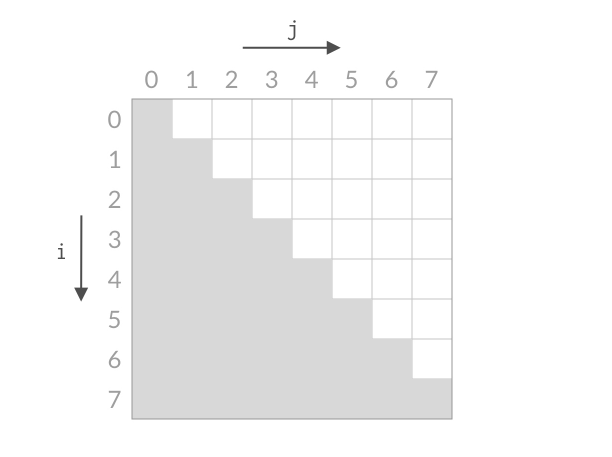

2. 从边角开始：

   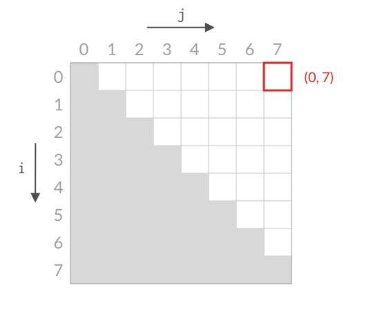

3. 如果小了，则下图部分不用搜索；反之旋转九十度部分不用搜索：

   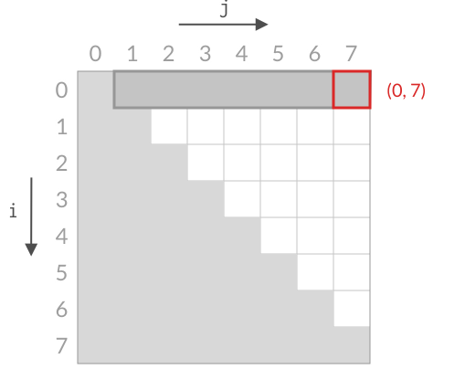

4. 最后本质上就是在图中走了一条长度为n的线，所以是$O(n)$


### 28. 盛最多水的容器*

#### 28.1 题目

给定一个长度为 `n` 的整数数组 `height` 。有 `n` 条垂线，第 `i` 条线的两个端点是 `(i, 0)` 和 `(i, height[i])` 。

找出其中的两条线，使得它们与 `x` 轴共同构成的容器可以容纳最多的水。

返回容器可以储存的最大水量。

**说明：**你不能倾斜容器。

 

**示例 1：**


```
输入：[1,8,6,2,5,4,8,3,7]
输出：49 
解释：图中垂直线代表输入数组 [1,8,6,2,5,4,8,3,7]。在此情况下，容器能够容纳水（表示为蓝色部分）的最大值为 49。
```

**示例 2：**

```
输入：height = [1,1]
输出：1
```

 

**提示：**

- `n == height.length`
- `2 <= n <= 105`
- `0 <= height[i] <= 104`


#### 28.2 解法

时间复杂度$O(n)$，空间复杂度为 $O(1)$。

```cpp
#include <algorithm>
#include <iostream>
#include <queue>
#include <string>
#include <unordered_map>
#include <vector>

using namespace std;

class Solution {
 public:
  int maxArea(vector<int>& height) {
    int i = 0, j = height.size() - 1, maxVol = 0;
    while (i < j) {
      int vol = (j - i) * min(height[i], height[j]);
      maxVol = max(vol, maxVol);

      if (height[i] < height[j]) {
        i++;
      } else {
        j--;
      }
    }

    return maxVol;
  }
};

int main() {
  ios::sync_with_stdio(false);
  cin.tie(nullptr);

  int n;
  cin >> n;

  vector<int> heights(n);
  for (int i = 0; i < n; i++) {
    cin >> heights[i];
  }

  Solution obj;
  cout << obj.maxArea(heights);

  return 0;
}
```


#### 28.3 解析

这道题和上一道题其实差不多，关键一点是不要代入之前“接雨水”那道题的想法，因为这里不算柱子的空间，所以不用担心柱子影响体积，这是很关键的。明白这一点之后，同样取左右指针，那么考虑一个问题：移动哪一个指针，凭什么移动？注意到当`height[i] < height[j]`时，如果移动右边`j`，宽度一定减少，但是水位一定不变，这样容积一定减小，那么不能移动`j`，自然而然地就得移动`i`……


### 29. 三数之和*

#### 29.1 题目

给你一个整数数组 `nums` ，判断是否存在三元组 `[nums[i], nums[j], nums[k]]` 满足 `i != j`、`i != k` 且 `j != k` ，同时还满足 `nums[i] + nums[j] + nums[k] == 0` 。请你返回所有和为 `0` 且不重复的三元组。

**注意：**答案中不可以包含重复的三元组。

 

**示例 1：**

```
输入：nums = [-1,0,1,2,-1,-4]
输出：[[-1,-1,2],[-1,0,1]]
解释：
nums[0] + nums[1] + nums[2] = (-1) + 0 + 1 = 0 。
nums[1] + nums[2] + nums[4] = 0 + 1 + (-1) = 0 。
nums[0] + nums[3] + nums[4] = (-1) + 2 + (-1) = 0 。
不同的三元组是 [-1,0,1] 和 [-1,-1,2] 。
注意，输出的顺序和三元组的顺序并不重要。
```

**示例 2：**

```
输入：nums = [0,1,1]
输出：[]
解释：唯一可能的三元组和不为 0 。
```

**示例 3：**

```
输入：nums = [0,0,0]
输出：[[0,0,0]]
解释：唯一可能的三元组和为 0 。
```

 

**提示：**

- `3 <= nums.length <= 3000`
- `-105 <= nums[i] <= 105`


#### 29.2 解法

时间复杂度：$O(n^2)$，空间复杂度：$O(\log n)$ 或 $O(1)$。

```cpp
#include <algorithm>
#include <iostream>
#include <queue>
#include <string>
#include <unordered_map>
#include <vector>

using namespace std;

class Solution {
 public:
  vector<vector<int>> threeSum(vector<int>& nums) {
    sort(nums.begin(), nums.end());

    vector<vector<int>> result;

    int x = 0, n = nums.size();
    while (x < n - 2) {
      if (nums[x] + nums[n - 2] + nums[n - 1] < 0) {
        x++;
      } else if (nums[x] + nums[x + 1] + nums[x + 2] > 0) {
        break;
      } else if (1 <= x && nums[x] == nums[x - 1]) {
        x++;
        continue;
      }

      int y = x + 1, z = n - 1, sum = -nums[x];
      while (y < z) {
        if (z < n - 1 && y > x + 1 && nums[y] == nums[y - 1] &&
            nums[z] == nums[z + 1]) {
          z--;
          y++;
        } else if (nums[y] + nums[z] == sum) {
          result.push_back(vector<int>{nums[x], nums[y], nums[z]});
          z--;
          y++;
        } else if (nums[y] + nums[z] > sum) {
          z--;
        } else {
          y++;
        }
      }

      x++;
    }

    return result;
  }
};

int main() {
  ios::sync_with_stdio(false);
  cin.tie(nullptr);

  int n;
  cin >> n;

  vector<int> nums(n);
  for (int i = 0; i < n; i++) {
    cin >> nums[i];
  }

  Solution obj;
  vector<vector<int>> res = obj.threeSum(nums);

  for (auto x : res) {
    cout << "[";
    for (int y : x) {
      cout << y << " ";
    }
    cout << "]\n";
  }

  return 0;
}
```

> 一些写法上的优化：
>
> ```cpp
> #include <algorithm>
> #include <iostream>
> #include <vector>
> 
> using namespace std;
> 
> class Solution {
> public:
>     vector<vector<int>> threeSum(vector<int>& nums) {
>         vector<vector<int>> result;
>         int n = nums.size();
>         if (n < 3) return result;
> 
>         sort(nums.begin(), nums.end());
> 
>         // 如果x（或i）一定加，那么可以用for
>         for (int i = 0; i < n - 2; i++) {
>             // 新剪枝，本意就是旧剪枝的第二部分
>             if (nums[i] > 0) break;
>             
>             if (i > 0 && nums[i] == nums[i - 1]) continue;
> 
>             int left = i + 1;
>             int right = n - 1;
> 
>             while (left < right) {
>                 int sum = nums[i] + nums[left] + nums[right];
>                 
>                 if (sum == 0) {
>                     result.push_back({nums[i], nums[left], nums[right]});
>                     
>                     // 去重
>                     while (left < right && nums[left] == nums[left + 1]) left++;
>                     while (left < right && nums[right] == nums[right - 1]) right--;
>                     
>                     left++;
>                     right--;
>                 } else if (sum < 0) {
>                     left++;
>                 } else {
>                     right--;
>                 }
>             }
>         }
> 
>         return result;
>     }
> };
> 
> int main() {
>     ios::sync_with_stdio(false);
>     cin.tie(nullptr);
> 
>     int n;
>     if (cin >> n) {
>         vector<int> nums(n);
>         for (int i = 0; i < n; i++) {
>             cin >> nums[i];
>         }
> 
>         Solution obj;
>         vector<vector<int>> res = obj.threeSum(nums);
> 
>         for (const auto& x : res) {
>             cout << "[";
>             for (size_t j = 0; j < x.size(); j++) {
>                 cout << x[j] << (j == x.size() - 1 ? "" : " ");
>             }
>             cout << "]\n";
>         }
>     }
>     return 0;
> }
> ```


#### 29.3 解析

这就是最优的解了，并没有量级上更快的办法。这道题相当于多了一个维度，其他部分和前面题目类似，稍微复杂的就是重复项的处理。


## 三、滑动窗口

### 30. 长度最小的子数组*

#### 30.1 题目

给定一个含有 `n` 个正整数的数组和一个正整数 `target` **。**

找出该数组中满足其总和大于等于 `target` 的长度最小的 **子数组** `[numsl, numsl+1, ..., numsr-1, numsr]` ，并返回其长度**。**如果不存在符合条件的子数组，返回 `0` 。

 

**示例 1：**

```
输入：target = 7, nums = [2,3,1,2,4,3]
输出：2
解释：子数组 [4,3] 是该条件下的长度最小的子数组。
```

**示例 2：**

```
输入：target = 4, nums = [1,4,4]
输出：1
```

**示例 3：**

```
输入：target = 11, nums = [1,1,1,1,1,1,1,1]
输出：0
```

 

**提示：**

- `1 <= target <= 109`
- `1 <= nums.length <= 105`
- `1 <= nums[i] <= 104`

 

**进阶：**

- 如果你已经实现 `O(n)` 时间复杂度的解法, 请尝试设计一个 `O(n log(n))` 时间复杂度的解法。


#### 30.2 解法

时间复杂度 $O(n)$，空间复杂度 $O(1)$。

```cpp
#include <algorithm>
#include <iostream>
#include <queue>
#include <string>
#include <unordered_map>
#include <vector>

using namespace std;

class Solution {
 public:
  int minSubArrayLen(int target, vector<int>& nums) {
    int i = 0, j = 1, n = nums.size(), sum = nums[0], minLen = 100001;
    if (n < 2) {
      return (sum >= target ? 1 : 0);
    }

    while (i < j) {
      if (sum >= target) {
        minLen = min(minLen, j - i);
        sum -= nums[i++];
      } else {
        if (j == n) break;
        sum += nums[j++];
      }
    }

    return (minLen == 100001 ? 0 : minLen);
  }
};

int main() {
  ios::sync_with_stdio(false);
  cin.tie(nullptr);

  int n, target;
  cin >> n >> target;

  vector<int> nums(n);
  for (int i = 0; i < n; i++) {
    cin >> nums[i];
  }

  Solution obj;
  cout << obj.minSubArrayLen(target, nums);

  return 0;
}
```

> 滑动窗口和双指针一样比较模板化，看看按模板写的（其实差不多）：
>
> ```cpp
> #include <algorithm>
> #include <climits>
> #include <iostream>
> #include <vector>
> 
> using namespace std;
> 
> class Solution {
> public:
>     int minSubArrayLen(int target, vector<int>& nums) {
>         int minLen = INT_MAX; //INT_MAX更好
>         int left = 0;
>         int sum = 0;
>         int n = nums.size();
> 
>         for (int right = 0; right < n; right++) {
>             sum += nums[right];
> 
>             while (sum >= target) {
>                 minLen = min(minLen, right - left + 1);
>                 sum -= nums[left];
>                 left++;
>             }
>         }
> 
>         return minLen == INT_MAX ? 0 : minLen;
>     }
> };
> 
> int main() {
>     ios::sync_with_stdio(false);
>     cin.tie(nullptr);
> 
>     int n, target;
>     if (cin >> n >> target) {
>         vector<int> nums(n);
>         for (int i = 0; i < n; i++) {
>             cin >> nums[i];
>         }
> 
>         Solution obj;
>         cout << obj.minSubArrayLen(target, nums) << "\n";
>     }
> 
>     return 0;
> }
> ```
>
> 


#### 30.3 解析

这就是等效最优解。注意到这道题是**大于等于**，不要误以为是等于即可。

进阶这部分是考虑到数字可能是负数，这样就没有$O(n)$了，不过这是另一个题目的解，这里先不说。


### 31. 无重复字符的最长子串*

#### 31.1 题目

给定一个字符串 `s` ，请你找出其中不含有重复字符的 **最长 子串** 的长度。

 

**示例 1:**

```
输入: s = "abcabcbb"
输出: 3 
解释: 因为无重复字符的最长子串是 "abc"，所以其长度为 3。注意 "bca" 和 "cab" 也是正确答案。
```

**示例 2:**

```
输入: s = "bbbbb"
输出: 1
解释: 因为无重复字符的最长子串是 "b"，所以其长度为 1。
```

**示例 3:**

```
输入: s = "pwwkew"
输出: 3
解释: 因为无重复字符的最长子串是 "wke"，所以其长度为 3。
     请注意，你的答案必须是 子串 的长度，"pwke" 是一个子序列，不是子串。
```

 

**提示：**

- `0 <= s.length <= 5 * 104`
- `s` 由英文字母、数字、符号和空格组成


#### 31.2 解法

时间复杂度 $O(N)$，空间复杂度 $O(M)$（$M$ 为字符集大小）。

```cpp
#include <algorithm>
#include <iostream>
#include <queue>
#include <string>
#include <unordered_map>
#include <vector>

using namespace std;

class Solution {
 public:
  int lengthOfLongestSubstring(string s) {
    int left = 1, n = s.size(), maxLen = 0;
    unordered_map<char, int> lastIndex;
    for (int right = 0; right < n; right++) {
      if (lastIndex[s[right]] >= left) {
        left = lastIndex[s[right]] + 1;
      }
      lastIndex[s[right]] = right + 1;
      maxLen = max(right - left + 2, maxLen);
    }

    return maxLen;
  }
};

int main() {
  ios::sync_with_stdio(false);
  cin.tie(nullptr);

  string s;
  getline(cin, s);

  Solution obj;
  cout << obj.lengthOfLongestSubstring(s);

  return 0;
}
```

> 由于只是ASCII码，以定长数组代替`unordered_map`速度会更快，顺便还解决了后者初始值是`0`的问题：
>
> ```cpp
> #include <algorithm>
> #include <iostream>
> #include <string>
> #include <vector>
> 
> using namespace std;
> 
> class Solution {
> public:
>     int lengthOfLongestSubstring(string s) {
>         vector<int> lastIndex(128, -1);
>         int maxLen = 0;
>         int left = 0;
>         
>         for (int right = 0; right < s.size(); right++) {
>             if (lastIndex[s[right]] >= left) {
>                 left = lastIndex[s[right]] + 1;
>             }
>             
>             lastIndex[s[right]] = right;
>             maxLen = max(maxLen, right - left + 1);
>         }
>         
>         return maxLen;
>     }
> };
> 
> int main() {
>     ios::sync_with_stdio(false);
>     cin.tie(nullptr);
> 
>     string s;
>     if (getline(cin, s)) {
>         Solution obj;
>         cout << obj.lengthOfLongestSubstring(s) << "\n";
>     }
> 
>     return 0;
> }
> ```


#### 31.3 解析

这就是等效最优解，存下每个字符上一次出现的位置，如果在窗口中就直接缩减窗口左边界到该处（+1）。

此外，还可以用`bool`数组表征窗口状态：

```cpp
#include <algorithm>
#include <string>
#include <vector>

using namespace std;

class Solution {
public:
    int lengthOfLongestSubstring(string s) {
        // 128位的布尔数组，表征窗口中是否有该字符
        vector<bool> window(128, false);
        int maxLen = 0;
        int left = 0;
        
        for (int right = 0; right < s.size(); right++) {
            // while循环代替跳转逻辑
            while (window[s[right]]) {
                window[s[left]] = false;
                left++;
            }
            
            window[s[right]] = true;
            maxLen = max(maxLen, right - left + 1);
        }
        
        return maxLen;
    }
};
```


### 32. 串联所有单词的子串* （@）

#### 32.1 题目

给定一个字符串 `s` 和一个字符串数组 `words`**。** `words` 中所有字符串 **长度相同**。

 `s` 中的 **串联子串** 是指一个包含 `words` 中所有字符串以任意顺序排列连接起来的子串。

- 例如，如果 `words = ["ab","cd","ef"]`， 那么 `"abcdef"`， `"abefcd"`，`"cdabef"`， `"cdefab"`，`"efabcd"`， 和 `"efcdab"` 都是串联子串。 `"acdbef"` 不是串联子串，因为他不是任何 `words` 排列的连接。

返回所有串联子串在 `s` 中的开始索引。你可以以 **任意顺序** 返回答案。

 

**示例 1：**

```
输入：s = "barfoothefoobarman", words = ["foo","bar"]
输出：[0,9]
解释：因为 words.length == 2 同时 words[i].length == 3，连接的子字符串的长度必须为 6。
子串 "barfoo" 开始位置是 0。它是 words 中以 ["bar","foo"] 顺序排列的连接。
子串 "foobar" 开始位置是 9。它是 words 中以 ["foo","bar"] 顺序排列的连接。
输出顺序无关紧要。返回 [9,0] 也是可以的。
```

**示例 2：**

```
输入：s = "wordgoodgoodgoodbestword", words = ["word","good","best","word"]
输出：[]
解释：因为 words.length == 4 并且 words[i].length == 4，所以串联子串的长度必须为 16。
s 中没有子串长度为 16 并且等于 words 的任何顺序排列的连接。
所以我们返回一个空数组。
```

**示例 3：**

```
输入：s = "barfoofoobarthefoobarman", words = ["bar","foo","the"]
输出：[6,9,12]
解释：因为 words.length == 3 并且 words[i].length == 3，所以串联子串的长度必须为 9。
子串 "foobarthe" 开始位置是 6。它是 words 中以 ["foo","bar","the"] 顺序排列的连接。
子串 "barthefoo" 开始位置是 9。它是 words 中以 ["bar","the","foo"] 顺序排列的连接。
子串 "thefoobar" 开始位置是 12。它是 words 中以 ["the","foo","bar"] 顺序排列的连接。
```

 

**提示：**

- `1 <= s.length <= 104`
- `1 <= words.length <= 5000`
- `1 <= words[i].length <= 30`
- `words[i]` 和 `s` 由小写英文字母组成


#### 32.2 解法

时间复杂度$O(M)$（$M$ 为字符串 `s` 的长度），空间复杂度 $O(N)$。

```cpp
#include <algorithm>
#include <iostream>
#include <queue>
#include <string>
#include <unordered_map>
#include <vector>

using namespace std;

class Solution {
 public:
  vector<int> findSubstring(string s, vector<string>& words) {
    unordered_map<string, int> wordsFeq;
    for (string x : words) wordsFeq[x]++;

    int wordLen = words[0].size(), n = words.size(), m = s.size();
    int subLen = wordLen * n;
    vector<int> res;

    for (int i = 0; i < wordLen; i++) {
      unordered_map<string, int> nowWordFeq;
      int left = i, nowMat = 0;
      for (int right = i; right <= m - wordLen; right += wordLen) {
        string sub = s.substr(right, wordLen);
        if (wordsFeq[sub] == 0) {
          left = right + wordLen;
          nowWordFeq.clear();
          nowMat = 0;
        } else {
          nowWordFeq[sub]++;
          nowMat++;
          while (wordsFeq[sub] < nowWordFeq[sub]) {
            string backSub = s.substr(left, wordLen);
            nowWordFeq[backSub]--;
            nowMat--;
            left += wordLen;
          }
          if (nowMat == n) {
            res.push_back(left);
            nowMat--;
            nowWordFeq[s.substr(left, wordLen)]--;
            left += wordLen;
          }
        }
      }
    }

    return res;
  }
};

int main() {
  ios::sync_with_stdio(false);
  cin.tie(nullptr);

  int n;
  cin >> n;

  vector<string> words(n);
  for (int i = 0; i < n; i++) {
    cin >> words[i];
  }

  string s;
  cin >> s;

  Solution obj;
  vector<int> res = obj.findSubstring(s, words);
  for (int x : res) {
    cout << x << " ";
  }

  return 0;
}
```

> 此前我多次直接访问`unordered_map`中未有的元素，这时它会自动初始化为0，但是这样也会额外消耗内存：
>
> ```cpp
> #include <iostream>
> #include <string>
> #include <unordered_map>
> #include <vector>
> 
> using namespace std;
> 
> class Solution {
> public:
>     vector<int> findSubstring(string s, vector<string>& words) {
>         vector<int> res;
>         if (words.empty() || s.empty()) return res;
> 
>         unordered_map<string, int> wordsFeq;
>         // const string& 节省空间
>         for (const string& word : words) {
>             wordsFeq[word]++;
>         }
> 
>         int wordLen = words[0].size();
>         int n = words.size();
>         int m = s.size();
> 
>         for (int i = 0; i < wordLen; i++) {
>             unordered_map<string, int> nowWordFeq;
>             int left = i;
>             int nowMat = 0;
> 
>             for (int right = i; right <= m - wordLen; right += wordLen) {
>                 string sub = s.substr(right, wordLen);
> 
>                 // 直接使用count就可以避免初始化它
>                 if (wordsFeq.count(sub) == 0) {
>                     nowWordFeq.clear();
>                     nowMat = 0;
>                     left = right + wordLen;
>                 } else {
>                     nowWordFeq[sub]++;
>                     nowMat++;
> 
>                     while (nowWordFeq[sub] > wordsFeq[sub]) {
>                         string backSub = s.substr(left, wordLen);
>                         nowWordFeq[backSub]--;
>                         nowMat--;
>                         left += wordLen;
>                     }
> 
>                     // 等于n后其实无需再移动，本次结束会自动right++移动，而必然导致超限，则使left++移动
>                     if (nowMat == n) {
>                         res.push_back(left);
>                     }
>                 }
>             }
>         }
> 
>         return res;
>     }
> };
> 
> int main() {
>     ios::sync_with_stdio(false);
>     cin.tie(nullptr);
> 
>     int n;
>     if (cin >> n) {
>         vector<string> words(n);
>         for (int i = 0; i < n; i++) {
>             cin >> words[i];
>         }
> 
>         string s;
>         cin >> s;
> 
>         Solution obj;
>         vector<int> res = obj.findSubstring(s, words);
>         for (size_t i = 0; i < res.size(); i++) {
>             cout << res[i] << (i == res.size() - 1 ? "" : " ");
>         }
>         cout << "\n";
>     }
> 
>     return 0;
> }
> ```


#### 32.3 解析

这就是最优解。这个思路需要把所谓的`Words`看作一个个完整的单元，而做到这一点就需要以`[0:Words.size()]`为起点开始遍历数组，避免出现不从`N`的整数倍开始的子串。


### 33. 最小覆盖子串*

#### 33.1 题目

给定两个字符串 `s` 和 `t`，长度分别是 `m` 和 `n`，返回 s 中的 **最短窗口 子串**，使得该子串包含 `t` 中的每一个字符（**包括重复字符**）。如果没有这样的子串，返回空字符串 `""`。

测试用例保证答案唯一。

 

**示例 1：**

```
输入：s = "ADOBECODEBANC", t = "ABC"
输出："BANC"
解释：最小覆盖子串 "BANC" 包含来自字符串 t 的 'A'、'B' 和 'C'。
```

**示例 2：**

```
输入：s = "a", t = "a"
输出："a"
解释：整个字符串 s 是最小覆盖子串。
```

**示例 3:**

```
输入: s = "a", t = "aa"
输出: ""
解释: t 中两个字符 'a' 均应包含在 s 的子串中，
因此没有符合条件的子字符串，返回空字符串。
```

 

**提示：**

- `m == s.length`
- `n == t.length`
- `1 <= m, n <= 105`
- `s` 和 `t` 由英文字母组成

 

**进阶：**你能设计一个在 `O(m + n)` 时间内解决此问题的算法吗？


#### 33.2 解法

时间复杂度$O(N)$，空间复杂度$O(1)$。

```cpp
#include <algorithm>
#include <iostream>
#include <queue>
#include <string>
#include <unordered_map>
#include <vector>

using namespace std;

class Solution {
 public:
  string minWindow(string s, string t) {
    int m = s.size(), n = t.size();
    if (n > m) {
      return "";
    }

    vector<int> freq(128, -1), nowFreq(128, 0);
    for (const char& x : t) freq[x] += (freq[x] == -1 ? 2 : 1);

    int count = 0, left = 0, minLen = INT_MAX, minLeft = 0;
    for (int right = 0; right < m; right++) {
      if (freq[s[right]] != 0) {
        nowFreq[s[right]]++;
        if (nowFreq[s[right]] <= freq[s[right]]) count++;
      }
      if (count >= n) {
        while (nowFreq[s[left]] > freq[s[left]]) {
          if (freq[s[left]] != 0) {
            nowFreq[s[left]]--;
          }
          left++;
        }

        if (right - left + 1 < minLen) {
          minLen = right - left + 1;
          minLeft = left;
        }
      }
    }

    return (minLen == INT_MAX ? "" : s.substr(minLeft, minLen));
  }
};

int main() {
  ios::sync_with_stdio(false);
  cin.tie(nullptr);

  string s, t;
  cin >> s >> t;

  Solution obj;
  cout << obj.minWindow(s, t) << endl;

  return 0;
}
```


#### 33.3 解析

等效最优解，继承了上题的思路。此外，可以不用两个数组，上一题之所以用两个，是因为恢复起来很麻烦，这道题没有这个问题：

```cpp
#include <climits>
#include <iostream>
#include <string>
#include <vector>

using namespace std;

class Solution {
public:
    string minWindow(string s, string t) {
        if (s.empty() || t.empty() || s.size() < t.size()) {
            return "";
        }

        vector<int> hash(128, 0);
        for (char c : t) {
            hash[c]++;
        }

        int left = 0, count = t.size(), minLen = INT_MAX, minLeft = 0;

        for (int right = 0; right < s.size(); right++) {
            if (hash[s[right]] > 0) {
                count--;
            }
            hash[s[right]]--;

            // count==0表征当前窗口就是符合条件的窗口
            while (count == 0) {
                if (right - left + 1 < minLen) {
                    minLen = right - left + 1;
                    minLeft = left;
                }

                // 如果当前窗口满足条件，则一定会左移一步，不论是否会破坏条件
                if (hash[s[left]] == 0) {
                    count++;
                }
                hash[s[left]]++;
                left++;
            }
        }

        return minLen == INT_MAX ? "" : s.substr(minLeft, minLen);
    }
};

int main() {
    ios::sync_with_stdio(false);
    cin.tie(nullptr);

    string s, t;
    if (cin >> s >> t) {
        Solution obj;
        cout << obj.minWindow(s, t) << "\n";
    }

    return 0;
}
```


## 四、矩阵

### 34. 有效的数独*/**

#### 34.1 题目

请你判断一个 `9 x 9` 的数独是否有效。只需要 **根据以下规则** ，验证已经填入的数字是否有效即可。

1. 数字 `1-9` 在每一行只能出现一次。
2. 数字 `1-9` 在每一列只能出现一次。
3. 数字 `1-9` 在每一个以粗实线分隔的 `3x3` 宫内只能出现一次。（请参考示例图）

 

**注意：**

- 一个有效的数独（部分已被填充）不一定是可解的。
- 只需要根据以上规则，验证已经填入的数字是否有效即可。
- 空白格用 `'.'` 表示。

 

**示例 1：**


```
输入：board = 
[["5","3",".",".","7",".",".",".","."]
,["6",".",".","1","9","5",".",".","."]
,[".","9","8",".",".",".",".","6","."]
,["8",".",".",".","6",".",".",".","3"]
,["4",".",".","8",".","3",".",".","1"]
,["7",".",".",".","2",".",".",".","6"]
,[".","6",".",".",".",".","2","8","."]
,[".",".",".","4","1","9",".",".","5"]
,[".",".",".",".","8",".",".","7","9"]]
输出：true
```

**示例 2：**

```
输入：board = 
[["8","3",".",".","7",".",".",".","."]
,["6",".",".","1","9","5",".",".","."]
,[".","9","8",".",".",".",".","6","."]
,["8",".",".",".","6",".",".",".","3"]
,["4",".",".","8",".","3",".",".","1"]
,["7",".",".",".","2",".",".",".","6"]
,[".","6",".",".",".",".","2","8","."]
,[".",".",".","4","1","9",".",".","5"]
,[".",".",".",".","8",".",".","7","9"]]
输出：false
解释：除了第一行的第一个数字从 5 改为 8 以外，空格内其他数字均与 示例1 相同。 但由于位于左上角的 3x3 宫内有两个 8 存在, 因此这个数独是无效的。
```

 

**提示：**

- `board.length == 9`
- `board[i].length == 9`
- `board[i][j]` 是一位数字（`1-9`）或者 `'.'`


#### 34.2 解法

**时间复杂度**：$O(1)$。**空间复杂度**：$O(1)$。

```cpp
#include <iostream>
#include <vector>

using namespace std;

class Solution {
public:
    bool isValidSudoku(vector<vector<char>>& board) {
        vector<vector<bool>> row(9, vector<bool>(9, false));
        vector<vector<bool>> col(9, vector<bool>(9, false));
        vector<vector<bool>> sqa(9, vector<bool>(9, false));

        for (int i = 0; i < 9; i++) {
            for (int j = 0; j < 9; j++) {
                if (board[i][j] != '.') {
                    int num = board[i][j] - '1';
                    int boxIndex = (i / 3) * 3 + j / 3;

                    if (row[i][num] || col[j][num] || sqa[boxIndex][num]) {
                        return false;
                    }

                    row[i][num] = true;
                    col[j][num] = true;
                    sqa[boxIndex][num] = true;
                }
            }
        }

        return true;
    }
};

int main() {
    ios::sync_with_stdio(false);
    cin.tie(nullptr);

    vector<vector<char>> board(9, vector<char>(9));
    for (int i = 0; i < 9; i++) {
        for (int j = 0; j < 9; j++) {
            cin >> board[i][j];
        }
    }

    Solution obj;
    cout << (obj.isValidSudoku(board) ? "true" : "false") << "\n";

    return 0;
}
```


#### 34.3 解析

这道题一般都是等效最优解，但在其中亦有优劣，可以使用位运算代替bool数组：

```cpp
#include <iostream>
#include <vector>

using namespace std;

class Solution {
public:
    bool isValidSudoku(vector<vector<char>>& board) {
        vector<int> row(9, 0);
        vector<int> col(9, 0);
        vector<int> sqa(9, 0);

        for (int i = 0; i < 9; i++) {
            for (int j = 0; j < 9; j++) {
                if (board[i][j] != '.') {
                    int num = board[i][j] - '1';
                    int mask = 1 << num; //把数字 1 向左移动 num 位，生成一个只有第 num 位是 1 的掩码
                    int boxIndex = (i / 3) * 3 + j / 3;

                    // 进行按位与操作，如果结果不为 0，说明这一位之前已经被标记过了（重复出现）
                    if ((row[i] & mask) || (col[j] & mask) || (sqa[boxIndex] & mask)) {
                        return false;
                    }

                    // 进行按位或操作，将当前数字的状态硬编码打入这个整数中
                    row[i] |= mask;
                    col[j] |= mask;
                    sqa[boxIndex] |= mask;
                }
            }
        }

        return true;
    }
};
```


### 35. 螺旋矩阵*

#### 35.1 题目

给你一个 `m` 行 `n` 列的矩阵 `matrix` ，请按照 **顺时针螺旋顺序** ，返回矩阵中的所有元素。

 

**示例 1：**


```
输入：matrix = [[1,2,3],[4,5,6],[7,8,9]]
输出：[1,2,3,6,9,8,7,4,5]
```

**示例 2：**

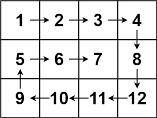

```
输入：matrix = [[1,2,3,4],[5,6,7,8],[9,10,11,12]]
输出：[1,2,3,4,8,12,11,10,9,5,6,7]
```

 

**提示：**

- `m == matrix.length`
- `n == matrix[i].length`
- `1 <= m, n <= 10`
- `-100 <= matrix[i][j] <= 100`


#### 35.2 解法

**时间复杂度**：$O(M \times N)$，**空间复杂度**：$O(1)$。

```cpp
#include <iostream>
#include <vector>

using namespace std;

class Solution {
 public:
  vector<int> spiralOrder(vector<vector<int>>& matrix) {
    if (matrix.empty() || matrix[0].empty()) return {};

    int n = matrix.size();
    int m = matrix[0].size();
    int i = 0, j = 0, k = 0, count = 0;

    vector<vector<int>> move = {
        {0, 1, m - 1}, {1, 0, n - 1}, {0, -1, 0}, {-1, 0, 0}};
    vector<int> res;

    while (count < m * n - 1) {
      if (i * move[k][0] + j * move[k][1] <
          move[k][2] * move[k][0] + move[k][2] * move[k][1]) {
        res.push_back(matrix[i][j]);
        count++;
        i += move[k][0];
        j += move[k][1];
      } else {
        int change = (k + 3) % 4;
        move[change][2] -= move[change][0] + move[change][1];
        k = (k + 1) % 4;
      }
    }
    res.push_back(matrix[i][j]);

    return res;
  }
};

int main() {
  ios::sync_with_stdio(false);
  cin.tie(nullptr);

  int n, m;
  if (cin >> n >> m) {
    vector<vector<int>> matrix(n, vector<int>(m));
    for (int i = 0; i < n; i++) {
      for (int j = 0; j < m; j++) {
        cin >> matrix[i][j];
      }
    }

    Solution obj;
    vector<int> res = obj.spiralOrder(matrix);

    for (size_t x = 0; x < res.size(); x++) {
      cout << res[x] << (x == res.size() - 1 ? "" : " ");
    }
    cout << "\n";
  }

  return 0;
}
```


#### 35.3 解析

算是等效最优解，但是逻辑稍微有点绕。`move`就是定义了四个方向的移动向量和边界，然后用一个投影算式统一表示了边界条件，最后更新边界注意是更新` (k + 3) % 4`。

此外，一般的做法更为清晰：

```cpp
#include <iostream>
#include <vector>

using namespace std;

class Solution {
public:
    vector<int> spiralOrder(vector<vector<int>>& matrix) {
        if (matrix.empty() || matrix[0].empty()) return {};

        vector<int> res;
        int top = 0;
        int bottom = matrix.size() - 1;
        int left = 0;
        int right = matrix[0].size() - 1;

        while (true) {
            for (int i = left; i <= right; i++) res.push_back(matrix[top][i]);
            if (++top > bottom) break;

            for (int i = top; i <= bottom; i++) res.push_back(matrix[i][right]);
            if (--right < left) break;

            for (int i = right; i >= left; i--) res.push_back(matrix[bottom][i]);
            if (--bottom < top) break;

            for (int i = bottom; i >= top; i--) res.push_back(matrix[i][left]);
            if (++left > right) break;
        }

        return res;
    }
};
```


### 36. 旋转图像*/**

#### 36.1 题目

给定一个 *n* × *n* 的二维矩阵 `matrix` 表示一个图像。请你将图像顺时针旋转 90 度。

你必须在**[ 原地](https://baike.baidu.com/item/原地算法)** 旋转图像，这意味着你需要直接修改输入的二维矩阵。**请不要** 使用另一个矩阵来旋转图像。

 

**示例 1：**

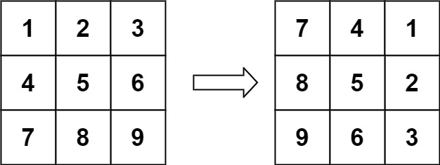

```
输入：matrix = [[1,2,3],[4,5,6],[7,8,9]]
输出：[[7,4,1],[8,5,2],[9,6,3]]
```

**示例 2：**

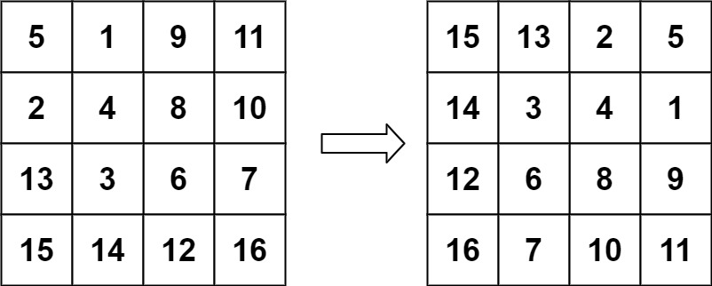

```
输入：matrix = [[5,1,9,11],[2,4,8,10],[13,3,6,7],[15,14,12,16]]
输出：[[15,13,2,5],[14,3,4,1],[12,6,8,9],[16,7,10,11]]
```

 

**提示：**

- `n == matrix.length == matrix[i].length`
- `1 <= n <= 20`
- `-1000 <= matrix[i][j] <= 1000`


#### 36.2 解法

**时间复杂度**：$O(N^2)$，**空间复杂度**：$O(1)$。

```cpp
#include <iostream>
#include <vector>

using namespace std;

class Solution {
 public:
  void rotate(vector<vector<int>>& matrix) {
    int n = matrix.size();
    for (int i = n - 1; i >= n / 2; i--) {
      int layer = n - 1 - i;
      for (int j = 0; j < i - layer; j++) {
        int temp = matrix[layer][layer + j];
        matrix[layer][layer + j] = matrix[i - j][layer];
        matrix[i - j][layer] = matrix[i][i - j];
        matrix[i][i - j] = matrix[layer + j][i];
        matrix[layer + j][i] = temp;
      }
    }
  }
};

int main() {
  ios::sync_with_stdio(false);
  cin.tie(nullptr);

  int n;
  if (cin >> n) {
    vector<vector<int>> matrix(n, vector<int>(n));
    for (int i = 0; i < n; i++) {
      for (int j = 0; j < n; j++) {
        cin >> matrix[i][j];
      }
    }

    Solution obj;
    obj.rotate(matrix);

    for (int i = 0; i < n; i++) {
      for (int j = 0; j < n; j++) {
        cout << matrix[i][j] << (j == n - 1 ? "" : " ");
      }
      cout << "\n";
    }
  }

  return 0;
}
```


#### 36.3 解析

我这个解当然也算最优解，但是有一个更好的办法：将一个二维矩阵顺时针旋转 90 度，在数学上等价于以下两步：

1. **主对角线翻转（转置）**：将矩阵的行和列互换（`matrix[i][j]` 与 `matrix[j][i]` 互换）。
2. **左右镜像翻转**：将转置后的矩阵，每一行进行水平翻转（逆序）。

那么：

```cpp
#include <algorithm>
#include <iostream>
#include <vector>

using namespace std;

class Solution {
public:
    void rotate(vector<vector<int>>& matrix) {
        int n = matrix.size();
        
        for (int i = 0; i < n; i++) {
            for (int j = i + 1; j < n; j++) {
                swap(matrix[i][j], matrix[j][i]);
            }
        }
        
        for (int i = 0; i < n; i++) {
            reverse(matrix[i].begin(), matrix[i].end());
        }
    }
};
```


### 37. 矩阵置零**

#### 37.1 题目

给定一个 `*m* x *n*` 的矩阵，如果一个元素为 **0** ，则将其所在行和列的所有元素都设为 **0** 。请使用 **[原地](http://baike.baidu.com/item/原地算法)** 算法**。**

 

**示例 1：**


```
输入：matrix = [[1,1,1],[1,0,1],[1,1,1]]
输出：[[1,0,1],[0,0,0],[1,0,1]]
```

**示例 2：**


```
输入：matrix = [[0,1,2,0],[3,4,5,2],[1,3,1,5]]
输出：[[0,0,0,0],[0,4,5,0],[0,3,1,0]]
```

 

**提示：**

- `m == matrix.length`
- `n == matrix[0].length`
- `1 <= m, n <= 200`
- `-231 <= matrix[i][j] <= 231 - 1`

 

**进阶：**

- 一个直观的解决方案是使用  `O(*m**n*)` 的额外空间，但这并不是一个好的解决方案。
- 一个简单的改进方案是使用 `O(*m* + *n*)` 的额外空间，但这仍然不是最好的解决方案。
- 你能想出一个仅使用常量空间的解决方案吗？


#### 37.2 解法

**时间复杂度**：$O(M \times N)$，**空间复杂度**：$O(M+N)$ 。

```cpp
#include <iostream>
#include <vector>

using namespace std;

class Solution {
public:
    void setZeroes(vector<vector<int>>& matrix) {
        int n = matrix.size();
        int m = matrix[0].size();
        vector<int> rowZero(n, 1);
        vector<int> colZero(m, 1);

        for (int i = 0; i < n; i++) {
            for (int j = 0; j < m; j++) {
                if (matrix[i][j] == 0) {
                    rowZero[i] = 0;
                    colZero[j] = 0;
                }
            }
        }

        for (int i = 0; i < n; i++) {
            for (int j = 0; j < m; j++) {
                if (rowZero[i] == 0 || colZero[j] == 0) {
                    matrix[i][j] = 0;
                }
            }
        }
    }
};

int main() {
    ios::sync_with_stdio(false);
    cin.tie(nullptr);

    int n, m;
    if (cin >> n >> m) {
        vector<vector<int>> matrix(n, vector<int>(m));
        for (int i = 0; i < n; i++) {
            for (int j = 0; j < m; j++) {
                cin >> matrix[i][j];
            }
        }

        Solution obj;
        obj.setZeroes(matrix);

        for (int i = 0; i < n; i++) {
            for (int j = 0; j < m; j++) {
                cout << matrix[i][j] << (j == m - 1 ? "" : " ");
            }
            cout << "\n";
        }
    }

    return 0;
}
```


#### 37.3 解析

这并不是最优解，最优解的空间复杂度能到达$O(1)$。但是所谓的最优解并没有思维上的跃进，它是征用了原矩阵第一行、第一列作为原本`M + N`的空间（因为如果对应行列有零，那么第一行、列的对应位置也一定会是零，并不需要备份原矩阵的第一行、列），算是一个比较巧妙的办法：

```cpp
#include <iostream>
#include <vector>

using namespace std;

class Solution {
public:
    void setZeroes(vector<vector<int>>& matrix) {
        int n = matrix.size();
        int m = matrix[0].size();
        // 两个布尔变量标记第一行、列是否需要全部置零。
        bool firstRowZero = false;
        bool firstColZero = false;

        // 扫描第一行、列
        for (int i = 0; i < n; i++) {
            if (matrix[i][0] == 0) firstColZero = true;
        }
        for (int j = 0; j < m; j++) {
            if (matrix[0][j] == 0) firstRowZero = true;
        }

        // 存储行列状态
        for (int i = 1; i < n; i++) {
            for (int j = 1; j < m; j++) {
                if (matrix[i][j] == 0) {
                    matrix[i][0] = 0;
                    matrix[0][j] = 0;
                }
            }
        }

        // 处理0
        for (int i = 1; i < n; i++) {
            for (int j = 1; j < m; j++) {
                if (matrix[i][0] == 0 || matrix[0][j] == 0) {
                    matrix[i][j] = 0;
                }
            }
        }

        // 处理第一行、列
        if (firstColZero) {
            for (int i = 0; i < n; i++) {
                matrix[i][0] = 0;
            }
        }
        if (firstRowZero) {
            for (int j = 0; j < m; j++) {
                matrix[0][j] = 0;
            }
        }
    }
};
```


### 38. 生命游戏**

#### 38.1 题目

根据 [百度百科](https://baike.baidu.com/item/生命游戏/2926434?fr=aladdin) ， **生命游戏** ，简称为 **生命** ，是英国数学家约翰·何顿·康威在 1970 年发明的细胞自动机。

给定一个包含 `m × n` 个格子的面板，每一个格子都可以看成是一个细胞。每个细胞都具有一个初始状态： `1` 即为 **活细胞** （live），或 `0` 即为 **死细胞** （dead）。每个细胞与其八个相邻位置（水平，垂直，对角线）的细胞都遵循以下四条生存定律：

1. 如果活细胞周围八个位置的活细胞数少于两个，则该位置活细胞死亡；
2. 如果活细胞周围八个位置有两个或三个活细胞，则该位置活细胞仍然存活；
3. 如果活细胞周围八个位置有超过三个活细胞，则该位置活细胞死亡；
4. 如果死细胞周围正好有三个活细胞，则该位置死细胞复活；

下一个状态是通过将上述规则同时应用于当前状态下的每个细胞所形成的，其中细胞的出生和死亡是 **同时** 发生的。给你 `m x n` 网格面板 `board` 的当前状态，返回下一个状态。

给定当前 `board` 的状态，**更新** `board` 到下一个状态。

**注意** 你不需要返回任何东西。

 

**示例 1：**


```
输入：board = [[0,1,0],[0,0,1],[1,1,1],[0,0,0]]
输出：[[0,0,0],[1,0,1],[0,1,1],[0,1,0]]
```

**示例 2：**


```
输入：board = [[1,1],[1,0]]
输出：[[1,1],[1,1]]
```

 

**提示：**

- `m == board.length`
- `n == board[i].length`
- `1 <= m, n <= 25`
- `board[i][j]` 为 `0` 或 `1`

 

**进阶：**

- 你可以使用原地算法解决本题吗？请注意，面板上所有格子需要同时被更新：你不能先更新某些格子，然后使用它们的更新后的值再更新其他格子。
- 本题中，我们使用二维数组来表示面板。原则上，面板是无限的，但当活细胞侵占了面板边界时会造成问题。你将如何解决这些问题？


#### 38.2 解法

时间复杂度为 $O(M \times N)$，空间复杂度为 $O(M \times N)$。

```cpp
#include <algorithm>
#include <iostream>
#include <queue>
#include <string>
#include <unordered_map>
#include <vector>

using namespace std;

class Solution {
 public:
  void gameOfLife(vector<vector<int>>& board) {
    int m = board[0].size(), n = board.size();
    vector<vector<int>> nextState(n, vector<int>(m));

    for (int i = 0; i < n; i++) {
      for (int j = 0; j < m; j++) {
        if (board[i][j] == 1) {
          nextState[i][j] += board[i][j];
          if (i > 0) {
            nextState[i - 1][j]++;
          }
          if (j > 0) {
            nextState[i][j - 1]++;
          }
          if (i < n - 1) {
            nextState[i + 1][j]++;
          }
          if (j < m - 1) {
            nextState[i][j + 1]++;
          }
          if (i > 0 && j > 0) {
            nextState[i - 1][j - 1]++;
          }
          if (i > 0 && j < m - 1) {
            nextState[i - 1][j + 1]++;
          }
          if (i < n - 1 && j > 0) {
            nextState[i + 1][j - 1]++;
          }
          if (i < n - 1 && j < m - 1) {
            nextState[i + 1][j + 1]++;
          }
        }
      }
    }

    for (int i = 0; i < n; i++) {
      for (int j = 0; j < m; j++) {
        if (board[i][j] == 0) {
          if (nextState[i][j] == 3) board[i][j] = 1;
        } else {
          if (nextState[i][j] > 4 || nextState[i][j] < 3) board[i][j] = 0;
        }
      }
    }
  }
};

int main() {
  ios::sync_with_stdio(false);
  cin.tie(nullptr);

  int m, n;
  cin >> m >> n;

  vector<vector<int>> matrix(n, vector<int>(m));
  for (int i = 0; i < n; i++) {
    for (int j = 0; j < m; j++) {
      cin >> matrix[i][j];
    }
  }

  Solution obj;
  obj.gameOfLife(matrix);

  for (vector<int> r : matrix) {
    for (int c : r) {
      cout << c << " ";
    }
    cout << endl;
  }

  return 0;
}
```

> 很多冗余的`if`分支，这里可以使用**方向数组**：
>
> ```cpp
> #include <iostream>
> #include <vector>
> 
> using namespace std;
> 
> class Solution {
> public:
>     void gameOfLife(vector<vector<int>>& board) {
>         int n = board.size();
>         int m = board[0].size();
>         vector<vector<int>> nextState(n, vector<int>(m, 0));
> 
>         // 定义方向数组，即(i + dx[k], j + dy[k])
>         int dx[] = {-1, -1, -1, 0, 0, 1, 1, 1};
>         int dy[] = {-1, 0, 1, -1, 1, -1, 0, 1};
> 
>         for (int i = 0; i < n; i++) {
>             for (int j = 0; j < m; j++) {
>                 if (board[i][j] == 1) {
>                     nextState[i][j] += 1;
>                     
>                     for (int k = 0; k < 8; k++) {
>                         int nx = i + dx[k];
>                         int ny = j + dy[k];
>                         
>                         // 条件判断压缩成一句
>                         if (nx >= 0 && nx < n && ny >= 0 && ny < m) {
>                             nextState[nx][ny] += 1;
>                         }
>                     }
>                 }
>             }
>         }
> 
>         for (int i = 0; i < n; i++) {
>             for (int j = 0; j < m; j++) {
>                 if (board[i][j] == 0) {
>                     if (nextState[i][j] == 3) board[i][j] = 1;
>                 } else {
>                     if (nextState[i][j] > 4 || nextState[i][j] < 3) board[i][j] = 0;
>                 }
>             }
>         }
>     }
> };
> ```
>
> 


#### 38.3 解析

这也不算是等效最优解。

最优解和上一题一样，都是借用原矩阵空间，这里由于数据只占用0和1两个数字，也就是1位，而`int`还剩31位没有用到，这时候就可以借用此后的比特位来存储`nextState`。

下面是八个方向扫描的做法，当然用这种思路也可以实现我的办法（也就是活细胞贡献法）：

```cpp
#include <iostream>
#include <vector>

using namespace std;

class Solution {
public:
    void gameOfLife(vector<vector<int>>& board) {
        if (board.empty() || board[0].empty()) return;
        
        int m = board.size();
        int n = board[0].size();
        
        int dx[] = {-1, -1, -1, 0, 0, 1, 1, 1};
        int dy[] = {-1, 0, 1, -1, 1, -1, 0, 1};

        for (int i = 0; i < m; i++) {
            for (int j = 0; j < n; j++) {
                int liveNeighbors = 0;
                
                for (int k = 0; k < 8; k++) {
                    int x = i + dx[k];
                    int y = j + dy[k];
                    if (x >= 0 && x < m && y >= 0 && y < n) {
                        liveNeighbors += (board[x][y] & 1);
                    }
                }

                // 满足继续存活或者复活条件，即写入第二位 1
                if ((board[i][j] & 1) == 1) {
                    if (liveNeighbors == 2 || liveNeighbors == 3) {
                        board[i][j] |= 2;
                    }
                } else {
                    if (liveNeighbors == 3) {
                        board[i][j] |= 2;
                    }
                }
            }
        }

        for (int i = 0; i < m; i++) {
            for (int j = 0; j < n; j++) {
                board[i][j] >>= 1;
            }
        }
    }
};
```


## 五、哈希

### 39. 赎金信*

#### 39.1 题目

给你两个字符串：`ransomNote` 和 `magazine` ，判断 `ransomNote` 能不能由 `magazine` 里面的字符构成。

如果可以，返回 `true` ；否则返回 `false` 。

`magazine` 中的每个字符只能在 `ransomNote` 中使用一次。

 

**示例 1：**

```
输入：ransomNote = "a", magazine = "b"
输出：false
```

**示例 2：**

```
输入：ransomNote = "aa", magazine = "ab"
输出：false
```

**示例 3：**

```
输入：ransomNote = "aa", magazine = "aab"
输出：true
```

 

**提示：**

- `1 <= ransomNote.length, magazine.length <= 105`
- `ransomNote` 和 `magazine` 由小写英文字母组成


#### 39.2 解法

时间复杂度 $O(m + n)$，空间复杂度$O(1)$。

```cpp
#include <algorithm>
#include <iostream>
#include <queue>
#include <string>
#include <unordered_map>
#include <vector>

using namespace std;

class Solution {
 public:
  bool canConstruct(string ransomNote, string magazine) {
    vector<int> freq(128);
    int n = ransomNote.size();

    for (char x : magazine) freq[x]++;

    for (int i = 0; i < n; i++) {
      if (--freq[ransomNote[i]] < 0) {
        return false;
      }
    }

    return true;
  }
};

int main() {
  ios::sync_with_stdio(false);
  cin.tie(nullptr);

  string s, t;
  cin >> s >> t;

  Solution obj;
  cout << obj.canConstruct(s, t);

  return 0;
}
```

> 可以多加一个判断（拦截）条件：
>
> ```cpp
> class Solution {
> public:
>     bool canConstruct(string ransomNote, string magazine) {
>         if (ransomNote.size() > magazine.size()) {
>             return false;
>         }
> 
>         vector<int> freq(128, 0);
> 
>         for (char x : magazine) {
>             freq[x]++;
>         }
> 
>         for (char x : ransomNote) {
>             if (--freq[x] < 0) {
>                 return false;
>             }
>         }
> 
>         return true;
>     }
> };
> ```


#### 39.3 解析

典型的简单题，没什么太多注意的，这题`hash`数量很少，可以不用`unordered_map`。


### 40. 同构字符串*

#### 40.1 题目

给定两个字符串 `s` 和 `t` ，判断它们是否是同构的。

如果 `s` 中的字符可以按某种映射关系替换得到 `t` ，那么这两个字符串是同构的。

每个出现的字符都应当映射到另一个字符，同时不改变字符的顺序。不同字符不能映射到同一个字符上，相同字符只能映射到同一个字符上，字符可以映射到自己本身。

 

**示例 1：**

**输入：**s = "egg", t = "add"

**输出：**true

**解释：**

字符串 `s` 和 `t` 可以通过以下方式变得相同：

- 将 `'e'` 映射为 `'a'`。
- 将 `'g'` 映射为 `'d'`。

**示例 2：**

**输入：**s = "f11", t = "b23"

**输出：**false

**解释：**

字符串 `s` 和 `t` 无法变得相同，因为 `'1'` 需要同时映射到 `'2'` 和 `'3'`。

**示例 3：**

**输入：**s = "paper", t = "title"

**输出：**true

 

**提示：**


- `1 <= s.length <= 5 * 104`
- `t.length == s.length`
- `s` 和 `t` 由任意有效的 ASCII 字符组成


#### 40.2 解法

时间复杂度 $O(N)$，空间复杂度 $O(1)$。

```cpp
#include <algorithm>
#include <iostream>
#include <queue>
#include <string>
#include <unordered_map>
#include <vector>

using namespace std;

class Solution {
 public:
  bool isIsomorphic(string s, string t) {
    int n = s.size();
    if (n != t.size()) return false;

    vector<int> map(128, -1), reverseMap(128, 0);

    for (int i = 0; i < n; i++) {
      if (map[s[i]] == -1) {
        if (reverseMap[t[i]] == 0) {
          map[s[i]] = t[i];
          reverseMap[t[i]]++;
        } else {
          return false;
        }
      } else {
        if (map[s[i]] != t[i]) return false;
      }
    }

    return true;
  }
};

int main() {
  ios::sync_with_stdio(false);
  cin.tie(nullptr);

  string s, t;
  cin >> s >> t;

  Solution obj;
  cout << obj.isIsomorphic(s, t);

  return 0;
}
```

> 这其实是一个双射模型，可以写得更加对称：
>
> ```cpp
> #include <iostream>
> #include <string>
> #include <vector>
> 
> using namespace std;
> 
> class Solution {
> public:
>     bool isIsomorphic(string s, string t) {
>         if (s.size() != t.size()) return false;
> 
>         vector<int> s2t(128, -1);
>         vector<int> t2s(128, -1);
> 
>         for (int i = 0; i < s.size(); i++) {
>             char cs = s[i];
>             char ct = t[i];
> 
>             if (s2t[cs] == -1 && t2s[ct] == -1) {
>                 s2t[cs] = ct;
>                 t2s[ct] = cs;
>             } else if (s2t[cs] != ct || t2s[ct] != cs) {
>                 return false;
>             }
>         }
> 
>         return true;
>     }
> };
> ```


#### 40.3 解析

同样地是典型的简单题，属于双Hash的开篇。不过除了双射法，还有一种比较巧妙的办法：注意到如果两个字符串是同构的，那么它们对应位置的字符，其“上一次出现的位置”必须是一致的：

```cpp
#include <iostream>
#include <string>
#include <vector>

using namespace std;

class Solution {
public:
    bool isIsomorphic(string s, string t) {
        if (s.size() != t.size()) return false;

        vector<int> lastSeenS(128, 0);
        vector<int> lastSeenT(128, 0);

        for (int i = 0; i < s.size(); i++) {
            if (lastSeenS[s[i]] != lastSeenT[t[i]]) {
                return false;
            }
            
            lastSeenS[s[i]] = i + 1;
            lastSeenT[t[i]] = i + 1;
        }

        return true;
    }
};
```


### 41. 单词规律*

#### 41.1 题目

给定一种规律 `pattern` 和一个字符串 `s` ，判断 `s` 是否遵循相同的规律。

这里的 **遵循** 指完全匹配，例如， `pattern` 里的每个字母和字符串 `s` 中的每个非空单词之间存在着双向连接的对应规律。具体来说：

- `pattern` 中的每个字母都 **恰好** 映射到 `s` 中的一个唯一单词。
- `s` 中的每个唯一单词都 **恰好** 映射到 `pattern` 中的一个字母。
- 没有两个字母映射到同一个单词，也没有两个单词映射到同一个字母。

 

**示例1:**

```
输入: pattern = "abba", s = "dog cat cat dog"
输出: true
```

**示例 2:**

```
输入:pattern = "abba", s = "dog cat cat fish"
输出: false
```

**示例 3:**

```
输入: pattern = "aaaa", s = "dog cat cat dog"
输出: false
```

 

**提示:**

- `1 <= pattern.length <= 300`
- `pattern` 只包含小写英文字母
- `1 <= s.length <= 3000`
- `s` 只包含小写英文字母和 `' '`
- `s` **不包含** 任何前导或尾随对空格
- `s` 中每个单词都被 **单个空格** 分隔


#### 41.2 解法

**时间复杂度**：$O(N + M)$，**空间复杂度**：$O(M)$。

```cpp
#include <algorithm>
#include <iostream>
#include <queue>
#include <sstream>
#include <string>
#include <unordered_map>
#include <vector>

using namespace std;

class Solution {
 public:
  bool wordPattern(string pattern, string s) {
    istringstream iss(s);
    string word;
    unordered_map<string, int> s2p;
    vector<string> p2s(128, "");

    for (char x : pattern) {
      iss >> word;
      if (word == "") return false;
      if (p2s[x] == "" && s2p.count(word) == 0) {
        p2s[x] = word;
        s2p[word] = x;
      } else {
        if (p2s[x] != word || s2p[word] != x) return false;
      }
    }
    if (iss >> word) return false;

    return true;
  }
};

int main() {
  ios::sync_with_stdio(false);
  cin.tie(nullptr);

  string pattern, s;
  cin >> pattern;
  cin.ignore();
  getline(cin, s);

  Solution obj;
  cout << obj.wordPattern(pattern, s);

  return 0;
}
```

> 流处理可以优化：
>
> ```cpp
> #include <iostream>
> #include <sstream>
> #include <string>
> #include <unordered_map>
> #include <vector>
> 
> using namespace std;
> 
> class Solution {
> public:
>     bool wordPattern(string pattern, string s) {
>         istringstream iss(s);
>         string word;
>         unordered_map<string, char> s2p;
>         vector<string> p2s(128, "");
> 
>         for (char x : pattern) {
>             // 直接判断是否读取出
>             if (!(iss >> word)) {
>                 return false;
>             }
> 
>             if (p2s[x] == "" && s2p.count(word) == 0) {
>                 p2s[x] = word;
>                 s2p[word] = x;
>             } else if (p2s[x] != word) {//双射判断单边即可
>                 return false;
>             }
>         }
> 
>         if (iss >> word) {
>             return false;
>         }
> 
>         return true;
>     }
> };
> ```


#### 41.3 解析

算是等效最优解，但是一般认为先把流`iss`处理成一个字符串向量会更好一些，当然这也会消耗更多的空间。


### 42. 有效的字母异位词*

#### 42.1 题目

给定两个字符串 `s` 和 `t` ，编写一个函数来判断 `t` 是否是 `s` 的 字母异位词（字母异位词是通过重新排列不同单词或短语的字母而形成的单词或短语，并使用所有原字母一次。）。

 

**示例 1:**

```
输入: s = "anagram", t = "nagaram"
输出: true
```

**示例 2:**

```
输入: s = "rat", t = "car"
输出: false
```

 

**提示:**

- `1 <= s.length, t.length <= 5 * 104`
- `s` 和 `t` 仅包含小写字母

 

**进阶:** 如果输入字符串包含 unicode 字符怎么办？你能否调整你的解法来应对这种情况？


#### 42.2 解法

时间复杂度 $O(N)$，空间复杂度 $O(1)$。

```cpp
#include <algorithm>
#include <iostream>
#include <queue>
#include <string>
#include <unordered_map>
#include <vector>

using namespace std;

class Solution {
 public:
  bool isAnagram(string s, string t) {
    int count = t.size();
    if (count != s.size()) return false;

    vector<int> freq(128);
    for (char x : t) freq[x]++;

    for (char x : s) {
      if (--freq[x] < 0) {
        return false;
      }
    }

    return true;
  }
};

int main() {
  ios::sync_with_stdio(false);
  cin.tie(nullptr);

  string s, t;
  cin >> s >> t;

  Solution obj;
  cout << obj.isAnagram(s, t);

  return 0;
}
```

> 很多时候只需要管字母，也就是长为26的数组：
>
> ```cpp
> #include <iostream>
> #include <string>
> #include <vector>
> 
> using namespace std;
> 
> class Solution {
> public:
>     bool isAnagram(string s, string t) {
>         if (s.size() != t.size()) {
>             return false;
>         }
> 
>         vector<int> freq(26, 0);
> 
>         for (char c : s) {
>             freq[c - 'a']++;
>         }
> 
>         for (char c : t) {
>             if (--freq[c - 'a'] < 0) {
>                 return false;
>             }
>         }
> 
>         return true;
>     }
> };
> 
> int main() {
>     ios::sync_with_stdio(false);
>     cin.tie(nullptr);
> 
>     string s, t;
>     if (cin >> s >> t) {
>         Solution obj;
>         cout << (obj.isAnagram(s, t) ? "true" : "false") << "\n";
>     }
> 
>     return 0;
> }
> ```
>
> 


#### 42.3 解析

这当然是两两比较的最优解，但是如果字符串多了起来，比如到达$10^4$ 量级……可以考虑排序法：

```cpp
#include <algorithm>
#include <iostream>
#include <string>

using namespace std;

class Solution {
public:
    bool isAnagram(string s, string t) {
        if (s.size() != t.size()) {
            return false;
        }
        
        sort(s.begin(), s.end());
        sort(t.begin(), t.end());
        
        return s == t;
    }
};
```

当然这的时间复杂度退化为 $O(N \log N)$，空间复杂度通常为 $O(1)$ 或 $O(\log N)$（取决于 C++ 底层排序的栈空间）。


### 43. 字母异位词分组**

#### 43.1 题目

给你一个字符串数组，请你将 字母异位词 组合在一起。可以按任意顺序返回结果列表。

 

**示例 1:**

**输入:** strs = ["eat", "tea", "tan", "ate", "nat", "bat"]

**输出:** [["bat"],["nat","tan"],["ate","eat","tea"]]

**解释：**

- 在 strs 中没有字符串可以通过重新排列来形成 `"bat"`。
- 字符串 `"nat"` 和 `"tan"` 是字母异位词，因为它们可以重新排列以形成彼此。
- 字符串 `"ate"` ，`"eat"` 和 `"tea"` 是字母异位词，因为它们可以重新排列以形成彼此。

**示例 2:**

**输入:** strs = [""]

**输出:** [[""]]

**示例 3:**

**输入:** strs = ["a"]

**输出:** [["a"]]

 

**提示：**

- `1 <= strs.length <= 104`
- `0 <= strs[i].length <= 100`
- `strs[i]` 仅包含小写字母


#### 43.2 解法

**时间复杂度**：$O(N \times K \log K)$，**空间复杂度**：$O(N \times K)$。

```cpp
#include <algorithm>
#include <iostream>
#include <queue>
#include <string>
#include <unordered_map>
#include <vector>

using namespace std;

class Solution {
 public:
  vector<vector<string>> groupAnagrams(vector<string>& strs) {
    int n = strs.size();
    vector<vector<string>> res;
    unordered_map<string, int> index;

    for (int i = 0; i < n; i++) {
      string word = strs[i];
      sort(strs[i].begin(), strs[i].end());

      if (index.count(strs[i]) != 0) {
        res[index[strs[i]]].push_back(word);
      } else {
        res.push_back({word});
        index[strs[i]] = res.size() - 1;
      }
    }

    return res;
  }
};

int main() {
  ios::sync_with_stdio(false);
  cin.tie(nullptr);

  int n;
  cin >> n;
  cin.ignore();

  vector<string> strs(n);
  for (int i = 0; i < n; i++) {
    cin >> strs[i];
  }

  Solution obj;
  vector<vector<string>> res = obj.groupAnagrams(strs);

  for (vector<string> group : res) {
    for (string x : group) {
      cout << x << " ";
    }
    cout << endl;
  }

  return 0;
}
```

> 主要有一个问题，就是传入的`strs`是一个引用，如果`sort`就会把原数组给修改了，这样不妥：
>
> ```cpp
> #include <algorithm>
> #include <iostream>
> #include <string>
> #include <unordered_map>
> #include <vector>
> 
> using namespace std;
> 
> class Solution {
> public:
>     vector<vector<string>> groupAnagrams(vector<string>& strs) {
>         unordered_map<string, vector<string>> groups;
> 
>         for (const string& s : strs) {
>             // 用副本排序，而不是用副本作为索引
>             string key = s;
>             sort(key.begin(), key.end());
>             groups[key].push_back(s);
>         }
> 
>         vector<vector<string>> res;
>         res.reserve(groups.size());
>         
>         // 映射表不存索引，而是字符串向量本身，之后用move高效地（O(1)）转移
>         for (auto& pair : groups) {
>             res.push_back(move(pair.second));
>         }
> 
>         return res;
>     }
> };
> ```


#### 43.3 解析

这并不算最优解，还有一种利用`42题`的频次统计，再结合`hash表`的高效算法：

异位词的本质是“各个字符出现的频次相同”，而题目限定了只有 26 个小写字母。这样我们可以统计每个词的字母频率，然后格式化成一个字符串，类似`"2#0#1#0...0"`，并以之作为映射表的索引：

```cpp
#include <iostream>
#include <string>
#include <unordered_map>
#include <vector>

using namespace std;

class Solution {
public:
    vector<vector<string>> groupAnagrams(vector<string>& strs) {
        unordered_map<string, vector<string>> groups;

        for (const string& s : strs) {
            // 直接定义字符串，利用其数组（向量）特性
            string key(26, 0); 
            for (char c : s) {
                key[c - 'a']++; 
            }
            groups[key].push_back(s);
        }

        vector<vector<string>> res;
        res.reserve(groups.size());
        for (auto& pair : groups) {
            res.push_back(move(pair.second));
        }

        return res;
    }
};
```

这样的算法将单个字符串的处理时间从 $O(K \log K)$ 降到了 $O(K)$，整体时间复杂度降低为 $O(N \times K)$；空间复杂度等价。


### 44. 两数之和*

#### 44.1 题目

给定一个整数数组 `nums` 和一个整数目标值 `target`，请你在该数组中找出 **和为目标值** *`target`* 的那 **两个** 整数，并返回它们的数组下标。

你可以假设每种输入只会对应一个答案，并且你不能使用两次相同的元素。

你可以按任意顺序返回答案。

 

**示例 1：**

```
输入：nums = [2,7,11,15], target = 9
输出：[0,1]
解释：因为 nums[0] + nums[1] == 9 ，返回 [0, 1] 。
```

**示例 2：**

```
输入：nums = [3,2,4], target = 6
输出：[1,2]
```

**示例 3：**

```
输入：nums = [3,3], target = 6
输出：[0,1]
```

 

**提示：**

- `2 <= nums.length <= 104`
- `-109 <= nums[i] <= 109`
- `-109 <= target <= 109`
- **只会存在一个有效答案**

 

**进阶：**你可以想出一个时间复杂度小于 `O(n2)` 的算法吗？


#### 44.2 解法

**时间复杂度**：$O(N)$，**空间复杂度**：$O(N)$。

```cpp
#include <algorithm>
#include <iostream>
#include <queue>
#include <string>
#include <unordered_map>
#include <vector>

using namespace std;

class Solution {
 public:
  vector<int> twoSum(vector<int>& nums, int target) {
    unordered_map<int, int> index;
    int n = nums.size();
    for (int i = 0; i < n; i++) {
      int sub = target - nums[i];
      if (index.count(sub) != 0) {
        return {index[sub], i};
      } else {
        index[nums[i]] = i;
      }
    }

    return {};
  }
};

int main() {
  ios::sync_with_stdio(false);
  cin.tie(nullptr);

  int n, target;
  cin >> n >> target;

  vector<int> nums(n);
  for (int i = 0; i < n; i++) {
    cin >> nums[i];
  }

  Solution obj;
  vector<int> res = obj.twoSum(nums, target);
  // 这个输出可能有问题（越界），加一个判断即可
  cout << res[0] << " " << res[1];

  return 0;
}
```


#### 44.3 解析

由于题目要求返回原始下标，所以不太可能不用额外的空间，如果要比$O(N^2)$更快，一个是我这个办法；另一个就是排序+双指针（两数之和II），后者限于排序速度，所以还是我这种为最优。当然如果只是返回数字，综合来看后者也是很不错的，空间复杂度仅$O(1)$。


### 45. 快乐数**

#### 45.1 题目

编写一个算法来判断一个数 `n` 是不是快乐数。

**「快乐数」** 定义为：

- 对于一个正整数，每一次将该数替换为它每个位置上的数字的平方和。
- 然后重复这个过程直到这个数变为 1，也可能是 **无限循环** 但始终变不到 1。
- 如果这个过程 **结果为** 1，那么这个数就是快乐数。

如果 `n` 是 *快乐数* 就返回 `true` ；不是，则返回 `false` 。

 

**示例 1：**

```
输入：n = 19
输出：true
解释：
12 + 92 = 82
82 + 22 = 68
62 + 82 = 100
12 + 02 + 02 = 1
```

**示例 2：**

```
输入：n = 2
输出：false
```

 

**提示：**

- `1 <= n <= 231 - 1`


#### 45.2 解法

**时间复杂度**：$O(\log n)$，**空间复杂度**：$O(\log n)$。

```cpp
#include <algorithm>
#include <cmath>
#include <iostream>
#include <queue>
#include <string>
#include <unordered_map>
#include <vector>

using namespace std;

class Solution {
 public:
  bool isHappy(int n) {
    unordered_map<int, int> circ;
    while (circ.count(n) == 0) {
      circ[n] = 1;
      int m = n, sum = 0;
      while (m != 0) {
        sum += int(pow(m % 10, 2));
        m /= 10;
      }
      if (sum == 1) return true;
      n = sum;
    }
    return false;
  }
};

int main() {
  ios::sync_with_stdio(false);
  cin.tie(nullptr);

  int n;
  cin >> n;

  Solution obj;
  cout << obj.isHappy(n);

  return 0;
}
```

> 一方面`pow`比较慢；另一方面，如果只用到`hash`的`key`，可以用`set`:
>
> ```cpp
> #include <iostream>
> #include <unordered_set>
> 
> using namespace std;
> 
> class Solution {
> private:
>     int getNext(int n) {
>         int totalSum = 0;
>         while (n > 0) {
>             int d = n % 10;
>             totalSum += d * d;
>             n /= 10;
>         }
>         return totalSum;
>     }
> 
> public:
>     bool isHappy(int n) {
>         unordered_set<int> seen;
>         
>         // 集合只判断有没有
>         while (n != 1 && !seen.count(n)) {
>             seen.insert(n); // 插入集合
>             n = getNext(n);
>         }
>         
>         return n == 1;
>     }
> };
> ```


#### 45.3 解析

这当然也不算最优解，此外还有空间 $O(1)$ 的解法。既然是判断是否循环，那么其实可以使用快慢指针（即Floyd 判圈算法）：让一个指针跑得更快，当他们相遇，则一定有环；而若有环，则一定相遇：

```cpp
#include <iostream>

using namespace std;

class Solution {
private:
    // 计算平方和独立函数
    int getNext(int n) {
        int totalSum = 0;
        while (n > 0) {
            int d = n % 10;
            totalSum += d * d;
            n /= 10;
        }
        return totalSum;
    }

public:
    bool isHappy(int n) {
        int slow = n;
        int fast = getNext(n);
        
        while (fast != 1 && slow != fast) {
            slow = getNext(slow); // 慢指针单步长
            fast = getNext(getNext(fast)); // 快指针双步长
        }
        
        return fast == 1;
    }
};
```


### 46. 存在重复元素II*/**

#### 46.1 题目

给你一个整数数组 `nums` 和一个整数 `k` ，判断数组中是否存在两个 **不同的索引** `i` 和 `j` ，满足 `nums[i] == nums[j]` 且 `abs(i - j) <= k` 。如果存在，返回 `true` ；否则，返回 `false` 。

 

**示例 1：**

```
输入：nums = [1,2,3,1], k = 3
输出：true
```

**示例 2：**

```
输入：nums = [1,0,1,1], k = 1
输出：true
```

**示例 3：**

```
输入：nums = [1,2,3,1,2,3], k = 2
输出：false
```

 

 

**提示：**

- `1 <= nums.length <= 105`
- `-109 <= nums[i] <= 109`
- `0 <= k <= 105`


#### 46.2 解法

时间复杂度 $O(N)$，空间复杂度 $O(N)$。

```cpp
#include <algorithm>
#include <iostream>
#include <queue>
#include <string>
#include <unordered_map>
#include <vector>

using namespace std;

class Solution {
 public:
  bool containsNearbyDuplicate(vector<int>& nums, int k) {
    int n = nums.size();
    unordered_map<int, int> index;
    for (int i = 0; i < n; i++) {
      if (index.count(nums[i]) != 0 && i - index[nums[i]] <= k) {
        return true;
      }
      index[nums[i]] = i;
    }
    return false;
  }
};

int main() {
  ios::sync_with_stdio(false);
  cin.tie(nullptr);

  int n, k;
  cin >> n >> k;

  vector<int> nums(n);
  for (int i = 0; i < n; i++) {
    cin >> nums[i];
  }

  Solution obj;
  cout << obj.containsNearbyDuplicate(nums, k);

  return 0;
}
```

> 还可以用`find`获得迭代器，这样比我的两次哈希寻址好一点。
>
> ```cpp
> #include <iostream>
> #include <unordered_map>
> #include <vector>
> 
> using namespace std;
> 
> class Solution {
> public:
>     bool containsNearbyDuplicate(vector<int>& nums, int k) {
>         unordered_map<int, int> index;
>         
>         for (int i = 0; i < nums.size(); i++) {
>             auto it = index.find(nums[i]);
>             
>             // 前者表示找到了，后者用->取值
>             if (it != index.end() && i - it->second <= k) {
>                 return true;
>             }
>             index[nums[i]] = i;
>         }
>         
>         return false;
>     }
> };
> ```


#### 46.3 解析

算半个等效最优解吧，事实上还有更好的办法，能够把空间复杂度降低到$O(\min(N, k))$。其实不难看出不需要遍历整个数组，而只需要维护一个长度为`k`的滑动窗口即可：前者意味着$O(N)$的空间复杂度，而后者则是$O(\min(N, k))$。

```cpp
#include <iostream>
#include <unordered_set>
#include <vector>

using namespace std;

class Solution {
public:
    bool containsNearbyDuplicate(vector<int>& nums, int k) {
        unordered_set<int> window;
        
        for (int i = 0; i < nums.size(); i++) {
            // 当窗口大于k，移除尾部
            if (i > k) {
                window.erase(nums[i - k - 1]);
            }
            
            // 如果无法插入集合，即在k内有重复
            if (!window.insert(nums[i]).second) {
                return true;
            }
        }
        
        return false;
    }
};
```


### 47. 最长连续序列***

#### 47.1 题目

给定一个未排序的整数数组 `nums` ，找出数字连续的最长序列（不要求序列元素在原数组中连续）的长度。

请你设计并实现时间复杂度为 `O(n)` 的算法解决此问题。

 

**示例 1：**

```
输入：nums = [100,4,200,1,3,2]
输出：4
解释：最长数字连续序列是 [1, 2, 3, 4]。它的长度为 4。
```

**示例 2：**

```
输入：nums = [0,3,7,2,5,8,4,6,0,1]
输出：9
```

**示例 3：**

```
输入：nums = [1,0,1,2]
输出：3
```

 

**提示：**

- `0 <= nums.length <= 105`
- `-109 <= nums[i] <= 109`


#### 47.2 解法

**时间复杂度**： **$O(N)$**，**空间复杂度**：**$O(N)$**。

```cpp
#include <algorithm>
#include <iostream>
#include <queue>
#include <string>
#include <unordered_map>
#include <unordered_set>
#include <vector>

using namespace std;

class Solution {
 public:
  int longestConsecutive(vector<int>& nums) {
    int n = nums.size(), maxLen = 0;
    unordered_set<int> start;
    for (int x : nums) start.insert(x);

    for (int i = 0; i < n; i++) {
      if (!start.count(nums[i] - 1)) {
        int index = nums[i], nowLen = 1;

        while (start.count(++index)) {
          nowLen++;
        }

        maxLen = max(maxLen, nowLen);
      }
    }

    return maxLen;
  }
};

int main() {
  ios::sync_with_stdio(false);
  cin.tie(nullptr);

  int n;
  cin >> n;

  vector<int> nums(n);
  for (int i = 0; i < n; i++) {
    cin >> nums[i];
  }

  Solution obj;
  cout << obj.longestConsecutive(nums);

  return 0;
}
```

> 第二次遍历就不能再遍历原数组了：
>
> ```cpp
> #include <iostream>
> #include <unordered_set>
> #include <vector>
> 
> using namespace std;
> 
> class Solution {
> public:
>     int longestConsecutive(vector<int>& nums) {
>         // 直接用nums初始化set
>         unordered_set<int> numSet(nums.begin(), nums.end());
>         int maxLen = 0;
> 
>         // 可以用迭代器遍历set
>         for (int num : numSet) {
>             if (!numSet.count(num - 1)) {
>                 int currentNum = num;
>                 int currentLen = 1;
> 
>                 while (numSet.count(currentNum + 1)) {
>                     currentNum++;
>                     currentLen++;
>                 }
> 
>                 if (currentLen > maxLen) {
>                     maxLen = currentLen;
>                 }
>             }
>         }
> 
>         return maxLen;
>     }
> };
> ```


#### 47.3 解析

这就是最优解，我是看了提示才写出来的，所以不算是做出来了。这个解还是很巧妙的，实际上难点就在怎么开始，而这里直接判断 `nums[i]-1` 在不在集合内，这一步是神来之手。


## 六、区间

### 48. 汇总区间*

#### 48.1 题目

给定一个  **无重复元素** 的 **有序** 整数数组 `nums` 。

区间 `[a,b]` 是从 `a` 到 `b`（包含）的所有整数的集合。

返回 ***恰好覆盖数组中所有数字** 的 **最小有序** 区间范围列表* 。也就是说，`nums` 的每个元素都恰好被某个区间范围所覆盖，并且不存在属于某个区间但不属于 `nums` 的数字 `x` 。

列表中的每个区间范围 `[a,b]` 应该按如下格式输出：

- `"a->b"` ，如果 `a != b`
- `"a"` ，如果 `a == b`

 

**示例 1：**

```
输入：nums = [0,1,2,4,5,7]
输出：["0->2","4->5","7"]
解释：区间范围是：
[0,2] --> "0->2"
[4,5] --> "4->5"
[7,7] --> "7"
```

**示例 2：**

```
输入：nums = [0,2,3,4,6,8,9]
输出：["0","2->4","6","8->9"]
解释：区间范围是：
[0,0] --> "0"
[2,4] --> "2->4"
[6,6] --> "6"
[8,9] --> "8->9"
```

 

**提示：**

- `0 <= nums.length <= 20`
- `-231 <= nums[i] <= 231 - 1`
- `nums` 中的所有值都 **互不相同**
- `nums` 按升序排列


#### 48.2 解法

时间复杂度 $O(N)$，空间复杂度 $O(1)$。

```cpp
#include <algorithm>
#include <iostream>
#include <queue>
#include <string>
#include <unordered_map>
#include <vector>

using namespace std;

class Solution {
 public:
  vector<string> summaryRanges(vector<int>& nums) {
    int n = nums.size(), st = 0;
    if (n == 0) return {};

    vector<string> res;

    // 这里修改了输入参数，虽然比较方便，但是不建议这么做
    nums.push_back(nums.back());
    for (int i = 0; i < n; i++) {
      // 这里如果用+1会溢出，而减一的话，因为是第二个数才开始，而题目要求单调递增且没有相等数，所以第二个数不可能是int的最小值
      if (nums[i] != nums[i + 1] - 1) {
        if (i != st) {
          res.push_back(to_string(nums[st]) + "->" + to_string(nums[i]));
        } else {
          res.push_back(to_string(nums[st]));
        }

        st = i + 1;
      }
    }

    return res;
  }
};

int main() {
  ios::sync_with_stdio(false);
  cin.tie(nullptr);

  int n;
  cin >> n;

  vector<int> nums(n);
  for (int i = 0; i < n; i++) {
    cin >> nums[i];
  }

  Solution obj;
  vector<string> res = obj.summaryRanges(nums);

  for (const string& s : res) {
    cout << s << endl;
  }

  return 0;
}
```

> 根据上面补充注释的两个问题，可以这么优化：
>
> ```cpp
> #include <iostream>
> #include <string>
> #include <vector>
> 
> using namespace std;
> 
> class Solution {
> public:
>     vector<string> summaryRanges(vector<int>& nums) {
>         vector<string> res;
>         int n = nums.size();
>         if (n == 0) return res;
> 
>         for (int i = 0; i < n; ) {
>             int st = i;
>             
>             // 转成longlong避免溢出
>             while (i + 1 < n && (long long)nums[i + 1] - nums[i] == 1) {
>                 i++; //在这迭代，把比较和迭代绑定，这样就不用担心边界问题
>             }
>             
>             if (st != i) {
>                 res.push_back(to_string(nums[st]) + "->" + to_string(nums[i]));
>             } else {
>                 res.push_back(to_string(nums[st]));
>             }
>             
>             i++;
>         }
> 
>         return res;
>     }
> };
> ```


#### 48.3 解析

我的当然也是等效最优解，但是优化版的**分组循环**是这类题目的范式，核心在于外层定位起点，内层定位终点：这样一方面比较可读，不需要记录状态；另一方面彻底告别差一错误，也就是不需要考虑边界问题。


### 49. 合并区间*

#### 49.1 题目

以数组 `intervals` 表示若干个区间的集合，其中单个区间为 `intervals[i] = [starti, endi]` 。请你合并所有重叠的区间，并返回 *一个不重叠的区间数组，该数组需恰好覆盖输入中的所有区间* 。

 

**示例 1：**

```
输入：intervals = [[1,3],[2,6],[8,10],[15,18]]
输出：[[1,6],[8,10],[15,18]]
解释：区间 [1,3] 和 [2,6] 重叠, 将它们合并为 [1,6].
```

**示例 2：**

```
输入：intervals = [[1,4],[4,5]]
输出：[[1,5]]
解释：区间 [1,4] 和 [4,5] 可被视为重叠区间。
```

**示例 3：**

```
输入：intervals = [[4,7],[1,4]]
输出：[[1,7]]
解释：区间 [1,4] 和 [4,7] 可被视为重叠区间。
```

 

**提示：**

- `1 <= intervals.length <= 104`
- `intervals[i].length == 2`
- `0 <= starti <= endi <= 104`


#### 49.2 解法

**时间复杂度**：$O(N \log N)$，**空间复杂度**：$O(\log N)$。

```cpp
#include <algorithm>
#include <iostream>
#include <queue>
#include <string>
#include <unordered_map>
#include <vector>

using namespace std;

class Solution {
   public:
    vector<vector<int>> merge(vector<vector<int>>& intervals) {
        sort(intervals.begin(), intervals.end(),
             [](const vector<int>& a, const vector<int>& b) { return a[0] < b[0]; });

        int n = intervals.size();
        vector<vector<int>> res;

        res.push_back(intervals.front());
        for (int i = 1; i < n; i++) {
            vector<int>& lastRanges = res.back();
            if (lastRanges[0] <= intervals[i][0] && intervals[i][0] <= lastRanges[1]) {
                lastRanges[1] = max(lastRanges[1], intervals[i][1]);
            } else {
                res.push_back(intervals[i]);
            }
        }

        return res;
    }
};

int main() {
    ios::sync_with_stdio(false);
    cin.tie(nullptr);

    int n;
    cin >> n;

    vector<vector<int>> intervals(n, vector<int>(2));
    for (int i = 0; i < n; i++) {
        cin >> intervals[i][0] >> intervals[i][1];
    }

    Solution obj;
    vector<vector<int>> res = obj.merge(intervals);

    for (vector<int> x : res) {
        cout << "[" << x[0] << ":" << x[1] << "]" << endl;
    }

    return 0;
}
```

> 经过排序之后，后元素开头不可能小于前元素，所以比较有点多余：
>
> ```cpp
> #include <algorithm>
> #include <iostream>
> #include <vector>
> 
> using namespace std;
> 
> class Solution {
> public:
>     vector<vector<int>> merge(vector<vector<int>>& intervals) {
>         if (intervals.empty()) {
>             return {};
>         }
> 
>         sort(intervals.begin(), intervals.end(),
>              [](const vector<int>& a, const vector<int>& b) { return a[0] < b[0]; });
> 
>         vector<vector<int>> res;
>         res.push_back(intervals[0]);
> 
>         for (int i = 1; i < intervals.size(); i++) {
>             vector<int>& lastRanges = res.back();
>             
>             // 去掉了冗余比较
>             if (intervals[i][0] <= lastRanges[1]) {
>                 lastRanges[1] = max(lastRanges[1], intervals[i][1]);
>             } else {
>                 res.push_back(intervals[i]);
>             }
>         }
> 
>         return res;
>     }
> };
> 
> int main() {
>     ios::sync_with_stdio(false);
>     cin.tie(nullptr);
> 
>     int n;
>     if (cin >> n) {
>         vector<vector<int>> intervals(n, vector<int>(2));
>         for (int i = 0; i < n; i++) {
>             cin >> intervals[i][0] >> intervals[i][1];
>         }
> 
>         Solution obj;
>         vector<vector<int>> res = obj.merge(intervals);
> 
>         // const避免修改、&避免拷贝，一般用在x是数组时（当然包括string）
>         for (const auto& x : res) {
>             cout << "[" << x[0] << ":" << x[1] << "]\n";
>         }
>     }
> 
>     return 0;
> }
> ```


#### 49.3 解析

这就是最优解了，排序没什么好说的，记住lambda的写法即可。


### 50. 插入区间* （@）

#### 50.1 题目

给你一个 **无重叠的** *，*按照区间起始端点排序的区间列表 `intervals`，其中 `intervals[i] = [starti, endi]` 表示第 `i` 个区间的开始和结束，并且 `intervals` 按照 `starti` 升序排列。同样给定一个区间 `newInterval = [start, end]` 表示另一个区间的开始和结束。

在 `intervals` 中插入区间 `newInterval`，使得 `intervals` 依然按照 `starti` 升序排列，且区间之间不重叠（如果有必要的话，可以合并区间）。

返回插入之后的 `intervals`。

**注意** 你不需要原地修改 `intervals`。你可以创建一个新数组然后返回它。

 

**示例 1：**

```
输入：intervals = [[1,3],[6,9]], newInterval = [2,5]
输出：[[1,5],[6,9]]
```

**示例 2：**

```
输入：intervals = [[1,2],[3,5],[6,7],[8,10],[12,16]], newInterval = [4,8]
输出：[[1,2],[3,10],[12,16]]
解释：这是因为新的区间 [4,8] 与 [3,5],[6,7],[8,10] 重叠。
```

 

**提示：**

- `0 <= intervals.length <= 104`
- `intervals[i].length == 2`
- `0 <= starti <= endi <= 105`
- `intervals` 根据 `starti` 按 **升序** 排列
- `newInterval.length == 2`
- `0 <= start <= end <= 105`


#### 50.2 解法

时间复杂度：$O(N)$，空间复杂度$O(N)$。

```cpp
#include <algorithm>
#include <iostream>
#include <queue>
#include <string>
#include <unordered_map>
#include <vector>

using namespace std;

class Solution {
   public:
    vector<vector<int>> insert(vector<vector<int>>& intervals, vector<int>& newInterval) {
        int n = intervals.size();
        if (n == 0) return {newInterval};

        int left = 0, right = n - 1;
        while (right != left) {
            int middle = (left + right) / 2;
            if (newInterval[0] == intervals[middle][0]) {
                right = middle;
                left = middle;
            } else if (newInterval[0] > intervals[middle][0]) {
                if (newInterval[0] <= intervals[middle][1]) {
                    left = middle;
                    right = middle;
                } else {
                    left = middle + 1;
                }
            } else {
                right = middle;
            }
        }

        vector<vector<int>> res;
        bool flag;
        int l;
        for (int i = 0; i < n; i++) {
            if (i < left) {
                res.push_back(intervals[i]);
            } else {
                if (flag) {
                    res.push_back(intervals[i]);
                } else {
                    if (i == left) {
                        if (intervals[i][1] >= newInterval[0]) {
                            l = min(intervals[i][0], newInterval[0]);
                        } else {
                            res.push_back(intervals[i]);
                            l = newInterval[0];
                        }
                    }
                    if (intervals[i][0] > newInterval[1]) {
                        res.push_back({l, newInterval[1]});
                        res.push_back(intervals[i]);
                        flag = true;
                    } else if (intervals[i][1] >= newInterval[1]) {
                        res.push_back({l, intervals[i][1]});
                        flag = true;
                    } else if (i == n - 1) {
                        res.push_back({l, newInterval[1]});
                        flag = true;
                    }
                }
            }
        }

        return res;
    }
};

int main() {
    ios::sync_with_stdio(false);
    cin.tie(nullptr);

    int n;
    cin >> n;

    vector<vector<int>> intervals(n, vector<int>(2));
    for (int i = 0; i < n; i++) {
        cin >> intervals[i][0] >> intervals[i][1];
    }

    vector<int> newInterval(2);
    cin >> newInterval[0] >> newInterval[1];

    Solution obj;
    vector<vector<int>> res = obj.insert(intervals, newInterval);

    for (const auto& x : res) {
        cout << "[" << x[0] << ":" << x[1] << "]" << endl;
    }

    return 0;
}
```

> 则二分写得太烂了，而且也没有用。看看优化吧：
>
> ```cpp
> #include <iostream>
> #include <vector>
> #include <algorithm>
> 
> using namespace std;
> 
> class Solution {
> public:
>     vector<vector<int>> insert(vector<vector<int>>& intervals, vector<int>& newInterval) {
>         // 左二分：找到第一个右端点大于等于新区间左端点位置
>         auto compLeft = [](const vector<int>& interval, int val) {
>             return interval[1] < val;
>         };
>         auto itLeft = lower_bound(intervals.begin(), intervals.end(), newInterval[0], compLeft);
> 
>         // 右二分：找到第一个左端点大于新区间右端点位置
>         auto compRight = [](int val, const vector<int>& interval) {
>             return val < interval[0];
>         };
>         auto itRight = upper_bound(itLeft, intervals.end(), newInterval[1], compRight);
> 
>         if (itLeft != itRight) {
>             newInterval[0] = min(newInterval[0], (*itLeft)[0]);
>             newInterval[1] = max(newInterval[1], (*prev(itRight))[1]);
>         }
> 
>         // 使用insert整体插入
>         vector<vector<int>> res;
>         res.insert(res.end(), intervals.begin(), itLeft);
>         res.push_back(newInterval); //保证不遗漏
>         res.insert(res.end(), itRight, intervals.end());
> 
>         return res;
>     }
> };
> ```
>
> 其中：
>
> - **`lower_bound`**：查找 **第一个大于或等于** `val` 的元素。
> - **`upper_bound`**：查找 **第一个大于** `val` 的元素。


#### 50.3 解析

一切的起因就是试图使用二分法加快左边界的查找，之后的逻辑就变得异常复杂。假如不用二分的话，正常是这样的：

```cpp
#include <iostream>
#include <vector>
#include <algorithm>

using namespace std;

class Solution {
public:
    vector<vector<int>> insert(vector<vector<int>>& intervals, vector<int>& newInterval) {
        vector<vector<int>> res;
        int n = intervals.size();
        int i = 0;

        while (i < n && intervals[i][1] < newInterval[0]) {
            res.push_back(intervals[i]);
            i++;
        }

        while (i < n && intervals[i][0] <= newInterval[1]) {
            newInterval[0] = min(newInterval[0], intervals[i][0]);
            newInterval[1] = max(newInterval[1], intervals[i][1]);
            i++;
        }
        res.push_back(newInterval);

        while (i < n) {
            res.push_back(intervals[i]);
            i++;
        }

        return res;
    }
};
```

整体就是分三段，并不困难。


### 51. 用最少数量的箭引爆气球*

#### 51.1 题目

有一些球形气球贴在一堵用 XY 平面表示的墙面上。墙面上的气球记录在整数数组 `points` ，其中`points[i] = [xstart, xend]` 表示水平直径在 `xstart` 和 `xend`之间的气球。你不知道气球的确切 y 坐标。

一支弓箭可以沿着 x 轴从不同点 **完全垂直** 地射出。在坐标 `x` 处射出一支箭，若有一个气球的直径的开始和结束坐标为 `xstart`，`xend`， 且满足  `xstart ≤ x ≤ xend`，则该气球会被 **引爆** 。可以射出的弓箭的数量 **没有限制** 。 弓箭一旦被射出之后，可以无限地前进。

给你一个数组 `points` ，*返回引爆所有气球所必须射出的 **最小** 弓箭数* 。

 

**示例 1：**

```
输入：points = [[10,16],[2,8],[1,6],[7,12]]
输出：2
解释：气球可以用2支箭来爆破:
-在x = 6处射出箭，击破气球[2,8]和[1,6]。
-在x = 11处发射箭，击破气球[10,16]和[7,12]。
```

**示例 2：**

```
输入：points = [[1,2],[3,4],[5,6],[7,8]]
输出：4
解释：每个气球需要射出一支箭，总共需要4支箭。
```

**示例 3：**

```
输入：points = [[1,2],[2,3],[3,4],[4,5]]
输出：2
解释：气球可以用2支箭来爆破:
- 在x = 2处发射箭，击破气球[1,2]和[2,3]。
- 在x = 4处射出箭，击破气球[3,4]和[4,5]。
```


**提示:**

- `1 <= points.length <= 105`
- `points[i].length == 2`
- `-231 <= xstart < xend <= 231 - 1`


#### 51.2 解法

**时间复杂度**：$O(N \log N)$， **空间复杂度**：$O(\log N)$。

```cpp
#include <algorithm>
#include <iostream>
#include <queue>
#include <string>
#include <unordered_map>
#include <vector>

using namespace std;

class Solution {
   public:
    int findMinArrowShots(vector<vector<int>>& points) {
        int n = points.size(), sum = 0;
        if (n == 1) return 1;

        sort(points.begin(), points.end(), [](const vector<int>& a, const vector<int>& b) { return a[0] < b[0]; });
        int nowRight = points[0][1];

        for (int i = 1; i < n; i++) {
            if (points[i][0] <= nowRight) {
                nowRight = min(nowRight, points[i][1]);
            } else {
                sum++;
                nowRight = points[i][1];
            }

            if (i == n - 1) {
                sum++;
            }
        }

        return sum;
    }
};

int main() {
    ios::sync_with_stdio(false);
    cin.tie(nullptr);

    int n;
    cin >> n;

    vector<vector<int>> points(n, vector<int>(2));
    for (int i = 0; i < n; i++) {
        cin >> points[i][0] >> points[i][1];
    }

    Solution obj;
    cout << obj.findMinArrowShots(points);

    return 0;
}
```

> 可以做成前置判断：
>
> ```cpp
> #include <algorithm>
> #include <iostream>
> #include <vector>
> 
> using namespace std;
> 
> class Solution {
> public:
>     int findMinArrowShots(vector<vector<int>>& points) {
>         if (points.empty()) return 0;
> 
>         sort(points.begin(), points.end(), [](const vector<int>& a, const vector<int>& b) {
>             return a[0] < b[0];
>         });
> 
>         // 初始直接 1
>         int sum = 1;
>         int nowRight = points[0][1];
> 
>         for (int i = 1; i < points.size(); i++) {
>             // 不重叠再追加
>             if (points[i][0] > nowRight) {
>                 sum++;
>                 nowRight = points[i][1];
>             } else {
>                 nowRight = min(nowRight, points[i][1]);
>             }
>         }
> 
>         return sum;
>     }
> };
> ```


#### 51.3 解析

我这属于“左端点排序”，也算是等效的最优解。但是右端点排序相对更好一点，特别是这种最小覆盖、最多不重叠问题：

```cpp
#include <algorithm>
#include <iostream>
#include <vector>

using namespace std;

class Solution {
public:
    int findMinArrowShots(vector<vector<int>>& points) {
        if (points.empty()) return 0;

        sort(points.begin(), points.end(), [](const vector<int>& a, const vector<int>& b) {
            return a[1] < b[1];
        });

        int arrows = 1;
        int currentEnd = points[0][1];

        for (int i = 1; i < points.size(); i++) {
            // 遇到不重叠，就重置有边界与arrows++
            if (points[i][0] > currentEnd) {
                arrows++;
                currentEnd = points[i][1];
            }
        }

        return arrows;
    }
};
```


## 七、栈

### 52. 有效的括号*

#### 52.1 题目

给定一个只包括 `'('`，`')'`，`'{'`，`'}'`，`'['`，`']'` 的字符串 `s` ，判断字符串是否有效。

有效字符串需满足：

1. 左括号必须用相同类型的右括号闭合。
2. 左括号必须以正确的顺序闭合。
3. 每个右括号都有一个对应的相同类型的左括号。

 

**示例 1：**

**输入：**s = "()"

**输出：**true

**示例 2：**

**输入：**s = "()[]{}"

**输出：**true

**示例 3：**

**输入：**s = "(]"

**输出：**false

**示例 4：**

**输入：**s = "([])"

**输出：**true

**示例 5：**

**输入：**s = "([)]"

**输出：**false

 

**提示：**

- `1 <= s.length <= 104`
- `s` 仅由括号 `'()[]{}'` 组成


#### 52.2 解法

时间复杂度 $O(N)$，空间复杂度 $O(N)$

```cpp
#include <algorithm>
#include <iostream>
#include <queue>
#include <stack>
#include <string>
#include <unordered_map>
#include <vector>

using namespace std;

class Solution {
   public:
    bool isValid(string s) {
        stack<char> b;

        for (char c : s) {
            switch (c) {
                case '(':
                case '[':
                case '{': {
                    b.push(c);
                    break;
                }
                case ')':
                case ']':
                case '}': {
                    if (!b.empty() && c == match(b.top())) {
                        b.pop();
                    } else {
                        return false;
                    }
                    break;
                }
            }
        }

        if (b.empty()) {
            return true;
        } else {
            return false;
        }
    }

    char match(char& a) {
        switch (a) {
            case '(':
                return ')';
            case '[':
                return ']';
            case '{':
                return '}';
        }
        return ' ';
    }
};

int main() {
    ios::sync_with_stdio(false);
    cin.tie(nullptr);

    string s;
    getline(cin, s);

    Solution obj;
    cout << obj.isValid(s);

    return 0;
}
```

> 可以做一些琐碎的优化，比如奇数长度不可能是有效的；比如char可以不用传引用（1字节）等：
>
> ```cpp
> #include <iostream>
> #include <stack>
> #include <string>
> 
> using namespace std;
> 
> class Solution {
> public:
>     bool isValid(string s) {
>         // 奇数检查
>         if (s.length() % 2 != 0) return false;
> 
>         stack<char> st;
>         for (char c : s) {
>             // 期望符号入栈，而不是本身
>             if (c == '(') {
>                 st.push(')');
>             } else if (c == '[') {
>                 st.push(']');
>             } else if (c == '{') {
>                 st.push('}');
>             } else {
>                 if (st.empty() || st.top() != c) {
>                     return false;
>                 }
>                 st.pop();
>             }
>         }
>         
>         // empty本身就是返回true或false
>         return st.empty();
>     }
> };
> ```


#### 52.3 解析

基础题，没什么太多能说的。如果括号（待匹配）类型很多的话，可以用一个额外的数据结构存映射即可，不需要太多重的分支。


### 53. 简化路径*/**

#### 53. 1 题目

给你一个字符串 `path` ，表示指向某一文件或目录的 Unix 风格 **绝对路径** （以 `'/'` 开头），请你将其转化为 **更加简洁的规范路径**。

在 Unix 风格的文件系统中规则如下：

- 一个点 `'.'` 表示当前目录本身。
- 此外，两个点 `'..'` 表示将目录切换到上一级（指向父目录）。
- 任意多个连续的斜杠（即，`'//'` 或 `'///'`）都被视为单个斜杠 `'/'`。
- 任何其他格式的点（例如，`'...'` 或 `'....'`）均被视为有效的文件/目录名称。

返回的 **简化路径** 必须遵循下述格式：

- 始终以斜杠 `'/'` 开头。
- 两个目录名之间必须只有一个斜杠 `'/'` 。
- 最后一个目录名（如果存在）**不能** 以 `'/'` 结尾。
- 此外，路径仅包含从根目录到目标文件或目录的路径上的目录（即，不含 `'.'` 或 `'..'`）。

返回简化后得到的 **规范路径** 。

 

**示例 1：**

**输入：**path = "/home/"

**输出：**"/home"

**解释：**

应删除尾随斜杠。

**示例 2：**

**输入：**path = "/home//foo/"

**输出：**"/home/foo"

**解释：**

多个连续的斜杠被单个斜杠替换。

**示例 3：**

**输入：**path = "/home/user/Documents/../Pictures"

**输出：**"/home/user/Pictures"

**解释：**

两个点 `".."` 表示上一级目录（父目录）。

**示例 4：**

**输入：**path = "/../"

**输出：**"/"

**解释：**

不可能从根目录上升一级目录。

**示例 5：**

**输入：**path = "/.../a/../b/c/../d/./"

**输出：**"/.../b/d"

**解释：**

`"..."` 在这个问题中是一个合法的目录名。

 

**提示：**

- `1 <= path.length <= 3000`
- `path` 由英文字母，数字，`'.'`，`'/'` 或 `'_'` 组成。
- `path` 是一个有效的 Unix 风格绝对路径。


#### 53.2 解法

时间复杂度 $O(N)$，空间复杂度 $O(N)$。

```cpp
#include <algorithm>
#include <iostream>
#include <queue>
#include <stack>
#include <string>
#include <unordered_map>
#include <vector>

using namespace std;

class Solution {
   public:
    string simplifyPath(string path) {
        int n = path.size();
        stack<string> paths;

        for (int i = 0; i < n;) {
            if (path[i] == '/') {
                while (i < n && path[++i] == '/');
                if (i == n) break;
                int nameIndex = i;

                while (i < n && path[++i] != '/');
                string dir = path.substr(nameIndex, i - nameIndex);

                if (dir == "..") {
                    if (!paths.empty()) paths.pop();
                    continue;
                }
                if (dir != ".") {
                    paths.push(dir);
                }
            }
        }

        string res = "";
        while (!paths.empty()) {
            res = "/" + paths.top() + res;
            paths.pop();
        }

        return (res == "" ? "/" : res);
    }
};

int main() {
    ios::sync_with_stdio(false);
    cin.tie(nullptr);

    string path;
    getline(cin, path);

    Solution obj;
    cout << obj.simplifyPath(path);

    return 0;
}
```

> 分割最好还是用`stringstream`，之前还只是在空格分割中使用：
>
> ```cpp
> #include <iostream>
> #include <sstream>
> #include <string>
> #include <vector>
> 
> using namespace std;
> 
> class Solution {
> public:
>     string simplifyPath(string path) {
>         vector<string> dirs;
>         stringstream ss(path);
>         string dir;
> 
>         while (getline(ss, dir, '/')) {
>             if (dir == "" || dir == ".") {
>                 continue;
>             }
>             if (dir == "..") {
>                 if (!dirs.empty()) {
>                     dirs.pop_back();
>                 }
>             } else {
>                 dirs.push_back(dir);
>             }
>         }
> 
>         string res;
>         for (const string& d : dirs) {
>             res += "/" + d;
>         }
> 
>         return res.empty() ? "/" : res;
>     }
> };
> ```
>
> 


#### 53.3 解析

这个问题其实是遍历时需要先入后出，转化字符串时需要先入先出，这个时候单纯的`stack`限制太大了，反而使用`vector`能完美模拟它。


### 54. 最小栈*（@）

#### 54.1 题目

设计一个支持 `push` ，`pop` ，`top` 操作，并能在常数时间内检索到最小元素的栈。

实现 `MinStack` 类:

- `MinStack()` 初始化堆栈对象。
- `void push(int val)` 将元素val推入堆栈。
- `void pop()` 删除堆栈顶部的元素。
- `int top()` 获取堆栈顶部的元素。
- `int getMin()` 获取堆栈中的最小元素。

 

**示例 1:**

```
输入：
["MinStack","push","push","push","getMin","pop","top","getMin"]
[[],[-2],[0],[-3],[],[],[],[]]

输出：
[null,null,null,null,-3,null,0,-2]

解释：
MinStack minStack = new MinStack();
minStack.push(-2);
minStack.push(0);
minStack.push(-3);
minStack.getMin();   --> 返回 -3.
minStack.pop();
minStack.top();      --> 返回 0.
minStack.getMin();   --> 返回 -2.
```

 

**提示：**

- `-231 <= val <= 231 - 1`
- `pop`、`top` 和 `getMin` 操作总是在 **非空栈** 上调用
- `push`, `pop`, `top`, and `getMin`最多被调用 `3 * 104` 次


#### 54.2 解法

**时间复杂度**：$O(1)$，**空间复杂度**：$O(N)$。

```cpp
#include <iostream>
#include <string>
#include <vector>

using namespace std;

class MinStack {
private:
    vector<int> stack;
    vector<int> minStack;

public:
    MinStack() {}

    void push(int val) {
        stack.push_back(val);
        if (minStack.empty() || val <= minStack.back()) {
            minStack.push_back(val);
        }
    }

    void pop() {
        if (stack.back() == minStack.back()) {
            minStack.pop_back();
        }
        stack.pop_back();
    }

    int top() {
        return stack.back();
    }

    int getMin() {
        return minStack.back();
    }
};

int main() {
    ios::sync_with_stdio(false);
    cin.tie(nullptr);

    int n;
    if (cin >> n) {
        MinStack minStack;
        for (int i = 0; i < n; i++) {
            string cmd;
            cin >> cmd;

            if (cmd == "MinStack") {
                cout << "null ";
            } else if (cmd == "push") {
                int val;
                cin >> val;
                minStack.push(val);
                cout << "null ";
            } else if (cmd == "pop") {
                minStack.pop();
                cout << "null ";
            } else if (cmd == "top") {
                cout << minStack.top() << " ";
            } else if (cmd == "getMin") {
                cout << minStack.getMin() << " ";
            }
        }
        cout << "\n";
    }

    return 0;
}
```


#### 54.3 解析

这道题最关键是利用一个**辅助栈（向量）**，因为栈的先入后出的特点，如果后进的元素比前一个大，那么它的出栈不会影响最小值，所以不需要存它；反之则需要存，这就是`minStack`。

此外，还有一种高内聚的方案，理论上差不多，工程上可能更安全：

```cpp
#include <algorithm>
#include <vector>

using namespace std;

class MinStack {
private:
    // pair结构，类似定长为2的数组
    vector<pair<int, int>> st;

public:
    MinStack() {}

    void push(int val) {
        if (st.empty()) {
            st.push_back({val, val});
        } else {
            st.push_back({val, min(val, st.back().second)});
        }
    }

    void pop() {
        st.pop_back();
    }

    int top() {
        return st.back().first;
    }

    int getMin() {
        return st.back().second;
    }
};
```


### 55. 逆波兰表达式求值*

#### 55.1 题目

给你一个字符串数组 `tokens` ，表示一个根据 [逆波兰表示法](https://baike.baidu.com/item/逆波兰式/128437) 表示的算术表达式。

请你计算该表达式。返回一个表示表达式值的整数。

**注意：**

- 有效的算符为 `'+'`、`'-'`、`'*'` 和 `'/'` 。
- 每个操作数（运算对象）都可以是一个整数或者另一个表达式。
- 两个整数之间的除法总是 **向零截断** 。
- 表达式中不含除零运算。
- 输入是一个根据逆波兰表示法表示的算术表达式。
- 答案及所有中间计算结果可以用 **32 位** 整数表示。

 

**示例 1：**

```
输入：tokens = ["2","1","+","3","*"]
输出：9
解释：该算式转化为常见的中缀算术表达式为：((2 + 1) * 3) = 9
```

**示例 2：**

```
输入：tokens = ["4","13","5","/","+"]
输出：6
解释：该算式转化为常见的中缀算术表达式为：(4 + (13 / 5)) = 6
```

**示例 3：**

```
输入：tokens = ["10","6","9","3","+","-11","*","/","*","17","+","5","+"]
输出：22
解释：该算式转化为常见的中缀算术表达式为：
  ((10 * (6 / ((9 + 3) * -11))) + 17) + 5
= ((10 * (6 / (12 * -11))) + 17) + 5
= ((10 * (6 / -132)) + 17) + 5
= ((10 * 0) + 17) + 5
= (0 + 17) + 5
= 17 + 5
= 22
```

 

**提示：**

- `1 <= tokens.length <= 104`
- `tokens[i]` 是一个算符（`"+"`、`"-"`、`"*"` 或 `"/"`），或是在范围 `[-200, 200]` 内的一个整数

 

**逆波兰表达式：**

逆波兰表达式是一种后缀表达式，所谓后缀就是指算符写在后面。

- 平常使用的算式则是一种中缀表达式，如 `( 1 + 2 ) * ( 3 + 4 )` 。
- 该算式的逆波兰表达式写法为 `( ( 1 2 + ) ( 3 4 + ) * )` 。

逆波兰表达式主要有以下两个优点：

- 去掉括号后表达式无歧义，上式即便写成 `1 2 + 3 4 + * `也可以依据次序计算出正确结果。
- 适合用栈操作运算：遇到数字则入栈；遇到算符则取出栈顶两个数字进行计算，并将结果压入栈中


#### 55.2 解法

**时间复杂度**：$O(N)$，**空间复杂度**：$O(N)$。

```cpp
#include <algorithm>
#include <iostream>
#include <queue>
#include <string>
#include <unordered_map>
#include <vector>

using namespace std;
class Solution {
   public:
    int evalRPN(vector<string>& tokens) {
        int n = tokens.size();
        vector<int> stack;

        for (int i = 0; i < n; i++) {
            if (tokens[i] == "+" || tokens[i] == "-" || tokens[i] == "*" || tokens[i] == "/") {
                int b = stack.back();
                stack.pop_back();
                int a = stack.back();
                stack[stack.size() - 1] = calculate(a, b, tokens[i]);
            } else {
                stack.push_back(stoi(tokens[i]));
            }
        }

        return stack.back();
    }

    int calculate(int a, int b, string cal) {
        if (cal == "*") {
            return a * b;
        }
        if (cal == "/") {
            return a / b;
        }
        if (cal == "+") {
            return a + b;
        }
        if (cal == "-") {
            return a - b;
        }

        return 1;
    }
};

int main() {
    ios::sync_with_stdio(false);
    cin.tie(nullptr);

    int n;
    cin >> n;

    vector<string> s(n);
    for (int i = 0; i < n; i++) {
        cin >> s[i];
    }

    Solution obj;
    cout << obj.evalRPN(s);

    return 0;
}
```

> 在数字判断上的优化：
>
> ```cpp
> #include <iostream>
> #include <string>
> #include <vector>
> 
> using namespace std;
> 
> class Solution {
> public:
>     int evalRPN(vector<string>& tokens) {
>         vector<long long> st;
>         
>         for (const string& s : tokens) {
>             // 如果负数，条件一；如果正数，条件二
>             if (s.size() > 1 || isdigit(s[0])) {
>                 st.push_back(stoll(s));
>             } else {
>                 long long b = st.back();
>                 st.pop_back();
>                 long long a = st.back();
>                 
>                 // 直接用back就行
>                 if (s == "+") st.back() = a + b;
>                 else if (s == "-") st.back() = a - b;
>                 else if (s == "*") st.back() = a * b;
>                 else if (s == "/") st.back() = a / b;
>             }
>         }
>         
>         return st.back();
>     }
> };
> ```


#### 55.3 解析

这道题就是用栈做的，也是逆波兰表达式的本质。不过此外，还有一种比较优雅的解法：

```cpp
#include <functional>
#include <iostream>
#include <string>
#include <unordered_map>
#include <vector>

using namespace std;

class Solution {
public:
    int evalRPN(vector<string>& tokens) {
        // 计算符号到函数（lambda）的映射
        unordered_map<string, function<long long(long long, long long)>> ops = {
            {"+", [](long long a, long long b) { return a + b; }},
            {"-", [](long long a, long long b) { return a - b; }},
            {"*", [](long long a, long long b) { return a * b; }},
            {"/", [](long long a, long long b) { return a / b; }}
        };

        vector<long long> st;

        for (const string& s : tokens) {
            // 由于map记录所有符号，直接count，十分巧妙
            if (ops.count(s)) {
                long long b = st.back();
                st.pop_back();
                long long a = st.back();
                st.back() = ops[s](a, b);
            } else {
                st.push_back(stoll(s));
            }
        }

        return st.back();
    }
};
```


### 56. 基本计算器*

#### 56.1 题目

给你一个字符串表达式 `s` ，请你实现一个基本计算器来计算并返回它的值。

注意:不允许使用任何将字符串作为数学表达式计算的内置函数，比如 `eval()` 。

 

**示例 1：**

```
输入：s = "1 + 1"
输出：2
```

**示例 2：**

```
输入：s = " 2-1 + 2 "
输出：3
```

**示例 3：**

```
输入：s = "(1+(4+5+2)-3)+(6+8)"
输出：23
```

 

**提示：**

- `1 <= s.length <= 3 * 105`
- `s` 由数字、`'+'`、`'-'`、`'('`、`')'`、和 `' '` 组成
- `s` 表示一个有效的表达式
- `'+'` 不能用作一元运算(例如， `"+1"` 和 `"+(2 + 3)"` 无效)
- `'-'` 可以用作一元运算(即 `"-1"` 和 `"-(2 + 3)"` 是有效的)
- 输入中不存在两个连续的操作符
- 每个数字和运行的计算将适合于一个有符号的 32位 整数


#### 56.2 解法

时间复杂度：接近 **O(N)**，空间复杂度：**O(N)**

```cpp
#include <algorithm>
#include <iostream>
#include <queue>
#include <sstream>
#include <string>
#include <unordered_map>
#include <vector>

using namespace std;

class Solution {
   public:
    int calculate(string s) {
        int n = s.size();
        long long sum = 0;
        bool sign = true;
        vector<bool> bracket;

        for (int i = 0; i < n; i++) {
            if (s[i] == '-' || s[i] == '+') {
                if (!bracket.empty() && !bracket.back()) {
                    sign = s[i] == '-';
                } else {
                    sign = s[i] == '+';
                }
            } else if (s[i] == '(') {
                int index = i;
                while (index > 0 && s[--index] == ' ');
                bracket.push_back(sign);
            } else if (s[i] == ')') {
                bracket.pop_back();
            } else if (s[i] == ' ') {
                continue;
            } else {
                int st = i;
                while (i < n - 1 && isdigit(s[++i]));
                long long num;
                if (i == n - 1) {
                    num = stol(s.substr(st, n - st));
                    sum += (sign ? num : -num);
                    break;
                } else {
                    num = stol(s.substr(st, i - st));
                    sum += (sign ? num : -num);
                    i--;
                }
            }
        }

        return sum;
    }
};

int main() {
    ios::sync_with_stdio(false);
    cin.tie(nullptr);

    string s;
    getline(cin, s);

    Solution obj;
    cout << obj.calculate(s);
    return 0;
}
```

> 才发现我那个`while`是残留的旧方法的代码，没什么用；另外，`stoi`也拖累了速度：
>
> ```cpp
> #include <iostream>
> #include <stack>
> #include <string>
> 
> using namespace std;
> 
> class Solution {
> public:
>     int calculate(string s) {
>         // 默认先置一个正号，节省了后面的一堆判断
>         stack<int> ops;
>         ops.push(1);
>         int sign = 1;
>         int res = 0;
>         int n = s.length();
>         int i = 0;
>         
>         while (i < n) {
>             if (s[i] == ' ') {
>                 i++;
>             } else if (s[i] == '+') {
>                 sign = ops.top();
>                 i++;
>             } else if (s[i] == '-') {
>                 sign = -ops.top();
>                 i++;
>             } else if (s[i] == '(') {
>                 ops.push(sign);
>                 i++;
>             } else if (s[i] == ')') {
>                 ops.pop();
>                 i++;
>             } else {
>                 long long num = 0;
>                 while (i < n && isdigit(s[i])) {
>                     num = num * 10 + (s[i] - '0');
>                     i++;
>                 }
>                 res += sign * num;
>             }
>         }
>         return res;
>     }
> };
> ```


#### 56.3 解析

算是等效最优解，这道题的关键在于注意到这是只有加减的计算，也就是只要展开括号即可。此外还有一种更通用的**双栈状态保存法**：

- 当左括号 ，将**当前的累加结果 `res`** 和 **括号前的符号 `sign`** 压入栈中封存起来，然后把 `res` 清零，计算下一层括号结果。
-  等遇到右括号 ，再把存起来的老结果和老符号弹出来，跟刚刚算出的括号内的值合并。

即：

```cpp
#include <iostream>
#include <stack>
#include <string>

using namespace std;

class Solution {
public:
    int calculate(string s) {
        stack<int> st;
        int res = 0;
        int sign = 1;
        int n = s.length();
        int i = 0;

        while (i < n) {
            if (isdigit(s[i])) {
                long long num = 0;
                while (i < n && isdigit(s[i])) {
                    num = num * 10 + (s[i] - '0');
                    i++;
                }
                res += sign * num;
            } else if (s[i] == '+') {
                sign = 1;
                i++;
            } else if (s[i] == '-') {
                sign = -1;
                i++;
            } else if (s[i] == '(') {
                // 括号前压栈
                st.push(res);
                st.push(sign);
                res = 0;
                sign = 1;
                i++;
            } else if (s[i] == ')') {
                // 括号后合并
                int prevSign = st.top();
                st.pop();
                int prevRes = st.top();
                st.pop();
                res = prevRes + prevSign * res;
                i++;
            } else {
                i++;
            }
        }
        return res;
    }
};
```


## 八、链表

### 57. 环形链表*

#### 57.1 题目

给你一个链表的头节点 `head` ，判断链表中是否有环。

如果链表中有某个节点，可以通过连续跟踪 `next` 指针再次到达，则链表中存在环。 为了表示给定链表中的环，评测系统内部使用整数 `pos` 来表示链表尾连接到链表中的位置（索引从 0 开始）。**注意：`pos` 不作为参数进行传递** 。仅仅是为了标识链表的实际情况。

*如果链表中存在环* ，则返回 `true` 。 否则，返回 `false` 。

 

**示例 1：**


```
输入：head = [3,2,0,-4], pos = 1
输出：true
解释：链表中有一个环，其尾部连接到第二个节点。
```

**示例 2：**


```
输入：head = [1,2], pos = 0
输出：true
解释：链表中有一个环，其尾部连接到第一个节点。
```

**示例 3：**


```
输入：head = [1], pos = -1
输出：false
解释：链表中没有环。
```

 

**提示：**

- 链表中节点的数目范围是 `[0, 104]`
- `-105 <= Node.val <= 105`
- `pos` 为 `-1` 或者链表中的一个 **有效索引** 。

 

**进阶：**你能用 `O(1)`（即，常量）内存解决此问题吗？


#### 57.2 解法

**时间复杂度**：$O(N)$，**空间复杂度**：$O(1)$。

```cpp
#include <iostream>
#include <vector>

using namespace std;

struct ListNode {
    int val;
    ListNode* next;
    ListNode(int x) : val(x), next(NULL) {}
};

class Solution {
   public:
    bool hasCycle(ListNode* head) {
        if (head == NULL || head->next == NULL) return false;
        ListNode *fast = head->next, *slow = head;
        while (fast != NULL && fast->next != NULL) {
            if (fast == slow) {
                return true;
            }
            fast = fast->next->next;
            slow = slow->next;
        }

        return false;
    }
};

int main() {
    ios::sync_with_stdio(false);
    cin.tie(nullptr);

    int n;
    if (cin >> n) {
        if (n == 0) {
            cout << "false\n";
            return 0;
        }

        vector<ListNode*> nodes;
        for (int i = 0; i < n; i++) {
            int val;
            cin >> val;
            nodes.push_back(new ListNode(val));
        }

        for (int i = 0; i < n - 1; i++) {
            nodes[i]->next = nodes[i + 1];
        }

        int pos;
        cin >> pos;
        if (pos >= 0 && pos < n) {
            nodes[n - 1]->next = nodes[pos];
        }

        Solution obj;
        cout << (obj.hasCycle(nodes[0]) ? "true" : "false") << "\n";
    }

    return 0;
}
```

> 可以把起跑线统一，只需要把移动前置：
>
> ```cpp
> class Solution {
> public:
>     bool hasCycle(ListNode *head) {
>         ListNode *fast = head;
>         ListNode *slow = head;
>         
>         while (fast != NULL && fast->next != NULL) {
>             fast = fast->next->next;
>             slow = slow->next;
>             
>             if (fast == slow) {
>                 return true;
>             }
>         }
>         return false;
>     }
> };
> ```


#### 57.3 解析

这种Floyd判圈法在`T45_快乐数`中就有提及，这里就是最优解。


### 58. 两数相加*（@）

#### 58.1 题目

给你两个 **非空** 的链表，表示两个非负的整数。它们每位数字都是按照 **逆序** 的方式存储的，并且每个节点只能存储 **一位** 数字。

请你将两个数相加，并以相同形式返回一个表示和的链表。

你可以假设除了数字 0 之外，这两个数都不会以 0 开头。

 

**示例 1：**


```
输入：l1 = [2,4,3], l2 = [5,6,4]
输出：[7,0,8]
解释：342 + 465 = 807.
```

**示例 2：**

```
输入：l1 = [0], l2 = [0]
输出：[0]
```

**示例 3：**

```
输入：l1 = [9,9,9,9,9,9,9], l2 = [9,9,9,9]
输出：[8,9,9,9,0,0,0,1]
```

 

**提示：**

- 每个链表中的节点数在范围 `[1, 100]` 内
- `0 <= Node.val <= 9`
- 题目数据保证列表表示的数字不含前导零


#### 58.2 解法

**时间复杂度**：$O(\max(M, N))$，**空间复杂度**：$O(\max(M, N))$。

```cpp
#include <iostream>
#include <vector>

using namespace std;

struct ListNode {
    int val;
    ListNode* next;
    ListNode() : val(0), next(nullptr) {}
    ListNode(int x) : val(x), next(nullptr) {}
    ListNode(int x, ListNode* next) : val(x), next(next) {}
};

class Solution {
   public:
    ListNode* addTwoNumbers(ListNode* l1, ListNode* l2) {
        ListNode* result = new ListNode();
        ListNode *l1Cur = l1, *l2Cur = l2, *resCur = result;
        bool st = true;
        int c = 0;

        while (l1Cur != nullptr || l2Cur != nullptr) {
            int sum = c;
            if (l1Cur != nullptr && l2Cur != nullptr) {
                sum += l1Cur->val + l2Cur->val;
                l1Cur = l1Cur->next;
                l2Cur = l2Cur->next;
            } else if (l1Cur == nullptr) {
                sum += l2Cur->val;
                l2Cur = l2Cur->next;
            } else {
                sum += l1Cur->val;
                l1Cur = l1Cur->next;
            }

            c = sum / 10;

            if (st) {
                resCur->val = sum % 10;
                st = false;
            } else {
                resCur->next = new ListNode(sum % 10);
                resCur = resCur->next;
            }
        }

        if (c > 0) {
            resCur->next = new ListNode(c);
        }

        return result;
    }
};

int main() {
    ios::sync_with_stdio(false);
    cin.tie(nullptr);

    int n, m;
    if (cin >> n >> m) {
        ListNode dummy1(0), dummy2(0);
        ListNode *cur1 = &dummy1, *cur2 = &dummy2;

        for (int i = 0; i < n; i++) {
            int val;
            cin >> val;
            cur1->next = new ListNode(val);
            cur1 = cur1->next;
        }

        for (int i = 0; i < m; i++) {
            int val;
            cin >> val;
            cur2->next = new ListNode(val);
            cur2 = cur2->next;
        }

        Solution obj;
        ListNode* res = obj.addTwoNumbers(dummy1.next, dummy2.next);

        while (res != nullptr) {
            cout << res->val << " ";
            res = res->next;
        }
        cout << "\n";
    }

    return 0;
}
```

> 在首节点和分支判断上还有不少优化空间，如：
>
> ```cpp
> #include <iostream>
> #include <vector>
> 
> using namespace std;
> 
> class Solution {
> public:
>     ListNode* addTwoNumbers(ListNode* l1, ListNode* l2) {
>         // 直接用l1、l2作为指针
>         ListNode dummy(0); //dummy 哑节点在栈上，函数结束后自动销毁，那么它的next就成了head
>         ListNode* curr = &dummy;
>         int carry = 0;
>         
>         // 把carry也算作条件，就不需要额外判断了
>         while (l1 != nullptr || l2 != nullptr || carry != 0) {
>             // 如果为空直接赋0
>             int val1 = (l1 != nullptr) ? l1->val : 0;
>             int val2 = (l2 != nullptr) ? l2->val : 0;
>             
>             int sum = val1 + val2 + carry;
>             carry = sum / 10;
>             
>             curr->next = new ListNode(sum % 10);
>             curr = curr->next;
>             
>             // 非空移动
>             if (l1 != nullptr) l1 = l1->next;
>             if (l2 != nullptr) l2 = l2->next;
>         }
>         
>         return dummy.next; //返回的是next
>     }
> };
> ```


#### 58.3 解析

题目并不难，重点在于提供了链表乃至很多指针操作的范式，故标注`@`。理论上这道题能够 $O(1)$ 解决，但是没有什么实际意义，不赘述。


### 59. 合并两个有序链表*

#### 59.1 题目

将两个升序链表合并为一个新的 **升序** 链表并返回。新链表是通过拼接给定的两个链表的所有节点组成的。 

 

**示例 1：**

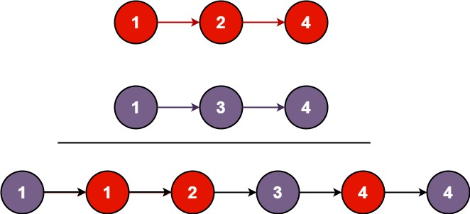

```
输入：l1 = [1,2,4], l2 = [1,3,4]
输出：[1,1,2,3,4,4]
```

**示例 2：**

```
输入：l1 = [], l2 = []
输出：[]
```

**示例 3：**

```
输入：l1 = [], l2 = [0]
输出：[0]
```

 

**提示：**

- 两个链表的节点数目范围是 `[0, 50]`
- `-100 <= Node.val <= 100`
- `l1` 和 `l2` 均按 **非递减顺序** 排列


#### 59.2 解法

时间复杂度： $O(N + M)$，空间复杂度：$O(1)$。

```cpp
#include <algorithm>
#include <iostream>
#include <queue>
#include <string>
#include <unordered_map>
#include <vector>

using namespace std;

struct ListNode {
    int val;
    ListNode* next;
    ListNode() : val(0), next(nullptr) {}
    ListNode(int x) : val(x), next(nullptr) {}
    ListNode(int x, ListNode* next) : val(x), next(next) {}
};

class Solution {
   public:
    ListNode* mergeTwoLists(ListNode* list1, ListNode* list2) {
        if (list1 == nullptr) return list2;
        if (list2 == nullptr) return list1;

        ListNode *base, *cur, *pre;
        bool flag = false;
        if (list2->val > list1->val) {
            base = list1;
            cur = list2;
            flag = true;
        } else {
            base = list2;
            cur = list1;
        }
        pre = base;
        while (cur != nullptr) {
            while (cur->val >= base->val) {
                if (base->next == nullptr) {
                    base->next = cur;
                    return flag ? list1 : list2;
                }
                pre = base;
                base = base->next;
            }
            ListNode* temp = base;
            pre->next = cur;
            cur = cur->next;
            pre->next->next = temp;
            pre = pre->next;
        }

        return flag ? list1 : list2;
    }
};

int main() {
    ios::sync_with_stdio(false);
    cin.tie(nullptr);

    return 0;
}
```

> 同样用哑节点能省不少事情，但是另一方面就不是原地地合并了：
>
> ```cpp
> #include <iostream>
> 
> using namespace std;
> 
> class Solution {
> public:
>     ListNode* mergeTwoLists(ListNode* list1, ListNode* list2) {
>         ListNode dummy(0);
>         ListNode* cur = &dummy;
>         
>         while (list1 != nullptr && list2 != nullptr) {
>             if (list1->val <= list2->val) {
>                 cur->next = list1;
>                 list1 = list1->next;
>             } else {
>                 cur->next = list2;
>                 list2 = list2->next;
>             }
>             cur = cur->next;
>         }
>         
>         cur->next = (list1 != nullptr) ? list1 : list2;
>         
>         return dummy.next;
>     }
> };
> ```


#### 59.3 解析

我这个和优化版的都可以算是最优解吧，因为原不原地实际上只是看需求。


### 60. 随机链表的复制**

#### 60.1 题目

给你一个长度为 `n` 的链表，每个节点包含一个额外增加的随机指针 `random` ，该指针可以指向链表中的任何节点或空节点。

构造这个链表的 **[深拷贝](https://baike.baidu.com/item/深拷贝/22785317?fr=aladdin)**。 深拷贝应该正好由 `n` 个 **全新** 节点组成，其中每个新节点的值都设为其对应的原节点的值。新节点的 `next` 指针和 `random` 指针也都应指向复制链表中的新节点，并使原链表和复制链表中的这些指针能够表示相同的链表状态。**复制链表中的指针都不应指向原链表中的节点** 。

例如，如果原链表中有 `X` 和 `Y` 两个节点，其中 `X.random --> Y` 。那么在复制链表中对应的两个节点 `x` 和 `y` ，同样有 `x.random --> y` 。

返回复制链表的头节点。

用一个由 `n` 个节点组成的链表来表示输入/输出中的链表。每个节点用一个 `[val, random_index]` 表示：

- `val`：一个表示 `Node.val` 的整数。
- `random_index`：随机指针指向的节点索引（范围从 `0` 到 `n-1`）；如果不指向任何节点，则为 `null` 。

你的代码 **只** 接受原链表的头节点 `head` 作为传入参数。

 

**示例 1：**

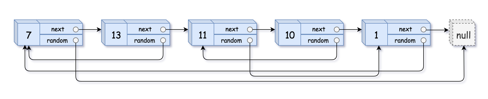

```
输入：head = [[7,null],[13,0],[11,4],[10,2],[1,0]]
输出：[[7,null],[13,0],[11,4],[10,2],[1,0]]
```

**示例 2：**


```
输入：head = [[1,1],[2,1]]
输出：[[1,1],[2,1]]
```

**示例 3：**

****

```
输入：head = [[3,null],[3,0],[3,null]]
输出：[[3,null],[3,0],[3,null]]
```

 

**提示：**

- `0 <= n <= 1000`
- `-104 <= Node.val <= 104`
- `Node.random` 为 `null` 或指向链表中的节点。


#### 60.2 解法

**时间复杂度**：$O(N)$，**空间复杂度**：$O(N)$。

```cpp
#include <iostream>
#include <unordered_map>
#include <vector>

using namespace std;

class Node {
public:
    int val;
    Node* next;
    Node* random;
    
    Node(int _val) {
        val = _val;
        next = nullptr;
        random = nullptr;
    }
};

class Solution {
public:
    Node* copyRandomList(Node* head) {
        if (head == nullptr) return head;
        
        unordered_map<Node*, Node*> o2n;
        Node dummy(0);
        Node *curr = &dummy, *oldCurr = head;
        
        while(oldCurr != nullptr){
            curr->next = new Node(oldCurr->val);
            o2n[oldCurr] = curr->next;
            curr = curr->next;
            oldCurr = oldCurr->next;
        }
        
        curr = dummy.next;
        oldCurr = head;
        while(oldCurr != nullptr){
            curr->random = o2n[oldCurr->random];
            curr = curr->next;
            oldCurr = oldCurr->next;
        }
        
        return dummy.next;
    }
};

int main() {
    ios::sync_with_stdio(false);
    cin.tie(nullptr);

    int n;
    if (cin >> n) {
        if (n == 0) {
            cout << "[]\n";
            return 0;
        }

        vector<Node*> originalNodes(n);
        vector<int> randomIndices(n);

        for (int i = 0; i < n; i++) {
            int val, randomIndex;
            cin >> val >> randomIndex;
            originalNodes[i] = new Node(val);
            randomIndices[i] = randomIndex;
        }

        for (int i = 0; i < n - 1; i++) {
            originalNodes[i]->next = originalNodes[i + 1];
        }

        for (int i = 0; i < n; i++) {
            if (randomIndices[i] != -1) {
                originalNodes[i]->random = originalNodes[randomIndices[i]];
            }
        }

        Solution obj;
        Node* copiedHead = obj.copyRandomList(originalNodes[0]);

        Node* temp = copiedHead;
        unordered_map<Node*, int> nodeToIndex;
        int idx = 0;
        while (temp != nullptr) {
            nodeToIndex[temp] = idx++;
            temp = temp->next;
        }

        temp = copiedHead;
        cout << "[";
        while (temp != nullptr) {
            cout << "[" << temp->val << ",";
            if (temp->random == nullptr) {
                cout << "null]";
            } else {
                cout << nodeToIndex[temp->random] << "]";
            }
            if (temp->next != nullptr) cout << ",";
            temp = temp->next;
        }
        cout << "]\n";
    }

    return 0;
}
```

> 不得不提的是，我没注意到当`unordered_map`键值是`nullptr`时候的情况，但由于其自动初始化的特点，自然而然地就解决了，但是为了可读性，可以加上：
>
> ```cpp
> if (oldCurr->random != nullptr) curr->random = o2n[oldCurr->random];
> ```


#### 60.3 解析

我这个不算最优解，其实直觉上是能够看出可以到$O(1)$的空间复杂度的，但确实是没想出来。

最优解的思路比较巧妙，本质上是给每一位之后插入一个自己的副本，如此就不会扰乱原本的顺序，并且能够轻易寻址`random`了：

1. **分身穿插**：遍历原链表，每走到一个节点 $A$，就创建一个分身 $A'$，并把 $A'$ 直接插在 $A$ 的后面。此时链表变成：$A \rightarrow A' \rightarrow B \rightarrow B' \rightarrow C \rightarrow C'$。
2. **拷贝随机指针**：再次遍历这个变长的链表。显然`A'->random = A->random->next`就是随机指针。
3. **剥离还原**：最后遍历一次，把奇数位置的节点连起来还原原链表，把偶数位置的节点连起来抽出拷贝链表。

```cpp
class Solution {
public:
    Node* copyRandomList(Node* head) {
        if (head == nullptr) return nullptr;

        Node* curr = head;
        while (curr != nullptr) {
            Node* clone = new Node(curr->val);
            clone->next = curr->next;
            curr->next = clone;
            curr = clone->next;
        }

        curr = head;
        while (curr != nullptr) {
            if (curr->random != nullptr) {
                curr->next->random = curr->random->next;
            }
            curr = curr->next->next;
        }

        curr = head;
        Node* cloneHead = head->next;
        while (curr != nullptr) {
            Node* clone = curr->next;
            curr->next = clone->next;
            if (clone->next != nullptr) {
                clone->next = clone->next->next;
            }
            curr = curr->next;
        }

        return cloneHead;
    }
};
```


### 61. 反转链表II*

#### 61.1 题目

给你单链表的头指针 `head` 和两个整数 `left` 和 `right` ，其中 `left <= right` 。请你反转从位置 `left` 到位置 `right` 的链表节点，返回 **反转后的链表** 。

 

**示例 1：**


```
输入：head = [1,2,3,4,5], left = 2, right = 4
输出：[1,4,3,2,5]
```

**示例 2：**

```
输入：head = [5], left = 1, right = 1
输出：[5]
```

 

**提示：**

- 链表中节点数目为 `n`
- `1 <= n <= 500`
- `-500 <= Node.val <= 500`
- `1 <= left <= right <= n`

 

**进阶：** 你可以使用一趟扫描完成反转吗？


#### 61.2 解法

**时间复杂度**：$O(N)$，**空间复杂度**：$O(1)$。

```cpp
#include <algorithm>
#include <iostream>
#include <queue>
#include <string>
#include <unordered_map>
#include <vector>

using namespace std;

struct ListNode {
    int val;
    ListNode* next;
    ListNode() : val(0), next(nullptr) {}
    ListNode(int x) : val(x), next(nullptr) {}
    ListNode(int x, ListNode* next) : val(x), next(next) {}
};

class Solution {
   public:
    ListNode* reverseBetween(ListNode* head, int left, int right) {
        ListNode *pre = head, *base, *tail, *curr = head;
        bool rev = false;
        while (curr != nullptr) {
            ListNode* next = curr->next;
            left--;
            right--;

            if (left == 0) {
                base = curr == head ? nullptr : pre;
                tail = curr;
                rev = true;
            } else if (rev) {
                if (right >= 0) {
                    curr->next = pre;
                }
                if (right == 0) {
                    if (base != nullptr) {
                        base->next = curr;
                    } else {
                        head = curr;
                    }

                    tail->next = next;

                    break;
                }
            }

            pre = curr;
            curr = next;
        }

        return head;
    }
};

int main() {
    ios::sync_with_stdio(false);
    cin.tie(nullptr);

    int n;
    while (cin >> n) {
        ListNode dummy(0);
        ListNode* curr = &dummy;

        for (int i = 0; i < n; i++) {
            int val;
            cin >> val;

            curr->next = new ListNode(val);
            curr = curr->next;
        }

        int left, right;
        cin >> left >> right;

        Solution obj;
        ListNode* rev = obj.reverseBetween(dummy.next, left, right);

        curr = rev;
        while (curr != nullptr) {
            cout << curr->val << " ";
            curr = curr->next;
        }
    }

    return 0;
```

> 用上哑节点同样会省不少功夫，不过这次是在已有链表之前添加：
>
> ```cpp
> #include <iostream>
> 
> using namespace std;
> 
> class Solution {
> public:
>     ListNode* reverseBetween(ListNode* head, int left, int right) {
>         ListNode dummy(0);
>         dummy.next = head;
>         ListNode* pre = &dummy;
> 
>         // 先跑到开始
>         for (int i = 0; i < left - 1; i++) {
>             pre = pre->next;
>         }
> 
>         // 定义开始时的curr
>         ListNode* curr = pre->next;
>         ListNode* prev = nullptr; 
>         for (int i = 0; i < right - left + 1; i++) {
>             ListNode* nextTemp = curr->next;
>             curr->next = prev;
>             prev = curr;
>             curr = nextTemp;
>         }
> 
>         pre->next->next = curr;
>         pre->next = prev;
> 
>         return dummy.next;
>     }
> };
> ```


#### 61.3 解析

我这种先内部翻转，在连接首尾的办法也还可以，但是另有一种**头插法**，更加清晰：在遍历的过程中，把要反转的节点一个个摘下来，直接插到 `pre` 节点的后面：

```cpp
class Solution {
public:
    ListNode* reverseBetween(ListNode* head, int left, int right) {
        // 公式化哑节点避免头空
        ListNode dummy(0);
        dummy.next = head;
        ListNode* pre = &dummy;

        // 跑到开始
        for (int i = 0; i < left - 1; i++) {
            pre = pre->next;
        }
        ListNode* curr = pre->next;
        
        // curr 不动（就是换之后的尾巴）
        for (int i = 0; i < right - left; i++) {
            // 把curr->next插入到pre后
            ListNode* nextTemp = curr->next;
            curr->next = nextTemp->next;
            nextTemp->next = pre->next;
            pre->next = nextTemp;
        }

        return dummy.next;
    }
};
```


### 62. K个一组翻转链表*

#### 62.1 题目

给你链表的头节点 `head` ，每 `k` 个节点一组进行翻转，请你返回修改后的链表。

`k` 是一个正整数，它的值小于或等于链表的长度。如果节点总数不是 `k` 的整数倍，那么请将最后剩余的节点保持原有顺序。

你不能只是单纯的改变节点内部的值，而是需要实际进行节点交换。

 

**示例 1：**


```
输入：head = [1,2,3,4,5], k = 2
输出：[2,1,4,3,5]
```

**示例 2：**


```
输入：head = [1,2,3,4,5], k = 3
输出：[3,2,1,4,5]
```

 

**提示：**

- 链表中的节点数目为 `n`
- `1 <= k <= n <= 5000`
- `0 <= Node.val <= 1000`

 

**进阶：**你可以设计一个只用 `O(1)` 额外内存空间的算法解决此问题吗？


#### 62.2 解法

**时间复杂度**：$O(N)$，**空间复杂度**：$O(1)$。

```cpp
#include <algorithm>
#include <iostream>
#include <queue>
#include <string>
#include <unordered_map>
#include <vector>

using namespace std;

struct ListNode {
    int val;
    ListNode* next;
    ListNode() : val(0), next(nullptr) {}
    ListNode(int x) : val(x), next(nullptr) {}
    ListNode(int x, ListNode* next) : val(x), next(next) {}
};

class Solution {
   public:
    ListNode* reverseKGroup(ListNode* head, int k) {
        ListNode dummy(0);
        dummy.next = head;

        ListNode *curr = dummy.next, *base = dummy.next, *pre = &dummy;
        int kGroup = k;

        while (curr != nullptr) {
            ListNode* nextIndex = curr->next;
            k--;

            if (k == 0) {
                k = kGroup;
                ListNode* currTemp = pre->next;

                while (base->next != nextIndex) {
                    ListNode* nextTemp = base->next;
                    base->next = nextTemp->next;
                    nextTemp->next = pre->next;
                    pre->next = nextTemp;
                }

                pre = currTemp;
                base = nextIndex;
            }

            curr = nextIndex;
        }

        return dummy.next;
    }
};

int main() {
    ios::sync_with_stdio(false);
    cin.tie(nullptr);

    int n;
    while (cin >> n) {
        ListNode dummy(0);
        ListNode* curr = &dummy;

        for (int i = 0; i < n; i++) {
            int val;
            cin >> val;

            curr->next = new ListNode(val);
            curr = curr->next;
        }

        int k;
        cin >> k;

        Solution obj;
        ListNode* rev = obj.reverseKGroup(dummy.next, k);

        curr = rev;
        while (curr != nullptr) {
            cout << curr->val << " ";
            curr = curr->next;
        }
    }

    return 0;
}
```

> `currTemp`其实就是`base`，可以删掉：
>
> ```cpp
> #include <iostream>
> 
> using namespace std;
> 
> class Solution {
> public:
>     ListNode* reverseKGroup(ListNode* head, int k) {
>         ListNode dummy(0);
>         dummy.next = head;
> 
>         ListNode *curr = head, *pre = &dummy;
>         int count = 0;
> 
>         while (curr != nullptr) {
>             count++;
>             ListNode* nextGroupHead = curr->next;
> 
>             if (count == k) {
>                 ListNode* groupTail = pre->next;
>                 
>                 while (groupTail->next != nextGroupHead) {
>                     ListNode* nextTemp = groupTail->next;
>                     groupTail->next = nextTemp->next;
>                     nextTemp->next = pre->next;
>                     pre->next = nextTemp;
>                 }
> 
>                 pre = groupTail;
>                 count = 0;
>             }
> 
>             curr = nextGroupHead;
>         }
> 
>         return dummy.next;
>     }
> };
> ```


#### 62.3 解析

我这个解法就是最优解了，其实是上一题的延续。此外还能用递归，但是看不出来有什么优势。


### 63. 删除链表的倒数第N个节点*

#### 63.1 题目

给你一个链表，删除链表的倒数第 `n` 个结点，并且返回链表的头结点。

 

**示例 1：**


```
输入：head = [1,2,3,4,5], n = 2
输出：[1,2,3,5]
```

**示例 2：**

```
输入：head = [1], n = 1
输出：[]
```

**示例 3：**

```
输入：head = [1,2], n = 1
输出：[1]
```

 

**提示：**

- 链表中结点的数目为 `sz`
- `1 <= sz <= 30`
- `0 <= Node.val <= 100`
- `1 <= n <= sz`

 

**进阶：**你能尝试使用一趟扫描实现吗？


#### 63.2 解法

**时间复杂度**：O(N)，**空间复杂度**：O(1)。

```cpp
#include <algorithm>
#include <iostream>
#include <queue>
#include <string>
#include <unordered_map>
#include <vector>

using namespace std;

struct ListNode {
    int val;
    ListNode* next;
    ListNode() : val(0), next(nullptr) {}
    ListNode(int x) : val(x), next(nullptr) {}
    ListNode(int x, ListNode* next) : val(x), next(next) {}
};

class Solution {
   public:
    ListNode* removeNthFromEnd(ListNode* head, int n) {
        ListNode dummy(0);
        dummy.next = head;
        ListNode *curr = &dummy, *preN = &dummy;
        int count = 0;

        while (curr != nullptr) {
            if (count < n) {
                count++;
                curr = curr->next;
            } else {
                if (curr->next == nullptr) {
                    break;
                }
                curr = curr->next;
                preN = preN->next;
            }
        }

        preN->next = preN->next->next;

        return dummy.next;
    }
};

int main() {
    ios::sync_with_stdio(false);
    cin.tie(nullptr);

    int n;
    while (cin >> n) {
        ListNode dummy(0);
        ListNode* curr = &dummy;

        for (int i = 0; i < n; i++) {
            int val;
            cin >> val;

            curr->next = new ListNode(val);
            curr = curr->next;
        }

        int k;
        cin >> k;

        Solution obj;
        ListNode* head = obj.removeNthFromEnd(dummy.next, k);

        curr = head;
        while (curr != nullptr) {
            cout << curr->val << " ";

            curr = curr->next;
        }
    }

    return 0;
}
```

> 其实**一次遍历两个循环**在之前的优化建议中已经出现了很多次了，这种办法能够更清晰地表征两种遍历逻辑而不需要分支语句：
>
> ```cpp
> #include <iostream>
> 
> using namespace std;
> 
> class Solution {
> public:
>     ListNode* removeNthFromEnd(ListNode* head, int n) {
>         ListNode dummy(0);
>         dummy.next = head;
>         ListNode *fast = &dummy;
>         ListNode *slow = &dummy;
> 
>         // 拉开间距
>         for (int i = 0; i <= n; i++) {
>             fast = fast->next;
>         }
> 
>         // 并进
>         while (fast != nullptr) {
>             fast = fast->next;
>             slow = slow->next;
>         }
> 
>         slow->next = slow->next->next;
> 
>         return dummy.next;
>     }
> };
> ```


#### 63.3 解析

这道题初看确实有点吓人，但结合之前这么多的双指针经验，其实不难发现这个解法，我大致的思路是：一个`vector`另存全部`index` -> 没必要全部存，有没有办法只存倒数第N个 -> 用`pre`表征前一个，那么用N个`pre`即可 -> 用`preN`不就可以只存前第N个，至此解出。


### 64. 删除排序链表中的重复元素II*

#### 64.1 题目

给定一个已排序的链表的头 `head` ， *删除原始链表中所有重复数字的节点，只留下不同的数字* 。返回 *已排序的链表* 。

 

**示例 1：**

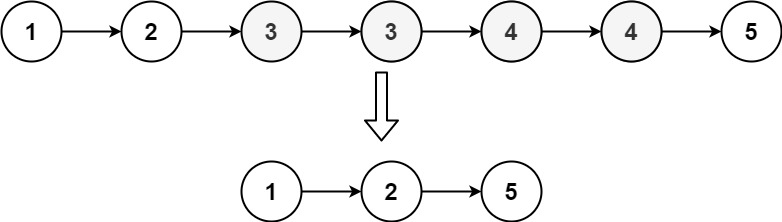

```
输入：head = [1,2,3,3,4,4,5]
输出：[1,2,5]
```

**示例 2：**

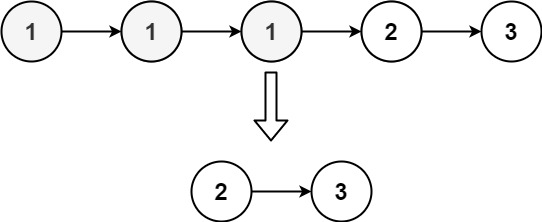

```
输入：head = [1,1,1,2,3]
输出：[2,3]
```

 

**提示：**

- 链表中节点数目在范围 `[0, 300]` 内
- `-100 <= Node.val <= 100`
- 题目数据保证链表已经按升序 **排列**


#### 64.2 解法

**时间复杂度**：$O(N)$，**空间复杂度**：$O(1)$。

```cpp
#include <algorithm>
#include <iostream>
#include <queue>
#include <string>
#include <unordered_map>
#include <vector>

using namespace std;

struct ListNode {
    int val;
    ListNode* next;
    ListNode() : val(0), next(nullptr) {}
    ListNode(int x) : val(x), next(nullptr) {}
    ListNode(int x, ListNode* next) : val(x), next(next) {}
};

class Solution {
   public:
    ListNode* deleteDuplicates(ListNode* head) {
        if (head == nullptr) return head;

        ListNode dummy(0);
        dummy.next = head;
        ListNode *pre = &dummy, *curr = head->next;

        while (curr != nullptr) {
            int nowVal = pre->next->val;
            if (curr->val == nowVal) {
                while (curr != nullptr && curr->val == nowVal) {
                    pre->next = curr->next;
                    curr = curr->next;
                }
                if (curr == nullptr || curr->next == nullptr) {
                    break;
                }
                curr = curr->next;
            } else {
                pre = pre->next;
                curr = curr->next;
            }
        }

        return dummy.next;
    }
};

int main() {
    ios::sync_with_stdio(false);
    cin.tie(nullptr);

    int n;
    while (cin >> n) {
        ListNode dummy(0);
        ListNode* curr = &dummy;

        for (int i = 0; i < n; i++) {
            int val;
            cin >> val;

            curr->next = new ListNode(val);
            curr = curr->next;
        }

        Solution obj;
        ListNode* head = obj.deleteDuplicates(dummy.next);

        curr = head;
        while (curr != nullptr) {
            cout << curr->val << " ";

            curr = curr->next;
        }
    }

    return 0;
}
```

> 依旧修修补补的逻辑，捋顺之后是这样：
>
> ```cpp
> #include <iostream>
> 
> using namespace std;
> 
> class Solution {
> public:
>     ListNode* deleteDuplicates(ListNode* head) {
>         ListNode dummy(0);
>         dummy.next = head;
>         
>         ListNode* pre = &dummy;
>         ListNode* curr = head;
> 
>         while (curr != nullptr && curr->next != nullptr) {
>             if (curr->val == curr->next->val) {
>                 int duplicateVal = curr->val;
>                 while (curr != nullptr && curr->val == duplicateVal) {
>                     curr = curr->next;
>                 }
>                 pre->next = curr;
>             } else {
>                 pre = pre->next;
>                 curr = curr->next;
>             }
>         }
> 
>         return dummy.next;
>     }
> };
> ```
>
> 


#### 64.3 解析

我这个解法自然是最优解。但是最近几道题，都可以用递归解决，递归的缺点是递归调用的额外消耗，优点可能是比较简洁，但是在可读性上又差了不少，我更倾向于在不得不使用时使用。本题的递归解法参考：

```cpp
class Solution {
public:
    ListNode* deleteDuplicates(ListNode* head) {
        if (head == nullptr || head->next == nullptr) {
            return head;
        }

        if (head->val == head->next->val) {
            int duplicateVal = head->val;
            while (head != nullptr && head->val == duplicateVal) {
                head = head->next;
            }
            return deleteDuplicates(head);
        } else {
            head->next = deleteDuplicates(head->next);
            return head;
        }
    }
};
```


### 65. 旋转链表*

#### 65.1 题目

给你一个链表的头节点 `head` ，旋转链表，将链表每个节点向右移动 `k` 个位置。

 

**示例 1：**

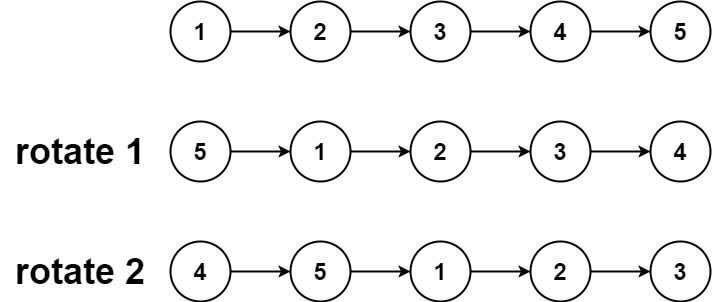

```
输入：head = [1,2,3,4,5], k = 2
输出：[4,5,1,2,3]
```

**示例 2：**

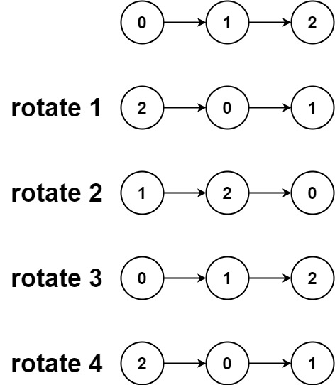

```
输入：head = [0,1,2], k = 4
输出：[2,0,1]
```

 

**提示：**

- 链表中节点的数目在范围 `[0, 500]` 内
- `-100 <= Node.val <= 100`
- `0 <= k <= 2 * 109`


#### 65.2 解法

**时间复杂度**：$O(N)$，**空间复杂度**：$O(1)$。

```cpp
#include <iostream>

using namespace std;

struct ListNode {
    int val;
    ListNode *next;
    ListNode() : val(0), next(nullptr) {}
    ListNode(int x) : val(x), next(nullptr) {}
    ListNode(int x, ListNode *next) : val(x), next(next) {}
};

class Solution {
public:
    ListNode* rotateRight(ListNode* head, int k) {
        if (head == nullptr) return head;
        
        ListNode dummy(0);
        dummy.next = head;
        ListNode *slow = &dummy, *fast = &dummy;
        int n = 0;
        
        while (fast->next != nullptr) {
            n++;
            fast = fast->next;
        }
        
        k = k % n;
        if (k == 0) return head;
        
        fast = &dummy;
        for (int i = 0; i < k; i++) {
            fast = fast->next;
        }
        
        while (fast->next != nullptr) {
            fast = fast->next;
            slow = slow->next;
        }
        
        fast->next = dummy.next;
        dummy.next = slow->next;
        slow->next = nullptr;
        
        return dummy.next;
    }
};

int main() {
    ios::sync_with_stdio(false);
    cin.tie(nullptr);

    int n;
    if (cin >> n) {
        if (n == 0) {
            cout << "\n";
            return 0;
        }
        ListNode dummy(0);
        ListNode* curr = &dummy;
        for (int i = 0; i < n; i++) {
            int val;
            cin >> val;
            curr->next = new ListNode(val);
            curr = curr->next;
        }
        int k;
        cin >> k;

        Solution obj;
        ListNode* res = obj.rotateRight(dummy.next, k);

        while (res != nullptr) {
            cout << res->val << " ";
            res = res->next;
        }
        cout << "\n";
    }

    return 0;
}
```

> 这里其实有点冗余，因为走过一遍统计`n`大小，所以倒数第`k`个其实就是正数第`n-k`个。


#### 65.3 解析

无论是我这种，还是别的等效的解法，本质上都是先连成环，后定位新尾部并截断。下面是优化版：

```cpp
#include <iostream>

using namespace std;

class Solution {
public:
    ListNode* rotateRight(ListNode* head, int k) {
        if (head == nullptr || head->next == nullptr || k == 0) {
            return head;
        }

        ListNode* tail = head;
        int n = 1;
        while (tail->next != nullptr) {
            tail = tail->next;
            n++;
        }

        k = k % n;
        if (k == 0) {
            return head;
        }

        tail->next = head;

        ListNode* newTail = head;
        for (int i = 0; i < n - k - 1; i++) {
            newTail = newTail->next;
        }

        ListNode* newHead = newTail->next;
        newTail->next = nullptr;

        return newHead;
    }
};
```


### 66. 分隔链表*

#### 66.1 题目

给你一个链表的头节点 `head` 和一个特定值 `x` ，请你对链表进行分隔，使得所有 **小于** `x` 的节点都出现在 **大于或等于** `x` 的节点之前。

你应当 **保留** 两个分区中每个节点的初始相对位置。

 

**示例 1：**

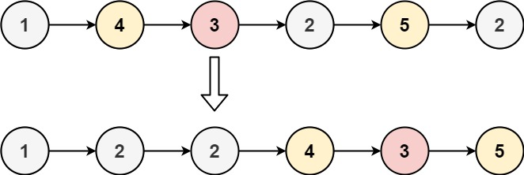

```
输入：head = [1,4,3,2,5,2], x = 3
输出：[1,2,2,4,3,5]
```

**示例 2：**

```
输入：head = [2,1], x = 2
输出：[1,2]
```

 

**提示：**

- 链表中节点的数目在范围 `[0, 200]` 内
- `-100 <= Node.val <= 100`
- `-200 <= x <= 200`


#### 66.2 解法

**时间复杂度**：$O(N)$，**空间复杂度**：$O(1)$。

```cpp
#include <iostream>
#include <vector>

using namespace std;

struct ListNode {
    int val;
    ListNode *next;
    ListNode() : val(0), next(nullptr) {}
    ListNode(int x) : val(x), next(nullptr) {}
    ListNode(int x, ListNode *next) : val(x), next(next) {}
};

class Solution {
public:
    ListNode* partition(ListNode* head, int x) {
        if (head == nullptr) return head;
        
        ListNode dummy(0);
        dummy.next = head;
        ListNode *curr = &dummy, *pre = &dummy;
        
        while (curr->next != nullptr && curr == pre && curr->next->val < x) {
            pre = pre->next;
            curr = curr->next;
        }
        
        while (curr != nullptr && curr->next != nullptr) {
            if (curr->next->val < x) {
                ListNode *temp = curr->next;
                curr->next = temp->next;
                temp->next = pre->next;
                pre->next = temp;
                pre = pre->next;
            } else {
                curr = curr->next;
            }
        }
        
        return dummy.next;
    }
};

int main() {
    ios::sync_with_stdio(false);
    cin.tie(nullptr);

    int n;
    if (cin >> n) {
        ListNode dummy(0);
        ListNode* curr = &dummy;

        for (int i = 0; i < n; i++) {
            int val;
            cin >> val;
            curr->next = new ListNode(val);
            curr = curr->next;
        }

        int x;
        cin >> x;

        Solution obj;
        ListNode* res = obj.partition(dummy.next, x);

        while (res != nullptr) {
            cout << res->val << " ";
            res = res->next;
        }
        cout << "\n";
    }

    return 0;
}
```


#### 66.3 解析

本质上也是之前一个题的变式，把后面的节点抽出并插入到一个节点上。这里面有两点比较关键：一个是抽出的点恰好是要插入的位置的下一个点，这样会造成自环；另一个是如果抽出之后直接进入下一个节点，那么就会忽略“连续几个都小于x”的这种情况，造成错误。

总的来说我这种办法思维负担还是比较大的，而利用链表的特点，其实可以直接弄两个链表，最后合并即可：

```cpp
#include <iostream>

using namespace std;

class Solution {
public:
    ListNode* partition(ListNode* head, int x) {
        ListNode smallDummy(0);
        ListNode largeDummy(0);
        ListNode* small = &smallDummy;
        ListNode* large = &largeDummy;
        
        while (head != nullptr) {
            if (head->val < x) {
                small->next = head;
                small = small->next;
            } else {
                large->next = head;
                large = large->next;
            }
            head = head->next;
        }
        
        large->next = nullptr;
        small->next = largeDummy.next;
        
        return smallDummy.next;
    }
};
```


### 67. LRU缓存*

#### 67.1 题目

请你设计并实现一个满足 [LRU (最近最少使用) 缓存](https://baike.baidu.com/item/LRU) 约束的数据结构。

实现 `LRUCache` 类：

- `LRUCache(int capacity)` 以 **正整数** 作为容量 `capacity` 初始化 LRU 缓存
- `int get(int key)` 如果关键字 `key` 存在于缓存中，则返回关键字的值，否则返回 `-1` 。
- `void put(int key, int value)` 如果关键字 `key` 已经存在，则变更其数据值 `value` ；如果不存在，则向缓存中插入该组 `key-value` 。如果插入操作导致关键字数量超过 `capacity` ，则应该 **逐出** 最久未使用的关键字。

函数 `get` 和 `put` 必须以 `O(1)` 的平均时间复杂度运行。

 

**示例：**

```
输入
["LRUCache", "put", "put", "get", "put", "get", "put", "get", "get", "get"]
[[2], [1, 1], [2, 2], [1], [3, 3], [2], [4, 4], [1], [3], [4]]
输出
[null, null, null, 1, null, -1, null, -1, 3, 4]

解释
LRUCache lRUCache = new LRUCache(2);
lRUCache.put(1, 1); // 缓存是 {1=1}
lRUCache.put(2, 2); // 缓存是 {1=1, 2=2}
lRUCache.get(1);    // 返回 1
lRUCache.put(3, 3); // 该操作会使得关键字 2 作废，缓存是 {1=1, 3=3}
lRUCache.get(2);    // 返回 -1 (未找到)
lRUCache.put(4, 4); // 该操作会使得关键字 1 作废，缓存是 {4=4, 3=3}
lRUCache.get(1);    // 返回 -1 (未找到)
lRUCache.get(3);    // 返回 3
lRUCache.get(4);    // 返回 4
```

 

**提示：**

- `1 <= capacity <= 3000`
- `0 <= key <= 10000`
- `0 <= value <= 105`
- 最多调用 `2 * 105` 次 `get` 和 `put`


#### 67.2 解法

**时间复杂度**：$O(1)$，**空间复杂度**：$O(Capacity)$。

```cpp
#include <algorithm>
#include <iostream>
#include <queue>
#include <string>
#include <unordered_map>
#include <vector>

using namespace std;

struct Pages {
    int key;
    int val;
    Pages* pre;
    Pages* next;

    Pages() : key(-1), val(-1), pre(nullptr), next(nullptr) {}
    Pages(int key, int val) : key(key), val(val), pre(nullptr), next(nullptr) {}
};

class LRUCache {
   private:
    int cap, size;
    unordered_map<int, Pages*> cache;
    Pages* CahceHead;
    Pages* CacheTail;

   public:
    LRUCache(int capacity) {
        size = 0;
        cap = capacity;
        CahceHead = new Pages();
        CacheTail = new Pages();
        CacheTail->pre = CahceHead;
        CahceHead->next = CacheTail;
    }

    int get(int key) {
        if (!cache.count(key)) {
            return -1;
        } else {
            moveToHead(cache[key]);

            return cache[key]->val;
        }
    }

    void put(int key, int value) {
        if (!cache.count(key)) {
            size++;
            Pages* temp = CahceHead->next;
            CahceHead->next = new Pages(key, value);
            CahceHead->next->next = temp;
            temp->pre = CahceHead->next;
            CahceHead->next->pre = CahceHead;
            cache[key] = CahceHead->next;

            if (size > cap) {
                removeTail();
                size--;
            }
        } else {
            cache[key]->val = value;
            moveToHead(cache[key]);
        }
    }

   private:
    void moveToHead(Pages* curr) {
        curr->pre->next = curr->next;
        curr->next->pre = curr->pre;

        Pages* temp = CahceHead->next;
        CahceHead->next = curr;
        curr->pre = CahceHead;
        curr->next = temp;
        temp->pre = curr;
    }

    void removeTail() {
        cache.erase(CacheTail->pre->key);
        Pages* temp = CacheTail->pre;
        temp->pre->next = CacheTail;
        CacheTail->pre = temp->pre;
        delete temp;
    }
};

int main() {
    ios::sync_with_stdio(false);
    cin.tie(nullptr);

    int n;
    if (!(cin >> n)) return 0;

    LRUCache* lRUCache = nullptr;

    for (int i = 0; i < n; ++i) {
        string op;
        cin >> op;
        if (op == "LRUCache") {
            int capacity;
            cin >> capacity;
            lRUCache = new LRUCache(capacity);
            cout << "null ";
        } else if (op == "put") {
            int key, value;
            cin >> key >> value;
            lRUCache->put(key, value);
            cout << "null ";
        } else if (op == "get") {
            int key;
            cin >> key;
            cout << lRUCache->get(key) << " ";
        }
    }
    cout << endl;

    return 0;
}
```

> 可以把两个辅助函数猜得更开一些，比如一个`addToHead`和一个`remove`等


#### 67.3 解析

这个思路基本上就是最优解，但是还可以写得更容易一些，`STL`的`list`就存在$O(1)$时间复杂度的移动函数：

```cpp
#include <list>
#include <unordered_map>

class LRUCache {
    int cap;
    list<pair<int, int>> l; // 存储 {key, value}
    unordered_map<int, list<pair<int, int>>::iterator> m; // key 映射到 list 的迭代器

public:
    LRUCache(int capacity) : cap(capacity) {}

    int get(int key) {
        if (m.find(key) == m.end()) return -1;
        // splice 将元素移动到链表头部
        l.splice(l.begin(), l, m[key]);
        return m[key]->second;
    }

    void put(int key, int value) {
        if (m.find(key) != m.end()) {
            l.splice(l.begin(), l, m[key]);
            m[key]->second = value;
            return;
        }
        if (l.size() == cap) {
            auto d_key = l.back().first;
            l.pop_back();
            m.erase(d_key);
        }
        l.push_front({key, value});
        m[key] = l.begin();
    }
};
```


## 九、二叉树

### 68. 二叉树的最大深度*/**

#### 68.1 题目

给定一个二叉树 `root` ，返回其最大深度。

二叉树的 **最大深度** 是指从根节点到最远叶子节点的最长路径上的节点数。

 

**示例 1：**


 

```
输入：root = [3,9,20,null,null,15,7]
输出：3
```

**示例 2：**

```
输入：root = [1,null,2]
输出：2
```

 

**提示：**

- 树中节点的数量在 `[0, 104]` 区间内。
- `-100 <= Node.val <= 100`


#### 68.2 解法

**时间复杂度**：$O(N)$，**空间复杂度**：$O(H)$。

```cpp
#include <algorithm>
#include <iostream>
#include <queue>
#include <vector>

using namespace std;

struct TreeNode {
    int val;
    TreeNode* left;
    TreeNode* right;

    TreeNode() : val(0), left(nullptr), right(nullptr) {}
    TreeNode(int x) : val(x), left(nullptr), right(nullptr) {}
    TreeNode(int x, TreeNode* left, TreeNode* right) : val(x), left(left), right(right) {}
};

class Solution {
public:
    int maxDepth(TreeNode* root) { 
        return DeepCount(root, 0); 
    }

private:
    int DeepCount(TreeNode* node, int depth) {
        if (node == nullptr) {
            return depth;
        } else {
            return max(DeepCount(node->left, depth + 1), DeepCount(node->right, depth + 1));
        }
    }
};

int main() {
    ios::sync_with_stdio(false);
    cin.tie(nullptr);

    int n;
    if (cin >> n) {
        if (n == 0) {
            cout << 0 << "\n";
            return 0;
        }

        vector<string> vals(n);
        for (int i = 0; i < n; i++) {
            cin >> vals[i];
        }

        TreeNode* root = new TreeNode(stoi(vals[0]));
        queue<TreeNode*> q;
        q.push(root);
        int i = 1;

        while (!q.empty() && i < n) {
            TreeNode* curr = q.front();
            q.pop();

            if (i < n && vals[i] != "-1") {
                curr->left = new TreeNode(stoi(vals[i]));
                q.push(curr->left);
            }
            i++;

            if (i < n && vals[i] != "-1") {
                curr->right = new TreeNode(stoi(vals[i]));
                q.push(curr->right);
            }
            i++;
        }

        Solution obj;
        cout << obj.maxDepth(root) << "\n";
    }

    return 0;
}
```


#### 68.3 解析

递归虽然空间复杂度差，写起来难，但是确实很漂亮！我这个算是很基础的版本，另外最简单的递归是这样的：

```cpp
class Solution {
public:
    int maxDepth(TreeNode* root) {
        if (root == nullptr) return 0;
        return max(maxDepth(root->left), maxDepth(root->right)) + 1;
    }
};
```

十分漂亮的代码，完全体现了数学的美感。当然在工程上搞这些意义不大，传统非递归算法在这一块更权威：

```cpp
#include <algorithm>
#include <queue>

using namespace std;

class Solution {
public:
    int maxDepth(TreeNode* root) {
        if (root == nullptr) return 0;
        
        queue<TreeNode*> q;
        q.push(root);
        int depth = 0;
        
        while (!q.empty()) {
            int levelSize = q.size();
            for (int i = 0; i < levelSize; i++) {
                TreeNode* node = q.front();
                q.pop();
                
                if (node->left != nullptr) q.push(node->left);
                if (node->right != nullptr) q.push(node->right);
            }
            depth++;
        }
        
        return depth;
    }
};
```

这就是大名鼎鼎的**广度优先搜索**。


### 69. 相同的树*

#### 69.1 题目

给你两棵二叉树的根节点 `p` 和 `q` ，编写一个函数来检验这两棵树是否相同。

如果两个树在结构上相同，并且节点具有相同的值，则认为它们是相同的。

 

**示例 1：**


```
输入：p = [1,2,3], q = [1,2,3]
输出：true
```

**示例 2：**


```
输入：p = [1,2], q = [1,null,2]
输出：false
```

**示例 3：**

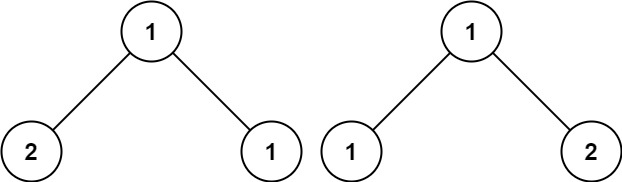

```
输入：p = [1,2,1], q = [1,1,2]
输出：false
```

 

**提示：**

- 两棵树上的节点数目都在范围 `[0, 100]` 内
- `-104 <= Node.val <= 104`


#### 69.2 解法

**时间复杂度**：$O(\min(N, M))$，**空间复杂度**：$O(\min(H_1, H_2))$。

```cpp
#include <algorithm>
#include <iostream>
#include <queue>
#include <string>
#include <unordered_map>
#include <vector>

using namespace std;

struct TreeNode {
    int val;
    TreeNode* left;
    TreeNode* right;
    TreeNode() : val(0), left(nullptr), right(nullptr) {}
    TreeNode(int x) : val(x), left(nullptr), right(nullptr) {}
    TreeNode(int x, TreeNode* left, TreeNode* right) : val(x), left(left), right(right) {}
};

class Solution {
   public:
    bool isSameTree(TreeNode* p, TreeNode* q) {
        if (p == nullptr && q == nullptr) {
            return true;
        } else if (p == nullptr || q == nullptr) {
            return false;
        } else if (p->val != q->val) {
            return false;
        } else {
            return isSameTree(p->left, q->left) && isSameTree(p->right, q->right);
        }
    }
};

int main() {
    ios::sync_with_stdio(false);
    cin.tie(nullptr);

    int n, m;
    if (!(cin >> n >> m)) return 0;

    if (n == 0 && m == 0) {
        cout << "true\n";
        return 0;
    }

    vector<string> pNum(n), qNum(m);
    for (int i = 0; i < n; i++) cin >> pNum[i];
    for (int i = 0; i < m; i++) cin >> qNum[i];

    TreeNode* pRoot = n > 0 ? new TreeNode(stoi(pNum[0])) : nullptr;
    TreeNode* qRoot = m > 0 ? new TreeNode(stoi(qNum[0])) : nullptr;

    if (pRoot != nullptr) {
        queue<TreeNode*> p;
        p.push(pRoot);
        int i = 1;
        while (!p.empty() && i < n) {
            TreeNode* curr = p.front();
            p.pop();
            if (i < n && pNum[i] != "-1") {
                curr->left = new TreeNode(stoi(pNum[i]));
                p.push(curr->left);
            }
            i++;
            if (i < n && pNum[i] != "-1") {
                curr->right = new TreeNode(stoi(pNum[i]));
                p.push(curr->right);
            }
            i++;
        }
    }

    if (qRoot != nullptr) {
        queue<TreeNode*> q;
        q.push(qRoot);
        int i = 1;
        while (!q.empty() && i < m) {
            TreeNode* curr = q.front();
            q.pop();
            if (i < m && qNum[i] != "-1") {
                curr->left = new TreeNode(stoi(qNum[i]));
                q.push(curr->left);
            }
            i++;
            if (i < m && qNum[i] != "-1") {
                curr->right = new TreeNode(stoi(qNum[i]));
                q.push(curr->right);
            }
            i++;
        }
    }

    Solution obj;
    cout << (obj.isSameTree(pRoot, qRoot) ? "true" : "false") << "\n";

    return 0;
}
```


#### 69.3 解析

同样地，也能用广度优先搜索：

```cpp
#include <queue>

using namespace std;

class Solution {
public:
    bool isSameTree(TreeNode* p, TreeNode* q) {
        queue<TreeNode*> qu;
        qu.push(p);
        qu.push(q);

        while (!qu.empty()) {
            TreeNode* node1 = qu.front(); 
            qu.pop();
            TreeNode* node2 = qu.front(); 
            qu.pop();

            if (node1 == nullptr && node2 == nullptr) {
                continue;
            }
            if (node1 == nullptr || node2 == nullptr || node1->val != node2->val) {
                return false;
            }

            qu.push(node1->left);
            qu.push(node2->left);
            
            qu.push(node1->right);
            qu.push(node2->right);
        }

        return true;
    }
};
```


### 70. 翻转二叉树*

#### 70.1 题目

给你一棵二叉树的根节点 `root` ，翻转这棵二叉树，并返回其根节点。

 

**示例 1：**


```
输入：root = [4,2,7,1,3,6,9]
输出：[4,7,2,9,6,3,1]
```

**示例 2：**

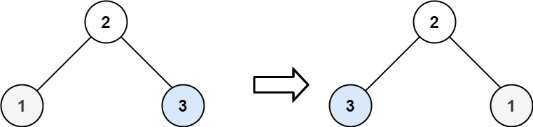

```
输入：root = [2,1,3]
输出：[2,3,1]
```

**示例 3：**

```
输入：root = []
输出：[]
```

 

**提示：**

- 树中节点数目范围在 `[0, 100]` 内
- `-100 <= Node.val <= 100`


#### 70.2 解法

**时间复杂度**：$O(N)$， **空间复杂度**：$O(H)$。

```cpp
#include <algorithm>
#include <iostream>
#include <queue>
#include <string>
#include <vector>

using namespace std;

struct TreeNode {
    int val;
    TreeNode* left;
    TreeNode* right;
    TreeNode() : val(0), left(nullptr), right(nullptr) {}
    TreeNode(int x) : val(x), left(nullptr), right(nullptr) {}
    TreeNode(int x, TreeNode* left, TreeNode* right) : val(x), left(left), right(right) {}
};

class Solution {
public:
    TreeNode* invertTree(TreeNode* root) {
        if (root == nullptr) {
            return root;
        } else {
            TreeNode* temp = root->left;
            root->left = root->right;
            root->right = temp;
            invertTree(root->right);
            invertTree(root->left);
        }

        return root;
    }
};

int main() {
    ios::sync_with_stdio(false);
    cin.tie(nullptr);

    int n;
    if (!(cin >> n)) return 0;
    if (n == 0) return 0;

    vector<string> nums(n);
    for (int i = 0; i < n; i++) {
        cin >> nums[i];
    }

    TreeNode* root = new TreeNode(stoi(nums[0]));
    queue<TreeNode*> q;
    q.push(root);
    int i = 1;

    while (!q.empty() && i < n) {
        TreeNode* curr = q.front();
        q.pop();

        if (i < n && nums[i] != "-1") {
            curr->left = new TreeNode(stoi(nums[i]));
            q.push(curr->left);
        }
        i++;

        if (i < n && nums[i] != "-1") {
            curr->right = new TreeNode(stoi(nums[i]));
            q.push(curr->right);
        }
        i++;
    }

    Solution obj;
    root = obj.invertTree(root);
    
    queue<TreeNode*> outQ;
    if (root != nullptr) {
        outQ.push(root);
    }

    while (!outQ.empty()) {
        TreeNode* curr = outQ.front();
        outQ.pop();
        
        cout << curr->val << " ";
        
        if (curr->left != nullptr) {
            outQ.push(curr->left);
        }
        if (curr->right != nullptr) {
            outQ.push(curr->right);
        }
    }
    cout << "\n";

    return 0;
}
```

> `swap`也能用：
>
> ```cpp
> #include <algorithm>
> 
> class Solution {
> public:
>     TreeNode* invertTree(TreeNode* root) {
>         if (root == nullptr) return nullptr;
>         
>         invertTree(root->left);
>         invertTree(root->right);
>         
>         std::swap(root->left, root->right);
>         
>         return root;
>     }
> };
> ```


#### 70.1 解析

同样地也能广度优先搜索：

```cpp
#include <queue>
#include <algorithm>

using namespace std;

class Solution {
public:
    TreeNode* invertTree(TreeNode* root) {
        if (root == nullptr) return nullptr;
        
        queue<TreeNode*> q;
        q.push(root);
        
        while (!q.empty()) {
            TreeNode* curr = q.front();
            q.pop();
            
            swap(curr->left, curr->right);
            
            if (curr->left != nullptr) q.push(curr->left);
            if (curr->right != nullptr) q.push(curr->right);
        }
        
        return root;
    }
};
```


### 71. 对称二叉树*

#### 71.1 题目

给你一个二叉树的根节点 `root` ， 检查它是否轴对称。

 

**示例 1：**

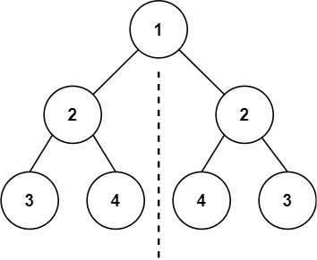

```
输入：root = [1,2,2,3,4,4,3]
输出：true
```

**示例 2：**


```
输入：root = [1,2,2,null,3,null,3]
输出：false
```

 

**提示：**

- 树中节点数目在范围 `[1, 1000]` 内
- `-100 <= Node.val <= 100`

 

**进阶：**你可以运用递归和迭代两种方法解决这个问题吗？


#### 71.2 解法

**时间复杂度**：**$O(N)$**，**空间复杂度**：**$O(H)$**。

```cpp
#include <algorithm>
#include <iostream>
#include <queue>
#include <string>
#include <unordered_map>
#include <vector>

using namespace std;

struct TreeNode {
    int val;
    TreeNode* left;
    TreeNode* right;
    TreeNode() : val(0), left(nullptr), right(nullptr) {}
    TreeNode(int x) : val(x), left(nullptr), right(nullptr) {}
    TreeNode(int x, TreeNode* left, TreeNode* right) : val(x), left(left), right(right) {}
};

class Solution {
   public:
    bool isSymmetric(TreeNode* root) {
        if (root == nullptr) {
            return true;
        } else {
            return compareNodes(root->left, root->right);
        }
    }

   private:
    bool compareNodes(TreeNode* left, TreeNode* right) {
        if (left == nullptr && right == nullptr) {
            return true;
        } else if (left == nullptr || right == nullptr) {
            return false;
        } else {
            if (left->val == right->val) {
                return compareNodes(left->left, right->right) && compareNodes(left->right, right->left);
            } else {
                return false;
            }
        }
    }
};

int main() {
    ios::sync_with_stdio(false);
    cin.tie(nullptr);

    int n;
    cin >> n;
    if (n <= 0) return 0;

    vector<string> nodes(n);
    for (int i = 0; i < n; i++) {
        cin >> nodes[i];
    }

    TreeNode* root = new TreeNode(stoi(nodes[0]));
    queue<TreeNode*> q;
    q.push(root);
    int i = 1;

    while (!q.empty() && i < n) {
        TreeNode* curr = q.front();
        q.pop();

        if (i < n && nodes[i] != "null") {
            curr->left = new TreeNode(stoi(nodes[i]));
            q.push(curr->left);
        }
        i++;

        if (i < n && nodes[i] != "null") {
            curr->right = new TreeNode(stoi(nodes[i]));
            q.push(curr->right);
        }
        i++;
    }

    Solution obj;
    cout << obj.isSymmetric(root);

    return 0;
}
```

> 逻辑可以写得再简洁些（少用else、else if）：
>
> ```cpp
> class Solution {
> public:
>     bool isSymmetric(TreeNode* root) {
>         if (root == nullptr) return true;
>         return compareNodes(root->left, root->right);
>     }
> 
> private:
>     bool compareNodes(TreeNode* left, TreeNode* right) {
>         if (left == nullptr && right == nullptr) return true;
>         if (left == nullptr || right == nullptr) return false;
>         
>         return (left->val == right->val) && 
>                compareNodes(left->left, right->right) && 
>                compareNodes(left->right, right->left);
>     }
> };
> ```


#### 71.3 解析

题目的迭代法，其实就是**BFS**：

```cpp
#include <queue>

using namespace std;

class Solution {
public:
    bool isSymmetric(TreeNode* root) {
        if (root == nullptr) return true;
        
        queue<TreeNode*> q;
        q.push(root->left);
        q.push(root->right);
        
        while (!q.empty()) {
            TreeNode* leftNode = q.front();
            q.pop();
            TreeNode* rightNode = q.front();
            q.pop();
            
            if (leftNode == nullptr && rightNode == nullptr) continue;
            
            if (leftNode == nullptr || rightNode == nullptr || leftNode->val != rightNode->val) {
                return false;
            }
            
            // 按比较需求成对入队
            q.push(leftNode->left);
            q.push(rightNode->right);
            
            q.push(leftNode->right);
            q.push(rightNode->left);
        }
        
        return true;
    }
};
```


### 72. 从前序与中序遍历序列构造二叉树**（@）

#### 72.1 题目

给定两个整数数组 `preorder` 和 `inorder` ，其中 `preorder` 是二叉树的**先序遍历**， `inorder` 是同一棵树的**中序遍历**，请构造二叉树并返回其根节点。

 

**示例 1:**


```
输入: preorder = [3,9,20,15,7], inorder = [9,3,15,20,7]
输出: [3,9,20,null,null,15,7]
```

**示例 2:**

```
输入: preorder = [-1], inorder = [-1]
输出: [-1]
```

 

**提示:**

- `1 <= preorder.length <= 3000`
- `inorder.length == preorder.length`
- `-3000 <= preorder[i], inorder[i] <= 3000`
- `preorder` 和 `inorder` 均 **无重复** 元素
- `inorder` 均出现在 `preorder`
- `preorder` **保证** 为二叉树的前序遍历序列
- `inorder` **保证** 为二叉树的中序遍历序列


#### 72.2 解法

**时间复杂度**：$O(N^2)$，**空间复杂度**：$O(N^2)$。

```cpp
#include <algorithm>
#include <iostream>
#include <queue>
#include <string>
#include <unordered_map>
#include <vector>

using namespace std;

struct TreeNode {
    int val;
    TreeNode* left;
    TreeNode* right;
    TreeNode() : val(0), left(nullptr), right(nullptr) {}
    TreeNode(int x) : val(x), left(nullptr), right(nullptr) {}
    TreeNode(int x, TreeNode* left, TreeNode* right) : val(x), left(left), right(right) {}
};

class Solution {
   public:
    TreeNode* buildTree(vector<int>& preorder, vector<int>& inorder) {
        TreeNode* root = new TreeNode();
        buildSubTree(root, preorder, inorder);

        return root;
    }

   private:
    void buildSubTree(TreeNode* root, vector<int>& preorder, vector<int>& inorder) {
        root->val = preorder[0];
        auto mid = find(inorder.begin(), inorder.end(), preorder[0]);
        int midIndex = distance(inorder.begin(), mid);

        if (mid != inorder.begin()) {
            root->left = new TreeNode();
            vector<int> preLeftSub(preorder.begin() + 1, preorder.begin() + 1 + midIndex);
            vector<int> inLeftSub(inorder.begin(), mid);
            buildSubTree(root->left, preLeftSub, inLeftSub);
        }
        if (mid != inorder.end() - 1) {
            root->right = new TreeNode();
            vector<int> preRightSub(preorder.begin() + 1 + midIndex, preorder.end());
            vector<int> inRightSub(mid + 1, inorder.end());
            buildSubTree(root->right, preRightSub, inRightSub);
        }
    }
};

int main() {
    ios::sync_with_stdio(false);
    cin.tie(nullptr);

    int n;
    cin >> n;

    vector<int> preorder(n), inorder(n);
    for (int i = 0; i < n; i++) {
        cin >> preorder[i];
    }
    for (int i = 0; i < n; i++) {
        cin >> inorder[i];
    }

    Solution obj;
    TreeNode* root = obj.buildTree(preorder, inorder);
    queue<TreeNode*> q;
    q.push(root);
    cout << root->val << " ";

    while (!q.empty()) {
        TreeNode* curr = q.front();
        q.pop();

        if (curr->left != nullptr) {
            cout << curr->left->val << " ";
            q.push(curr->left);
        } else {
            cout << "null ";
        }

        if (curr->right != nullptr) {
            cout << curr->right->val << " ";
            q.push(curr->right);
        } else {
            cout << "null ";
        }
    }

    return 0;
}
```


#### 72.3 解析

递归的办法不错，但是在定位（用了find）和切割（用了拷贝）两个部分的选择失误导致了复杂度飙升，而若使用哈希表和零拷贝，即可解决这两问题：

```cpp
#include <iostream>
#include <vector>
#include <unordered_map>
#include <algorithm>

using namespace std;

class Solution {
private:
    unordered_map<int, int> index_map;

    // 只传下标，不拷贝
    TreeNode* myBuildTree(const vector<int>& preorder, int pre_left, int pre_right, 
                          int in_left, int in_right) {
        if (pre_left > pre_right) return nullptr;

        // 前序遍历的第一个节点就是根节点
        int root_val = preorder[pre_left];
        TreeNode* root = new TreeNode(root_val);
        
        // 在中序遍历中定位根节点
        int in_root_index = index_map[root_val];
        
        // 计算左子树节点个数
        int left_subtree_size = in_root_index - in_left;

        // 递归构造左子树
        root->left = myBuildTree(preorder, pre_left + 1, pre_left + left_subtree_size, 
                                 in_left, in_root_index - 1);
        
        // 递归构造右子树
        root->right = myBuildTree(preorder, pre_left + left_subtree_size + 1, pre_right, 
                                  in_root_index + 1, in_right);
        
        return root;
    }

public:
    TreeNode* buildTree(vector<int>& preorder, vector<int>& inorder) {
        int n = preorder.size();
        for (int i = 0; i < n; i++) {
            index_map[inorder[i]] = i;
        }
        return myBuildTree(preorder, 0, n - 1, 0, n - 1);
    }
};
```

此外，迭代法也是可行的：

```cpp
#include <stack>

class Solution {
public:
    TreeNode* buildTree(vector<int>& preorder, vector<int>& inorder) {
        if (preorder.empty()) return nullptr;

        TreeNode* root = new TreeNode(preorder[0]);
        // 栈压入中间节点（左）
        stack<TreeNode*> st;
        st.push(root);
        int inorderIndex = 0;

        for (int i = 1; i < preorder.size(); i++) {
            int preorderVal = preorder[i];
            TreeNode* node = st.top();
            
            // 如果栈顶元素等于中序遍历数组的当前元素，说明需要转向添加右边节点，否则一直添加左节点。
            if (node->val != inorder[inorderIndex]) {
                node->left = new TreeNode(preorderVal);
                st.push(node->left);
            } else {
                while (!st.empty() && st.top()->val == inorder[inorderIndex]) {
                    node = st.top();
                    st.pop();
                    inorderIndex++;
                }
                node->right = new TreeNode(preorderVal);
                st.push(node->right);
            }
        }
        return root;
    }
};
```


### 73. 从中序与后序遍历序列构造二叉树*

#### 73.1 题目

给定两个整数数组 `inorder` 和 `postorder` ，其中 `inorder` 是二叉树的中序遍历， `postorder` 是同一棵树的后序遍历，请你构造并返回这颗 *二叉树* 。

 

**示例 1:**


```
输入：inorder = [9,3,15,20,7], postorder = [9,15,7,20,3]
输出：[3,9,20,null,null,15,7]
```

**示例 2:**

```
输入：inorder = [-1], postorder = [-1]
输出：[-1]
```

 

**提示:**

- `1 <= inorder.length <= 3000`
- `postorder.length == inorder.length`
- `-3000 <= inorder[i], postorder[i] <= 3000`
- `inorder` 和 `postorder` 都由 **不同** 的值组成
- `postorder` 中每一个值都在 `inorder` 中
- `inorder` **保证**是树的中序遍历
- `postorder` **保证**是树的后序遍历


#### 73.2 解法

**时间复杂度**：$O(N)$，**空间复杂度**：$O(N)$。

```cpp
#include <algorithm>
#include <iostream>
#include <queue>
#include <string>
#include <unordered_map>
#include <vector>

using namespace std;

struct TreeNode {
    int val;
    TreeNode* left;
    TreeNode* right;
    TreeNode() : val(0), left(nullptr), right(nullptr) {}
    TreeNode(int x) : val(x), left(nullptr), right(nullptr) {}
    TreeNode(int x, TreeNode* left, TreeNode* right) : val(x), left(left), right(right) {}
};

class Solution {
   private:
    unordered_map<int, int> index;

    TreeNode* buildSubTree(const vector<int>& postorder, int inLeft, int inRight, int postLeft, int postRight) {
        if (postLeft > postRight) return nullptr;

        int rootVal = postorder[postRight];
        TreeNode* root = new TreeNode(rootVal);

        int inRootIndex = index[rootVal];
        int leftSize = inRootIndex - inLeft;

        root->left = buildSubTree(postorder, inLeft, inRootIndex - 1, postLeft, postLeft + leftSize - 1);
        root->right = buildSubTree(postorder, inRootIndex + 1, inRight, postLeft + leftSize, postRight - 1);

        return root;
    }

   public:
    TreeNode* buildTree(vector<int>& inorder, vector<int>& postorder) {
        int n = inorder.size();
        for (int i = 0; i < n; i++) {
            index[inorder[i]] = i;
        }
        return buildSubTree(postorder, 0, n - 1, 0, n - 1);
    }
};

int main() {
    ios::sync_with_stdio(false);
    cin.tie(nullptr);

    int n;
    cin >> n;

    vector<int> inorder(n), postorder(n);
    for (int i = 0; i < n; i++) {
        cin >> inorder[i];
    }
    for (int i = 0; i < n; i++) {
        cin >> postorder[i];
    }

    Solution obj;
    TreeNode* root = obj.buildTree(inorder, postorder);
    queue<TreeNode*> q;
    q.push(root);
    cout << root->val << " ";

    while (!q.empty()) {
        TreeNode* curr = q.front();
        q.pop();

        if (curr->left != nullptr) {
            cout << curr->left->val << " ";
            q.push(curr->left);
        } else {
            cout << "null ";
        }

        if (curr->right != nullptr) {
            cout << curr->right->val << " ";
            q.push(curr->right);
        } else {
            cout << "null ";
        }
    }

    return 0;
}
```

> 如果调用的是同一个`Solution`，那么`index`表会残留很多键值对：
>
> ```cpp
> #include <iostream>
> #include <vector>
> #include <unordered_map>
> #include <queue>
> 
> using namespace std;
> 
> struct TreeNode {
>     int val;
>     TreeNode* left;
>     TreeNode* right;
>     TreeNode() : val(0), left(nullptr), right(nullptr) {}
>     TreeNode(int x) : val(x), left(nullptr), right(nullptr) {}
>     TreeNode(int x, TreeNode* left, TreeNode* right) : val(x), left(left), right(right) {}
> };
> 
> class Solution {
> private:
>     TreeNode* buildSubTree(const vector<int>& postorder, int inLeft, int inRight, 
>                            int postLeft, int postRight, unordered_map<int, int>& index) {
>         if (postLeft > postRight) return nullptr;
> 
>         int rootVal = postorder[postRight];
>         TreeNode* root = new TreeNode(rootVal);
> 
>         int inRootIndex = index[rootVal];
>         int leftSize = inRootIndex - inLeft;
> 
>         root->left = buildSubTree(postorder, inLeft, inRootIndex - 1, 
>                                   postLeft, postLeft + leftSize - 1, index);
>         root->right = buildSubTree(postorder, inRootIndex + 1, inRight, 
>                                    postLeft + leftSize, postRight - 1, index);
> 
>         return root;
>     }
> 
> public:
>     TreeNode* buildTree(vector<int>& inorder, vector<int>& postorder) {
>         unordered_map<int, int> index;
>         int n = inorder.size();
>         for (int i = 0; i < n; i++) {
>             index[inorder[i]] = i;
>         }
>         return buildSubTree(postorder, 0, n - 1, 0, n - 1, index);
>     }
> };
> ```


#### 73.3 解析

就是上一题的变式，同样有迭代法：

```cpp
#include <stack>
#include <vector>

using namespace std;

class Solution {
public:
    TreeNode* buildTree(vector<int>& inorder, vector<int>& postorder) {
        if (postorder.empty()) return nullptr;

        TreeNode* root = new TreeNode(postorder.back());
        stack<TreeNode*> st;
        st.push(root);
        int inorderIndex = inorder.size() - 1;

        for (int i = postorder.size() - 2; i >= 0; i--) {
            int postorderVal = postorder[i];
            TreeNode* node = st.top();

            if (node->val != inorder[inorderIndex]) {
                node->right = new TreeNode(postorderVal);
                st.push(node->right);
            } else {
                while (!st.empty() && st.top()->val == inorder[inorderIndex]) {
                    node = st.top();
                    st.pop();
                    inorderIndex--;
                }
                node->left = new TreeNode(postorderVal);
                st.push(node->left);
            }
        }
        return root;
    }
};
```


### 74. 填充每个节点的下一个右侧节点指针II*

#### 74.1 题目

给定一个二叉树：

```
struct Node {
  int val;
  Node *left;
  Node *right;
  Node *next;
}
```

填充它的每个 next 指针，让这个指针指向其下一个右侧节点。如果找不到下一个右侧节点，则将 next 指针设置为 `NULL` 。

初始状态下，所有 next 指针都被设置为 `NULL` 。

 

**示例 1：**


```
输入：root = [1,2,3,4,5,null,7]
输出：[1,#,2,3,#,4,5,7,#]
解释：给定二叉树如图 A 所示，你的函数应该填充它的每个 next 指针，以指向其下一个右侧节点，如图 B 所示。序列化输出按层序遍历顺序（由 next 指针连接），'#' 表示每层的末尾。
```

**示例 2：**

```
输入：root = []
输出：[]
```

 

**提示：**

- 树中的节点数在范围 `[0, 6000]` 内
- `-100 <= Node.val <= 100`

**进阶：**

- 你只能使用常量级额外空间。
- 使用递归解题也符合要求，本题中递归程序的隐式栈空间不计入额外空间复杂度。


#### 74.2 解法

**时间复杂度**：$O(N)$，**空间复杂度**：$O(1)$。

```cpp
#include <algorithm>
#include <iostream>
#include <queue>
#include <string>
#include <unordered_map>
#include <vector>

using namespace std;

class Node {
   public:
    int val;
    Node* left;
    Node* right;
    Node* next;

    Node() : val(0), left(NULL), right(NULL), next(NULL) {}

    Node(int _val) : val(_val), left(NULL), right(NULL), next(NULL) {}

    Node(int _val, Node* _left, Node* _right, Node* _next) : val(_val), left(_left), right(_right), next(_next) {}
};

class Solution {
   public:
    Node* connect(Node* root) {
        if (root == nullptr) return root;

        Node *base = root, *curr = nullptr, *start = nullptr;
        while (base != nullptr || start != nullptr) {
            if (base == nullptr) {
                base = start;
                start = nullptr;
                curr = nullptr;
            }
            if (start == nullptr) {
                start = base->left != nullptr ? base->left : (base->right != nullptr ? base->right : nullptr);
                curr = start;
                if (curr != nullptr && curr == base->left) {
                    curr->next = base->right;
                    if (curr->next != nullptr) curr = curr->next;
                }
            } else {
                curr->next = base->left;
                if (curr->next != nullptr) curr = curr->next;
                curr->next = base->right;
                if (curr->next != nullptr) curr = curr->next;
            }

            base = base->next;
        }

        return root;
    }
};

int main() {
    ios::sync_with_stdio(false);
    cin.tie(nullptr);
    int n;
    if (!(cin >> n)) return 0;
    if (n == 0) return 0;

    vector<string> nums(n);
    for (int i = 0; i < n; i++) {
        cin >> nums[i];
    }

    Node* root = new Node(stoi(nums[0]));
    queue<Node*> q;
    q.push(root);
    int i = 1;

    while (!q.empty() && i < n) {
        Node* curr = q.front();
        q.pop();

        if (i < n && nums[i] != "null") {
            curr->left = new Node(stoi(nums[i]));
            q.push(curr->left);
        }
        i++;

        if (i < n && nums[i] != "null") {
            curr->right = new Node(stoi(nums[i]));
            q.push(curr->right);
        }
        i++;
    }

    Solution obj;
    root = obj.connect(root);

    Node *start = nullptr, *curr = root;
    while (start != nullptr || curr != nullptr) {
        if (curr == nullptr) {
            cout << "# ";
            curr = start;
            start = nullptr;
        }
        if (start == nullptr) {
            start = curr->left;
        }
        if (start == nullptr) {
            start = curr->right;
        }
        cout << curr->val << " ";
        curr = curr->next;
    }
    cout << "#";

    return 0;
}
```

> 可以用哑节点优化逻辑：
>
> ```cpp
> #include <iostream>
> #include <queue>
> #include <string>
> #include <vector>
> 
> using namespace std;
> 
> class Node {
> public:
>     int val;
>     Node* left;
>     Node* right;
>     Node* next;
> 
>     Node() : val(0), left(nullptr), right(nullptr), next(nullptr) {}
>     Node(int _val) : val(_val), left(nullptr), right(nullptr), next(nullptr) {}
>     Node(int _val, Node* _left, Node* _right, Node* _next) : val(_val), left(_left), right(_right), next(_next) {}
> };
> 
> class Solution {
> public:
>     Node* connect(Node* root) {
>         if (root == nullptr) return nullptr;
>         
>         Node* currLevel = root;
>         
>         while (currLevel != nullptr) {
>             // 每一层相当于一个链表，给链表的起始创建一个哑节点
>             Node dummy(0);
>             Node* tail = &dummy;
>             
>             while (currLevel != nullptr) {
>                 if (currLevel->left != nullptr) {
>                     tail->next = currLevel->left;
>                     tail = tail->next;
>                 }
>                 if (currLevel->right != nullptr) {
>                     tail->next = currLevel->right;
>                     tail = tail->next;
>                 }
>                 currLevel = currLevel->next;
>             }
>             
>             // 直接dummy.next就是链表的head，也就是这一层的最左侧节点
>             currLevel = dummy.next;
>         }
>         
>         return root;
>     }
> };
> 
> int main() {
>     ios::sync_with_stdio(false);
>     cin.tie(nullptr);
>     
>     int n;
>     if (!(cin >> n)) return 0;
>     if (n == 0) return 0;
> 
>     vector<string> nums(n);
>     for (int i = 0; i < n; i++) {
>         cin >> nums[i];
>     }
> 
>     Node* root = new Node(stoi(nums[0]));
>     queue<Node*> q;
>     q.push(root);
>     int i = 1;
> 
>     while (!q.empty() && i < n) {
>         Node* curr = q.front();
>         q.pop();
> 
>         if (i < n && nums[i] != "null") {
>             curr->left = new Node(stoi(nums[i]));
>             q.push(curr->left);
>         }
>         i++;
> 
>         if (i < n && nums[i] != "null") {
>             curr->right = new Node(stoi(nums[i]));
>             q.push(curr->right);
>         }
>         i++;
>     }
> 
>     Solution obj;
>     root = obj.connect(root);
> 
>     Node* levelStart = root;
>     while (levelStart != nullptr) {
>         Node* curr = levelStart;
>         levelStart = nullptr;
>         
>         while (curr != nullptr) {
>             cout << curr->val << " ";
>             
>             if (levelStart == nullptr) {
>                 if (curr->left != nullptr) levelStart = curr->left;
>                 else if (curr->right != nullptr) levelStart = curr->right;
>             }
>             
>             curr = curr->next;
>         }
>         cout << "# ";
>     }
>     cout << "\n";
> 
>     return 0;
> }
> ```
>
> 


#### 74.3 解析

这题的关键在于认识到可以用刚刚做好的`next`来进行上一层的遍历，而不需要借助`queue`。同样也有递归方法，核心也在于借助`next`:

```cpp
#include <iostream>

using namespace std;

class Solution {
public:
    Node* connect(Node* root) {
        if (root == nullptr) return nullptr;

        if (root->left != nullptr) {
            if (root->right != nullptr) {
                root->left->next = root->right;
            } else {
                root->left->next = findNext(root->next);
            }
        }

        if (root->right != nullptr) {
            root->right->next = findNext(root->next);
        }

        connect(root->right);
        connect(root->left);

        return root;
    }

private:
    Node* findNext(Node* node) {
        while (node != nullptr) {
            if (node->left != nullptr) return node->left;
            if (node->right != nullptr) return node->right;
            node = node->next;
        }
        return nullptr;
    }
};
```


### 75. 二叉树展开为链表**

#### 75.1 题目

给你二叉树的根结点 `root` ，请你将它展开为一个单链表：

- 展开后的单链表应该同样使用 `TreeNode` ，其中 `right` 子指针指向链表中下一个结点，而左子指针始终为 `null` 。
- 展开后的单链表应该与二叉树 [**先序遍历**](https://baike.baidu.com/item/先序遍历/6442839?fr=aladdin) 顺序相同。

 

**示例 1：**

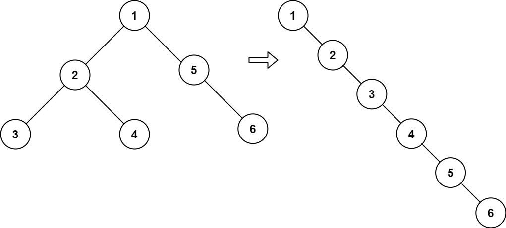

```
输入：root = [1,2,5,3,4,null,6]
输出：[1,null,2,null,3,null,4,null,5,null,6]
```

**示例 2：**

```
输入：root = []
输出：[]
```

**示例 3：**

```
输入：root = [0]
输出：[0]
```

 

**提示：**

- 树中结点数在范围 `[0, 2000]` 内
- `-100 <= Node.val <= 100`

 

**进阶：**你可以使用原地算法（`O(1)` 额外空间）展开这棵树吗？


#### 75.2 解法

**时间复杂度**：$O(N)$，**空间复杂度**：$O(H)$。

```cpp
#include <algorithm>
#include <iostream>
#include <queue>
#include <string>
#include <unordered_map>
#include <vector>

using namespace std;

struct TreeNode {
    int val;
    TreeNode* left;
    TreeNode* right;
    TreeNode() : val(0), left(nullptr), right(nullptr) {}
    TreeNode(int x) : val(x), left(nullptr), right(nullptr) {}
    TreeNode(int x, TreeNode* left, TreeNode* right) : val(x), left(left), right(right) {}
};

class Solution {
   public:
    void flatten(TreeNode* root) { subFlatten(root); }

   private:
    TreeNode* subFlatten(TreeNode* root) {
        if (root == nullptr) return root;

        TreeNode *right = subFlatten(root->right), *subRight = subFlatten(root->left);
        if (subRight != nullptr) {
            TreeNode* oldRight = root->right;
            root->right = root->left;
            subRight->right = oldRight;
            root->left = nullptr;

            if (right == nullptr) {
                right = subRight;
            }
        } else if (right == nullptr) {
            right = root;
        }

        return right;
    }
};

int main() {
    ios::sync_with_stdio(false);
    cin.tie(nullptr);

    int n;
    if (!(cin >> n)) return 0;
    if (n == 0) return 0;

    vector<string> nums(n);
    for (int i = 0; i < n; i++) {
        cin >> nums[i];
    }

    TreeNode* root = new TreeNode(stoi(nums[0]));
    queue<TreeNode*> q;
    q.push(root);
    int i = 1;

    while (!q.empty() && i < n) {
        TreeNode* curr = q.front();
        q.pop();

        if (i < n && nums[i] != "null") {
            curr->left = new TreeNode(stoi(nums[i]));
            q.push(curr->left);
        }
        i++;

        if (i < n && nums[i] != "null") {
            curr->right = new TreeNode(stoi(nums[i]));
            q.push(curr->right);
        }
        i++;
    }

    Solution obj;
    obj.flatten(root);

    queue<TreeNode*> outQ;
    if (root != nullptr) {
        outQ.push(root);
        cout << root->val << " ";
    }

    while (!outQ.empty()) {
        TreeNode* curr = outQ.front();
        outQ.pop();

        if (curr->left != nullptr) {
            outQ.push(curr->left);
            cout << curr->left->val << " ";
        } else {
            cout << "null ";
        }
        if (curr->right != nullptr) {
            outQ.push(curr->right);
            cout << curr->right->val << " ";
        } else {
            cout << "null ";
        }
    }
    cout << "\n";

    return 0;
}
```

> 写得更漂亮一点就是：
>
> ```cpp
> class Solution {
> public:
>     void flatten(TreeNode* root) { 
>         getTail(root); 
>     }
> 
> private:
>     TreeNode* getTail(TreeNode* root) {
>         if (root == nullptr) return nullptr;
> 
>         TreeNode* leftTail = getTail(root->left);
>         TreeNode* rightTail = getTail(root->right);
> 
>         if (leftTail != nullptr) {
>             leftTail->right = root->right;
>             root->right = root->left;
>             root->left = nullptr;
>         }
> 
>         if (rightTail != nullptr) return rightTail;
>         if (leftTail != nullptr) return leftTail;
>         return root;
>     }
> };
> ```


#### 75.3 解析

如果用递归的话，还有一种不用返回的解法：

```cpp
class Solution {
private:
    TreeNode* prev = nullptr;

public:
    void flatten(TreeNode* root) {
        if (root == nullptr) return;
        
        flatten(root->right);
        flatten(root->left);
        
        root->right = prev;
        root->left = nullptr;
        prev = root;
    }
};
```

这个解法很巧妙，`prev`实际上是处理到该节点时，按先序遍历排列的链表中在它之后的部分的`head`，即反向地进行了先序遍历（右-左-根），从后往前挂链表。

但是用了递归就不可能还是常量空间，所以还有一种类似 **Morris 遍历**的办法，即：找到左子树中最右下角的节点，然后把右子树接到上面去，再把左子树移动到右子树上后清空左子树，接着`root->right`地遍历下去，逐步捋平。（思路有点类似上面的办法）：

```cpp
class Solution {
public:
    void flatten(TreeNode* root) {
        TreeNode* curr = root;
        
        while (curr != nullptr) {
            if (curr->left != nullptr) {
                TreeNode* next = curr->left;
                TreeNode* predecessor = next;
                
                while (predecessor->right != nullptr) {
                    predecessor = predecessor->right;
                }
                
                predecessor->right = curr->right;
                curr->left = nullptr;
                curr->right = next;
            }
            curr = curr->right;
        }
    }
};
```

这种空间复杂度为 $O(1)$。


### 76. 路径总和*

#### 76.1 题目

给你二叉树的根节点 `root` 和一个表示目标和的整数 `targetSum` 。判断该树中是否存在 **根节点到叶子节点** 的路径，这条路径上所有节点值相加等于目标和 `targetSum` 。如果存在，返回 `true` ；否则，返回 `false` 。

**叶子节点** 是指没有子节点的节点。

 

**示例 1：**


```
输入：root = [5,4,8,11,null,13,4,7,2,null,null,null,1], targetSum = 22
输出：true
解释：等于目标和的根节点到叶节点路径如上图所示。
```

**示例 2：**

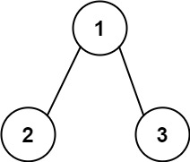

```
输入：root = [1,2,3], targetSum = 5
输出：false
解释：树中存在两条根节点到叶子节点的路径：
(1 --> 2): 和为 3
(1 --> 3): 和为 4
不存在 sum = 5 的根节点到叶子节点的路径。
```

**示例 3：**

```
输入：root = [], targetSum = 0
输出：false
解释：由于树是空的，所以不存在根节点到叶子节点的路径。
```

 

**提示：**

- 树中节点的数目在范围 `[0, 5000]` 内
- `-1000 <= Node.val <= 1000`
- `-1000 <= targetSum <= 1000`


#### 76.2 解法

**空间复杂度**：$O(H)$，**时间复杂度**：$O(N)$。

```cpp
#include <algorithm>
#include <iostream>
#include <queue>
#include <string>
#include <unordered_map>
#include <vector>

using namespace std;

struct TreeNode {
    int val;
    TreeNode* left;
    TreeNode* right;
    TreeNode() : val(0), left(nullptr), right(nullptr) {}
    TreeNode(int x) : val(x), left(nullptr), right(nullptr) {}
    TreeNode(int x, TreeNode* left, TreeNode* right) : val(x), left(left), right(right) {}
};

class Solution {
   public:
    bool hasPathSum(TreeNode* root, int targetSum) {
        if (root == nullptr) return false;

        int sub = targetSum - root->val;

        if (sub == 0 && root->left == nullptr && root->right == nullptr) {
            return true;
        }

        return hasPathSum(root->left, sub) || hasPathSum(root->right, sub);
    }
};

int main() {
    ios::sync_with_stdio(false);
    cin.tie(nullptr);

    int n, targetSum;
    cin >> n >> targetSum;

    if (n == 0) {
        cout << 0 << "\n";
        return 0;
    }

    vector<string> vals(n);
    for (int i = 0; i < n; i++) {
        cin >> vals[i];
    }

    TreeNode* root = new TreeNode(stoi(vals[0]));
    queue<TreeNode*> q;
    q.push(root);
    int i = 1;

    while (!q.empty() && i < n) {
        TreeNode* curr = q.front();
        q.pop();

        if (i < n && vals[i] != "null") {
            curr->left = new TreeNode(stoi(vals[i]));
            q.push(curr->left);
        }
        i++;

        if (i < n && vals[i] != "null") {
            curr->right = new TreeNode(stoi(vals[i]));
            q.push(curr->right);
        }
        i++;
    }

    Solution obj;
    cout << obj.hasPathSum(root, targetSum) << "\n";

    return 0;
}
```


#### 76.3 解析

其实标准还是很统一的，我把如果有我没想到的更好的解的情况标为**，比如上一题。而类似这题不一样，虽然递归永远不可能是最优解，但是BFS在思维层面上没有更优，所以视为等效的解。BFS：

```cpp
#include <queue>
#include <utility>

using namespace std;

class Solution {
public:
    bool hasPathSum(TreeNode* root, int targetSum) {
        if (root == nullptr) return false;
        
        queue<pair<TreeNode*, int>> q;
        q.push({root, root->val});
        
        while (!q.empty()) {
            auto [node, currentSum] = q.front();
            q.pop();
            
            if (node->left == nullptr && node->right == nullptr && currentSum == targetSum) {
                return true;
            }
            
            if (node->left != nullptr) {
                q.push({node->left, currentSum + node->left->val});
            }
            if (node->right != nullptr) {
                q.push({node->right, currentSum + node->right->val});
            }
        }
        
        return false;
    }
};
```


### 77. 求根节点到叶子节点数字之和*

#### 77.1 题目

给你一个二叉树的根节点 `root` ，树中每个节点都存放有一个 `0` 到 `9` 之间的数字。

每条从根节点到叶节点的路径都代表一个数字：

- 例如，从根节点到叶节点的路径 `1 -> 2 -> 3` 表示数字 `123` 。

计算从根节点到叶节点生成的 **所有数字之和** 。

**叶节点** 是指没有子节点的节点。

 

**示例 1：**


```
输入：root = [1,2,3]
输出：25
解释：
从根到叶子节点路径 1->2 代表数字 12
从根到叶子节点路径 1->3 代表数字 13
因此，数字总和 = 12 + 13 = 25
```

**示例 2：**


```
输入：root = [4,9,0,5,1]
输出：1026
解释：
从根到叶子节点路径 4->9->5 代表数字 495
从根到叶子节点路径 4->9->1 代表数字 491
从根到叶子节点路径 4->0 代表数字 40
因此，数字总和 = 495 + 491 + 40 = 1026
```

 

**提示：**

- 树中节点的数目在范围 `[1, 1000]` 内
- `0 <= Node.val <= 9`
- 树的深度不超过 `10`


#### 77.2 解法

**时间复杂度**：$O(N)$，**空间复杂度**：$O(H)$。

```cpp
#include <iostream>
#include <queue>
#include <string>
#include <vector>

using namespace std;

struct TreeNode {
    int val;
    TreeNode* left;
    TreeNode* right;
    TreeNode() : val(0), left(nullptr), right(nullptr) {}
    TreeNode(int x) : val(x), left(nullptr), right(nullptr) {}
    TreeNode(int x, TreeNode* left, TreeNode* right) : val(x), left(left), right(right) {}
};

class Solution {
public:
    int sumNumbers(TreeNode* root) {
        if(root == nullptr) return 0;
        return layerSum(root, 0);
    }
private:
    int layerSum(TreeNode* root, int layer){
        if(root == nullptr) return 0;
        layer *= 10;
        int sum = layer + root->val;
        if(root->left == nullptr && root->right == nullptr) return sum;
        return layerSum(root->left, sum) + layerSum(root->right, sum);
    }
};

int main() {
    ios::sync_with_stdio(false);
    cin.tie(nullptr);

    int n;
    if (!(cin >> n)) return 0;

    if (n == 0) {
        cout << 0 << "\n";
        return 0;
    }

    vector<string> vals(n);
    for (int i = 0; i < n; i++) {
        cin >> vals[i];
    }

    TreeNode* root = new TreeNode(stoi(vals[0]));
    queue<TreeNode*> q;
    q.push(root);
    int i = 1;

    while (!q.empty() && i < n) {
        TreeNode* curr = q.front();
        q.pop();

        if (i < n && vals[i] != "null") {
            curr->left = new TreeNode(stoi(vals[i]));
            q.push(curr->left);
        }
        i++;

        if (i < n && vals[i] != "null") {
            curr->right = new TreeNode(stoi(vals[i]));
            q.push(curr->right);
        }
        i++;
    }

    Solution obj;
    cout << obj.sumNumbers(root) << "\n";

    return 0;
}
```


#### 77.3 解析

同样也能用迭代法，同样也会用到额外空间：

```cpp
#include <queue>
#include <utility>

using namespace std;

class Solution {
public:
    int sumNumbers(TreeNode* root) {
        if (root == nullptr) return 0;

        int totalSum = 0;
        queue<pair<TreeNode*, int>> q;
        q.push({root, root->val});

        while (!q.empty()) {
            auto [node, currentNum] = q.front();
            q.pop();

            if (node->left == nullptr && node->right == nullptr) {
                totalSum += currentNum;
            } else {
                if (node->left != nullptr) {
                    q.push({node->left, currentNum * 10 + node->left->val});
                }
                if (node->right != nullptr) {
                    q.push({node->right, currentNum * 10 + node->right->val});
                }
            }
        }

        return totalSum;
    }
};
```


### 78. 二叉树的最大路径和***

#### 78.1 题目

二叉树中的 **路径** 被定义为一条节点序列，序列中每对相邻节点之间都存在一条边。同一个节点在一条路径序列中 **至多出现一次** 。该路径 **至少包含一个** 节点，且不一定经过根节点。

**路径和** 是路径中各节点值的总和。

给你一个二叉树的根节点 `root` ，返回其 **最大路径和** 。

 

**示例 1：**


```
输入：root = [1,2,3]
输出：6
解释：最优路径是 2 -> 1 -> 3 ，路径和为 2 + 1 + 3 = 6
```

**示例 2：**


```
输入：root = [-10,9,20,null,null,15,7]
输出：42
解释：最优路径是 15 -> 20 -> 7 ，路径和为 15 + 20 + 7 = 42
```

 

**提示：**

- 树中节点数目范围是 `[1, 3 * 104]`
- `-1000 <= Node.val <= 1000`


#### 78.2 解法

**时间复杂度**：$O(N)$，**空间复杂度**：$O(H)$。

```cpp
#include <algorithm>
#include <iostream>
#include <queue>
#include <string>
#include <vector>
#include <climits>

using namespace std;

struct TreeNode {
    int val;
    TreeNode* left;
    TreeNode* right;
    TreeNode() : val(0), left(nullptr), right(nullptr) {}
    TreeNode(int x) : val(x), left(nullptr), right(nullptr) {}
    TreeNode(int x, TreeNode* left, TreeNode* right) : val(x), left(left), right(right) {}
};

class Solution {
private:
    int maxSum = INT_MIN;
    
    int subNodeSelect(TreeNode *root) {
        if (root == nullptr) return 0;
        
        int left = max(subNodeSelect(root->left), 0);
        int right = max(subNodeSelect(root->right), 0);
        
        int nowSum = root->val + left + right;
        maxSum = max(maxSum, nowSum);
        
        return root->val + max(left, right);
    }
    
public:
    int maxPathSum(TreeNode* root) {
        maxSum = INT_MIN;
        subNodeSelect(root);
        return maxSum;
    }
};

int main() {
    ios::sync_with_stdio(false);
    cin.tie(nullptr);

    int n;
    if (!(cin >> n)) return 0;
    if (n == 0) {
        cout << 0 << "\n";
        return 0;
    }

    vector<string> vals(n);
    for (int i = 0; i < n; i++) {
        cin >> vals[i];
    }

    TreeNode* root = new TreeNode(stoi(vals[0]));
    queue<TreeNode*> q;
    q.push(root);
    int i = 1;

    while (!q.empty() && i < n) {
        TreeNode* curr = q.front();
        q.pop();

        if (i < n && vals[i] != "null") {
            curr->left = new TreeNode(stoi(vals[i]));
            q.push(curr->left);
        }
        i++;

        if (i < n && vals[i] != "null") {
            curr->right = new TreeNode(stoi(vals[i]));
            q.push(curr->right);
        }
        i++;
    }

    Solution obj;
    cout << obj.maxPathSum(root) << "\n";

    return 0;
}
```


#### 78.3 解析

看了提示才写出来，算三颗星吧。但是题目解法本身不太难，就是思维没打开：其实最重要的是外部的`maxSum`记录，而不是像上一题一样递归计算，我就是陷入了这个误区，一直没能想出来；之后就是`return`值，不能直接`return`和，而应该是`left`和`right`的`max`，又由于它们各自已经和 0 `max`过了，所以 `root->val + max(left, right)`是另一关键。

此外，在这里的迭代法没太大意义，这是`左右中`遍历，不太好维护队列。


### 79. 二叉搜索树迭代器*

#### 79.1 题目

实现一个二叉搜索树迭代器类`BSTIterator` ，表示一个按中序遍历二叉搜索树（BST）的迭代器：

- `BSTIterator(TreeNode root)` 初始化 `BSTIterator` 类的一个对象。BST 的根节点 `root` 会作为构造函数的一部分给出。指针应初始化为一个不存在于 BST 中的数字，且该数字小于 BST 中的任何元素。
- `boolean hasNext()` 如果向指针右侧遍历存在数字，则返回 `true` ；否则返回 `false` 。
- `int next()`将指针向右移动，然后返回指针处的数字。

注意，指针初始化为一个不存在于 BST 中的数字，所以对 `next()` 的首次调用将返回 BST 中的最小元素。

你可以假设 `next()` 调用总是有效的，也就是说，当调用 `next()` 时，BST 的中序遍历中至少存在一个下一个数字。

 

**示例：**

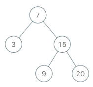

```
输入
["BSTIterator", "next", "next", "hasNext", "next", "hasNext", "next", "hasNext", "next", "hasNext"]
[[[7, 3, 15, null, null, 9, 20]], [], [], [], [], [], [], [], [], []]
输出
[null, 3, 7, true, 9, true, 15, true, 20, false]

解释
BSTIterator bSTIterator = new BSTIterator([7, 3, 15, null, null, 9, 20]);
bSTIterator.next();    // 返回 3
bSTIterator.next();    // 返回 7
bSTIterator.hasNext(); // 返回 True
bSTIterator.next();    // 返回 9
bSTIterator.hasNext(); // 返回 True
bSTIterator.next();    // 返回 15
bSTIterator.hasNext(); // 返回 True
bSTIterator.next();    // 返回 20
bSTIterator.hasNext(); // 返回 False
```

 

**提示：**

- 树中节点的数目在范围 `[1, 105]` 内
- `0 <= Node.val <= 106`
- 最多调用 `105` 次 `hasNext` 和 `next` 操作

 

**进阶：**

- 你可以设计一个满足下述条件的解决方案吗？`next()` 和 `hasNext()` 操作均摊时间复杂度为 `O(1)` ，并使用 `O(h)` 内存。其中 `h` 是树的高度。


#### 79.2 解法

**时间复杂度**：均摊 $O(1)$，**空间复杂度**：$O(h)$。

```cpp
#include <algorithm>
#include <iostream>
#include <queue>
#include <string>
#include <unordered_map>
#include <vector>

using namespace std;

struct TreeNode {
    int val;
    TreeNode* left;
    TreeNode* right;
    TreeNode() : val(0), left(nullptr), right(nullptr) {}
    TreeNode(int x) : val(x), left(nullptr), right(nullptr) {}
    TreeNode(int x, TreeNode* left, TreeNode* right) : val(x), left(left), right(right) {}
};

class BSTIterator {
   private:
    vector<TreeNode*> pre;
    TreeNode* r;
    TreeNode* interator;

   public:
    BSTIterator(TreeNode* root) {
        r = root;

        while (root != nullptr) {
            pre.push_back(root);
            root = root->left;
        }

        interator = new TreeNode(pre.back()->val - 1);
    }

    int next() {
        if (interator->right != nullptr) {
            interator = interator->right;
            while (interator->left != nullptr) {
                pre.push_back(interator);
                interator = interator->left;
            }
        } else if (!pre.empty()) {
            interator = pre.back();
            pre.pop_back();
        }

        return interator->val;
    }

    bool hasNext() {
        if (pre.empty() && interator->right == nullptr) {
            return false;
        }

        return true;
    }
};

int main() {
    ios::sync_with_stdio(false);
    cin.tie(nullptr);

    int m;
    if (!(cin >> m)) return 0;

    vector<string> ops(m);
    for (int i = 0; i < m; ++i) {
        cin >> ops[i];
    }

    int n;
    if (!(cin >> n)) return 0;

    TreeNode* root = nullptr;
    if (n > 0) {
        vector<string> nodes(n);
        for (int i = 0; i < n; ++i) {
            cin >> nodes[i];
        }

        if (nodes[0] != "null") {
            root = new TreeNode(stoi(nodes[0]));
            queue<TreeNode*> q;
            q.push(root);
            int i = 1;
            while (!q.empty() && i < n) {
                TreeNode* curr = q.front();
                q.pop();
                if (i < n && nodes[i] != "null") {
                    curr->left = new TreeNode(stoi(nodes[i]));
                    q.push(curr->left);
                }
                i++;
                if (i < n && nodes[i] != "null") {
                    curr->right = new TreeNode(stoi(nodes[i]));
                    q.push(curr->right);
                }
                i++;
            }
        }
    }

    BSTIterator* obj = nullptr;

    for (int i = 0; i < m; ++i) {
        if (ops[i] == "BSTIterator") {
            obj = new BSTIterator(root);
            cout << "null ";
        } else if (ops[i] == "next") {
            cout << obj->next() << " ";
        } else if (ops[i] == "hasNext") {
            cout << (obj->hasNext() ? "true" : "false") << " ";
        }
    }
    cout << "\n";

    return 0;
}
```

> 如果把最左端也入栈，会省不少功夫：
>
> ```cpp
> class BSTIterator {
> private:
>     stack<TreeNode*> st;
> 
>     void pushAllLeft(TreeNode* node) {
>         while (node != nullptr) {
>             st.push(node);
>             node = node->left;
>         }
>     }
> 
> public:
>     BSTIterator(TreeNode* root) {
>         pushAllLeft(root);
>     }
>     
>     int next() {
>         TreeNode* topNode = st.top();
>         st.pop();
>         
>         if (topNode->right != nullptr) {
>             pushAllLeft(topNode->right);
>         }
>         
>         return topNode->val;
>     }
>     
>     bool hasNext() {
>         return !st.empty();
>     }
> };
> ```


#### 79.3 解析

在题目进阶限制下，并没有其他解法。


### 80. 完全二叉树的节点个数**

#### 80.1 题目

给你一棵 **完全二叉树** 的根节点 `root` ，求出该树的节点个数。

[完全二叉树](https://baike.baidu.com/item/完全二叉树/7773232?fr=aladdin) 的定义如下：在完全二叉树中，除了最底层节点可能没填满外，其余每层节点数都达到最大值，并且最下面一层的节点都集中在该层最左边的若干位置。若最底层为第 `h` 层（从第 0 层开始），则该层包含 `1~ 2h` 个节点。

 

**示例 1：**

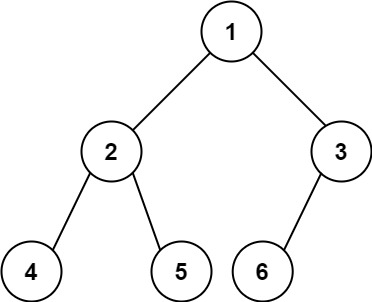

```
输入：root = [1,2,3,4,5,6]
输出：6
```

**示例 2：**

```
输入：root = []
输出：0
```

**示例 3：**

```
输入：root = [1]
输出：1
```

 

**提示：**

- 树中节点的数目范围是`[0, 5 * 104]`
- `0 <= Node.val <= 5 * 104`
- 题目数据保证输入的树是 **完全二叉树**

 

**进阶：**遍历树来统计节点是一种时间复杂度为 `O(n)` 的简单解决方案。你可以设计一个更快的算法吗？


#### 80.2 解法

**时间复杂度**：$O(N)$，**空间复杂度**：$O(\log N)$。

```cpp
#include <algorithm>
#include <iostream>
#include <queue>
#include <string>
#include <unordered_map>
#include <vector>

using namespace std;

struct TreeNode {
    int val;
    TreeNode* left;
    TreeNode* right;
    TreeNode() : val(0), left(nullptr), right(nullptr) {}
    TreeNode(int x) : val(x), left(nullptr), right(nullptr) {}
    TreeNode(int x, TreeNode* left, TreeNode* right) : val(x), left(left), right(right) {}
};

class Solution {
   public:
    int countNodes(TreeNode* root) {
        if (root == nullptr) return 0;

        return 1 + countNodes(root->left) + countNodes(root->right);
    }
};

int main() {
    ios::sync_with_stdio(false);
    cin.tie(nullptr);

    int n;
    cin >> n;
    if (n == 0) {
        cout << 0 << "\n";
        return 0;
    }

    vector<string> vals(n);
    for (int i = 0; i < n; i++) {
        cin >> vals[i];
    }

    TreeNode* root = new TreeNode(stoi(vals[0]));
    queue<TreeNode*> q;
    q.push(root);
    int i = 1;

    while (!q.empty() && i < n) {
        TreeNode* curr = q.front();
        q.pop();

        if (i < n && vals[i] != "null") {
            curr->left = new TreeNode(stoi(vals[i]));
            q.push(curr->left);
        }
        i++;

        if (i < n && vals[i] != "null") {
            curr->right = new TreeNode(stoi(vals[i]));
            q.push(curr->right);
        }
        i++;
    }

    Solution obj;
    cout << obj.countNodes(root) << "\n";

    return 0;
}
```


#### 80.3 解析

这个方法最简单，但是显然还有更好的办法：

```cpp
class Solution {
public:
    int countNodes(TreeNode* root) {
        if (root == nullptr) return 0;
        
        // 分别计算左右子树的高度
        int leftHeight = getDepth(root->left);
        int rightHeight = getDepth(root->right);
        
        // 逻辑分支：必定有一半是满二叉树，直接位运算秒算
        if (leftHeight == rightHeight) {
            // 左子树是满二叉树: 2^leftHeight 个节点 (包含了根节点) + 递归计算右子树
            return (1 << leftHeight) + countNodes(root->right);
        } else {
            // 右子树是满二叉树: 2^rightHeight 个节点 (包含了根节点) + 递归计算左子树
            return (1 << rightHeight) + countNodes(root->left);
        }
    }

private:
    // 计算完全二叉树的高度（只用沿左边界走到底即可，O(logN)时间）
    int getDepth(TreeNode* node) {
        int depth = 0;
        while (node != nullptr) {
            depth++;
            node = node->left;
        }
        return depth;
    }
};
```

这里有一个核心点：**至少一半是满的**。如果高度相同，那么是右边缺了，左边肯定是满的；若不同，那么一定是左边不满（多出几个），但是右边肯定是满的。


### 81. 二叉树的最近公共祖先*

#### 81.1 题目

给定一个二叉树, 找到该树中两个指定节点的最近公共祖先。

[百度百科](https://baike.baidu.com/item/最近公共祖先/8918834?fr=aladdin)中最近公共祖先的定义为：“对于有根树 T 的两个节点 p、q，最近公共祖先表示为一个节点 x，满足 x 是 p、q 的祖先且 x 的深度尽可能大（**一个节点也可以是它自己的祖先**）。”

 

**示例 1：**


```
输入：root = [3,5,1,6,2,0,8,null,null,7,4], p = 5, q = 1
输出：3
解释：节点 5 和节点 1 的最近公共祖先是节点 3 。
```

**示例 2：**


```
输入：root = [3,5,1,6,2,0,8,null,null,7,4], p = 5, q = 4
输出：5
解释：节点 5 和节点 4 的最近公共祖先是节点 5 。因为根据定义最近公共祖先节点可以为节点本身。
```

**示例 3：**

```
输入：root = [1,2], p = 1, q = 2
输出：1
```

 

**提示：**

- 树中节点数目在范围 `[2, 105]` 内。
- `-109 <= Node.val <= 109`
- 所有 `Node.val` `互不相同` 。
- `p != q`
- `p` 和 `q` 均存在于给定的二叉树中。


#### 81.2 解法

**时间复杂度**：**O(N)**，**空间复杂度**：**O(H)**。

```cpp
#include <iostream>
#include <vector>
#include <string>
#include <queue>

using namespace std;

struct TreeNode {
    int val;
    TreeNode* left;
    TreeNode* right;
    TreeNode(int x) : val(x), left(nullptr), right(nullptr) {}
};

class Solution {
public:
    TreeNode* lowestCommonAncestor(TreeNode* root, TreeNode* p, TreeNode* q) {
        if(root == nullptr) return root;
        if(p == q) return p;
        
        vector<pair<TreeNode*,bool>> findStack;
        TreeNode* find = nullptr;
        bool findOne = false;
        while(root != nullptr || !findStack.empty()){
            while(root != nullptr){
                findStack.push_back({root, !findOne});
                find = findOne ? find : root;
                
                if(root== p || root == q){
                    if(findOne){
                        return find;
                    }else{
                        findOne = true;
                    }
                }
                root = root->left;
            }
            root = findStack.back().first;
            find = findStack.back().second ? root : find;
            findStack.pop_back();
            root = root->right;
        }
        
        return find;
    }
};

TreeNode* findNode(TreeNode* root, int val) {
    if (root == nullptr) return nullptr;
    if (root->val == val) return root;
    TreeNode* leftRes = findNode(root->left, val);
    if (leftRes != nullptr) return leftRes;
    return findNode(root->right, val);
}

int main() {
    ios::sync_with_stdio(false);
    cin.tie(nullptr);

    int n, p_val, q_val;
    if (!(cin >> n >> p_val >> q_val)) return 0;

    if (n == 0) return 0;

    vector<string> vals(n);
    for (int i = 0; i < n; i++) {
        cin >> vals[i];
    }

    TreeNode* root = new TreeNode(stoi(vals[0]));
    queue<TreeNode*> q_tree;
    q_tree.push(root);
    int i = 1;

    while (!q_tree.empty() && i < n) {
        TreeNode* curr = q_tree.front();
        q_tree.pop();

        if (i < n && vals[i] != "null") {
            curr->left = new TreeNode(stoi(vals[i]));
            q_tree.push(curr->left);
        }
        i++;

        if (i < n && vals[i] != "null") {
            curr->right = new TreeNode(stoi(vals[i]));
            q_tree.push(curr->right);
        }
        i++;
    }

    TreeNode* p = findNode(root, p_val);
    TreeNode* q = findNode(root, q_val);

    Solution obj;
    TreeNode* lca = obj.lowestCommonAncestor(root, p, q);
    
    if (lca != nullptr) {
        cout << lca->val << "\n";
    } else {
        cout << "null\n";
    }

    return 0;
}
```

> 代码写复杂了，关键在于`findOne`之后的一些操作，实际上我走的先序遍历不太好，因为走右子树时候`root`就不在栈里面了，这样就没办法在代码之外遍历栈去找第一个标记不是`true`的节点，所以我给融入到遍历之中了。
>
> 更清晰的其实是后序遍历，也就是走右边不先把父节点出栈。


#### 81.3 解析

Gemini 3.1 Pro 最开始还误判了我的解法，而DeepSeek更是没有理解，这一块写得太复杂了，但是好在时空复杂度不复杂，也算达到了最优解水平。

迭代法部分，我的固然是一种解法，另外还有一种用哈希表的，时间复杂度是 $O(N)$，就不放了。

然后是递归部分，一到复杂的逻辑就不敢写递归，也是我的一个问题，这道题其实有一个很好的递归解法：

```cpp
class Solution {
public:
    TreeNode* lowestCommonAncestor(TreeNode* root, TreeNode* p, TreeNode* q) {
        // 1. 递归终止条件：越界，或者找到了目标
        if (root == nullptr || root == p || root == q) {
            return root;
        }
        
        // 2. 去左边找
        TreeNode* left = lowestCommonAncestor(root->left, p, q);
        // 3. 去右边找
        TreeNode* right = lowestCommonAncestor(root->right, p, q);
        
        // 4. 如果左右两边都能找到，说明 p 和 q 分居当前节点的两侧，当前节点就是 LCA
        if (left != nullptr && right != nullptr) {
            return root;
        }
        
        // 5. 如果只在某一边找到，就把那一边找到的节点一路送上去
        return left != nullptr ? left : right;
    }
};
```

这道题核心思想就是**层层上报**，比一般的递归稍微复杂一点，但是逻辑上其实差不太多。返回条件是空和找到目标，空的话到时加个判断过滤一下就行，重点是上报的被找到的节点。如果一个节点，同时在左子树方向和右子树方向都有非空的返回，那么它就是要找的那个祖先。此外，如果另一个节点是一个节点的子节点，那么到了后者时会直接返回，这时候最终结果就是后者，逻辑自洽。


### 82. 二叉树的右视图*

#### 82.1 题目

给定一个二叉树的 **根节点** `root`，想象自己站在它的右侧，按照从顶部到底部的顺序，返回从右侧所能看到的节点值。

 

**示例 1：**

**输入：**root = [1,2,3,null,5,null,4]

**输出：**[1,3,4]

**解释：**

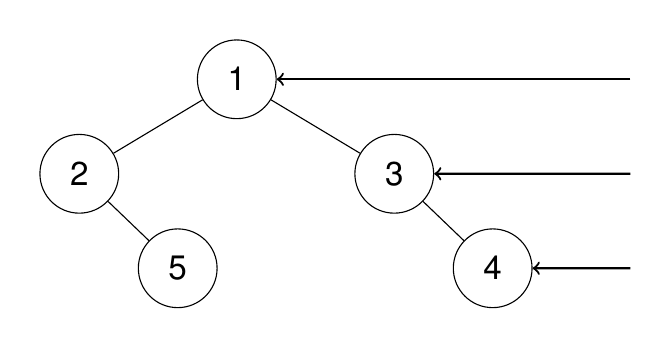

**示例 2：**

**输入：**root = [1,2,3,4,null,null,null,5]

**输出：**[1,3,4,5]

**解释：**


**示例 3：**

**输入：**root = [1,null,3]

**输出：**[1,3]

**示例 4：**

**输入：**root = []

**输出：**[]

 

**提示:**

- 二叉树的节点个数的范围是 `[0,100]`
- `-100 <= Node.val <= 100` 


#### 82.2 解法

**时间复杂度**：$O(N)$，**空间复杂度**：$O(H)$。

```cpp
#include <algorithm>
#include <iostream>
#include <queue>
#include <string>
#include <vector>

using namespace std;

struct TreeNode {
    int val;
    TreeNode* left;
    TreeNode* right;
    TreeNode() : val(0), left(nullptr), right(nullptr) {}
    TreeNode(int x) : val(x), left(nullptr), right(nullptr) {}
    TreeNode(int x, TreeNode* left, TreeNode* right) : val(x), left(left), right(right) {}
};

class Solution {
   private:
    vector<int> result;

   public:
    vector<int> rightSideView(TreeNode* root) {
        result.resize(0);
        findRightest(root, 0);
        return result;
    }

   private:
    void findRightest(TreeNode* root, int layer) {
        if (root == nullptr) return;

        if (layer == result.size()) {
            result.push_back(root->val);
        }

        findRightest(root->right, layer + 1);
        findRightest(root->left, layer + 1);
    }
};

int main() {
    ios::sync_with_stdio(false);
    cin.tie(nullptr);

    int n;
    if (!(cin >> n)) return 0;

    if (n == 0) {
        cout << "\n";
        return 0;
    }

    vector<string> vals(n);
    for (int i = 0; i < n; i++) {
        cin >> vals[i];
    }

    TreeNode* root = new TreeNode(stoi(vals[0]));
    queue<TreeNode*> q;
    q.push(root);
    int i = 1;

    while (!q.empty() && i < n) {
        TreeNode* curr = q.front();
        q.pop();

        if (i < n && vals[i] != "null") {
            curr->left = new TreeNode(stoi(vals[i]));
            q.push(curr->left);
        }
        i++;

        if (i < n && vals[i] != "null") {
            curr->right = new TreeNode(stoi(vals[i]));
            q.push(curr->right);
        }
        i++;
    }

    Solution obj;
    vector<int> res = obj.rightSideView(root);

    for (int val : res) {
        cout << val << " ";
    }
    cout << "\n";

    return 0;
}
```

> 这里用 `clear()`替代` resize(0)`更好；当然，如果传引用到递归函数更好。


#### 83.3 解析

依旧是递归最优解，此外，迭代的话：

```cpp
#include <queue>
#include <vector>

using namespace std;

class Solution {
public:
    vector<int> rightSideView(TreeNode* root) {
        vector<int> result;
        if (root == nullptr) return result;
        
        queue<TreeNode*> q;
        q.push(root);
        
        while (!q.empty()) {
            int levelSize = q.size();
            
            for (int i = 0; i < levelSize; i++) {
                TreeNode* node = q.front();
                q.pop();
                
                // 如果是当前层的最后一个节点，记录到结果中
                if (i == levelSize - 1) {
                    result.push_back(node->val);
                }
                
                if (node->left != nullptr) q.push(node->left);
                if (node->right != nullptr) q.push(node->right);
            }
        }
        
        return result;
    }
};
```


### 83. 二叉树的层平均值*

#### 83.1 题目

给定一个非空二叉树的根节点 `root` , 以数组的形式返回每一层节点的平均值。与实际答案相差 `10-5` 以内的答案可以被接受。

 

**示例 1：**


```
输入：root = [3,9,20,null,null,15,7]
输出：[3.00000,14.50000,11.00000]
解释：第 0 层的平均值为 3,第 1 层的平均值为 14.5,第 2 层的平均值为 11 。
因此返回 [3, 14.5, 11] 。
```

**示例 2:**

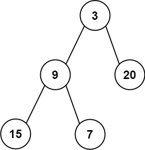

```
输入：root = [3,9,20,15,7]
输出：[3.00000,14.50000,11.00000]
```

 

**提示：**


- 树中节点数量在 `[1, 104]` 范围内
- `-231 <= Node.val <= 231 - 1`


#### 83.2 解法

 **时间复杂度**：$O(N)$，**空间复杂度**：$O(M)$。

```cpp
#include <algorithm>
#include <iomanip>
#include <iostream>
#include <queue>
#include <string>
#include <vector>

using namespace std;

struct TreeNode {
    int val;
    TreeNode* left;
    TreeNode* right;
    TreeNode() : val(0), left(nullptr), right(nullptr) {}
    TreeNode(int x) : val(x), left(nullptr), right(nullptr) {}
    TreeNode(int x, TreeNode* left, TreeNode* right) : val(x), left(left), right(right) {}
};

class Solution {
   public:
    vector<double> averageOfLevels(TreeNode* root) {
        vector<double> avg;
        if (root == nullptr) return avg;

        queue<TreeNode*> layer;
        layer.push(root);

        while (!layer.empty()) {
            int layerSize = layer.size();
            double sum = 0;

            for (int i = 0; i < layerSize; i++) {
                TreeNode* curr = layer.front();
                layer.pop();

                sum += curr->val;

                if (curr->left) layer.push(curr->left);
                if (curr->right) layer.push(curr->right);
            }
            avg.push_back(sum / layerSize);
        }

        return avg;
    }
};

int main() {
    ios::sync_with_stdio(false);
    cin.tie(nullptr);

    int n;
    if (!(cin >> n)) return 0;

    if (n == 0) {
        cout << "\n";
        return 0;
    }

    vector<string> vals(n);
    for (int i = 0; i < n; i++) {
        cin >> vals[i];
    }

    TreeNode* root = new TreeNode(stoi(vals[0]));
    queue<TreeNode*> q;
    q.push(root);
    int i = 1;

    while (!q.empty() && i < n) {
        TreeNode* curr = q.front();
        q.pop();

        if (i < n && vals[i] != "null") {
            curr->left = new TreeNode(stoi(vals[i]));
            q.push(curr->left);
        }
        i++;

        if (i < n && vals[i] != "null") {
            curr->right = new TreeNode(stoi(vals[i]));
            q.push(curr->right);
        }
        i++;
    }

    Solution obj;
    vector<double> res = obj.averageOfLevels(root);

    cout << fixed << setprecision(5);
    for (double avg : res) {
        cout << avg << " ";
    }
    cout << "\n";

    return 0;
}
```


#### 83.3 解析

这回跑去写迭代了，因为很直观，如果用递归的话也不难，但是没啥必要。


### 84. 二叉树的层序遍历*

#### 84.1 题目

给你二叉树的根节点 `root` ，返回其节点值的 **层序遍历** 。 （即逐层地，从左到右访问所有节点）。

 

**示例 1：**


```
输入：root = [3,9,20,null,null,15,7]
输出：[[3],[9,20],[15,7]]
```

**示例 2：**

```
输入：root = [1]
输出：[[1]]
```

**示例 3：**

```
输入：root = []
输出：[]
```

 

**提示：**

- 树中节点数目在范围 `[0, 2000]` 内
- `-1000 <= Node.val <= 1000`


#### 84.2 解法

```cpp
#include <algorithm>
#include <iostream>
#include <queue>
#include <string>
#include <utility>
#include <vector>

using namespace std;

struct TreeNode {
    int val;
    TreeNode* left;
    TreeNode* right;
    TreeNode() : val(0), left(nullptr), right(nullptr) {}
    TreeNode(int x) : val(x), left(nullptr), right(nullptr) {}
    TreeNode(int x, TreeNode* left, TreeNode* right) : val(x), left(left), right(right) {}
};

class Solution {
   public:
    vector<vector<int>> levelOrder(TreeNode* root) {
        if (root == nullptr) return {};

        vector<vector<int>> layers;
        queue<TreeNode*> q;
        q.push(root);

        while (!q.empty()) {
            int layerSize = q.size();
            vector<int> everyLayer;

            everyLayer.reserve(layerSize);

            for (int i = 0; i < layerSize; i++) {
                TreeNode* curr = q.front();
                q.pop();

                everyLayer.push_back(curr->val);

                if (curr->left) q.push(curr->left);
                if (curr->right) q.push(curr->right);
            }

            layers.push_back(std::move(everyLayer));
        }

        return layers;
    }
};

int main() {
    ios::sync_with_stdio(false);
    cin.tie(nullptr);

    int n;
    if (!(cin >> n)) return 0;

    if (n == 0) {
        cout << "[]\n";
        return 0;
    }

    vector<string> vals(n);
    for (int i = 0; i < n; i++) {
        cin >> vals[i];
    }

    TreeNode* root = new TreeNode(stoi(vals[0]));
    queue<TreeNode*> q;
    q.push(root);
    int i = 1;

    while (!q.empty() && i < n) {
        TreeNode* curr = q.front();
        q.pop();

        if (i < n && vals[i] != "null") {
            curr->left = new TreeNode(stoi(vals[i]));
            q.push(curr->left);
        }
        i++;

        if (i < n && vals[i] != "null") {
            curr->right = new TreeNode(stoi(vals[i]));
            q.push(curr->right);
        }
        i++;
    }

    Solution obj;
    vector<vector<int>> res = obj.levelOrder(root);

    cout << "[";
    for (size_t r = 0; r < res.size(); ++r) {
        cout << "[";
        for (size_t c = 0; c < res[r].size(); ++c) {
            cout << res[r][c];
            if (c < res[r].size() - 1) cout << ",";
        }
        cout << "]";
        if (r < res.size() - 1) cout << ",";
    }
    cout << "]\n";

    return 0;
}
```

> 两个复合向量的性能优化办法：
>
> 1. 预分配内存（比如我们的`everyLayer`预先知道大小，可以用`reverse`（不影响`push_back`使用，与初始化分配有点区别）
> 2. `move`避免拷贝


#### 84.3 解析

依旧较为直观的迭代法层序遍历，此外，递归的话：

```cpp
class Solution {
public:
    vector<vector<int>> levelOrder(TreeNode* root) {
        vector<vector<int>> res;
        dfs(root, 0, res);
        return res;
    }
    
private:
    void dfs(TreeNode* root, int level, vector<vector<int>>& res) {
        if (root == nullptr) return;
        
        // 当 depth 等于 res 的大小，说明我们到达了一个新的、还未被触及的深度
        if (level == res.size()) {
            res.push_back(vector<int>()); // 为新的一层开辟空间
        }
        
        // 将当前节点塞入对应深度的数组中
        res[level].push_back(root->val);
        
        // 继续带着深度信息往下挖
        dfs(root->left, level + 1, res);
        dfs(root->right, level + 1, res);
    }
};
```


### 85. 二叉树的锯齿形层序遍历*

#### 85.1 题目

给你二叉树的根节点 `root` ，返回其节点值的 **锯齿形层序遍历** 。（即先从左往右，再从右往左进行下一层遍历，以此类推，层与层之间交替进行）。

 

**示例 1：**


```
输入：root = [3,9,20,null,null,15,7]
输出：[[3],[20,9],[15,7]]
```

**示例 2：**

```
输入：root = [1]
输出：[[1]]
```

**示例 3：**

```
输入：root = []
输出：[]
```

 

**提示：**

- 树中节点数目在范围 `[0, 2000]` 内
- `-100 <= Node.val <= 100`


#### 85.2 解法

**时间复杂度**：$O(N)$，**空间复杂度**：$O(N)$。

```cpp
#include <algorithm>
#include <iostream>
#include <queue>
#include <string>
#include <utility>
#include <vector>

using namespace std;

struct TreeNode {
    int val;
    TreeNode* left;
    TreeNode* right;
    TreeNode() : val(0), left(nullptr), right(nullptr) {}
    TreeNode(int x) : val(x), left(nullptr), right(nullptr) {}
    TreeNode(int x, TreeNode* left, TreeNode* right) : val(x), left(left), right(right) {}
};

class Solution {
   public:
    vector<vector<int>> zigzagLevelOrder(TreeNode* root) {
        if (root == nullptr) return {};

        bool ward = true;
        vector<vector<int>> res;
        queue<TreeNode*> q;
        q.push(root);

        while (!q.empty()) {
            int layerSize = q.size();
            vector<int> layer(layerSize);

            for (int i = 0; i < layerSize; i++) {
                TreeNode* curr = q.front();
                q.pop();

                int index = ward ? i : layerSize - 1 - i;
                layer[index] = curr->val;

                if (curr->left != nullptr) q.push(curr->left);
                if (curr->right != nullptr) q.push(curr->right);
            }

            res.push_back(std::move(layer));
            ward = !ward;
        }

        return res;
    }
};

int main() {
    ios::sync_with_stdio(false);
    cin.tie(nullptr);

    int n;
    if (!(cin >> n)) return 0;

    if (n == 0) {
        cout << "[]\n";
        return 0;
    }

    vector<string> vals(n);
    for (int i = 0; i < n; i++) {
        cin >> vals[i];
    }

    TreeNode* root = new TreeNode(stoi(vals[0]));
    queue<TreeNode*> q;
    q.push(root);
    int i = 1;

    while (!q.empty() && i < n) {
        TreeNode* curr = q.front();
        q.pop();

        if (i < n && vals[i] != "null") {
            curr->left = new TreeNode(stoi(vals[i]));
            q.push(curr->left);
        }
        i++;

        if (i < n && vals[i] != "null") {
            curr->right = new TreeNode(stoi(vals[i]));
            q.push(curr->right);
        }
        i++;
    }

    Solution obj;
    vector<vector<int>> res = obj.zigzagLevelOrder(root);

    cout << "[";
    for (size_t r = 0; r < res.size(); ++r) {
        cout << "[";
        for (size_t c = 0; c < res[r].size(); ++c) {
            cout << res[r][c];
            if (c < res[r].size() - 1) cout << ",";
        }
        cout << "]";
        if (r < res.size() - 1) cout << ",";
    }
    cout << "]\n";

    return 0;
}
```


#### 85.3 解析

我最初是想改入栈顺序，但是假如还是依序遍历的话，多几层之后就完全乱了；而这种不同遍历顺序的办法，核心不在于`curr`出队列的顺序，而是赋值给数组的顺序。

此外，递归也是能做的，要多一步翻转：

```cpp
class Solution {
public:
    vector<vector<int>> zigzagLevelOrder(TreeNode* root) {
        vector<vector<int>> res;
        dfs(root, 0, res); // 先正常收集所有层的数据
        
        // 后处理：仅对奇数层（从右向左的层）进行原地翻转
        for (int i = 1; i < res.size(); i += 2) {
            reverse(res[i].begin(), res[i].end());
        }
        return res;
    }
    
private:
    void dfs(TreeNode* root, int level, vector<vector<int>>& res) {
        if (!root) return;
        
        if (level == res.size()) {
            res.push_back(vector<int>());
        }
        
        res[level].push_back(root->val); // 永远从左往右 push
        
        dfs(root->left, level + 1, res);
        dfs(root->right, level + 1, res);
    }
};
```


### 86. 二叉搜索树的最小绝对差*

#### 86.1 题目

给你一个二叉搜索树的根节点 `root` ，返回 **树中任意两不同节点值之间的最小差值** 。

差值是一个正数，其数值等于两值之差的绝对值。

 

**示例 1：**

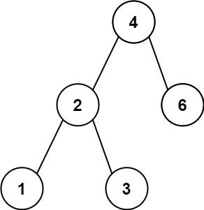

```
输入：root = [4,2,6,1,3]
输出：1
```

**示例 2：**


```
输入：root = [1,0,48,null,null,12,49]
输出：1
```

 

**提示：**

- 树中节点的数目范围是 `[2, 104]`
- `0 <= Node.val <= 105`

 

**注意：**本题与 783 https://leetcode.cn/problems/minimum-distance-between-bst-nodes/ 相同


#### 86.2 解法

**时间复杂度**：$O(N)$，**空间复杂度**：$O(H)$。

```cpp
#include <algorithm>
#include <iostream>
#include <queue>
#include <string>
#include <vector>
#include <climits>

using namespace std;

struct TreeNode {
    int val;
    TreeNode* left;
    TreeNode* right;
    TreeNode() : val(0), left(nullptr), right(nullptr) {}
    TreeNode(int x) : val(x), left(nullptr), right(nullptr) {}
    TreeNode(int x, TreeNode* left, TreeNode* right) : val(x), left(left), right(right) {}
};

class Solution {
private:
    int minSub;

    void midSeek(TreeNode* root, int& pre) {
        if (root == nullptr) {
            return;
        }
        
        midSeek(root->left, pre);
        
        if (pre == -1) {
            pre = root->val;
        } else {
            minSub = min(minSub, root->val - pre);
            pre = root->val;
        }
        
        midSeek(root->right, pre);
    }

public:
    int getMinimumDifference(TreeNode* root) {
        minSub = INT_MAX; 
        int pre = -1;
        midSeek(root, pre);
        return minSub;
    }
};

int main() {
    ios::sync_with_stdio(false);
    cin.tie(nullptr);

    int n;
    if (!(cin >> n)) return 0;

    if (n == 0) return 0;

    vector<string> vals(n);
    for (int i = 0; i < n; i++) {
        cin >> vals[i];
    }

    TreeNode* root = new TreeNode(stoi(vals[0]));
    queue<TreeNode*> q;
    q.push(root);
    int i = 1;

    while (!q.empty() && i < n) {
        TreeNode* curr = q.front();
        q.pop();

        if (i < n && vals[i] != "null") {
            curr->left = new TreeNode(stoi(vals[i]));
            q.push(curr->left);
        }
        i++;

        if (i < n && vals[i] != "null") {
            curr->right = new TreeNode(stoi(vals[i]));
            q.push(curr->right);
        }
        i++;
    }

    Solution obj;
    cout << obj.getMinimumDifference(root) << "\n";

    return 0;
}
```

> 两个问题，一是用`private`记录最大值，容易被污染；一是用`-1`标记空，限制很大：
>
> ```cpp
> class Solution {
> public:
>     int getMinimumDifference(TreeNode* root) {
>         int minSub = INT_MAX;
>         TreeNode* prev = nullptr; // 完美替代 int pre = -1
>         
>         inorder(root, prev, minSub);
>         
>         return minSub;
>     }
> 
> private:
>     void inorder(TreeNode* curr, TreeNode*& prev, int& minSub) {
>         if (curr == nullptr) return;
>         
>         inorder(curr->left, prev, minSub);
>         
>         if (prev != nullptr) {
>             minSub = min(minSub, curr->val - prev->val);
>         }
>         prev = curr;
>         
>         inorder(curr->right, prev, minSub);
>     }
> };
> ```


#### 86.3 解析

这道题的核心就是认识到中序遍历后的二叉搜索树实际上就是一个非递减的数组。此外迭代法也是可以的：

```cpp
#include <stack>
#include <algorithm>
#include <climits>

using namespace std;

class Solution {
public:
    int getMinimumDifference(TreeNode* root) {
        int minSub = INT_MAX;
        TreeNode* prev = nullptr;
        TreeNode* curr = root;
        stack<TreeNode*> st;
        
        while (curr != nullptr || !st.empty()) {
            // 一路向左走到底
            while (curr != nullptr) {
                st.push(curr);
                curr = curr->left;
            }
            
            // 弹出栈顶元素（这就是当前中序序列中最小的一个）
            curr = st.top();
            st.pop();
            
            // 处理逻辑
            if (prev != nullptr) {
                minSub = min(minSub, curr->val - prev->val);
            }
            prev = curr;
            
            // 转向右边
            curr = curr->right;
        }
        
        return minSub;
    }
};
```


### 87. 二叉搜索树中第k小的元素*

#### 87.1 题目

给定一个二叉搜索树的根节点 `root` ，和一个整数 `k` ，请你设计一个算法查找其中第 `k` 小的元素（`k` 从 1 开始计数）。

 

**示例 1：**


```
输入：root = [3,1,4,null,2], k = 1
输出：1
```

**示例 2：**


```
输入：root = [5,3,6,2,4,null,null,1], k = 3
输出：3
```

 

 

**提示：**

- 树中的节点数为 `n` 。
- `1 <= k <= n <= 104`
- `0 <= Node.val <= 104`

 

**进阶：**如果二叉搜索树经常被修改（插入/删除操作）并且你需要频繁地查找第 `k` 小的值，你将如何优化算法？


#### 87.2 解法

**时间复杂度**：$O(H + k)$，**空间复杂度**：$O(H)$。

```cpp
#include <algorithm>
#include <iostream>
#include <queue>
#include <string>
#include <vector>

using namespace std;

struct TreeNode {
    int val;
    TreeNode* left;
    TreeNode* right;
    TreeNode() : val(0), left(nullptr), right(nullptr) {}
    TreeNode(int x) : val(x), left(nullptr), right(nullptr) {}
    TreeNode(int x, TreeNode* left, TreeNode* right) : val(x), left(left), right(right) {}
};

class Solution {
   public:
    int kthSmallest(TreeNode* root, int k) { return helper(root, k); }

   private:
    int helper(TreeNode* root, int& k) {
        if (root == nullptr) return -1;

        int num = helper(root->left, k);
        if (num != -1) return num;

        k--;
        if (k == 0) return root->val;

        num = helper(root->right, k);
        if (num != -1) return num;

        return -1;
    }
};

int main() {
    ios::sync_with_stdio(false);
    cin.tie(nullptr);

    int n, k;
    if (!(cin >> n >> k)) return 0;

    if (n == 0) return 0;

    vector<string> vals(n);
    for (int i = 0; i < n; i++) {
        cin >> vals[i];
    }

    TreeNode* root = new TreeNode(stoi(vals[0]));
    queue<TreeNode*> q;
    q.push(root);
    int i = 1;

    while (!q.empty() && i < n) {
        TreeNode* curr = q.front();
        q.pop();

        if (i < n && vals[i] != "null") {
            curr->left = new TreeNode(stoi(vals[i]));
            q.push(curr->left);
        }
        i++;

        if (i < n && vals[i] != "null") {
            curr->right = new TreeNode(stoi(vals[i]));
            q.push(curr->right);
        }
        i++;
    }

    Solution obj;
    cout << obj.kthSmallest(root, k) << "\n";

    return 0;
}
```

> 用`-1`标识没有找到，不太工程化：
>
> ```cpp
> class Solution {
> private:
>     int result = 0; // 存放最终答案
>     int count = 0;  // 记录当前遍历到了第几个
> 
>     void inorder(TreeNode* root, int k) {
>         if (root == nullptr) return;
>         
>         inorder(root->left, k);
>         
>         // 核心剪枝操作：如果已经找到了，后续的递归直接秒退
>         if (count >= k) return; 
>         
>         count++;
>         if (count == k) {
>             result = root->val;
>             return;
>         }
>         
>         inorder(root->right, k);
>     }
> 
> public:
>     int kthSmallest(TreeNode* root, int k) {
>         inorder(root, k);
>         return result;
>     }
> };
> ```


#### 87.3 解析

这里用迭代法会更好：

```cpp
#include <stack>

using namespace std;

class Solution {
public:
    int kthSmallest(TreeNode* root, int k) {
        stack<TreeNode*> st;
        TreeNode* curr = root;
        
        while (curr != nullptr || !st.empty()) {
            // 1. 左子树入栈
            while (curr != nullptr) {
                st.push(curr);
                curr = curr->left;
            }
            
            // 2. 弹出当前最小的元素
            curr = st.top();
            st.pop();
            
            // 3. 查找
            k--;
            if (k == 0) {
                return curr->val;
            }
            
            // 4. 转向右子树
            curr = curr->right;
        }
        
        return -1; // 理论上不可能走到这里，除非 k 大于树的节点总数
    }
};
```


### 88. 验证二叉搜索树*

#### 88.1 题目

给你一个二叉树的根节点 `root` ，判断其是否是一个有效的二叉搜索树。

**有效** 二叉搜索树定义如下：

- 节点的左子树只包含 **严格小于** 当前节点的数。
- 节点的右子树只包含 **严格大于** 当前节点的数。
- 所有左子树和右子树自身必须也是二叉搜索树。

 

**示例 1：**


```
输入：root = [2,1,3]
输出：true
```

**示例 2：**


```
输入：root = [5,1,4,null,null,3,6]
输出：false
解释：根节点的值是 5 ，但是右子节点的值是 4 。
```

 

**提示：**

- 树中节点数目范围在`[1, 104]` 内
- `-231 <= Node.val <= 231 - 1`


#### 88.2 解法

```cpp
#include <algorithm>
#include <iostream>
#include <queue>
#include <string>
#include <vector>

using namespace std;

struct TreeNode {
    int val;
    TreeNode* left;
    TreeNode* right;
    TreeNode() : val(0), left(nullptr), right(nullptr) {}
    TreeNode(int x) : val(x), left(nullptr), right(nullptr) {}
    TreeNode(int x, TreeNode* left, TreeNode* right) : val(x), left(left), right(right) {}
};

class Solution {
   private:
    TreeNode* pre;

   public:
    bool isValidBST(TreeNode* root) {
        pre = nullptr;
        return inorder(root);
    }

    bool inorder(TreeNode* root) {
        if (root == nullptr) return true;

        bool leftSon = inorder(root->left);
        if (!leftSon) return leftSon;

        bool self = true;
        if (pre != nullptr) self = root->val <= pre->val ? false : true;
        if (!self) return self;
        pre = root;

        bool rightSon = inorder(root->right);
        if (!rightSon) return rightSon;

        return true;
    }
};

int main() {
    ios::sync_with_stdio(false);
    cin.tie(nullptr);

    int n;
    if (!(cin >> n)) return 0;

    if (n == 0) {
        cout << "true\n";
        return 0;
    }

    vector<string> vals(n);
    for (int i = 0; i < n; i++) {
        cin >> vals[i];
    }

    TreeNode* root = new TreeNode(stoi(vals[0]));
    queue<TreeNode*> q;
    q.push(root);
    int i = 1;

    while (!q.empty() && i < n) {
        TreeNode* curr = q.front();
        q.pop();

        if (i < n && vals[i] != "null") {
            curr->left = new TreeNode(stoi(vals[i]));
            q.push(curr->left);
        }
        i++;

        if (i < n && vals[i] != "null") {
            curr->right = new TreeNode(stoi(vals[i]));
            q.push(curr->right);
        }
        i++;
    }

    Solution obj;
    cout << (obj.isValidBST(root) ? "true" : "false") << "\n";

    return 0;
}
```


#### 88.3 解析

此外，也能迭代：

```cpp
#include <stack>

class Solution {
public:
    bool isValidBST(TreeNode* root) {
        stack<TreeNode*> st;
        TreeNode* curr = root;
        TreeNode* pre = nullptr;
        
        while (curr != nullptr || !st.empty()) {
            while (curr != nullptr) {
                st.push(curr);
                curr = curr->left;
            }
            
            curr = st.top();
            st.pop();
            
            // 核心验证逻辑
            if (pre != nullptr && curr->val <= pre->val) {
                return false;
            }
            pre = curr;
            
            curr = curr->right;
        }
        return true;
    }
};
```

而递归也有另一种思路：

```cpp
class Solution {
public:
    bool isValidBST(TreeNode* root) {
        // 初始状态，根节点的上下限都是“无限制”
        return validate(root, nullptr, nullptr);
    }

private:
    bool validate(TreeNode* node, TreeNode* lower, TreeNode* upper) {
        // 空节点自然是合法的
        if (node == nullptr) return true;
        
        // 检查是否越过下限
        if (lower != nullptr && node->val <= lower->val) return false;
        // 检查是否越过上限
        if (upper != nullptr && node->val >= upper->val) return false;
        
        // 往左走：下限不变，上限变成当前节点
        // 往右走：上限不变，下限变成当前节点
        return validate(node->left, lower, node) && 
               validate(node->right, node, upper);
    }
};
```


## 十、图

### 89. 岛屿数量***（@）

#### 89.1 题目

给你一个由 `'1'`（陆地）和 `'0'`（水）组成的的二维网格，请你计算网格中岛屿的数量。

岛屿总是被水包围，并且每座岛屿只能由水平方向和/或竖直方向上相邻的陆地连接形成。

此外，你可以假设该网格的四条边均被水包围。

 

**示例 1：**

```
输入：grid = [
  ['1','1','1','1','0'],
  ['1','1','0','1','0'],
  ['1','1','0','0','0'],
  ['0','0','0','0','0']
]
输出：1
```

**示例 2：**

```
输入：grid = [
  ['1','1','0','0','0'],
  ['1','1','0','0','0'],
  ['0','0','1','0','0'],
  ['0','0','0','1','1']
]
输出：3
```

 

**提示：**

- `m == grid.length`
- `n == grid[i].length`
- `1 <= m, n <= 300`
- `grid[i][j]` 的值为 `'0'` 或 `'1'`


#### 89.2 解法

**时间复杂度**：$O(M \times N)$，**空间复杂度**：$O(M \times N)$。

```cpp
#include <iostream>
#include <vector>

using namespace std;

class Solution {
   public:
    int numIslands(vector<vector<char>>& grid) {
        int n = grid.size(), m = grid[0].size(), sum = 0;

        for (int i = 0; i < n; i++) {
            for (int j = 0; j < m; j++) {
                if (grid[i][j] == '1') {
                    // cout<<i <<" "<< j <<endl;
                    sum++;
                    DFS(grid, i, j);
                    // cout<<endl;
                }
            }
        }
        // cout<<endl;

        return sum;
    }

   private:
    void DFS(vector<vector<char>>& grid, int i, int j) {
        // cout<<i <<" "<< j <<endl;

        grid[i][j] = '0';

        if (i - 1 >= 0 && grid[i - 1][j] == '1') DFS(grid, i - 1, j);
        if (j - 1 >= 0 && grid[i][j - 1] == '1') DFS(grid, i, j - 1);
        if (i + 1 < grid.size() && grid[i + 1][j] == '1') DFS(grid, i + 1, j);
        if (j + 1 < grid[0].size() && grid[i][j + 1] == '1') DFS(grid, i, j + 1);
    }
};

int main() {
    ios::sync_with_stdio(false);
    cin.tie(nullptr);

    int n, m;
    if (!(cin >> n >> m)) return 0;
    if (n == 0 || m == 0) {
        cout << 0 << "\n";
        return 0;
    }

    vector<vector<char>> grid(n, vector<char>(m));
    for (int i = 0; i < n; i++) {
        for (int j = 0; j < m; j++) {
            cin >> grid[i][j];
        }
    }

    Solution obj;
    cout << obj.numIslands(grid) << "\n";

    return 0;
}
```


#### 89.3 解析

这个图这一块，之前真没怎么接触过，基本上没太多思路，看了提示之后才写出来，就标了三星。此外，这题的解法，我看来也比较有参考性，也就是用深度优先搜索或者广度优先搜索的次数作为所谓的“岛数”，其本质上就是联通的图的数量，这是最关键的一点。然后就是深度优先、广度优先的模板写法了，其实和树的基本形式是一样的，只是更加复杂一些。

那么广度优先搜索版本：

```cpp
#include <queue>
#include <vector>

using namespace std;

class Solution {
public:
    int numIslands(vector<vector<char>>& grid) {
        int n = grid.size();
        if (n == 0) return 0;
        int m = grid[0].size();
        int islands = 0;
        
        // 方向数组，常用于简化网格搜索的四周扩散逻辑
        int directions[4][2] = {{-1, 0}, {1, 0}, {0, -1}, {0, 1}};
        
        for (int i = 0; i < n; ++i) {
            for (int j = 0; j < m; ++j) {
                if (grid[i][j] == '1') {
                    islands++;
                    grid[i][j] = '0'; // 发现岛屿，立即原位标记
                    
                    queue<pair<int, int>> q;
                    q.push({i, j});
                    
                    // BFS 扩散
                    while (!q.empty()) {
                        auto [r, c] = q.front();
                        q.pop();
                        
                        for (auto& dir : directions) {
                            int nr = r + dir[0];
                            int nc = c + dir[1];
                            
                            // 检查越界和是否为陆地
                            if (nr >= 0 && nr < n && nc >= 0 && nc < m && grid[nr][nc] == '1') {
                                grid[nr][nc] = '0'; // 入队时立即标记，防止将同一个节点多次推入队列
                                q.push({nr, nc});
                            }
                        }
                    }
                }
            }
        }
        
        return islands;
    }
};
```


### 90. 被围绕的区域*(@)

#### 90.1 题目

给你一个 `m x n` 的矩阵 `board` ，由若干字符 `'X'` 和 `'O'` 组成，**捕获** 所有 **被围绕的区域**：

- **连接：**一个单元格与水平或垂直方向上相邻的单元格连接。
- **区域：连接所有** `'O'` 的单元格来形成一个区域。
- **围绕：**如果一个区域中的所有 `'O'` 单元格都不在棋盘的边缘，则该区域被包围。这样的区域 **完全** 被 `'X'` 单元格包围。

通过 **原地** 将输入矩阵中的所有 `'O'` 替换为 `'X'` 来 **捕获被围绕的区域**。你不需要返回任何值。

 

**示例 1：**

**输入：**board = [['X','X','X','X'],['X','O','O','X'],['X','X','O','X'],['X','O','X','X']]

**输出：**[['X','X','X','X'],['X','X','X','X'],['X','X','X','X'],['X','O','X','X']]

**解释：**

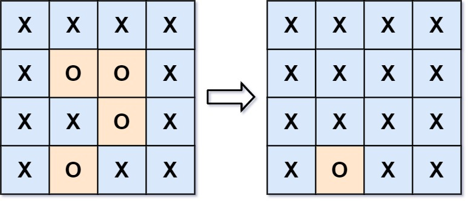

在上图中，底部的区域没有被捕获，因为它在 board 的边缘并且不能被围绕。

**示例 2：**

**输入：**board = [['X']]

**输出：**[['X']]

 

**提示：**

- `m == board.length`
- `n == board[i].length`
- `1 <= m, n <= 200`
- `board[i][j]` 为 `'X'` 或 `'O'`


#### 90.2 解法

**时间复杂度**：$O(M \times N)$，**空间复杂度**：$O(M \times N)$。

```cpp
#include <iostream>
#include <vector>

using namespace std;

class Solution {
   public:
    void solve(vector<vector<char>>& board) {
        if (board.empty()) return;
        int n = board.size(), m = board[0].size();

        for (int i = 0; i < n; i++) {
            if (board[i][0] == 'O') {
                DFS(board, i, 0, 'B');
            }
            if (board[i][m - 1] == 'O') {
                DFS(board, i, m - 1, 'B');
            }
        }

        for (int i = 0; i < m; i++) {
            if (board[0][i] == 'O') {
                DFS(board, 0, i, 'B');
            }
            if (board[n - 1][i] == 'O') {
                DFS(board, n - 1, i, 'B');
            }
        }

        for (int i = 0; i < n; i++) {
            for (int j = 0; j < m; j++) {
                if (board[i][j] == 'O') {
                    DFS(board, i, j, 'X');
                }
            }
        }

        for (int i = 0; i < n; i++) {
            for (int j = 0; j < m; j++) {
                if (board[i][j] == 'B') {
                    board[i][j] = 'O';
                }
            }
        }
    }

   private:
    void DFS(vector<vector<char>>& grid, int i, int j, char modify) {
        grid[i][j] = modify;

        if (i - 1 >= 0 && grid[i - 1][j] == 'O') DFS(grid, i - 1, j, modify);
        if (j - 1 >= 0 && grid[i][j - 1] == 'O') DFS(grid, i, j - 1, modify);
        if (i + 1 < grid.size() && grid[i + 1][j] == 'O') DFS(grid, i + 1, j, modify);
        if (j + 1 < grid[0].size() && grid[i][j + 1] == 'O') DFS(grid, i, j + 1, modify);
    }
};

int main() {
    ios::sync_with_stdio(false);
    cin.tie(nullptr);

    int n, m;
    if (!(cin >> n >> m)) return 0;
    if (n == 0 || m == 0) return 0;

    vector<vector<char>> board(n, vector<char>(m));
    for (int i = 0; i < n; i++) {
        for (int j = 0; j < m; j++) {
            cin >> board[i][j];
        }
    }

    Solution obj;
    obj.solve(board);

    for (int i = 0; i < n; i++) {
        for (int j = 0; j < m; j++) {
            cout << board[i][j] << " ";
        }
        cout << "\n";
    }

    return 0;
}
```

> 第三次循环，其实不需要再DFS 了，可以与第四次合并：
>
> ```cpp
> for (int i = 0; i < n; i++) {
>     for (int j = 0; j < m; j++) {
>         if (board[i][j] == 'O') {
>             board[i][j] = 'X'; // 内部必死，直接改
>         } else if (board[i][j] == 'B') {
>             board[i][j] = 'O'; // 边缘幸存，还原
>         }
>     }
> }
> ```


#### 90.3 解析

这次核心在于怎么判断有没有擦到边界，这里需要明白的一点是，假如要基于之前的解法，不可避免地面临实时修改与实时扫描的矛盾：还没扫完不能确定能不能改……所以必须做一种标记，标记扫过的节点，额外空间当然是一种思路，但是原地修改的话会更好。

此外，还有一种方法叫做**并查集**:

```cpp
#include <iostream>
#include <vector>

using namespace std;

class UnionFind {
private:
    vector<int> parent;
public:
    // 初始化数组的值就是index，也即各自的root都是自己，互不连通
    UnionFind(int n) {
        parent.resize(n);
        for (int i = 0; i < n; ++i) {
            parent[i] = i;
        }
    }

    // 递归找到最初的parent，类似于root
    int find(int i) {
        if (parent[i] != i) {
            parent[i] = find(parent[i]);
        }
        return parent[i];
    }

    //找i、j的root，如果不相同，就连接上，即parent[rootI] = rootJ
    void unite(int i, int j) {
        int rootI = find(i);
        int rootJ = find(j);
        if (rootI != rootJ) {
            parent[rootI] = rootJ;
        }
    }

    //看看root相不相同，如果相同必然联通，否则不连通。
    bool connected(int i, int j) {
        return find(i) == find(j);
    }
};

class Solution {
public:
    void solve(vector<vector<char>>& board) {
        if (board.empty() || board[0].empty()) return;
        
        int n = board.size();
        int m = board[0].size();
        
        //为每个节点都预留了空间
        UnionFind uf(n * m + 1);
        int dummy = n * m;
        
        for (int i = 0; i < n; ++i) {
            for (int j = 0; j < m; ++j) {
                if (board[i][j] == 'O') {
                    //边界的O默认全部链接进去，也就是和一个dummy链接，dummy是用来锚定边界O的，也就是说，如果最后和dummy同root的节点，那么一定是与边界O联通的
                    if (i == 0 || i == n - 1 || j == 0 || j == m - 1) {
                        uf.unite(i * m + j, dummy);
                    }
                    // 只看左边、上边（按遍历顺序）
                    if (i > 0 && board[i - 1][j] == 'O') {
                        uf.unite(i * m + j, (i - 1) * m + j);
                    }
                    if (j > 0 && board[i][j - 1] == 'O') {
                        uf.unite(i * m + j, i * m + (j - 1));
                    }
                }
            }
        }
        
        //同上述，如果不和dummy同root，那么就是独立的，直接X
        for (int i = 0; i < n; ++i) {
            for (int j = 0; j < m; ++j) {
                if (board[i][j] == 'O' && !uf.connected(i * m + j, dummy)) {
                    board[i][j] = 'X';
                }
            }
        }
    }
};
```


### 91. 克隆图*/**（@）

#### 91.1 题目

给你无向 **[连通](https://baike.baidu.com/item/连通图/6460995?fr=aladdin)** 图中一个节点的引用，请你返回该图的 [**深拷贝**](https://baike.baidu.com/item/深拷贝/22785317?fr=aladdin)（克隆）。

图中的每个节点都包含它的值 `val`（`int`） 和其邻居的列表（`list[Node]`）。

```
class Node {
    public int val;
    public List<Node> neighbors;
}
```

 

**测试用例格式：**

简单起见，每个节点的值都和它的索引相同。例如，第一个节点值为 1（`val = 1`），第二个节点值为 2（`val = 2`），以此类推。该图在测试用例中使用邻接列表表示。

**邻接列表** 是用于表示有限图的无序列表的集合。每个列表都描述了图中节点的邻居集。

给定节点将始终是图中的第一个节点（值为 1）。你必须将 **给定节点的拷贝** 作为对克隆图的引用返回。

 

**示例 1：**


```
输入：adjList = [[2,4],[1,3],[2,4],[1,3]]
输出：[[2,4],[1,3],[2,4],[1,3]]
解释：
图中有 4 个节点。
节点 1 的值是 1，它有两个邻居：节点 2 和 4 。
节点 2 的值是 2，它有两个邻居：节点 1 和 3 。
节点 3 的值是 3，它有两个邻居：节点 2 和 4 。
节点 4 的值是 4，它有两个邻居：节点 1 和 3 。
```

**示例 2：**


```
输入：adjList = [[]]
输出：[[]]
解释：输入包含一个空列表。该图仅仅只有一个值为 1 的节点，它没有任何邻居。
```

**示例 3：**

```
输入：adjList = []
输出：[]
解释：这个图是空的，它不含任何节点。
```

 

**提示：**

- 这张图中的节点数在 `[0, 100]` 之间。
- `1 <= Node.val <= 100`
- 每个节点值 `Node.val` 都是唯一的，
- 图中没有重复的边，也没有自环。
- 图是连通图，你可以从给定节点访问到所有节点。


#### 91.2 解法

**时间复杂度**：O(V + E)，**空间复杂度**：O(V)。

```cpp
#include <algorithm>
#include <iostream>
#include <queue>
#include <string>
#include <unordered_map>
#include <vector>

using namespace std;

class Node {
   public:
    int val;
    vector<Node*> neighbors;

    Node() {
        val = 0;
        neighbors = vector<Node*>();
    }
    Node(int _val) {
        val = _val;
        neighbors = vector<Node*>();
    }
    Node(int _val, vector<Node*> _neighbors) {
        val = _val;
        neighbors = _neighbors;
    }
};

class Solution {
   public:
    Node* cloneGraph(Node* node) {
        if (node == nullptr) return node;
        
        queue<Node*> neighbors;
        neighbors.push(node);
        node->val *= -1;

        unordered_map<Node*, Node*> old2new;
        while (!neighbors.empty()) {
            Node* curr = neighbors.front();
            neighbors.pop();

            Node* newCurr = new Node(-1 * curr->val);
            old2new[curr] = newCurr;

            for (auto neighbor : curr->neighbors) {
                if (neighbor->val > 0) {
                    neighbors.push(neighbor);
                    neighbor->val *= -1;
                }
            }
        }

        neighbors.push(node);
        node->val *= -1;
        while (!neighbors.empty()) {
            Node* curr = neighbors.front();
            neighbors.pop();

            for (auto neighbor : curr->neighbors) {
                old2new[curr]->neighbors.push_back(old2new[neighbor]);

                if (neighbor->val < 0) {
                    neighbors.push(neighbor);
                    neighbor->val *= -1;
                }
            }
        }

        return old2new[node];
    }
};

int main() {
    ios::sync_with_stdio(false);
    cin.tie(nullptr);

    int n;
    cin >> n;
    if (n == 0) return 0;

    vector<Node*> nodes(n);
    for (int i = 0; i < n; i++) {
        nodes[i] = new Node(i + 1);
    }

    for (int i = 0; i < n; i++) {
        int m;
        cin >> m;

        for (int j = 0; j < m; j++) {
            int index;
            cin >> index;

            nodes[i]->neighbors.push_back(nodes[index - 1]);
        }
    }

    Solution obj;
    Node* first = obj.cloneGraph(nodes[0]);

    queue<Node*> neighbors;
    neighbors.push(first);
    first->val *= -1;

    while (!neighbors.empty()) {
        Node* curr = neighbors.front();
        neighbors.pop();

        cout << -1 * curr->val << " ";

        for (auto node : curr->neighbors) {
            if (node->val > 0) {
                neighbors.push(node);
                node->val *= -1;
            }
        }
    }

    return 0;
}
```


#### 91.3 解法

做得有点麻烦了，实际上只需要一次遍历：要明白是否被遍历和是否被克隆实际上是等价的，所以两次遍历可以合并为一次：

```cpp
class Solution {
public:
    Node* cloneGraph(Node* node) {
        if (node == nullptr) return nullptr;

        unordered_map<Node*, Node*> cloned;
        queue<Node*> q;

        // 克隆起点，并放入队列和哈希表
        cloned[node] = new Node(node->val);
        q.push(node);

        while (!q.empty()) {
            Node* curr = q.front();
            q.pop();

            // 遍历当前节点的所有原邻居
            for (Node* neighbor : curr->neighbors) {
                // 如果邻居还没被克隆过<->邻居没有被访问过
                if (cloned.find(neighbor) == cloned.end()) {
                    cloned[neighbor] = new Node(neighbor->val);
                    q.push(neighbor);
                }
                // 无脑将邻居的克隆体，加入当前节点克隆体的邻居列表中
                cloned[curr]->neighbors.push_back(cloned[neighbor]);
            }
        }

        return cloned[node];
    }
};
```

此外还有递归的办法，也就是深度优先搜索：

```cpp
class Solution {
private:
    unordered_map<Node*, Node*> cloned;

public:
    Node* cloneGraph(Node* node) {
        if (node == nullptr) return nullptr;

        // 如果这个节点已经被克隆过，直接返回它的克隆体（这也就是 DFS 处理环的核心防线）
        if (cloned.find(node) != cloned.end()) {
            return cloned[node];
        }

        // 克隆当前节点，并立即存入哈希表（必须在递归邻居之前存入，否则遇到环会死循环）
        Node* cloneNode = new Node(node->val);
        cloned[node] = cloneNode;

        // 递归深搜邻居，将返回的克隆邻居塞进自己的邻居列表里
        for (Node* neighbor : node->neighbors) {
            cloneNode->neighbors.push_back(cloneGraph(neighbor));
        }

        return cloneNode;
    }
};
```


### 92. 除法求值**

#### 92.1 题目

给你一个变量对数组 `equations` 和一个实数值数组 `values` 作为已知条件，其中 `equations[i] = [Ai, Bi]` 和 `values[i]` 共同表示等式 `Ai / Bi = values[i]` 。每个 `Ai` 或 `Bi` 是一个表示单个变量的字符串。

另有一些以数组 `queries` 表示的问题，其中 `queries[j] = [Cj, Dj]` 表示第 `j` 个问题，请你根据已知条件找出 `Cj / Dj = ?` 的结果作为答案。

返回 **所有问题的答案** 。如果存在某个无法确定的答案，则用 `-1.0` 替代这个答案。如果问题中出现了给定的已知条件中没有出现的字符串，也需要用 `-1.0` 替代这个答案。

**注意：**输入总是有效的。你可以假设除法运算中不会出现除数为 0 的情况，且不存在任何矛盾的结果。

**注意：**未在等式列表中出现的变量是未定义的，因此无法确定它们的答案。

 

**示例 1：**

```
输入：equations = [["a","b"],["b","c"]], values = [2.0,3.0], queries = [["a","c"],["b","a"],["a","e"],["a","a"],["x","x"]]
输出：[6.00000,0.50000,-1.00000,1.00000,-1.00000]
解释：
条件：a / b = 2.0, b / c = 3.0
问题：a / c = ?, b / a = ?, a / e = ?, a / a = ?, x / x = ?
结果：[6.0, 0.5, -1.0, 1.0, -1.0 ]
注意：x 是未定义的 => -1.0
```

**示例 2：**

```
输入：equations = [["a","b"],["b","c"],["bc","cd"]], values = [1.5,2.5,5.0], queries = [["a","c"],["c","b"],["bc","cd"],["cd","bc"]]
输出：[3.75000,0.40000,5.00000,0.20000]
```

**示例 3：**

```
输入：equations = [["a","b"]], values = [0.5], queries = [["a","b"],["b","a"],["a","c"],["x","y"]]
输出：[0.50000,2.00000,-1.00000,-1.00000]
```

 

**提示：**

- `1 <= equations.length <= 20`
- `equations[i].length == 2`
- `1 <= Ai.length, Bi.length <= 5`
- `values.length == equations.length`
- `0.0 < values[i] <= 20.0`
- `1 <= queries.length <= 20`
- `queries[i].length == 2`
- `1 <= Cj.length, Dj.length <= 5`
- `Ai, Bi, Cj, Dj` 由小写英文字母与数字组成


#### 92.3 解法

**时间复杂度**：$O(N + Q \times (V + E))$，**空间复杂度**：$O(V + E)$。

```cpp
#include <algorithm>
#include <iostream>
#include <queue>
#include <string>
#include <unordered_map>
#include <unordered_set>
#include <vector>

using namespace std;

struct Node {
    string val;
    vector<pair<Node*, double>> neighbors;

    Node(string _val) : val(_val) { neighbors = vector<pair<Node*, double>>(); }
};

class Solution {
   private:
    unordered_map<string, Node*> build;
    unordered_set<Node*> visit;

   public:
    vector<double> calcEquation(vector<vector<string>>& equations, vector<double>& values,
                                vector<vector<string>>& queries) {
        build.clear();
        int n = equations.size();

        for (int i = 0; i < n; i++) {
            auto& eq = equations[i];

            if (!build.count(eq[0])) {
                build[eq[0]] = new Node(eq[0]);
            }
            if (!build.count(eq[1])) {
                build[eq[1]] = new Node(eq[1]);
            }

            build[eq[0]]->neighbors.push_back({build[eq[1]], values[i]});
            build[eq[1]]->neighbors.push_back({build[eq[0]], values[i] == 0 ? -1 : 1 / values[i]});
        }

        vector<double> res;
        for (auto& q : queries) {
            if (!build.count(q[0]) || !build.count(q[1])) {
                res.push_back(-1);
                continue;
            }
            if (q[0] == q[1]) {
                res.push_back(1);
                continue;
            }

            visit.clear();
            res.push_back(calculate(build[q[0]], q[1]));
        }

        return res;
    }

   private:
    double calculate(Node* st, string& ed) {
        visit.insert(st);

        for (auto neighbor : st->neighbors) {
            if (neighbor.first->val == ed) {
                return neighbor.second;
            }

            if (!visit.count(neighbor.first)) {
                double res = calculate(neighbor.first, ed);
                if (res != -1) return neighbor.second * res;
            }
        }

        return -1;
    }
};

int main() {
    ios::sync_with_stdio(false);
    cin.tie(nullptr);

    int n;
    cin >> n;
    vector<vector<string>> equations(n, vector<string>(2));
    vector<double> values(n);

    for (int i = 0; i < n; i++) {
        string e1, e2;
        double val;
        cin >> e1 >> e2 >> val;

        equations[i] = {e1, e2};
        values[i] = val;
    }

    int m;
    cin >> m;
    vector<vector<string>> queries(m, vector<string>(2));

    for (int i = 0; i < m; i++) {
        string q1, q2;
        cin >> q1 >> q2;

        queries[i] = {q1, q2};
    }

    Solution obj;
    vector<double> res = obj.calcEquation(equations, values, queries);

    for (auto val : res) {
        cout << val << " ";
    }

    return 0;
}
```

> 用`new`分配空间最后没有`delete`，然后其实可以不用定义图结构，直接用`string`代指即可：
>
> ```cpp
> // 直接用 string 替代 Node*，连结构体都不用写
> unordered_map<string, vector<pair<string, double>>> graph;
> ```


#### 92.3 解析

我这个解法慢一点，**带权并查集**会更快：

```cpp
class Solution {
private:
    // parent 记录：<当前节点字符串, 根节点字符串>
    unordered_map<string, string> parent;
    // weight 记录：当前节点 / 根节点 的比值
    unordered_map<string, double> weight;

    // 查：寻找根节点，并进行路径压缩更新权重
    string find(const string& x) {
        if (parent.find(x) == parent.end()) {
            parent[x] = x;
            weight[x] = 1.0;
        }
        
        if (parent[x] != x) {
            string originParent = parent[x];
            parent[x] = find(parent[x]); // 递归找最终的根
            // 路径压缩：当前节点到最终根的权重 = 原来自身到父节点的权重 * 父节点到最终根的权重
            weight[x] = weight[x] * weight[originParent];
        }
        return parent[x];
    }

    // 并：合并两个节点所在的集合
    void unite(const string& x, const string& y, double val) {
        string rootX = find(x);
        string rootY = find(y);
        
        if (rootX != rootY) {
            parent[rootX] = rootY;
            // 数学推导：x/y = val, x/rootX = weight[x], y/rootY = weight[y]
            // 因为 rootX 指向了 rootY，所以我们需要求 rootX/rootY
            // rootX / rootY = (x/y) * (y/rootY) / (x/rootX) = val * weight[y] / weight[x]
            weight[rootX] = val * weight[y] / weight[x];
        }
    }

public:
    vector<double> calcEquation(vector<vector<string>>& equations, vector<double>& values, vector<vector<string>>& queries) {
        // 1. 建图（合并集合）
        for (int i = 0; i < equations.size(); i++) {
            unite(equations[i][0], equations[i][1], values[i]);
        }

        vector<double> res;
        // 2. 查询
        for (const auto& q : queries) {
            const string& x = q[0];
            const string& y = q[1];

            // 如果有未知的变量，直接 -1
            if (parent.find(x) == parent.end() || parent.find(y) == parent.end()) {
                res.push_back(-1.0);
            } else {
                string rootX = find(x);
                string rootY = find(y);
                // 只有在同一个连通分量里（根相同）才能求出结果
                if (rootX == rootY) {
                    res.push_back(weight[x] / weight[y]);
                } else {
                    res.push_back(-1.0);
                }
            }
        }
        return res;
    }
};
```

这道题是一道很经典的并查集能解的题，首先是只有在同一连通分量才有解，而并查集中的查就是判断这一点的；其次，根据乘除法的递推关系，也很容易建立起基于根的乘除关系，可以很快计算得结果。

此外，之所以我的路径查找比并查集要慢，实际上是重复地查找了很多次某些路径；而并查集将这部分统一提出到并与查的过程中，即路径压缩与合并部分。


### 93. 课程表**（@）

#### 93.1 题目

你这个学期必须选修 `numCourses` 门课程，记为 `0` 到 `numCourses - 1` 。

在选修某些课程之前需要一些先修课程。 先修课程按数组 `prerequisites` 给出，其中 `prerequisites[i] = [ai, bi]` ，表示如果要学习课程 `ai` 则 **必须** 先学习课程 `bi` 。

- 例如，先修课程对 `[0, 1]` 表示：想要学习课程 `0` ，你需要先完成课程 `1` 。

请你判断是否可能完成所有课程的学习？如果可以，返回 `true` ；否则，返回 `false` 。

 

**示例 1：**

```
输入：numCourses = 2, prerequisites = [[1,0]]
输出：true
解释：总共有 2 门课程。学习课程 1 之前，你需要完成课程 0 。这是可能的。
```

**示例 2：**

```
输入：numCourses = 2, prerequisites = [[1,0],[0,1]]
输出：false
解释：总共有 2 门课程。学习课程 1 之前，你需要先完成课程 0 ；并且学习课程 0 之前，你还应先完成课程 1 。这是不可能的。
```

 

**提示：**

- `1 <= numCourses <= 2000`
- `0 <= prerequisites.length <= 5000`
- `prerequisites[i].length == 2`
- `0 <= ai, bi < numCourses`
- `prerequisites[i]` 中的所有课程对 **互不相同**


#### 93.2 解法

**时间复杂度**：$O(V + E)$，**空间复杂度**：$O(V + E)$。

```cpp
#include <algorithm>
#include <iostream>
#include <queue>
#include <string>
#include <unordered_map>
#include <vector>

using namespace std;

class Solution {
   private:
    unordered_map<int, vector<int>> graph;

   public:
    bool canFinish(int numCourses, vector<vector<int>>& prerequisites) {
        graph.clear();
        for (int i = 0; i < numCourses; i++) {
            graph[i] = vector<int>();
        }

        for (auto& pre : prerequisites) {
            graph[pre[0]].push_back(pre[1]);
        }

        vector<int> state(numCourses, 0);
        for (int i = 0; i < numCourses; i++) {
            if (state[i] == 0) {
                if (!checkCirc(state, i)) return false;
            }
        }

        return true;
    }

   private:
    bool checkCirc(vector<int>& state, int node) {
        state[node] = 1;

        for (auto neighbor : graph[node]) {
            if (state[neighbor] == 1) {
                return false;
            }
            if (state[neighbor] == 0) {
                if (!checkCirc(state, neighbor)) return false;
            }
        }

        state[node] = 2;
        return true;
    }
};

int main() {
    ios::sync_with_stdio(false);
    cin.tie(nullptr);

    int n, numCourses;
    cin >> n >> numCourses;

    vector<vector<int>> prerequisites(n, vector<int>(2));
    for (int i = 0; i < n; i++) {
        cin >> prerequisites[i][0] >> prerequisites[i][1];
    }

    Solution obj;
    cout << (obj.canFinish(n, prerequisites) ? "true" : "false");

    return 0;
}
```

> 其实没必要用`unordered_map`……

#### 93.3 解析

我的办法是三色标记法，一般的访问标记只能标记有没有去过，这样会导致一些情况被误判：`0->1`，`2->1`；而三色标记法多了一种状态，用来表示是否是同路径上的再次相遇：用一个 `vector<int> state` 数组，定义三种状态：

- `0`：未访问；
- `1`：正在访问，也就是在当前的 DFS 路径/栈中；
- `2`：已完全访问，它的所有邻居都查过了，确认没有环，以后谁再访问到它，直接放行。

此外，这类找环的问题，还有一种比较好的BFS方法，即**BFS 拓扑排序（Kahn 算法）**，其核心在于模拟真是上课场景，看看能不能真的上完：先把入度为零的节点入队，也就是先上这些课程，上完后把以其为依赖的课的入度都减1，如果有新的入度为0的课，也入队，最后遍历完成后，看有几个入度为0的课程……

```cpp
#include <vector>
#include <queue>

using namespace std;

class Solution {
public:
    bool canFinish(int numCourses, vector<vector<int>>& prerequisites) {
        vector<vector<int>> graph(numCourses);
        vector<int> inDegree(numCourses, 0);

        for (const auto& pre : prerequisites) {
            graph[pre[1]].push_back(pre[0]);
            inDegree[pre[0]]++;
        }

        queue<int> q;
        for (int i = 0; i < numCourses; ++i) {
            if (inDegree[i] == 0) {
                q.push(i);
            }
        }

        int count = 0;
        while (!q.empty()) {
            int curr = q.front();
            q.pop();
            count++;

            for (int neighbor : graph[curr]) {
                inDegree[neighbor]--;
                if (inDegree[neighbor] == 0) {
                    q.push(neighbor);
                }
            }
        }

        return count == numCourses;
    }
};
```


### 94. 课程表II*

#### 94.1 题目

现在你总共有 `numCourses` 门课需要选，记为 `0` 到 `numCourses - 1`。给你一个数组 `prerequisites` ，其中 `prerequisites[i] = [ai, bi]` ，表示在选修课程 `ai` 前 **必须** 先选修 `bi` 。

- 例如，想要学习课程 `0` ，你需要先完成课程 `1` ，我们用一个匹配来表示：`[0,1]` 。

返回你为了学完所有课程所安排的学习顺序。可能会有多个正确的顺序，你只要返回 **任意一种** 就可以了。如果不可能完成所有课程，返回 **一个空数组** 。

 

**示例 1：**

```
输入：numCourses = 2, prerequisites = [[1,0]]
输出：[0,1]
解释：总共有 2 门课程。要学习课程 1，你需要先完成课程 0。因此，正确的课程顺序为 [0,1] 。
```

**示例 2：**

```
输入：numCourses = 4, prerequisites = [[1,0],[2,0],[3,1],[3,2]]
输出：[0,2,1,3]
解释：总共有 4 门课程。要学习课程 3，你应该先完成课程 1 和课程 2。并且课程 1 和课程 2 都应该排在课程 0 之后。
因此，一个正确的课程顺序是 [0,1,2,3] 。另一个正确的排序是 [0,2,1,3] 。
```

**示例 3：**

```
输入：numCourses = 1, prerequisites = []
输出：[0]
```

 

**提示：**

- `1 <= numCourses <= 2000`
- `0 <= prerequisites.length <= numCourses * (numCourses - 1)`
- `prerequisites[i].length == 2`
- `0 <= ai, bi < numCourses`
- `ai != bi`
- 所有`[ai, bi]` **互不相同**


#### 94.2 解法

**时间复杂度**：$O(V + E)$，**空间复杂度**：$O(V + E)$。

```cpp
class Solution {
   public:
    vector<int> findOrder(int numCourses, vector<vector<int>>& prerequisites) {
        vector<vector<int>> baseCourse(numCourses);
        vector<int> inDegree(numCourses, 0);
        vector<int> res;

        for (auto& pre : prerequisites) {
            baseCourse[pre[1]].push_back(pre[0]);
            inDegree[pre[0]]++;
        }

        queue<int> course;
        for (int i = 0; i < numCourses; i++) {
            if (inDegree[i] == 0) {
                course.push(i);
            }
        }

        int count = 0;
        while (!course.empty()) {
            int curr = course.front();
            course.pop();
            res.push_back(curr);
            count++;

            for (int x : baseCourse[curr]) {
                inDegree[x]--;
                if (inDegree[x] == 0) {
                    course.push(x);
                }
            }
        }

        return count == numCourses ? res : vector<int>();
    }
};
```

> `count`没什么必要了


#### 94.3 解析

这题就是延续上一题的BFS的思路做的，此外三色排序也能做：

```cpp
#include <vector>
#include <algorithm>

using namespace std;

class Solution {
private:
    vector<vector<int>> graph;
    vector<int> state;
    vector<int> res;
    bool valid = true;

public:
    vector<int> findOrder(int numCourses, vector<vector<int>>& prerequisites) {
        graph.resize(numCourses);
        state.assign(numCourses, 0);
        
        for (const auto& pre : prerequisites) {
            graph[pre[1]].push_back(pre[0]);
        }

        for (int i = 0; i < numCourses && valid; i++) {
            if (state[i] == 0) {
                dfs(i);
            }
        }

        if (!valid) return {};

        reverse(res.begin(), res.end());
        return res;
    }

private:
    void dfs(int u) {
        state[u] = 1;
        for (int v : graph[u]) {
            if (state[v] == 0) {
                dfs(v);
                if (!valid) return;
            } else if (state[v] == 1) {
                valid = false;
                return;
            }
        }
        state[u] = 2;
        res.push_back(u);
    }
};
```

这里面一个核心的改动就是在状态为2的时候加入，然后最后反转一下数组就行。当为2时，它一定就是最后的那个课程，也就是越深的递归越先结束，这个比较好理解。


### 95. 蛇梯棋**

#### 95.1 题目

给你一个大小为 `n x n` 的整数矩阵 `board` ，方格按从 `1` 到 `n2` 编号，编号遵循 [转行交替方式](https://baike.baidu.com/item/牛耕式转行书写法/17195786) ，**从左下角开始** （即，从 `board[n - 1][0]` 开始）的每一行改变方向。

你一开始位于棋盘上的方格 `1`。每一回合，玩家需要从当前方格 `curr` 开始出发，按下述要求前进：

- 选定目标方格 `next` ，目标方格的编号在范围 `[curr + 1, min(curr + 6, n2)]` 。
  - 该选择模拟了掷 **六面体骰子** 的情景，无论棋盘大小如何，玩家最多只能有 6 个目的地。
- 传送玩家：如果目标方格 `next` 处存在蛇或梯子，那么玩家会传送到蛇或梯子的目的地。否则，玩家传送到目标方格 `next` 。 
- 当玩家到达编号 `n2` 的方格时，游戏结束。

如果 `board[r][c] != -1` ，位于 `r` 行 `c` 列的棋盘格中可能存在 “蛇” 或 “梯子”。那个蛇或梯子的目的地将会是 `board[r][c]`。编号为 `1` 和 `n2` 的方格不是任何蛇或梯子的起点。

注意，玩家在每次掷骰的前进过程中最多只能爬过蛇或梯子一次：就算目的地是另一条蛇或梯子的起点，玩家也 **不能** 继续移动。

- 举个例子，假设棋盘是 `[[-1,4],[-1,3]]` ，第一次移动，玩家的目标方格是 `2` 。那么这个玩家将会顺着梯子到达方格 `3` ，但 **不能** 顺着方格 `3` 上的梯子前往方格 `4` 。（简单来说，类似飞行棋，玩家掷出骰子点数后移动对应格数，遇到单向的路径（即梯子或蛇）可以直接跳到路径的终点，但如果多个路径首尾相连，也不能连续跳多个路径）

返回达到编号为 `n2` 的方格所需的最少掷骰次数，如果不可能，则返回 `-1`。

 

**示例 1：**


```
输入：board = [[-1,-1,-1,-1,-1,-1],[-1,-1,-1,-1,-1,-1],[-1,-1,-1,-1,-1,-1],[-1,35,-1,-1,13,-1],[-1,-1,-1,-1,-1,-1],[-1,15,-1,-1,-1,-1]]
输出：4
解释：
首先，从方格 1 [第 5 行，第 0 列] 开始。 
先决定移动到方格 2 ，并必须爬过梯子移动到到方格 15 。
然后决定移动到方格 17 [第 3 行，第 4 列]，必须爬过蛇到方格 13 。
接着决定移动到方格 14 ，且必须通过梯子移动到方格 35 。 
最后决定移动到方格 36 , 游戏结束。 
可以证明需要至少 4 次移动才能到达最后一个方格，所以答案是 4 。 
```

**示例 2：**

```
输入：board = [[-1,-1],[-1,3]]
输出：1
```

 

**提示：**

- `n == board.length == board[i].length`
- `2 <= n <= 20`
- `board[i][j]` 的值是 `-1` 或在范围 `[1, n2]` 内
- 编号为 `1` 和 `n2` 的方格上没有蛇或梯子


#### 95.2 解法

时间复杂度：$(O(N^2) , O(6^{N^2}) )$，空间复杂度：$O(N^2)$。

```cpp
#include <iostream>
#include <vector>
#include <algorithm>
#include <climits>

using namespace std;

class Solution {
private:
    int minTimes;
    int n;
public:
    int snakesAndLadders(vector<vector<int>>& board) {
        minTimes = INT_MAX;
        n = board.size();
        vector<int> visited(n * n + 1, INT_MAX);
        
        move(board, 0, 1, visited);
        
        return (minTimes == INT_MAX ? -1 : minTimes);
    }
private:
    void move(vector<vector<int>>& board, int times, int pos, vector<int>& visited) {
        if (times >= minTimes) return;
        
        if (times >= visited[pos]) return;
        visited[pos] = times;
        
        if (pos == n * n) {
            minTimes = times;
            return;
        }
        
        for (int i = 1; i <= 6; i++) {
            int nextPos = pos + i;
            if (nextPos > n * n) break;
            
            int r = n - 1 - (nextPos - 1) / n;
            int c = ((nextPos - 1) / n) % 2 == 0 ? (nextPos - 1) % n : n - 1 - (nextPos - 1) % n;
            
            int dest = (board[r][c] == -1 ? nextPos : board[r][c]);
            
            move(board, times + 1, dest, visited);
        }
    }
};

int main() {
    ios::sync_with_stdio(false);
    cin.tie(nullptr);

    int n;
    if (!(cin >> n)) return 0;
    if (n == 0) return 0;

    vector<vector<int>> board(n, vector<int>(n));
    for (int i = 0; i < n; i++) {
        for (int j = 0; j < n; j++) {
            cin >> board[i][j];
        }
    }

    Solution obj;
    cout << obj.snakesAndLadders(board) << "\n";

    return 0;
}
```


#### 95.3 解析

这种无权图最短路径问题，我的DFS解法效果是很差的，虽然在剪枝上下了不少功夫，但是依旧可能因为数据较差而使得时间复杂度飙升。这种题目最好的做法其实是BFS，其一个核心特点是：**首次到达的情况就是最少次数的情况**。

```cpp
class Solution {
public:
    int snakesAndLadders(vector<vector<int>>& board) {
        int n = board.size();
        // visited 数组退化为最简单的 bool 数组，因为 BFS 第一次访问必定是最短步数
        vector<bool> visited(n * n + 1, false); 
        queue<pair<int, int>> q; // <当前位置, 掷骰子次数>
        
        q.push({1, 0});
        visited[1] = true;
        
        while (!q.empty()) {
            auto [curr, step] = q.front();
            q.pop();
            
            if (curr == n * n) return step;
            
            // 模拟掷骰子 1-6
            for (int i = 1; i <= 6; ++i) {
                int next = curr + i;
                if (next > n * n) break;
                
                int r = n - 1 - (next - 1) / n;
                int c = ((next - 1) / n) % 2 == 0 ? (next - 1) % n : n - 1 - (next - 1) % n;  
                int dest = board[r][c] != -1 ? board[r][c] : next;
                
                // 只要没访问过，现在到达的步数就是最优的
                if (!visited[dest]) {
                    visited[dest] = true;
                    q.push({dest, step + 1});
                }
            }
        }
        
        return -1;
    }
};
```


### 96. 最小基因变化**

#### 96.1 题目

基因序列可以表示为一条由 8 个字符组成的字符串，其中每个字符都是 `'A'`、`'C'`、`'G'` 和 `'T'` 之一。

假设我们需要调查从基因序列 `start` 变为 `end` 所发生的基因变化。一次基因变化就意味着这个基因序列中的一个字符发生了变化。

- 例如，`"AACCGGTT" --> "AACCGGTA"` 就是一次基因变化。

另有一个基因库 `bank` 记录了所有有效的基因变化，只有基因库中的基因才是有效的基因序列。（变化后的基因必须位于基因库 `bank` 中）

给你两个基因序列 `start` 和 `end` ，以及一个基因库 `bank` ，请你找出并返回能够使 `start` 变化为 `end` 所需的最少变化次数。如果无法完成此基因变化，返回 `-1` 。

注意：起始基因序列 `start` 默认是有效的，但是它并不一定会出现在基因库中。

 

**示例 1：**

```
输入：start = "AACCGGTT", end = "AACCGGTA", bank = ["AACCGGTA"]
输出：1
```

**示例 2：**

```
输入：start = "AACCGGTT", end = "AAACGGTA", bank = ["AACCGGTA","AACCGCTA","AAACGGTA"]
输出：2
```

**示例 3：**

```
输入：start = "AAAAACCC", end = "AACCCCCC", bank = ["AAAACCCC","AAACCCCC","AACCCCCC"]
输出：3
```

 

**提示：**

- `start.length == 8`
- `end.length == 8`
- `0 <= bank.length <= 10`
- `bank[i].length == 8`
- `start`、`end` 和 `bank[i]` 仅由字符 `['A', 'C', 'G', 'T']` 组成


#### 96.2 解法

**时间复杂度**：$O(N^2 \cdot L)$，**空间复杂度**：$O(N \cdot L)$。

```cpp
#include <algorithm>
#include <iostream>
#include <queue>
#include <string>
#include <unordered_map>
#include <unordered_set>
#include <vector>

using namespace std;

class Solution {
   public:
    int minMutation(string startGene, string endGene, vector<string>& bank) {
        unordered_set<string> visited;
        queue<pair<string, int>> q;

        q.push({startGene, 0});
        visited.insert(startGene);

        while (!q.empty()) {
            auto [curr, step] = q.front();
            q.pop();

            if (curr == endGene) return step;

            for (string& gene : bank) {
                if (!visited.count(gene) && isCanConvert(curr, gene)) {
                    visited.insert(gene);
                    q.push({gene, step + 1});
                }
            }
        }

        return -1;
    }

   private:
    bool isCanConvert(string st, string ed) {
        bool times = false;
        for (int i = 0; i < 8; i++) {
            if (st[i] != ed[i]) {
                if (times) return false;
                times = true;
            }
        }

        return times;
    }
};

int main() {
    ios::sync_with_stdio(false);
    cin.tie(nullptr);

    string start, end;
    int n;
    cin >> n >> start >> end;

    vector<string> bank(n);
    for (int i = 0; i < n; i++) {
        cin >> bank[i];
    }

    Solution obj;
    cout << obj.minMutation(start, end, bank);

    return 0;
}
```

> `isCanConvert`那里应该用引用的：
>
> ```cpp
> bool isCanConvert(const string& st, const string& ed)
> ```


#### 96.3 解析

如果`bank`特别大，那么每一次拓展都要搜索一遍，开销就很大了。而本题里由于L长度定为8，每个位置最多有3种变化，那么一共就是24种情况，这时候可以把bank哈希化，然后遍历24种所有可能的变化去匹配：

```cpp
class Solution {
public:
    int minMutation(string startGene, string endGene, vector<string>& bank) {
        unordered_set<string> dict(bank.begin(), bank.end());
        if (!dict.count(endGene)) return -1;
        
        unordered_set<string> visited;
        queue<pair<string, int>> q;
        
        q.push({startGene, 0});
        visited.insert(startGene);
        
        char mutates[4] = {'A', 'C', 'G', 'T'};
        
        while (!q.empty()) {
            auto [curr, step] = q.front();
            q.pop();
            
            if (curr == endGene) return step;
            
            // 核心转变：不再遍历 bank，而是遍历 24 种突变可能
            for (int i = 0; i < 8; i++) {
                char originalChar = curr[i];
                for (char c : mutates) {
                    if (c == originalChar) continue;
                    
                    curr[i] = c; // 原地突变
                    if (dict.count(curr) && !visited.count(curr)) {
                        visited.insert(curr);
                        q.push({curr, step + 1});
                    }
                }
                curr[i] = originalChar; // 回溯复原，供下个位置突变
            }
        }
        return -1;
    }
};
```

这样时间复杂度就变成了$O(N \cdot 24 \cdot L)$，当然LeetCode里面限制了bank的长度一定小于10，所以这个优化有点鸡肋。

此外，还有一种办法，就是双向的BFS：

```cpp
class Solution {
public:
    int minMutation(string startGene, string endGene, vector<string>& bank) {
        unordered_set<string> dict(bank.begin(), bank.end());
        if (!dict.count(endGene)) return -1;

        unordered_set<string> beginSet, endSet, visited;
        beginSet.insert(startGene);
        endSet.insert(endGene);
        
        int step = 0;
        char mutates[4] = {'A', 'C', 'G', 'T'};

        while (!beginSet.empty() && !endSet.empty()) {
            // 优先扩展节点数较少的那个集合
            if (beginSet.size() > endSet.size()) {
                swap(beginSet, endSet);
            }

            unordered_set<string> nextSet; // 存储下一层的节点
            
            for (string curr : beginSet) {
                for (int i = 0; i < 8; i++) {
                    char originalChar = curr[i];
                    for (char c : mutates) {
                        if (c == originalChar) continue;
                        
                        curr[i] = c;
                        
                        // 如果在另一端的扩展圈里找到了，即相交，结束
                        if (endSet.count(curr)) {
                            return step + 1;
                        }
                        
                        if (dict.count(curr) && !visited.count(curr)) {
                            visited.insert(curr);
                            nextSet.insert(curr);
                        }
                    }
                    curr[i] = originalChar;
                }
            }
            
            beginSet = nextSet;
            step++;
        }

        return -1;
    }
};
```


### 97. 单词接龙*

#### 97.1 题目

字典 `wordList` 中从单词 `beginWord` 到 `endWord` 的 **转换序列** 是一个按下述规格形成的序列 `beginWord -> s1 -> s2 -> ... -> sk`：

- 每一对相邻的单词只差一个字母。
-  对于 `1 <= i <= k` 时，每个 `si` 都在 `wordList` 中。注意， `beginWord` 不需要在 `wordList` 中。
- `sk == endWord`

给你两个单词 `beginWord` 和 `endWord` 和一个字典 `wordList` ，返回 *从 `beginWord` 到 `endWord` 的 **最短转换序列** 中的 **单词数目*** 。如果不存在这样的转换序列，返回 `0` 。

 

**示例 1：**

```
输入：beginWord = "hit", endWord = "cog", wordList = ["hot","dot","dog","lot","log","cog"]
输出：5
解释：一个最短转换序列是 "hit" -> "hot" -> "dot" -> "dog" -> "cog", 返回它的长度 5。
```

**示例 2：**

```
输入：beginWord = "hit", endWord = "cog", wordList = ["hot","dot","dog","lot","log"]
输出：0
解释：endWord "cog" 不在字典中，所以无法进行转换。
```

 

**提示：**

- `1 <= beginWord.length <= 10`
- `endWord.length == beginWord.length`
- `1 <= wordList.length <= 5000`
- `wordList[i].length == beginWord.length`
- `beginWord`、`endWord` 和 `wordList[i]` 由小写英文字母组成
- `beginWord != endWord`
- `wordList` 中的所有字符串 **互不相同**


#### 97.2 解法

**时间复杂度**：$O(N \cdot 26 \cdot L^2)$，**空间复杂度**：$O(N \cdot L)$。

```cpp
#include <iostream>
#include <queue>
#include <string>
#include <unordered_map>
#include <vector>

using namespace std;

class Solution {
   public:
    int ladderLength(string beginWord, string endWord, vector<string>& wordList) {
        unordered_map<string, int> wordMap;
        for (string& word : wordList) {
            wordMap[word] = 0;
        }

        queue<pair<string, int>> q;
        int n = beginWord.size();

        q.push({beginWord, 0});
        while (!q.empty()) {
            auto [curr, step] = q.front();
            q.pop();
            // cout << curr << ": ";

            if (curr == endWord) return step + 1;

            for (int i = 0; i < n; i++) {
                char ori = curr[i];
                for (int j = 0; j < 26; j++) {
                    if (ori == 'a' + j) continue;
                    curr[i] = 'a' + j;

                    if (wordMap.count(curr) && wordMap[curr] == 0) {
                        // cout << curr << " ";
                        wordMap[curr]++;
                        q.push({curr, step + 1});
                    }
                }
                curr[i] = ori;
            }
            // cout << endl;
        }

        // cout << endl;
        return 0;
    }
};

int main() {
    ios::sync_with_stdio(false);
    cin.tie(nullptr);

    string beginWord, endWord;
    if (!(cin >> beginWord >> endWord)) return 0;

    int n;
    if (!(cin >> n)) return 0;

    vector<string> wordList(n);
    for (int i = 0; i < n; i++) {
        cin >> wordList[i];
    }

    Solution obj;
    cout << obj.ladderLength(beginWord, endWord, wordList) << "\n";

    return 0;
}
```

> 可以用`unordered_set`代替，如果访问过就删除即可，这样也能有三种标记。

#### 97.3 解析

同样地，也能双向BFS：

```cpp
#include <unordered_set>
#include <vector>
#include <string>

using namespace std;

class Solution {
public:
    int ladderLength(string beginWord, string endWord, vector<string>& wordList) {
        unordered_set<string> dict(wordList.begin(), wordList.end());
        if (!dict.count(endWord)) return 0; // 终点不在字典里，直接判死刑

        unordered_set<string> beginSet{beginWord};
        unordered_set<string> endSet{endWord};
        int step = 1;

        while (!beginSet.empty() && !endSet.empty()) {
            // 极限剪枝优化：永远优先扩展规模较小的那个集合
            if (beginSet.size() > endSet.size()) {
                swap(beginSet, endSet);
            }

            unordered_set<string> nextSet; // 收集下一层挖掘到的新节点
            
            for (string word : beginSet) {
                for (int i = 0; i < word.size(); i++) {
                    char originalChar = word[i];
                    
                    for (int j = 0; j < 26; j++) {
                        if (originalChar == 'a' + j) continue;
                        word[i] = 'a' + j;
                        
                        // 神来之笔：如果我刚挖出的一步，正好在对面队伍的集合里
                        // 说明两支队伍胜利会师，直接返回总步数！
                        if (endSet.count(word)) {
                            return step + 1;
                        }
                        
                        // 如果是个合法的新节点
                        if (dict.count(word)) {
                            nextSet.insert(word);
                            dict.erase(word); // 用完就删，极致压榨空间并防止回头路
                        }
                    }
                    word[i] = originalChar; // 回溯
                }
            }
            
            // 队伍推进：把下一层变成当前层
            beginSet = nextSet;
            step++;
        }

        return 0;
    }
};
```


## 十一、字典树

### 98. 实现前缀树***

#### 98.1 题目

**[Trie](https://baike.baidu.com/item/字典树/9825209?fr=aladdin)**（发音类似 "try"）或者说 **前缀树** 是一种树形数据结构，用于高效地存储和检索字符串数据集中的键。这一数据结构有相当多的应用情景，例如自动补全和拼写检查。

请你实现 Trie 类：

- `Trie()` 初始化前缀树对象。
- `void insert(String word)` 向前缀树中插入字符串 `word` 。
- `boolean search(String word)` 如果字符串 `word` 在前缀树中，返回 `true`（即，在检索之前已经插入）；否则，返回 `false` 。
- `boolean startsWith(String prefix)` 如果之前已经插入的字符串 `word` 的前缀之一为 `prefix` ，返回 `true` ；否则，返回 `false` 。

 

**示例：**

```
输入
["Trie", "insert", "search", "search", "startsWith", "insert", "search"]
[[], ["apple"], ["apple"], ["app"], ["app"], ["app"], ["app"]]
输出
[null, null, true, false, true, null, true]

解释
Trie trie = new Trie();
trie.insert("apple");
trie.search("apple");   // 返回 True
trie.search("app");     // 返回 False
trie.startsWith("app"); // 返回 True
trie.insert("app");
trie.search("app");     // 返回 True
```

 

**提示：**

- `1 <= word.length, prefix.length <= 2000`
- `word` 和 `prefix` 仅由小写英文字母组成
- `insert`、`search` 和 `startsWith` 调用次数 **总计** 不超过 `3 * 104` 次


#### 98.2 解法


```cpp
#include <algorithm>
#include <iostream>
#include <queue>
#include <string>
#include <unordered_map>
#include <vector>

using namespace std;

struct Node {
    string val;
    vector<Node*> children;

    Node(string _val) : val(_val) { children = vector<Node*>(); }
};

class Trie {
   private:
    Node* root;

    int isContain(string& pre, string& word) {
        int n = pre.size(), m = word.size();

        for (int i = 0; i < n; i++) {
            if (i == m) return -m;

            if (pre[i] != word[i]) {
                return i;
            }
        }

        return n;
    }

   public:
    Trie() { root = new Node(""); }

    void insert(string word) {
        Node* curr = root;
        while (true) {
            if (curr->children.empty()) {
                curr->children.push_back(new Node(word));
                if (curr->val != "") curr->children.push_back(new Node(curr->val));
                return;
            }

            int basePre = isContain(curr->val, word);
            bool isContinue = false;
            for (int i = 0; i < curr->children.size(); i++) {
                auto& node = curr->children[i];
                int res = isContain(node->val, word);
                /* 这里res的取值必须确定一下：
                首先要知道的是，进入到这一层之后，node->val.size()是一定大于或等于curr->val.size()的，也即大于或等于basePre。
                1. 如果word比curr要短，那么它不可能进入到这一层；
                2. 如果word和curr等长，那么它在进来之前，就已经pushback了；
                3. 那么word一定比curr长，这时：（res > basePre 防止往叶子节点上加，并且不匹配前缀同curr者）
                    1. word是node的前缀但不相等（res < 0）：把word插入到curr与node之间，并额外并入word作为叶子；
                    2. node是word的前缀（res == node->val.size()）：
                        1. 如果node和word相等（res ==
                word.size()）：找node的孩子，如果之前有过word，那么其孩子一定还有一个与word相等的，否则添加；
                        2. 如果node和word不相等，那就是纯前缀，进入到下一层。
                    3. node和word有共同前缀：就拆分。
                 */
                if (res < 0) {
                    Node* tempNode = node;
                    swap(node, curr->children.back());
                    curr->children.pop_back();
                    curr->children.push_back(new Node(word));
                    curr->children.back()->children.push_back(tempNode);
                    curr->children.back()->children.push_back(new Node(word));
                    return;
                } else if (res > basePre) {
                    if (res < node->val.size()) {
                        string prefix = word.substr(0, res);
                        Node* tempNode = node;
                        swap(node, curr->children.back());
                        curr->children.pop_back();
                        curr->children.push_back(new Node(prefix));
                        curr->children.back()->children.push_back(tempNode);
                        curr->children.back()->children.push_back(new Node(word));
                        return;
                    } else {
                        if (res < word.size()) {
                            curr = node;
                            isContinue = true;
                            break;
                        } else {
                            for (auto subNode : node->children) {
                                if (subNode->val == word) {
                                    return;
                                }
                            }
                            node->children.push_back(new Node(word));
                        }
                    }
                }
            }
            if (isContinue) continue;

            curr->children.push_back(new Node(word));
            return;
        }
    }

    bool search(string word) {
        Node* curr = root;
        while (true) {
            int basePre = isContain(curr->val, word);
            bool isContinue = false;
            for (auto node : curr->children) {
                int res = isContain(node->val, word);
                if (res > basePre) {
                    if (res == node->val.size()) {
                        if (res < word.size()) {
                            curr = node;
                            isContinue = true;
                            break;
                        } else {
                            if (node->children.empty()) return true;

                            for (auto subNode : node->children) {
                                if (subNode->val == word) {
                                    return true;
                                }
                            }

                            return false;
                        }
                    }
                }
            }
            if (isContinue) continue;

            return false;
        }
        return false;
    }

    bool startsWith(string prefix) {
        Node* curr = root;
        while (true) {
            bool isContinue = false;
            for (auto node : curr->children) {
                int res = isContain(node->val, prefix);
                if (res < 0) {
                    return true;
                } else if (res == node->val.size()) {
                    if (res == prefix.size() && node->children.empty()) {
                        return true;
                    } else {
                        curr = node;
                        isContinue = true;
                        break;
                    }
                }
            }
            if (isContinue) continue;

            return false;
        }

        return false;
    }
};

int main() {
    ios::sync_with_stdio(false);
    cin.tie(nullptr);

    Trie trie;
    trie.insert("axy");
    trie.insert("ax");
    cout << trie.search("axy");

    return 0;
}
```

> 这个版本是自己写的，但是没有通过。改了很多遍了，目前这一版算是表述比较清晰的一版，乍一看实在是看不出什么问题，不过注释可能有点过时，但也不想改了。


#### 98.3 解析

做了很久，还是没做出来，有一个用例大概是11000步，过了6139步，因为树实在是太复杂了，无法得知到底是哪里的问题，留作悬案了。

因为只是小写字母，所以这个树可以一个个字母那样弄，这样简单很多，参考解法：

```cpp
#include <string>
#include <vector>

using namespace std;

class Trie {
private:
    struct Node {
        bool isEnd; // 标记是否是一个完整单词的结尾
        Node* children[26]; // 26个字母的槽位，空则为 nullptr

        Node() {
            isEnd = false;
            for (int i = 0; i < 26; i++) {
                children[i] = nullptr;
            }
        }
    };

    Node* root;

public:
    Trie() {
        root = new Node();
    }
    
    void insert(string word) {
        Node* curr = root;
        for (char c : word) {
            int index = c - 'a';
            // 如果这条路上没有这个字母，新建一个节点
            if (curr->children[index] == nullptr) {
                curr->children[index] = new Node();
            }
            // 顺着这条路往下走
            curr = curr->children[index];
        }
        // 单词的所有字母都走完了，打上完结标记
        curr->isEnd = true;
    }
    
    bool search(string word) {
        Node* curr = root;
        for (char c : word) {
            int index = c - 'a';
            // 如果路断了，说明字典里没有这个词
            if (curr->children[index] == nullptr) {
                return false;
            }
            curr = curr->children[index];
        }
        // 词是走完了，但它必须是一个被标记过结尾的完整单词（比如查 app，虽然路通了，但如果只有 apple，app 的 isEnd 就是 false）
        return curr->isEnd;
    }
    
    bool startsWith(string prefix) {
        Node* curr = root;
        for (char c : prefix) {
            int index = c - 'a';
            // 如果前缀的路断了，直接 return false
            if (curr->children[index] == nullptr) {
                return false;
            }
            curr = curr->children[index];
        }
        // 只要前缀能顺利走完，哪怕没有 isEnd 标记，也是合法的
        return true;
    }
};
```


### 99. 添加与搜索单词-数据结构设计*

#### 99.1 题目

请你设计一个数据结构，支持 添加新单词 和 查找字符串是否与任何先前添加的字符串匹配 。

实现词典类 `WordDictionary` ：

- `WordDictionary()` 初始化词典对象
- `void addWord(word)` 将 `word` 添加到数据结构中，之后可以对它进行匹配
- `bool search(word)` 如果数据结构中存在字符串与 `word` 匹配，则返回 `true` ；否则，返回 `false` 。`word` 中可能包含一些 `'.'` ，每个 `.` 都可以表示任何一个字母。

 

**示例：**

```
输入：
["WordDictionary","addWord","addWord","addWord","search","search","search","search"]
[[],["bad"],["dad"],["mad"],["pad"],["bad"],[".ad"],["b.."]]
输出：
[null,null,null,null,false,true,true,true]

解释：
WordDictionary wordDictionary = new WordDictionary();
wordDictionary.addWord("bad");
wordDictionary.addWord("dad");
wordDictionary.addWord("mad");
wordDictionary.search("pad"); // 返回 False
wordDictionary.search("bad"); // 返回 True
wordDictionary.search(".ad"); // 返回 True
wordDictionary.search("b.."); // 返回 True
```

 

**提示：**

- `1 <= word.length <= 25`
- `addWord` 中的 `word` 由小写英文字母组成
- `search` 中的 `word` 由 '.' 或小写英文字母组成
- 最多调用 `104` 次 `addWord` 和 `search`


#### 99.2 解法

**时间复杂度**：`addWord`：严格的 $O(L)$；`search`：最坏情况下 $O(26^L)$。

**空间复杂度**：$O(N \cdot L \cdot 26)$。

```cpp
#include <iostream>
#include <string>
#include <vector>

using namespace std;

class WordDictionary {
private:
    struct Node{
        bool isEnd;
        Node* next[26];
    
        Node(bool _isEnd) : isEnd(_isEnd){
            for(int i=0; i<26;i++){
                next[i] = nullptr;
            }
        }
    };
    Node* root;
    
    bool findWord(string& word, int i,  Node* curr){
        if(i >= word.size()) return curr->isEnd;
        
        if(word[i] == '.'){
            for(int k=0;k<26;k++){
                if (curr->next[k] != nullptr && findWord(word, i+1, curr->next[k])) return true;
            }
        }else{
            if (curr->next[word[i]-'a'] != nullptr && findWord(word, i+1, curr->next[word[i]-'a'] )) return true;
        }
        
        return false;
    }
    
public:
    WordDictionary() {
        root = new Node(false);
    }
    
    void addWord(string word) {
        Node *curr = root;
        for(char c:word){
            if(curr->next[c-'a'] == nullptr){
                curr->next[c-'a'] = new Node(false);
            }
            curr = curr->next[c-'a'];
        }
        curr->isEnd = true;
    }
    
    bool search(string word) {
        return findWord(word, 0, root);
    }
};

int main() {
    ios::sync_with_stdio(false);
    cin.tie(nullptr);

    WordDictionary* obj = new WordDictionary();
    int n;
    if (!(cin >> n)) return 0;

    for (int i = 0; i < n; i++) {
        string op, word;
        cin >> op >> word;
        if (op == "addWord") {
            obj->addWord(word);
            cout << "null\n";
        } else if (op == "search") {
            cout << (obj->search(word) ? "true" : "false") << "\n";
        }
    }

    return 0;
}
```


#### 99.3 解析

基于之前的前缀树即可解决，不多说。此外Gemini给出一个暴力解，它也能过测试，但是在LeetCode的测试集上速度比我的解法慢很多，不知道它所说的“速度更快”快在哪：

```cpp
#include <string>
#include <vector>

using namespace std;

class WordDictionary {
private:
    vector<vector<string>> dict;

public:
    WordDictionary() {
        dict.resize(26);
    }
    
    void addWord(string word) {
        dict[word.size()].push_back(word);
    }
    
    bool search(string word) {
        int len = word.size();
        for (const string& s : dict[len]) {
            bool match = true;
            for (int i = 0; i < len; i++) {
                if (word[i] != '.' && word[i] != s[i]) {
                    match = false;
                    break;
                }
            }
            if (match) return true;
        }
        return false;
    }
};
```

就是按长度将单词分组，然后暴力匹配。


### 100. 单词搜索II \*/*\*\*

#### 100.1 题目

给定一个 `m x n` 二维字符网格 `board` 和一个单词（字符串）列表 `words`， *返回所有二维网格上的单词* 。

单词必须按照字母顺序，通过 **相邻的单元格** 内的字母构成，其中“相邻”单元格是那些水平相邻或垂直相邻的单元格。同一个单元格内的字母在一个单词中不允许被重复使用。

 

**示例 1：**


```
输入：board = [["o","a","a","n"],["e","t","a","e"],["i","h","k","r"],["i","f","l","v"]], words = ["oath","pea","eat","rain"]
输出：["eat","oath"]
```

**示例 2：**


```
输入：board = [["a","b"],["c","d"]], words = ["abcb"]
输出：[]
```

 

**提示：**

- `m == board.length`
- `n == board[i].length`
- `1 <= m, n <= 12`
- `board[i][j]` 是一个小写英文字母
- `1 <= words.length <= 3 * 104`
- `1 <= words[i].length <= 10`
- `words[i]` 由小写英文字母组成
- `words` 中的所有字符串互不相同


#### 100.2 解法

**时间复杂度**：$O(W \times L + M \times N \times 4^L \times L)$，**空间复杂度**：$O(W \times L + L^2)$。

```cpp
#include <algorithm>
#include <iostream>
#include <queue>
#include <string>
#include <unordered_map>
#include <unordered_set>
#include <vector>

using namespace std;

struct Node {
    bool isEnd;
    int wordLen;
    Node* next[26];

    Node(bool _isEnd) : isEnd(_isEnd) {
        wordLen = 0;
        for (int i = 0; i < 26; i++) {
            next[i] = nullptr;
        }
    }
};

class Trie {
   public:
    Node* root;

    Trie() { root = new Node(false); }

    void addWord(string word) {
        Node* curr = root;
        for (char c : word) {
            curr->wordLen++;
            if (curr->next[c - 'a'] == nullptr) {
                curr->next[c - 'a'] = new Node(false);
            }
            curr = curr->next[c - 'a'];
        }
        curr->isEnd = true;
    }

    void findWord(string& word, int i, Node* curr) {
        if (i >= word.size()) return;

        curr->wordLen--;

        findWord(word, i + 1, curr->next[word[i] - 'a']);
    }
};

class Solution {
   private:
    Trie* wordTree;
    int n;
    int m;
    vector<string> res;
    unordered_set<string> isRes;

    void DFS(vector<vector<char>>& board, int i, int j, Node* curr, string prefix, unordered_set<int> visited) {
        if (curr->isEnd && !isRes.count(prefix)) {
            wordTree->findWord(prefix, 0, wordTree->root);
            isRes.insert(prefix);
            res.push_back(prefix);
        }

        if (curr->wordLen <= 0) return;

        if (i - 1 >= 0 && !visited.count((i - 1) * m + j) && curr->next[board[i - 1][j] - 'a'] != nullptr) {
            string temp = prefix + board[i - 1][j];
            unordered_set tempVis = visited;
            tempVis.insert((i - 1) * m + j);
            DFS(board, i - 1, j, curr->next[board[i - 1][j] - 'a'], temp, tempVis);
        }
        if (i + 1 < n && !visited.count((i + 1) * m + j) && curr->next[board[i + 1][j] - 'a'] != nullptr) {
            string temp = prefix + board[i + 1][j];
            unordered_set tempVis = visited;
            tempVis.insert((i + 1) * m + j);
            DFS(board, i + 1, j, curr->next[board[i + 1][j] - 'a'], temp, tempVis);
        }
        if (j - 1 >= 0 && !visited.count(i * m + j - 1) && curr->next[board[i][j - 1] - 'a'] != nullptr) {
            string temp = prefix + board[i][j - 1];
            unordered_set tempVis = visited;
            tempVis.insert(i * m + j - 1);
            DFS(board, i, j - 1, curr->next[board[i][j - 1] - 'a'], temp, tempVis);
        }
        if (j + 1 < m && !visited.count(i * m + j + 1) && curr->next[board[i][j + 1] - 'a'] != nullptr) {
            string temp = prefix + board[i][j + 1];
            unordered_set tempVis = visited;
            tempVis.insert(i * m + j + 1);
            DFS(board, i, j + 1, curr->next[board[i][j + 1] - 'a'], temp, tempVis);
        }
    }

   public:
    vector<string> findWords(vector<vector<char>>& board, vector<string>& words) {
        wordTree = new Trie();
        res.clear();
        isRes.clear();
        n = board.size();
        m = board[0].size();

        unordered_set<char> boardNum;
        for (auto& r : board) {
            for (char c : r) {
                boardNum.insert(c);
            }
        }
        for (string& w : words) {
            unordered_set<char> wordNum;
            for (char c : w) wordNum.insert(c);

            if (wordNum.size() <= boardNum.size()) {
                wordTree->addWord(w);
            }
        }

        for (int i = 0; i < n; i++) {
            for (int j = 0; j < m; j++) {
                if (wordTree->root->wordLen <= 0) return res;

                if (wordTree->root->next[board[i][j] - 'a'] != nullptr) {
                    unordered_set<int> visited;
                    visited.insert(i * m + j);
                    DFS(board, i, j, wordTree->root->next[board[i][j] - 'a'], string(1, board[i][j]), visited);
                }
            }
        }

        delete wordTree;
        return res;
    }
};

int main() {
    ios::sync_with_stdio(false);
    cin.tie(nullptr);

    int n, m;
    cin >> n >> m;
    vector<vector<char>> board(n, vector<char>(m));
    for (int i = 0; i < n; i++) {
        for (int j = 0; j < m; j++) {
            cin >> board[i][j];
        }
    }

    cin >> n;
    vector<string> words(n);
    for (int i = 0; i < n; i++) {
        cin >> words[i];
    }

    Solution obj;
    vector<string> res = obj.findWords(board, words);
    for (string& r : res) {
        cout << r << " ";
    }

    return 0;
}
```


#### 100.3 解析

这几天忙得有点神志不清，一定程度上是题目越来越难导致的，所以这几天都忘记在仓库上提交了，做完就润了，这次弄了个48、49、50天的合并提交……

我的解法理论时间复杂度达标，但是由于弄了太多值传递的东西了，最终导致实际执行超时，优化版本：

```cpp
#include <iostream>
#include <vector>
#include <string>

using namespace std;

struct Node {
    string word;
    Node* next[26];
    Node() {
        word = "";
        for (int i = 0; i < 26; i++) {
            next[i] = nullptr;
        }
    }
};

class Solution {
private:
    Node* root;
    vector<string> res;
    int n, m;

    void dfs(vector<vector<char>>& board, int i, int j, Node* p) {
        char c = board[i][j];
        if (c == '#' || p->next[c - 'a'] == nullptr) return;

        p = p->next[c - 'a'];
        if (p->word != "") {
            res.push_back(p->word);
            p->word = ""; 
        }

        board[i][j] = '#';
        if (i > 0) dfs(board, i - 1, j, p);
        if (j > 0) dfs(board, i, j - 1, p);
        if (i < n - 1) dfs(board, i + 1, j, p);
        if (j < m - 1) dfs(board, i, j + 1, p);
        board[i][j] = c;
    }

public:
    vector<string> findWords(vector<vector<char>>& board, vector<string>& words) {
        root = new Node();
        for (string& w : words) {
            Node* curr = root;
            for (char c : w) {
                if (curr->next[c - 'a'] == nullptr) {
                    curr->next[c - 'a'] = new Node();
                }
                curr = curr->next[c - 'a'];
            }
            curr->word = w;
        }

        n = board.size();
        m = board[0].size();
        for (int i = 0; i < n; i++) {
            for (int j = 0; j < m; j++) {
                dfs(board, i, j, root);
            }
        }

        return res;
    }
};

int main() {
    ios::sync_with_stdio(false);
    cin.tie(nullptr);

    int n, m;
    if (!(cin >> n >> m)) return 0;

    vector<vector<char>> board(n, vector<char>(m));
    for (int i = 0; i < n; i++) {
        for (int j = 0; j < m; j++) {
            cin >> board[i][j];
        }
    }

    int k;
    if (!(cin >> k)) return 0;
    vector<string> words(k);
    for (int i = 0; i < k; i++) {
        cin >> words[i];
    }

    Solution obj;
    vector<string> res = obj.findWords(board, words);
    for (size_t i = 0; i < res.size(); i++) {
        cout << res[i] << (i == res.size() - 1 ? "" : " ");
    }
    cout << "\n";

    return 0;
}
```

这个版本优先采用了原地的标记以及把Trie修改成叶子节点记录完整单词，这样就直接节省掉我两个值传递的变量，然后Trie的wordLen也省了。然后我之前一直担心原地标记会不会让交错情况出错，但是实际上每一层DFS，它所有父节点就是它的来时路，标记为“#”没有问题，而当它要退回到上一层时，再把它改回去就行，这样不会出现分叉交错的问题。

优化后，**时间复杂度**：$O(M \cdot N \cdot 4 \cdot 3^{L-1})$，**空间复杂度**：$O(K \cdot L)$。


## 十二、回溯法

### 101. 电话号码的字母组合**

#### 101.1 题目

给定一个仅包含数字 `2-9` 的字符串，返回所有它能表示的字母组合。答案可以按 **任意顺序** 返回。

给出数字到字母的映射如下（与电话按键相同）。注意 1 不对应任何字母。

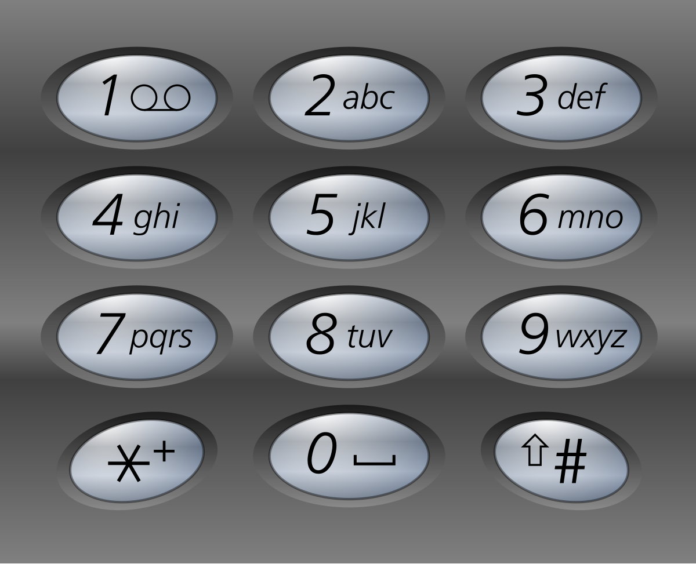

 

**示例 1：**

```
输入：digits = "23"
输出：["ad","ae","af","bd","be","bf","cd","ce","cf"]
```

**示例 2：**

```
输入：digits = "2"
输出：["a","b","c"]
```

 

**提示：**

- `1 <= digits.length <= 4`
- `digits[i]` 是范围 `['2', '9']` 的一个数字。


#### 101.2 解法

时间复杂度：$O(4^n \times n)$，空间复杂度：$O(4^n \times n)$。

```cpp
class Solution {
   private:
    vector<vector<string>> dial = {
        {},
        {},
        {"a", "b", "c"},
        {"d", "e", "f"},
        {"g", "h", "i"},
        {"j", "k", "l"},
        {"m", "n", "o"},
        {"p", "q", "r", "s"},
        {"t", "u", "v"},
        {"w", "x", "y", "z"},
    };

   public:
    vector<string> letterCombinations(string digits) {
        if (digits.size() == 0) return {};

        queue<string> q;
        for (string& c : dial[stoi(digits.substr(0, 1))]) {
            q.push(c);
        }

        for (int i = 1; i < digits.size(); i++) {
            int qSize = q.size();
            for (int j = 0; j < qSize; j++) {
                string curr = q.front();
                q.pop();

                for (string& c : dial[stoi(digits.substr(i, 1))]) {
                    q.push(curr + c);
                }
            }
        }

        vector<string> res;
        while (!q.empty()) {
            res.push_back(q.front());
            q.pop();
        }

        return res;
    }
};
```

> 1. 单个字母，可以直接`digits[i] - '0'`，当时也是没转过弯来……
> 2. 然后`dial`可以直接弄字符串，而不是`vector<char>`；
> 3. 最后可以先在`q`里弄个空串，就可以统一处理了……


#### 101.3 解析

BFS缺点在于空间复杂度太大，如果用回溯法（DFS），那么只要维护递归调用栈，也就是$O(n)$：

```cpp
#include <string>
#include <vector>

using namespace std;

class Solution {
private:
    vector<string> dial = {
        "", "", "abc", "def", "ghi", "jkl", "mno", "pqrs", "tuv", "wxyz"
    };
    vector<string> res;
    string path;

    void backtrack(const string& digits, int index) {
        if (index == digits.size()) {
            res.push_back(path);
            return;
        }
        
        int digit = digits[index] - '0';
        const string& letters = dial[digit];
        
        for (char c : letters) {
            path.push_back(c);
            backtrack(digits, index + 1);
            path.pop_back();
        }
    }

public:
    vector<string> letterCombinations(string digits) {
        if (digits.empty()) return {};
        backtrack(digits, 0);
        return res;
    }
};
```


### 102. 组合*

#### 102.1 题目

给定两个整数 `n` 和 `k`，返回范围 `[1, n]` 中所有可能的 `k` 个数的组合。

你可以按 **任何顺序** 返回答案。

 

**示例 1：**

```
输入：n = 4, k = 2
输出：
[
  [2,4],
  [3,4],
  [2,3],
  [1,2],
  [1,3],
  [1,4],
]
```

**示例 2：**

```
输入：n = 1, k = 1
输出：[[1]]
```

 

**提示：**

- `1 <= n <= 20`
- `1 <= k <= n`


#### 102.2 解法

时间复杂度：$O(k \times C(n, k))$，空间复杂度：$O(k)$。

```cpp
class Solution {
   private:
    vector<vector<int>> res;

    void findCombination(int n, int k, int index, vector<int>& path) {
        if (path.size() == k) {
            res.push_back(path);
            return;
        }

        for (int i = index; i <= n + 1 - k + path.size(); i++) {
            path.push_back(i);
            findCombination(n, k, i + 1, path);
            path.pop_back();
        }
    }

   public:
    vector<vector<int>> combine(int n, int k) {
        res.clear();

        vector<int> path;
        findCombination(n, k, 1, path);

        return res;
    }
};

```


#### 102.3 解析

这道题回归到正宗回溯法了，也是最优解之一，当然也可以用循环模拟递归：

```cpp
class Solution {
public:
    vector<vector<int>> combine(int n, int k) {
        vector<vector<int>> res;
        vector<int> path(k, 0);
        int i = 0;
        
        while (i >= 0) {
            path[i]++;
            if (path[i] > n - k + i + 1) {
                i--;
            } else if (i == k - 1) {
                res.push_back(path);
            } else {
                i++;
                path[i] = path[i - 1];
            }
        }
        return res;
    }
};
```

可以把`i`理解成是递归的第几层，也就是`index`，其他同理。


### 103. 全排列*

#### 103.1 题目

给定一个不含重复数字的数组 `nums` ，返回其 *所有可能的全排列* 。你可以 **按任意顺序** 返回答案。

 

**示例 1：**

```
输入：nums = [1,2,3]
输出：[[1,2,3],[1,3,2],[2,1,3],[2,3,1],[3,1,2],[3,2,1]]
```

**示例 2：**

```
输入：nums = [0,1]
输出：[[0,1],[1,0]]
```

**示例 3：**

```
输入：nums = [1]
输出：[[1]]
```

 

**提示：**

- `1 <= nums.length <= 6`
- `-10 <= nums[i] <= 10`
- `nums` 中的所有整数 **互不相同**


#### 103.2 解法

时间复杂度：$O(n \times n!)$，空间复杂度：$O(n)$。

```cpp
#include <algorithm>
#include <iostream>
#include <queue>
#include <string>
#include <unordered_map>
#include <vector>

using namespace std;

class Solution {
   private:
    vector<vector<int>> res;
    vector<int> path;
    int n;

    void DFS(vector<int>& nums, int index) {
        if (index == n) {
            res.push_back(path);
        }

        for (int i = index; i < n; i++) {
            swap(nums[index], nums[i]);
            path.push_back(nums[index]);
            DFS(nums, index + 1);
            path.pop_back();
            swap(nums[index], nums[i]);
        }
    }

   public:
    vector<vector<int>> permute(vector<int>& nums) {
        res.clear();
        path.clear();
        n = nums.size();

        DFS(nums, 0);
        return res;
    }
};

int main() {
    ios::sync_with_stdio(false);
    cin.tie(nullptr);

    int n;
    cin >> n;

    vector<int> nums(n);
    for (int i = 0; i < n; i++) {
        cin >> nums[i];
    }

    Solution obj;
    vector<vector<int>> res = obj.permute(nums);

    for (auto& r : res) {
        for (int c : r) {
            cout << c << " ";
        }
        cout << endl;
    }

    return 0;
}
```

> `path`实际上没有必要，`nums`的前几项就是了
>
> ```cpp
> #include <vector>
> 
> using namespace std;
> 
> class Solution {
>    private:
>     vector<vector<int>> res;
>     int n;
> 
>     void DFS(vector<int>& nums, int index) {
>         if (index == n) {
>             res.push_back(nums);
>             return;
>         }
> 
>         for (int i = index; i < n; i++) {
>             swap(nums[index], nums[i]);
>             DFS(nums, index + 1);
>             swap(nums[index], nums[i]);
>         }
>     }
> 
>    public:
>     vector<vector<int>> permute(vector<int>& nums) {
>         res.clear();
>         n = nums.size();
>         DFS(nums, 0);
>         return res;
>     }
> };
> ```


#### 103.3 解析

这道题基本上就是这样，关键在于`swap`那一步；此外，`STL`其实内置一个全排列的函数：

```cpp
#include <algorithm>
#include <vector>

using namespace std;

class Solution {
   public:
    vector<vector<int>> permute(vector<int>& nums) {
        vector<vector<int>> res;
        
        sort(nums.begin(), nums.end());
        
        do {
            res.push_back(nums);
        } while (next_permutation(nums.begin(), nums.end()));
        
        return res;
    }
};
```


### 104. 组合总和*

#### 104.1 题目

给你一个 **无重复元素** 的整数数组 `candidates` 和一个目标整数 `target` ，找出 `candidates` 中可以使数字和为目标数 `target` 的 所有 **不同组合** ，并以列表形式返回。你可以按 **任意顺序** 返回这些组合。

`candidates` 中的 **同一个** 数字可以 **无限制重复被选取** 。如果至少一个数字的被选数量不同，则两种组合是不同的。 

对于给定的输入，保证和为 `target` 的不同组合数少于 `150` 个。

 

**示例 1：**

```
输入：candidates = [2,3,6,7], target = 7
输出：[[2,2,3],[7]]
解释：
2 和 3 可以形成一组候选，2 + 2 + 3 = 7 。注意 2 可以使用多次。
7 也是一个候选， 7 = 7 。
仅有这两种组合。
```

**示例 2：**

```
输入: candidates = [2,3,5], target = 8
输出: [[2,2,2,2],[2,3,3],[3,5]]
```

**示例 3：**

```
输入: candidates = [2], target = 1
输出: []
```

 

**提示：**

- `1 <= candidates.length <= 30`
- `2 <= candidates[i] <= 40`
- `candidates` 的所有元素 **互不相同**
- `1 <= target <= 40`


#### 104.2 解法

时间复杂度：$O(S)$，空间复杂度：$O(\frac{target}{min\_val})$。

```cpp
#include <algorithm>
#include <iostream>
#include <queue>
#include <string>
#include <unordered_map>
#include <vector>

using namespace std;

class Solution {
   private:
    vector<vector<int>> res;
    vector<int> path;

    void DFS(vector<int>& nums, int index, int sum, int target) {
        if (sum == target) {
            res.push_back(path);
            return;
        }

        for (int i = index; i < nums.size(); i++) {
            if (sum + nums[i] > target) {
                return;
            }

            path.push_back(nums[i]);
            sum += nums[i];
            DFS(nums, i, sum, target);
            path.pop_back();
            sum -= nums[i];
        }
    }

   public:
    vector<vector<int>> combinationSum(vector<int>& candidates, int target) {
        res.clear();
        path.clear();

        int sum = 0;
        sort(candidates.begin(), candidates.end());
        DFS(candidates, 0, sum, target);

        return res;
    }
};

int main() {
    ios::sync_with_stdio(false);
    cin.tie(nullptr);

    int n, target;
    cin >> n >> target;
    vector<int> nums(n);
    for (int i = 0; i < n; i++) {
        cin >> nums[i];
    }

    Solution obj;
    vector<vector<int>> res = obj.combinationSum(nums, target);

    for (auto& r : res) {
        for (int c : r) {
            cout << c << " ";
        }

        cout << endl;
    }

    return 0;
}
```


#### 104.3 解析

如果用回溯法，基本上就是这样，理论上`sum`也可以不用，一直减`target`就行。然后也能用DP来解，这个问题本质上是一个完全背包问题：

```cpp
#include <algorithm>
#include <vector>

using namespace std;

class Solution {
   public:
    vector<vector<int>> combinationSum(vector<int>& candidates, int target) {
        vector<vector<vector<int>>> dp(target + 1);
        dp[0] = {{}};

        for (int num : candidates) {
            for (int i = num; i <= target; i++) {
                for (auto combination : dp[i - num]) {
                    combination.push_back(num);
                    dp[i].push_back(combination);
                }
            }
        }

        return dp[target];
    }
};
```

其核心是：和为 `i` 的组合，等于和为 `i - num` 的所有组合，各自在尾部追加一个当前的 `num`。


### 105. N皇后II*

#### 105.1 题目

**n 皇后问题** 研究的是如何将 `n` 个皇后放置在 `n × n` 的棋盘上，并且使皇后彼此之间不能相互攻击。

给你一个整数 `n` ，返回 **n 皇后问题** 不同的解决方案的数量。

 

**示例 1：**

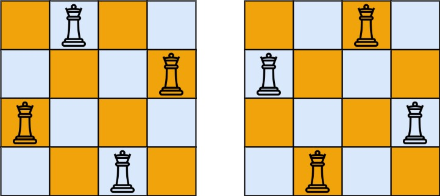

```
输入：n = 4
输出：2
解释：如上图所示，4 皇后问题存在两个不同的解法。
```

**示例 2：**

```
输入：n = 1
输出：1
```

 

**提示：**

- `1 <= n <= 9`


#### 105.2 解法

时间复杂度：$O(N!)$，空间复杂度：$O(N)$。

```cpp
#include <algorithm>
#include <iostream>
#include <queue>
#include <string>
#include <unordered_map>
#include <vector>

using namespace std;

class Solution {
   private:
    vector<bool> c;
    vector<bool> y;
    vector<bool> x;
    int n;
    int nums;

    void placeQueens(int index) {
        if (index == n) {
            nums++;
            return;
        }

        for (int i = 0; i < n; i++) {
            if (c[i]) continue;
            if (x[n - index + i - 1]) continue;
            if (y[2 * n - index - i - 2]) continue;

            c[i] = true;
            x[n - index + i - 1] = true;
            y[2 * n - index - i - 2] = true;
            placeQueens(index + 1);
            c[i] = false;
            x[n - index + i - 1] = false;
            y[2 * n - index - i - 2] = false;
        }
    }

   public:
    int totalNQueens(int n) {
        this->n = n;
        c.resize(n, false);
        x.resize(2 * n - 1, false);
        y.resize(2 * n - 1, false);
        nums = 0;
        placeQueens(0);

        return nums;
    }
};

int main() {
    ios::sync_with_stdio(false);
    cin.tie(nullptr);

    int n;
    cin >> n;

    Solution obj;
    cout << obj.totalNQueens(n);

    return 0;
}
```


#### 105.3 解析

基本上这个思路就是最好的，当然在实现上，因为不需要给出具体解，可以直接用位运算来解：

```cpp
class Solution {
   private:
    int nums;
    int upper_lim;

    void dfs(int col, int ld, int rd) {
        if (col == upper_lim) {
            nums++;
            return;
        }

        int pos = upper_lim & (~(col | ld | rd));
        
        while (pos != 0) {
            int p = pos & (-pos);
            pos -= p;
            dfs(col | p, (ld | p) << 1, (rd | p) >> 1);
        }
    }

   public:
    int totalNQueens(int n) {
        nums = 0;
        upper_lim = (1 << n) - 1;
        dfs(0, 0, 0);
        return nums;
    }
};
```

其中，`col`、`ld`、`rd`代替我的 `c`、`x`、`y` 数组。然后用`upper_lim` 控制边界： `(1 << n) - 1` 会生成一个低 $n$ 位全为 `1` 的数字，用来作为掩码，确保所有的位操作只在棋盘的 $n$ 列范围内进行。通过`col | ld | rd` 算出了当前行所有不能放皇后的位置。对其取反 `~` 后，再与 `upper_lim` 进行按位与 `&`，得到的 `pos` 中，所有二进制为 `1` 的位就是当前行可以放皇后的安全位置。然后`p = pos & (-pos)`拿出最低有效位，逐个传入下一层。进入下一行递归时，列的限制 `col | p` 垂直传递；左对角线的限制 `(ld | p) << 1` 整体向左移一位；右对角线的限制 `(rd | p) >> 1` 整体向右移一位。


### 106. 括号生成*

#### 106.1 题目

数字 `n` 代表生成括号的对数，请你设计一个函数，用于能够生成所有可能的并且 **有效的** 括号组合。

 

**示例 1：**

```
输入：n = 3
输出：["((()))","(()())","(())()","()(())","()()()"]
```

**示例 2：**

```
输入：n = 1
输出：["()"]
```

 

**提示：**

- `1 <= n <= 8`


#### 106.2 解法

时间复杂度：$O(n \times C_n)$，空间复杂度：$O(n)$。

```cpp
#include <algorithm>
#include <iostream>
#include <queue>
#include <string>
#include <unordered_map>
#include <vector>

using namespace std;

class Solution {
   private:
    vector<string> res;
    string path;

    void findSeq(int n, int index) {
        if (index == 0) {
            if (n == 0) res.push_back(path);
            return;
        }

        path.push_back('(');
        n++;
        for (int i = 0; i <= n; i++) {
            int temp = n;
            for (int j = 0; j < i; j++) {
                path.push_back(')');
                temp--;
            }

            findSeq(temp, index - 1);

            while (path.back() == ')') path.pop_back();
        }
        path.pop_back();
        n--;
    }

   public:
    vector<string> generateParenthesis(int n) {
        res.clear();
        path = "";
        findSeq(0, n);

        return res;
    }
};

int main() {
    ios::sync_with_stdio(false);
    cin.tie(nullptr);

    int n;
    cin >> n;

    Solution obj;
    vector<string> res = obj.generateParenthesis(n);

    for (string& r : res) {
        cout << r << " ";
    }

    return 0;
}
```

> 可以弄成二叉树，省一点`pop`和`push`的开销：
>
> ```cpp
> #include <string>
> #include <vector>
> 
> using namespace std;
> 
> class Solution {
>    private:
>     vector<string> res;
>     string path;
> 
>     void DFS(int left, int right, int n) {
>         if (path.length() == n * 2) {
>             res.push_back(path);
>             return;
>         }
> 
>         if (left < n) {
>             path.push_back('(');
>             DFS(left + 1, right, n);
>             path.pop_back();
>         }
> 
>         if (right < left) {
>             path.push_back(')');
>             DFS(left, right + 1, n);
>             path.pop_back();
>         }
>     }
> 
>    public:
>     vector<string> generateParenthesis(int n) {
>         res.clear();
>         path.clear();
>         DFS(0, 0, n);
>         return res;
>     }
> };
> ```


#### 106.3 解析

此外，这道题也能用DP来做，核心是：**"(" + 内部的合法括号 + ")" + 外部右侧的合法括号**：

```cpp
#include <string>
#include <vector>

using namespace std;

class Solution {
   public:
    vector<string> generateParenthesis(int n) {
        if (n == 0) return {""};

        vector<vector<string>> dp(n + 1);
        dp[0] = {""};
        dp[1] = {"()"};

        for (int i = 2; i <= n; i++) {
            for (int j = 0; j < i; j++) {
                for (const string& p : dp[j]) {
                    for (const string& q : dp[i - 1 - j]) {
                        string str = "(" + p + ")" + q;
                        dp[i].push_back(str);
                    }
                }
            }
        }

        return dp[n];
    }
};
```


### 107. 单词搜索*

#### 107.1 题目

给定一个 `m x n` 二维字符网格 `board` 和一个字符串单词 `word` 。如果 `word` 存在于网格中，返回 `true` ；否则，返回 `false` 。

单词必须按照字母顺序，通过相邻的单元格内的字母构成，其中“相邻”单元格是那些水平相邻或垂直相邻的单元格。同一个单元格内的字母不允许被重复使用。

 

**示例 1：**


```
输入：board = [['A','B','C','E'],['S','F','C','S'],['A','D','E','E']], word = "ABCCED"
输出：true
```

**示例 2：**


```
输入：board = [['A','B','C','E'],['S','F','C','S'],['A','D','E','E']], word = "SEE"
输出：true
```

**示例 3：**


```
输入：board = [['A','B','C','E'],['S','F','C','S'],['A','D','E','E']], word = "ABCB"
输出：false
```

 

**提示：**

- `m == board.length`
- `n = board[i].length`
- `1 <= m, n <= 6`
- `1 <= word.length <= 15`
- `board` 和 `word` 仅由大小写英文字母组成

 

**进阶：**你可以使用搜索剪枝的技术来优化解决方案，使其在 `board` 更大的情况下可以更快解决问题？


#### 107.2 解法

时间复杂度：$O(M \times N \times 3^L)$，空间复杂度：$O(L)$。

```cpp
#include <algorithm>
#include <iostream>
#include <queue>
#include <string>
#include <unordered_map>
#include <vector>

using namespace std;

class Solution {
   private:
    int n;
    int m;

    bool wordSearch(vector<vector<char>>& board, string& word, int k, int i, int j) {
        if (board[i][j] == word[k]) {
            if (k == word.size() - 1) return true;
        } else {
            return false;
        }

        char c = board[i][j];
        board[i][j] = '0';
        if (i - 1 >= 0 && board[i - 1][j] != '0' && wordSearch(board, word, k + 1, i - 1, j)) return true;
        if (i + 1 < n && board[i + 1][j] != '0' && wordSearch(board, word, k + 1, i + 1, j)) return true;
        if (j - 1 >= 0 && board[i][j - 1] != '0' && wordSearch(board, word, k + 1, i, j - 1)) return true;
        if (j + 1 < m && board[i][j + 1] != '0' && wordSearch(board, word, k + 1, i, j + 1)) return true;
        board[i][j] = c;

        return false;
    }

   public:
    bool exist(vector<vector<char>>& board, string word) {
        n = board.size();
        m = board[0].size();

        for (int i = 0; i < n; i++) {
            for (int j = 0; j < m; j++) {
                if (board[i][j] == word[0] && wordSearch(board, word, 0, i, j)) {
                    return true;
                }
            }
        }

        return false;
    }
};

int main() {
    ios::sync_with_stdio(false);
    cin.tie(nullptr);

    int n, m;
    cin >> n >> m;

    vector<vector<char>> board(n, vector<char>(m));
    for (int i = 0; i < n; i++) {
        for (int j = 0; j < m; j++) {
            cin >> board[i][j];
        }
    }

    string word;
    cin >> word;

    Solution obj;
    cout << (obj.exist(board, word) ? "true" : "false");

    return 0;
}
```


#### 107.3 解析

比单词搜索II简单很多，基本上就是这么做，此外还能做一些剪枝，只要花费的代价比收益小就行：

1. 统计一下单词长度，如果大于矩阵大小，直接返回；
2. 统计一下首尾字母在矩阵中出现的个数，哪个少就从哪边开始。

```cpp
#include <algorithm>
#include <string>
#include <vector>

using namespace std;

class Solution {
   private:
    int n, m;

    bool wordSearch(vector<vector<char>>& board, string& word, int k, int i, int j) {
        // 把跳过的情况集中
        if (i < 0 || i >= n || j < 0 || j >= m || board[i][j] != word[k]) {
            return false;
        }
        if (k == word.size() - 1) {
            return true;
        }

        char c = board[i][j];
        board[i][j] = '0';

        bool found = wordSearch(board, word, k + 1, i - 1, j) ||
                     wordSearch(board, word, k + 1, i + 1, j) ||
                     wordSearch(board, word, k + 1, i, j - 1) ||
                     wordSearch(board, word, k + 1, i, j + 1);

        board[i][j] = c;
        return found;
    }

   public:
    bool exist(vector<vector<char>>& board, string word) {
        n = board.size();
        m = board[0].size();

        if (word.length() > n * m) return false;

        vector<int> boardCount(128, 0);
        for (int i = 0; i < n; ++i) {
            for (int j = 0; j < m; ++j) {
                boardCount[board[i][j]]++;
            }
        }

        vector<int> wordCount(128, 0);
        for (char c : word) {
            wordCount[c]++;
            if (wordCount[c] > boardCount[c]) return false;
        }

        if (boardCount[word.front()] > boardCount[word.back()]) {
            reverse(word.begin(), word.end());
        }

        for (int i = 0; i < n; i++) {
            for (int j = 0; j < m; j++) {
                if (wordSearch(board, word, 0, i, j)) {
                    return true;
                }
            }
        }
        return false;
    }
};
```


## 十三、分治

### 108. 将有序数组转换为二叉搜索树*

#### 108.1 题目

给你一个整数数组 `nums` ，其中元素已经按 **升序** 排列，请你将其转换为一棵 平衡 二叉搜索树。

 

**示例 1：**


```
输入：nums = [-10,-3,0,5,9]
输出：[0,-3,9,-10,null,5]
解释：[0,-10,5,null,-3,null,9] 也将被视为正确答案：
```

**示例 2：**


```
输入：nums = [1,3]
输出：[3,1]
解释：[1,null,3] 和 [3,1] 都是高度平衡二叉搜索树。
```

 

**提示：**

- `1 <= nums.length <= 104`
- `-104 <= nums[i] <= 104`
- `nums` 按 **严格递增** 顺序排列


#### 108.2 解法

时间复杂度：$O(N)$，空间复杂度：$O(\log N)$。

```cpp
#include <algorithm>
#include <iostream>
#include <queue>
#include <string>
#include <unordered_map>
#include <vector>

using namespace std;

struct TreeNode {
    int val;
    TreeNode* left;
    TreeNode* right;
    TreeNode() : val(0), left(nullptr), right(nullptr) {}
    TreeNode(int x) : val(x), left(nullptr), right(nullptr) {}
    TreeNode(int x, TreeNode* left, TreeNode* right) : val(x), left(left), right(right) {}
};

class Solution {
   private:
    void buildTree(TreeNode* root, vector<int>& nums, int i, int j) {
        int mid = (i + j) / 2;
        root->val = nums[mid];

        if (mid > i) {
            root->left = new TreeNode();
            buildTree(root->left, nums, i, mid - 1);
        }
        if (mid < j) {
            root->right = new TreeNode();
            buildTree(root->right, nums, mid + 1, j);
        }
    }

   public:
    TreeNode* sortedArrayToBST(vector<int>& nums) {
        TreeNode* root = new TreeNode();
        buildTree(root, nums, 0, nums.size() - 1);
        return root;
    }
};

int main() {
    ios::sync_with_stdio(false);
    cin.tie(nullptr);

    int n;
    cin >> n;

    vector<int> nums(n);
    for (int i = 0; i < n; i++) {
        cin >> nums[i];
    }

    Solution obj;
    TreeNode* root = obj.sortedArrayToBST(nums);
    queue<TreeNode*> q;
    q.push(root);

    while (!q.empty()) {
        TreeNode* curr = q.front();
        q.pop();

        cout << curr->val << " ";
        if (curr->left != nullptr) {
            q.push(curr->left);
        }
        if (curr->right != nullptr) {
            q.push(curr->right);
        }
    }

    return 0;
}
```


#### 108.3 解析

我这个思路是给出子节点让其在子函数中替换，但是也可以在子函数中建立起小的二叉树，然后返回给父函数组装：

```cpp
#include <vector>

using namespace std;

struct TreeNode {
    int val;
    TreeNode* left;
    TreeNode* right;
    TreeNode() : val(0), left(nullptr), right(nullptr) {}
    TreeNode(int x) : val(x), left(nullptr), right(nullptr) {}
    TreeNode(int x, TreeNode* left, TreeNode* right) : val(x), left(left), right(right) {}
};

class Solution {
   private:
    TreeNode* buildTree(vector<int>& nums, int left, int right) {
        if (left > right) {
            return nullptr;
        }

        int mid = left + (right - left) / 2;
        TreeNode* root = new TreeNode(nums[mid]);

        root->left = buildTree(nums, left, mid - 1);
        root->right = buildTree(nums, mid + 1, right);

        return root;
    }

   public:
    TreeNode* sortedArrayToBST(vector<int>& nums) {
        return buildTree(nums, 0, nums.size() - 1);
    }
};
```

